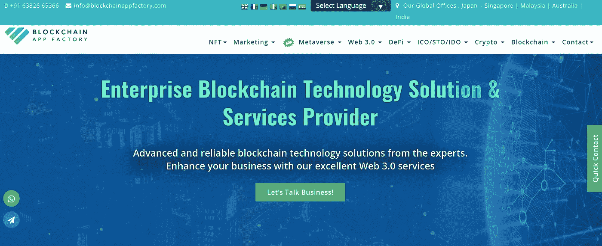
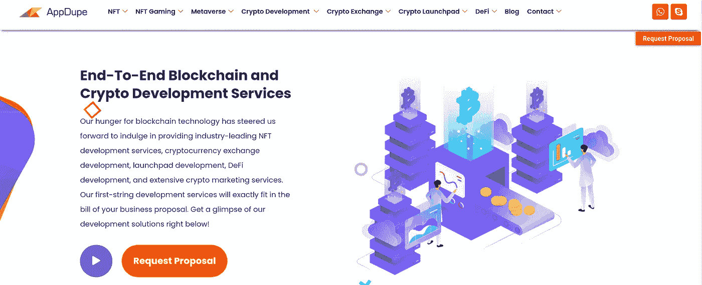
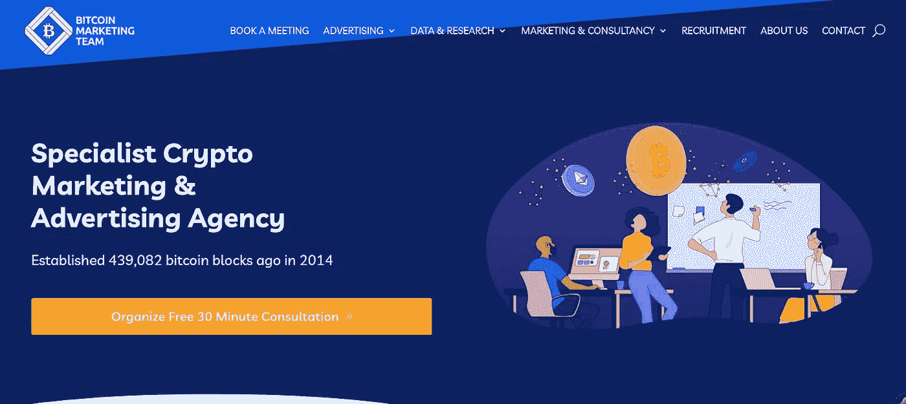
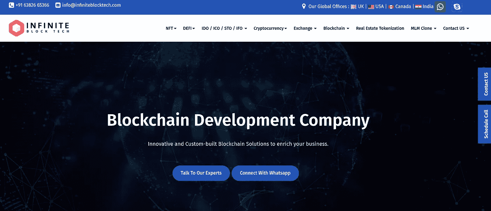
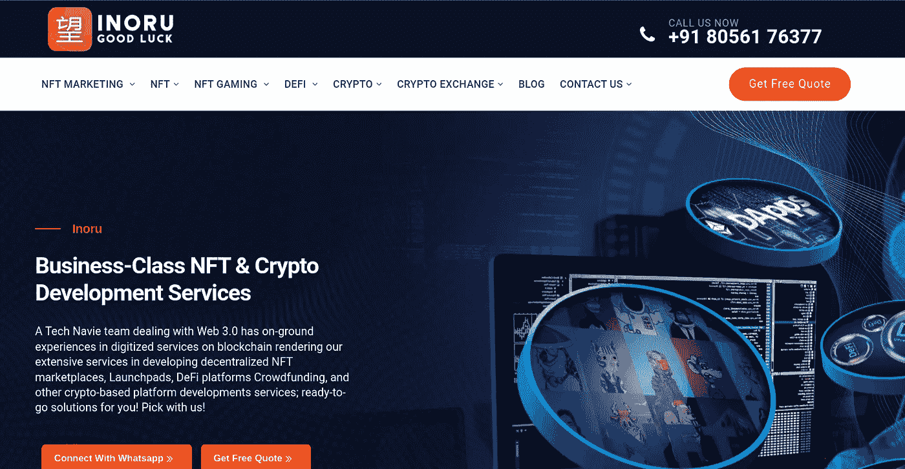
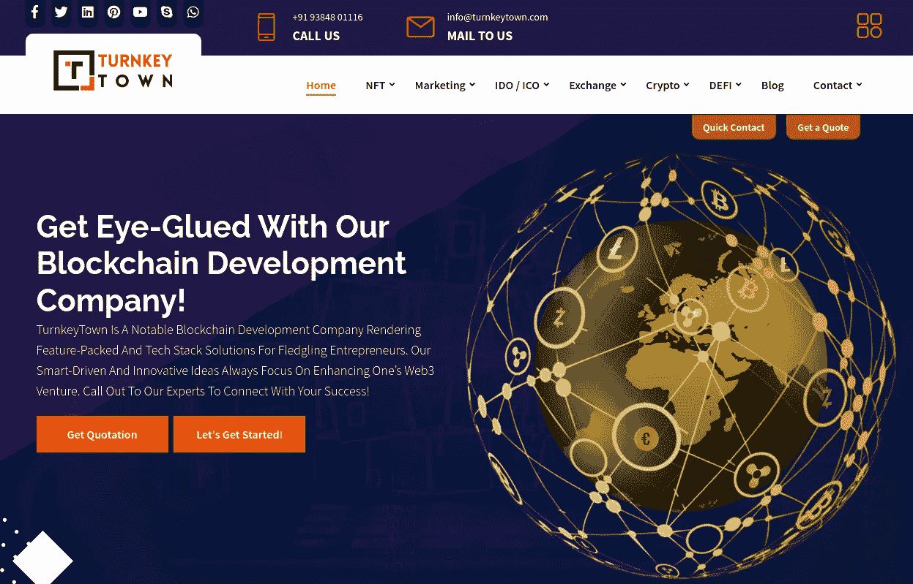
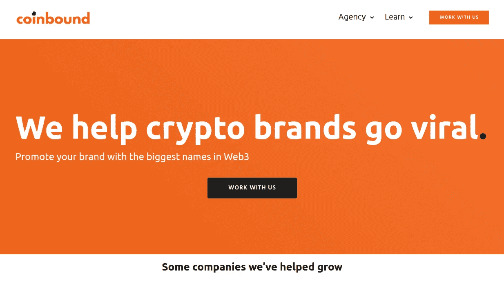
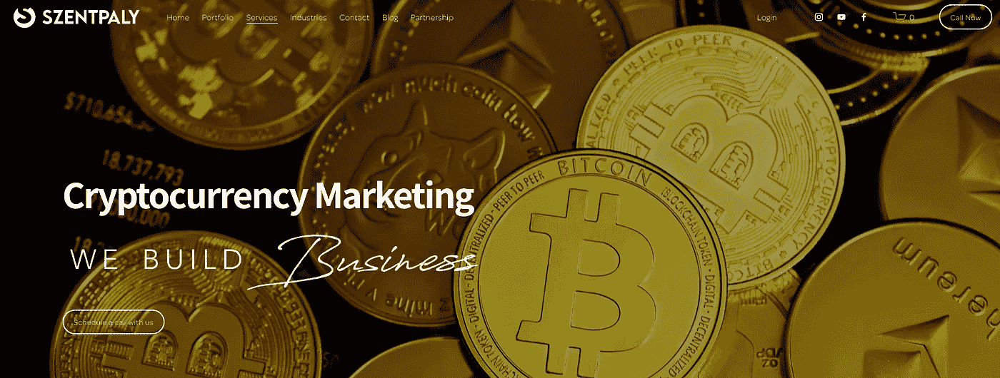
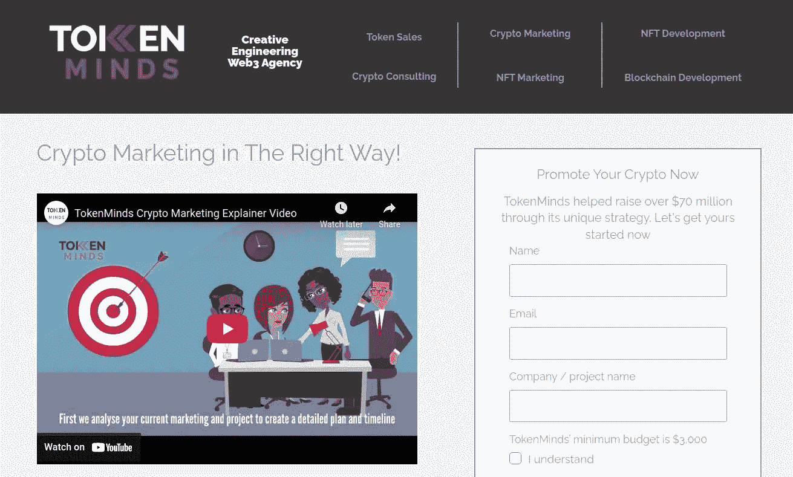

# 2023 年 3 月十大最佳加密营销机构

> 原文：<https://medium.com/geekculture/top-10-best-crypto-marketing-agency-dominate-in-2023-d6e54286af8b?source=collection_archive---------15----------------------->

Top 10 Best Crypto Marketing Agency in 2023

近年来的加密热潮导致了数字世界的指数级增长。Cryptos 一旦达到万亿美元的市值，就开始获得主流的关注。密码也用于交易和操作目的。许多领先的公司甚至初创公司已经开始在这个巨大的市场上赚钱。但是，创建一个加密项目和让人们知道它是两码事。这是很多创业者没能把球打进球门的地方。不管你的密码有多有前途，如果没有有效的营销策略，你的项目很可能会被忽视。不要担心，我们已经编制了一份市场上领先的加密营销机构的名单，你可以利用有效的营销活动。

# **十大最佳加密营销机构**

## [**1。区块链 App 工厂**](https://bit.ly/3SHaXG2)

Blockchain App Factory

区块链应用工厂是市场领导者，也是最受欢迎的区块链公司。它为全球各行业提供基于区块链的解决方案。除了区块链开发服务，他们还帮助公司提供高效的加密营销服务。

区块链应用工厂轻松满足您的营销需求，并提供高质量和

经济高效的加密营销服务。作为加密市场的领导者，它通过其世界级的营销活动帮助其客户获得竞争优势。

区块链应用工厂肯定是领先的加密营销机构名单上的第一名，这是有原因的。

## [**2。app dupe**](https://bit.ly/3SDgdKN)

AppDupe

AppDupe 在区块链行业拥有超过 10 年的经验，是一家著名的加密营销公司，提供定制的营销解决方案，将加密项目提升到新的高度。

AppDupe 凭借其经验丰富的营销团队，以开发创新的营销解决方案来增加加密项目的价值而闻名。从理解项目的目标受众到组织项目的成功营销活动，AppDupe 为所有营销需求提供一站式解决方案。

如果你正在寻找一家在使用多种数字营销实践方面有经验的公司，你可以看看 AppDupe。

## [**3。比特币营销团队**](https://bit.ly/3SF8qvN)

Bitcoin Marketing Team

比特币市场团队是一家总部位于欧洲的加密营销公司，于 2014 年推出。它有一个非常独特的营销服务方法，因为它每次只处理少数客户，以确保高质量的服务和成功的商业化。

该公司是数据驱动的，在区块链行业有多年的经验。他们因其高标准的加密项目营销而受到客户的高度赞扬。

## [**4。无限街区科技**](https://bit.ly/3EmtKBY)

Infinite Block Tech

Infinite Block Tech 是一家总部位于区块链的公司，为世界各地的客户开发和提供基于区块链的解决方案。除了开发之外，它还与由内容作者、SEO 和市场分析师组成的专家团队一起致力于区块链营销服务。

人们可以选择 Infinite Block Tech，因为它的营销能力可以提供基于趋势的高质量数字营销服务。凭借其对市场的全面了解，它可以为加密项目营销活动带来非常有利的结果。

## [**5。being Social**](https://bit.ly/3M9ic75)

Beeing Social

Beeing Social 是一家数字营销机构，已经帮助 3000 多个品牌在数字空间建立了自己的品牌。它还致力于加密营销服务，其经验丰富的加密营销专家可以产生一致的结果与他们的加密营销策略。

Beeing Social 可以帮助项目提供定制的、有针对性的和数据驱动的营销活动，帮助他们将业务提升到一个新的水平，并获得最大的投资回报。

## [**6。inoru**](https://bit.ly/3V4Ab2n)

Inoru

Inoru 是一家总部位于区块链的公司，为加密项目提供广泛的营销服务。Inoru 根据加密项目的范围为其提供定制的营销解决方案。Inoru 之所以成为市场领导者，是因为它拥有分析方法、多渠道营销战略和胜算很大的战略执行能力。

Inoru 给你一个清晰的概念，它是如何构建和概述其营销活动的，所以即使一个人是密码行业的新手，他们也可以清楚地了解他们的营销过程。

## [**7。交钥匙城镇**](https://bit.ly/3C1JcAM)

Turnkey Town

Turnkey Town 是一家区块链开发公司，因其营销服务而备受推崇。从构思到成功执行营销战略，交钥匙城镇可以根据项目要求和目标受众提供有效的营销活动。

你可以和它的专家取得联系，传达你的目标和目标市场；Turnkeytown 拥有经验丰富的营销专业人员，能够为您的项目提供合适的营销策略。它在 Discord 等平台上提供社交媒体营销、影响者营销、视频营销、内容营销和社区营销等营销服务。

## [**8。硬币绑定**](https://bit.ly/3yetWzy)

Coinbound

Coinbound 是一家领先的 Web3 影响机构，已经帮助数千个品牌在数字空间接触到数百万个品牌。他们提供数字营销服务，如社区管理、公共关系、社交媒体参与、搜索引擎优化、公共关系等。

它有一个诀窍，帮助公司围绕他们的资产建立宣传，并提升他们在加密领域的存在。它因其有效的策略、市场知识和故障分析而广受好评。

## [**9。szentpaly**](https://bit.ly/3ycEX4j)

Szentpaly

Szentpaly 是一家顶级的加密营销机构，帮助品牌实现其商业目标。它使用多种营销渠道和综合方法，为营销活动项目提供定制服务和个人帮助。

其熟练的营销团队和密码专家为您的品牌提供创新的营销方法。如果您正在寻找一个有能力的营销团队，能够为您的业务带来最好的结果并强化您的品牌，那么 Szentpaly 将是您理想的选择。

## [**10。token minds**](https://bit.ly/3V3b3t2)

TokenMinds

TokenMinds 是一家顶尖的加密营销公司，凭借其对加密生态系统的深刻理解，提供全面的营销策略。从概念到执行，TokenMinds 确保您的加密项目的有机流量。

该公司致力于活动内容，重新定位受众，并根据用户反应推出创新的营销策略。其密码营销服务包括密码营销、NFT 营销等。

**总之，**随着每天大量的加密项目出现，加密领域的竞争变得非常激烈。如果没有专业的营销支持，让你的存在在加密市场为人所知会是一件困难的事情。但是不要紧张，利用上面的列表，选择最适合你的加密项目的加密营销代理。