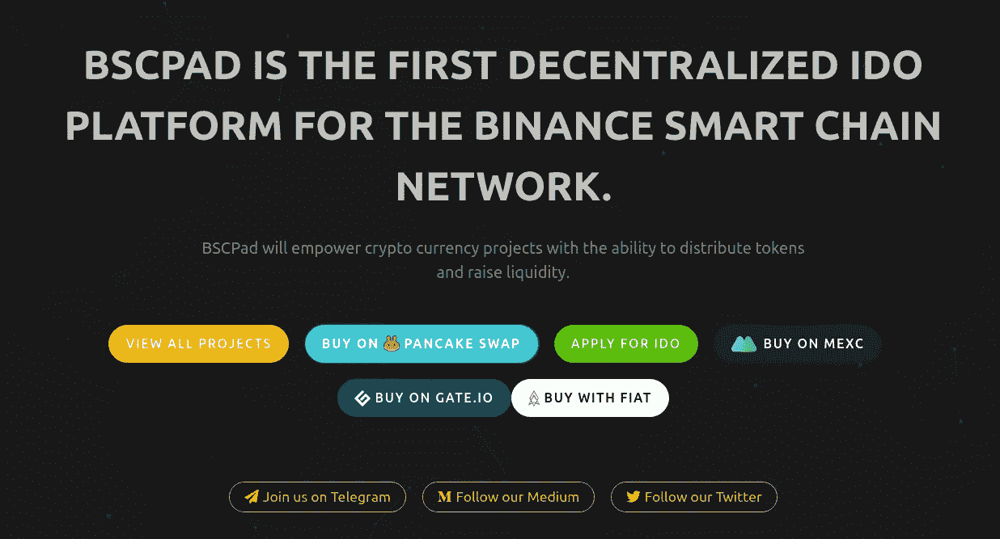
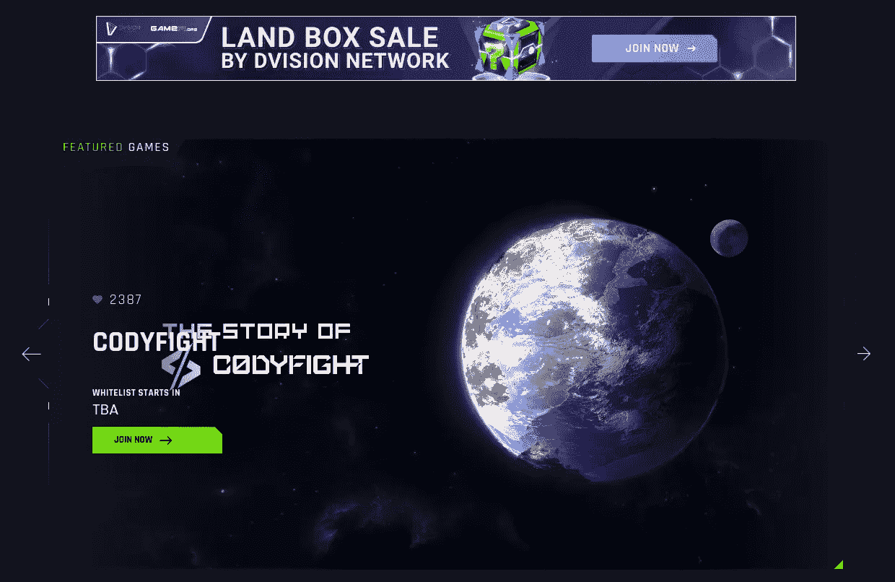
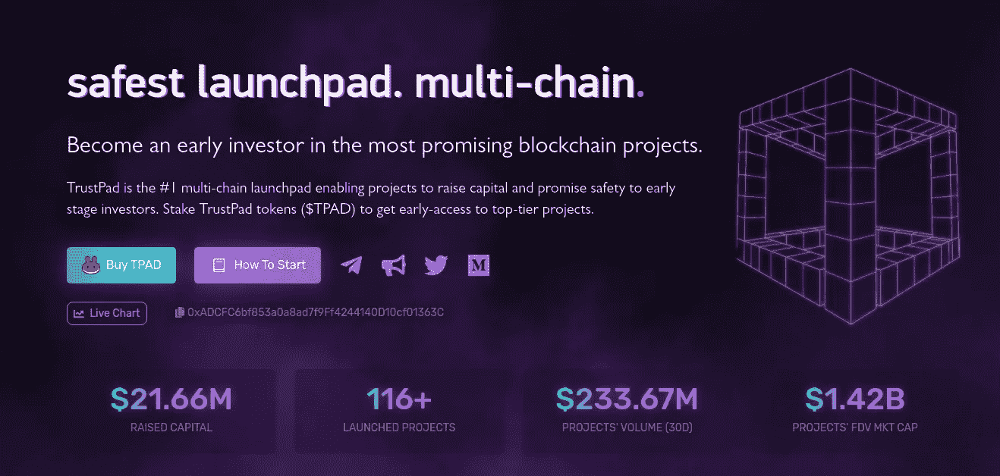
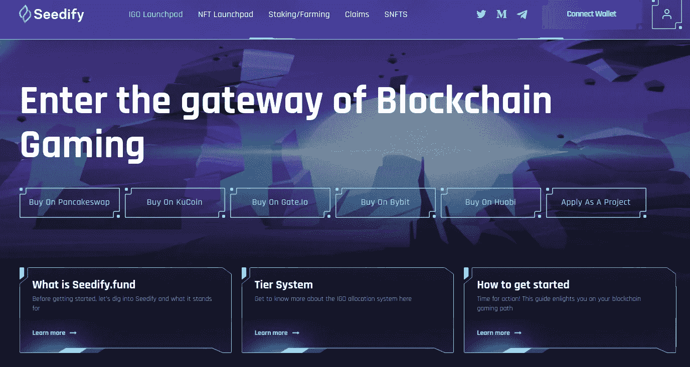
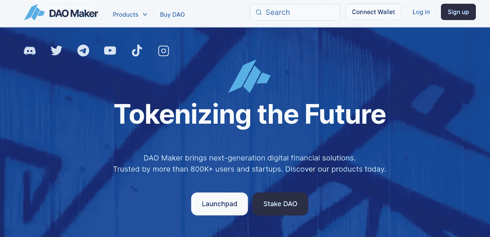
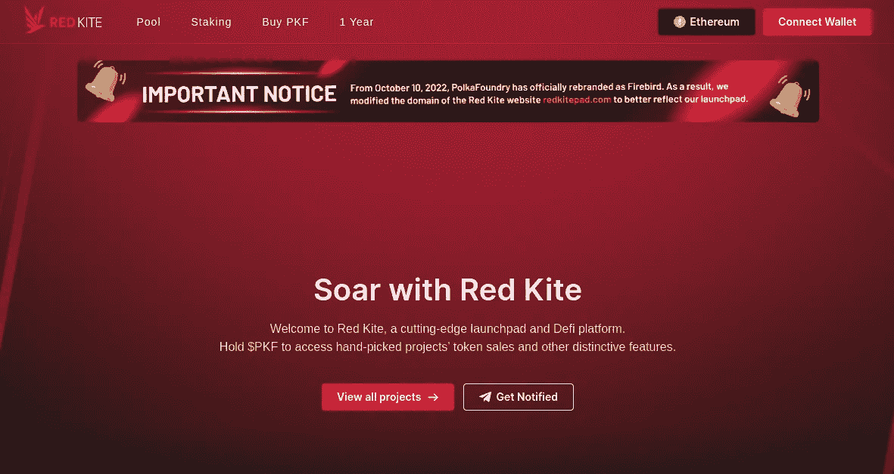
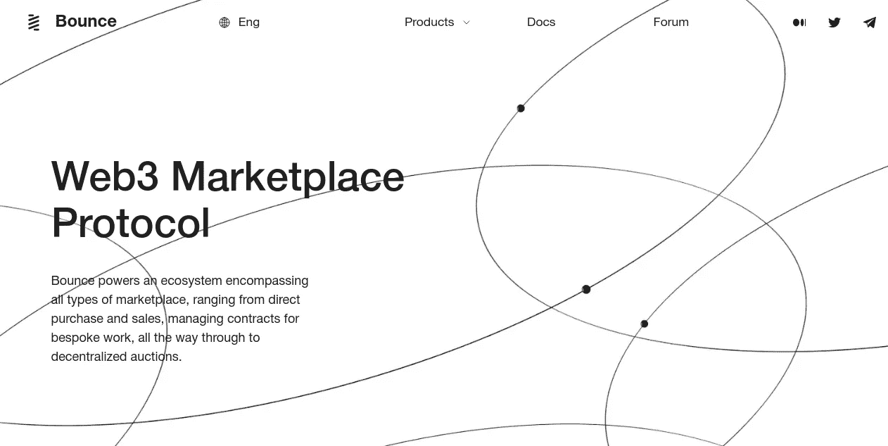
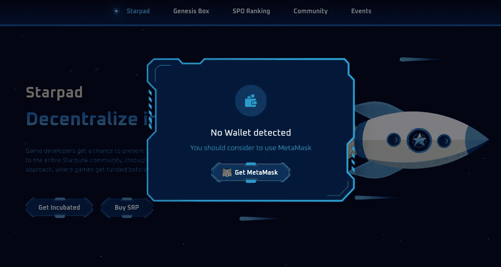
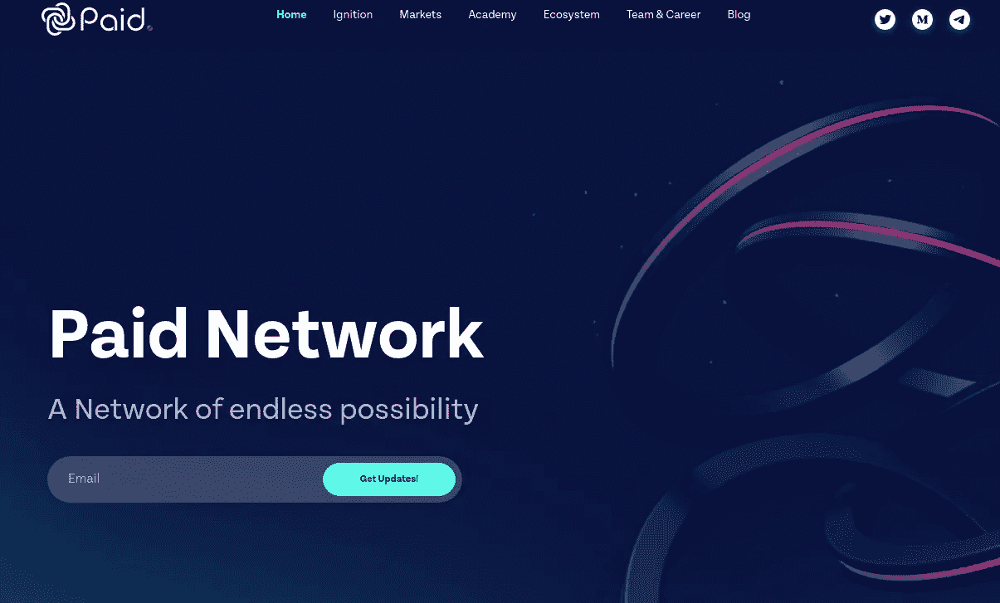

# 2023 年值得关注的十大 IDO 发射台

> 原文：<https://medium.com/geekculture/top-10-best-ido-launchpads-to-watch-for-in-2023-eebd39bdab18?source=collection_archive---------4----------------------->

## 在这里，我们将讨论 2023 年最佳的 10 个 IDO 发射台

Top 10 Best IDO Launchpads in 2023

加密货币的兴起只意味着一件事:有抱负的企业家找到了一个开展梦想业务的新领域。秘密筹款机制的出现也向我们传达了同样的信息。尽管 ICO 和 IEO 提升了许多企业，但它们固有的缺陷意味着这些产品不能永远被信任。

> [***如何创建一个 IDO Launchpad？***](https://www.blockchainappfactory.com/ido-token-launchpad-services?utm_source=Medium+GC&utm_medium=28%2F10%2F22&utm_campaign=senpagapandian)***👈👈👈**点击此处，立即开始*****

*这一点和 IDOs(初始 DEX 产品)迫在眉睫的优势使它们在 Web3 商业社区中受到欢迎。只有在 IDOs 出现之后，使用 launchpad 平台的习惯才成为主流。*

*** [## IDO Launchpad 的终极指南！

### 初始 DEX 产品(IDO) launchpad 是一个加密众筹平台，利用分散的加密交易所…

www.blockchainappfactory.com](https://www.blockchainappfactory.com/blog/ido-launchpad-development/?utm_source=Medium+GC&utm_medium=28%2F10%2F22&utm_campaign=senpagapandian) 

# 2023 年十大最佳 IDO 发射台

## 1. [BSCPad](https://bscpad.com/)

BSCPad

来自币安商业集团 BSCPad 的第一个 IDO launchpad 允许基于 BNB 链的 NFT 和加密项目通过其分散的交换池筹集资金，而无需中介。该平台有一个两级令牌分配系统，确保所有活跃的投资者都能获得项目令牌。投资者，无论其规模和资源，都可以从这个 IDO launchpad 投资项目，因为它为所有目的提供了一个公平的机制。BSCPad 可能是基于 BNB 链的 Web3 项目的理想选择。

## 2. [GameFi](https://gamefi.org/)

GameFi

GameFi 是 Web3 生态系统中新颖的 IDO launchpads 之一。顾名思义，GameFi IDO launchpad 使 Web3 游戏项目能够通过初始游戏发行(IGO)筹集资金，其中游戏内的原生令牌和资产根据投资者的投资水平提供给投资者。它基于 Solana 网络，能够以较低的燃气费和能源消耗水平实现更快的交易。它也有一个 NFT 市场，可以玩多种 P2E 游戏，还有一个元宇宙。

## 3.[信任板](https://trustpad.io/)

TrustPad

TrustPad 是 IDO launchpad 中的知名品牌，是一个多链 I do launch pad 平台。它适用于 BNB 链、以太坊和索拉纳网络，以及对元掩码、信任钱包和 WalletConnect 的钱包支持。它可以帮助大、中、小型 Web3 公司进行分散的筹款活动。IDO launchpad 平台已经成功地使用其分散机制帮助各种 Web3 企业聚集资本。该平台的用户可以从零开始学习加密投资的艺术，并随着时间的推移而获利。

## 4.[播种](https://launchpad.seedify.fund/)

Seedify

顾名思义，Seedify 是一个由 DAO(去中心化自治组织)驱动的基于种子资金的 IDO launchpad 平台。旨在通过分散的方式帮助创新型企业家，平台上与筹资相关的每个流程都由社区成员选出的管理社区决定。Seedify IDO launchpad 依靠社区的参与和反馈而蓬勃发展，这是我们迈向 DeSoc(去中心化社会)的一个好迹象。这对新一代实验性创业公司来说可能是完美的。

## 5.[刀匠](https://daomaker.com/)

DAO Maker

作为专注于零售加密投资者的 IDO launchpads 之一，DAO Maker 帮助初创公司使用增长技术和低投票率增长框架以安全的方式筹集资金。这种框架鼓励小规模投资者通过 DAO 制造商 IDO launchpad 积极参与风险投资。对于希望接触更广泛的社区并筹集资金的企业家来说，该平台可能是首选。它还提供了加密赌注和稳定硬币投资的选项，由 DAO 驱动的社区提供支持。

## 6. [FireStarter](https://firestarter.fi/)

FireStarter

作为 Polygon 上最受欢迎的 IDO 启动平台之一，FireStarter 是第一个基于 IDO 模型运行初始元宇宙产品(IMO)的平台。IDO launchpad 平台支持基于 metaverses、分散金融、游戏和社交门户的 Web3 项目。该平台在 Polygon 生态系统中的突出地位帮助了 unknown，新的加密项目建立了他们的社区并迅速筹集资金。对于创业者来说，这个平台也很容易使用，因为它为初创公司提供了一系列营销工具。

## 7.[红风筝](https://redkitepad.com/)

Red Kite

Red Kite 是 PolkaFoundry 项目的 IDO launchpads 之一，使来自多个区块链(以太坊、多边形、BNB 链、索拉纳、Terra 和 Polkadot)的用户能够参与筹款活动。红风筝 IDO launchpad 拥有严格的审查流程，确保所有项目都是真实的，并根据用户活动水平分配层级系统。此外，该平台为所有终端提供了一些前所未见的功能，这将提高用户满意度。它对任何 Web3 初创公司来说都是完美的。

## 8.[弹跳](https://bounce.finance/)

Bounce

Bounce 是一个独特的 IDO launchpad，因为它在同一个伞下提供了多个实用程序。该平台包含一个 NFT 市场、一个 DeFi 协议和一个 DAO 以及一个 IDO launchpad。其认证销售门户的行为类似于 IDO 协议，允许用户在 KYC 过程后参与白名单销售和分散加密拍卖。该平台支持以太坊和基于 BNB 链的资产，以及多个冷热钱包。这个平台可能是基于利基的创业公司的理想选择。

## 9.[星朋克](https://starpunk.io/)

Starpunk

Starpunk 是基于游戏的 IDO launchpads 中的另一个，是一个由投资者社区驱动的 Web3 游戏孵化器。它使用 DAO 协议来控制活动，并且在平台内部没有单独的权力点。该平台仍处于萌芽阶段，因此排名较低。但是，它已经显示出足够的承诺，成为明年值得期待的 IDO 发射台。星际朋克可能是游戏创业公司的所在地。

## 10.[付费网络](https://paidnetwork.com/)

Paid network

付费网络有一个名为“Ignition”的 IDO launchpad 平台，自 2021 年加密热潮以来一直很有名，已经推出了数百个项目。它的验证协议和直接的彩票等级保证企业家和投资者积极参与 IDO 活动。点火 IDO 启动板可在以太坊，BNB 链，索拉纳，雪崩区块链，更多的支持即将推出。该平台还提供其社区固定掉期，使每个人受益，以及其本机令牌的赌注功能。

# 最后的话

从今以后，上述 IDO launchpads 可以成为 Web3 项目的绝佳选择，以获得初始资本，在 2023 年顺利启动他们的企业。每个 [**IDO launchpad 在某些方面**](https://bit.ly/3NesQKg) 都是独一无二的，人们必须根据自己的喜好和业务目标选择平台。如果你是一个项目所有者，渴望从社区中获得资本，并且正在考虑一条出路，一个 Web3 咨询机构也许能帮助你。或者，如果你想在 2023 年将自己的 IDO launchpad 推向顶峰，可以考虑与一家经验丰富的 IDO launchpad 开发公司合作，以提高你的企业的成功几率。*