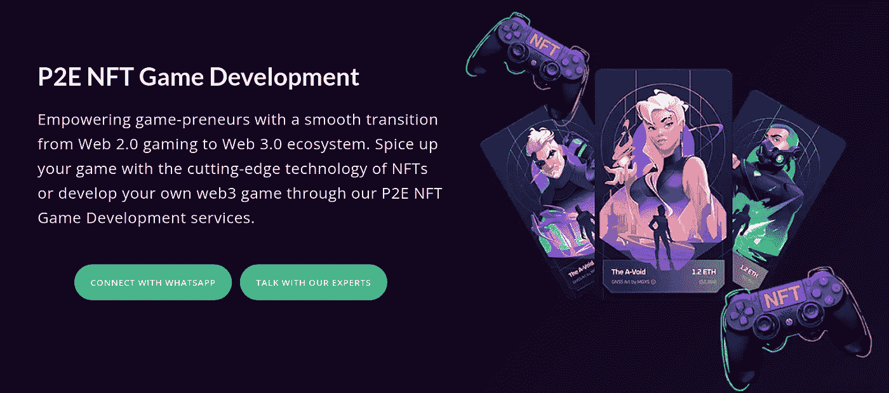
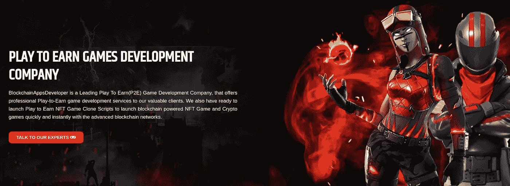
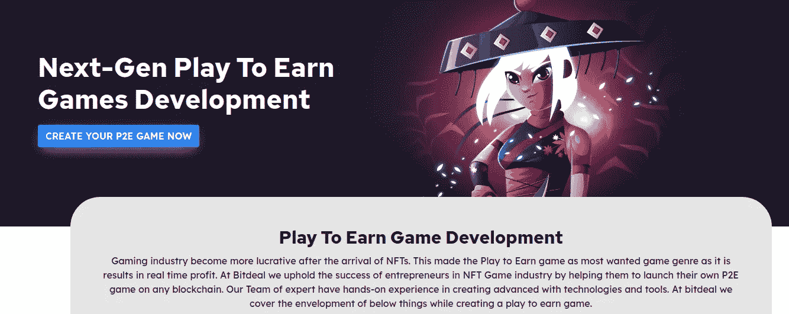
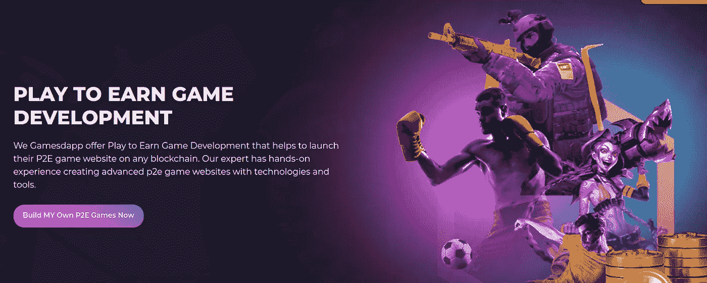
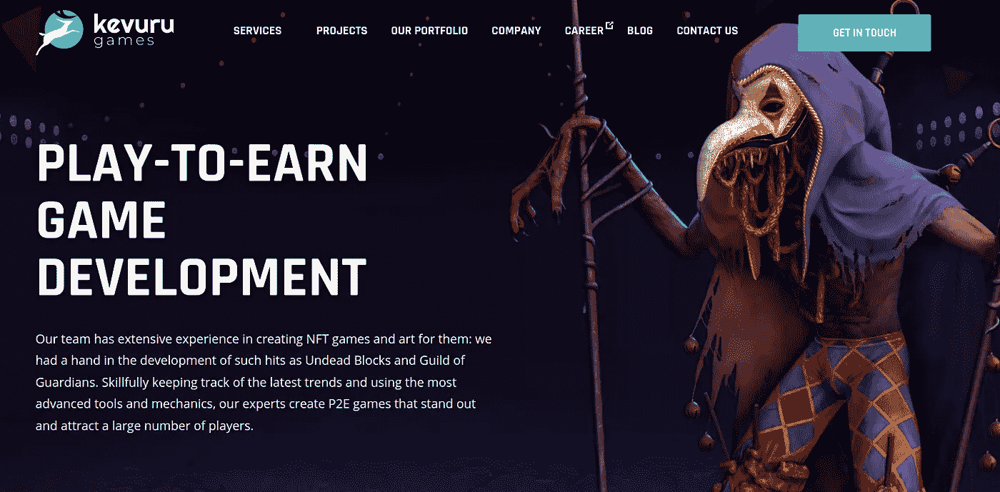
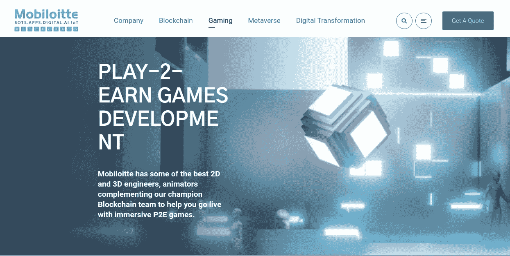
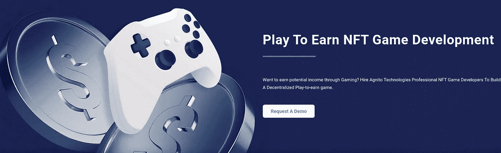
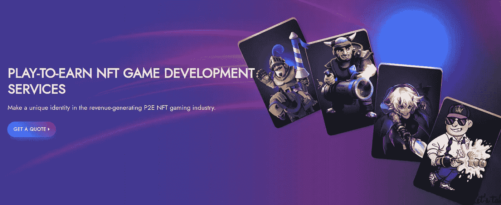
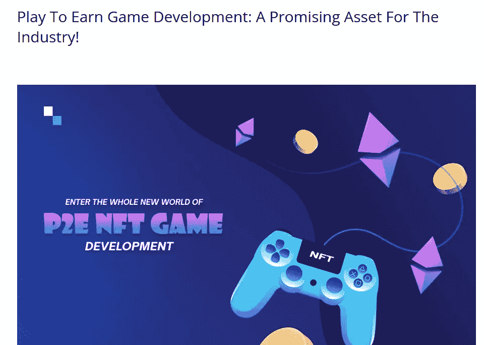

# 2023 年十大最佳游戏开发公司

> 原文：<https://medium.com/geekculture/top-10-best-play-to-earn-game-development-companies-in-2023-a14f3a6cb0d5?source=collection_archive---------10----------------------->

## 十大最赚钱的游戏开发公司如下

Top 10 Best Play to Earn Game Development Companies in 2023

游戏已经成为许多人生活中的一个重要方面。他们为广大观众带来了发财的机会。曾经游戏只是娱乐的一个点，现在给了一个赚的空间。这一切都发生在区块链将游戏部门掌握在手中，进行一次令人兴奋的升级之时。正是在 [**玩赚游戏发展的时候**](https://bit.ly/3epTTFx) 应运而生。许多公司适应了这一趋势，并提供了可以让人们在未来休息的发展。如果你想成为这个天堂般的机构中的一员，你可以看看这篇文章，它会给你一个 2023 年游戏开发公司十大盈利的线索。

# **十大游戏开发公司:**

## **1。** [**区块链 App 工厂**](https://bit.ly/3epTTFx) **(推荐)**

作为 P2E 奥运会的先驱，他们的唯一目标是把你的想法变成现实。作为游戏领域的领跑者，区块链应用工厂提供了最令人兴奋的游戏和收获无尽财富的平台。他们用一个基于 web3 的游戏来增加你的游戏体验。他们利用尖端技术开发出了 P2E 游戏所需的所有功能。凭借质量专家的力量，他们为自己增添了积极因素。他们被描绘成该领域的第一名，旨在成为具有丰富游戏经验的全球专家。因此，选择他们为 P2E 游戏建立根据您的需求。

## **2。**[**Suffescom**](https://bit.ly/3fVDRUc)

P2E 游戏为玩家提供了无与伦比的透明度。因此，玩家不必担心安全性，因为这些游戏允许极其安全的虚拟资产交易。Suffescom 提供了一个吸引数百万观众的激动人心的平台。他们是创造令人兴奋的游戏的专家，这就是为什么许多人选择用他们开发基于 web3 的游戏。开发一款基于 NFT 的游戏所需的时间取决于几个因素，Suffescom 会根据您的要求给出可能发生的确切时间框架，之后不会有任何延迟。他们已经处理了许多已经成为游戏企业家的客户，证明了玩赚游戏的成功。

## **3。**T22**BlockchainAppsDeveloper**

玩赚游戏开发是领先的玩赚(P2E)游戏开发公司 BlockchainAppsDeveloper 的专长。他们向他们尊敬的客户提供高质量的游戏。在数量上，他们从时间中挖掘出最好的东西，使他们成为市场的引领者。提供了无尽的机会，许多人进入令人兴奋的游戏。考虑到 NFT 游戏的所有功能、技术堆栈、API 集成、开发工作和其他因素，他们为您的业务需求创建了完美的游戏平台。当你需要一个刺激的游戏时，你可以盲目地选择他们进行激烈的游戏。

## **4。** [**Bitdeal**](https://bit.ly/3MmNmrG)

Bitdeal 是 P2E 游戏的行业领导者。由于游戏产业的财富机会已经被很好地定义，P2E 游戏已经成为最想要的，因为他们能够通过玩游戏获得难以置信的利润。他们通过帮助 NFT 游戏行业的企业主在任何区块链上发布他们自己的 P2E 游戏来支持他们的繁荣。他们的专家团队拥有使用尖端工具和技术进行创作的第一手知识。在 Bitdeal，他们发现了许多企业所缺乏的魔力，这就是为什么他们被认为是发展中的佼佼者。

## **5。** [**Gamesdapp**](https://bit.ly/3Te0LEQ)

Gamesdapp 是市场上的潮流引领者，他们在自己制作的每款游戏中都展示了多样性。P2E 奥运会是他们的强项，他们有自己的观众。他们提供顶级的游戏开发，使客户能够在任何区块链上启动他们的 P2E 游戏平台。他们的专家拥有使用技术和工具构建复杂的 P2E 游戏网站的实践经验。假设你正等着创建一个基于区块链、NFT 或加密货币的游戏平台。Gamesdapp 是一款一站式游戏解决方案，可根据您公司的要求创建理想的游戏环境。

## **6。** [**Kevuru 游戏**](https://bit.ly/3VghQ2H)

Kevuru games 是最杰出的游戏开发公司，利用尖端技术开发令人兴奋的游戏。他们的专业人员创造出脱颖而出的 P2E 游戏，并通过专业地跟上最新的趋势和利用最先进的工具和机制吸引了许多玩家。P2E 是一种让玩家和游戏开发者受益匪浅的游戏赚钱方式。区块链技术被用于从玩到赚的项目，这就是为什么世界各地的人们都忙于 P2E 模型。因此，让 Kevuru 游戏成为一个令人兴奋的游戏体验。

## 7 .**。**

****

**作为一家领先的游戏开发公司，Mobiloitte 为每个希望成为游戏社区一员的人提供了一些东西。为了帮助您推出身临其境的 P2E 游戏，Mobiloitte 拥有一些顶级的 2D 和 3D 工程师、动画师和冠军区块链团队成员。他们还使用最先进的工具来制造 P2E 模型的轰动效应。如果你在等待一个行业的突破，他们将带领你进入加密游戏行业。**

## ****8。** [**阿格尼托科技**](https://bit.ly/3CIQ4n9)**

****

**作为一家 Play to Earn 游戏开发公司，Agnito Technologies 提供顶级游戏解决方案，并在现代化的区块链网络上提供随时可用的功能。他们的开发人员拥有创建具有卓越和独一无二特性的分散式游戏平台的经验。他们是制作令人兴奋的 P2E 游戏的领导者，这些游戏能让人们获得大量奖励。他们正在用一款游戏吸引观众，这款游戏培养了人们在未来几年成为游戏企业家的需求。**

## ****9。** [**开发硬币**](https://bit.ly/3yxoOXk)**

****

**Developcoins 是一家令人兴奋的 P2E 游戏制造商，它使用尖端技术开发未来游戏。作为一个正在形成的潮流引领者，开发硬币让人们在玩的时候也能赚钱。他们和一群专家一起让一切都变得独特。抓住机会，使 P2E 游戏，吸引数百万用户的令人兴奋的游戏。**

## ****10。** [**安泰尔**](https://bit.ly/3rLu1qF)**

****

**Antier Solutions 是一家顶级公司，凭借其游戏性吸引了数百万用户。他们有一个为未来创造机会的专家团队。他们创造了一个令人兴奋的平台，展望未来。他们的附加功能使他们与众不同，这就是为什么许多人呼吁 P2E 游戏开发安提尔。**

## ****结论****

**P2E 游戏开发创造了一种氛围，让事情在短时间内变得更好。根据上面的列表，选择最好的一个来雕刻最好的 P2E 游戏。通过一轮选择，你可以成为伟大未来的一部分。**