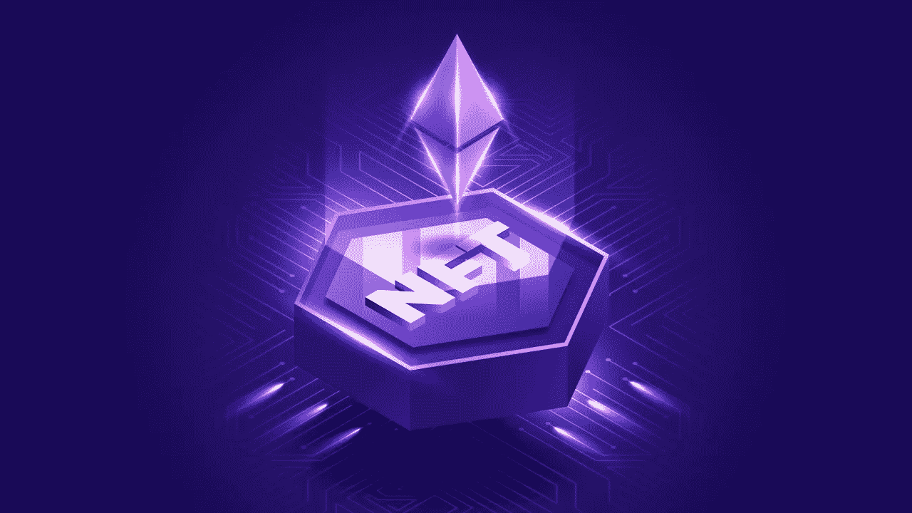

# 2023 年投资 NFTs 实现增长的十大品牌

> 原文：<https://medium.com/geekculture/top-10-brands-investing-in-nfts-for-growth-in-2023-c7cbeac1298e?source=collection_archive---------12----------------------->

Fig: Top 10 Brands Investing In NFTs For Growth In 2023

另一个关于“不可替代”的重要亮点是它们是不可互换的。NFT 是独一无二的可区分的数字资产，可以帮助表示几乎任何物理或虚拟资产。NFT 对特定资产的权力表明，存在者是相关资产的唯一和应有的所有者。品牌正在投资非传统艺术品，并在 NFT 艺术市场**挂牌出售。**

# **投资 NFT 的十大品牌**

**关于顶级品牌投资 NFTs 的讨论对于理解企业如何从现在开始欣然接受 NFTs 是至关重要的。大多数人一直在允许 NFT 篝火在世界范围内逐渐消失。尽管如此，非功能性测试的特点和它们的价值主张使它们成为定义未来的重要工具之一。这些品牌以 NFTs 的形式推出自己的服务，并通过 NFT 艺术市场进行销售。接下来是投资于非专利技术的顶级品牌的数字。**

## **阿迪达斯**

**在关于 NFT 最大公司的对话中，第一个出现的著名品牌会是阿迪达斯。这家运动服装巨头宣布，这是第一家与 NFTs 世界顶级品牌合作的 NFT drop，类似于 wearied Ham Yacht Club。阿迪达斯 NFT 在元宇宙平台沙盒中作为虚拟可穿戴设备提供给用户。此外，买家还进入了帽衫，运动服，和标志性的无檐帽。有趣的是，这个品牌本身已经买了一辆 BAYC NFT，Indigo Herz。同样，阿迪达斯最近也与普拉达在 2022 年 1 月就 NFT 的设计达成了合作。**

## **通过易趣网购买**

**在 NFT 股票中，最受投资者青睐的将是易贝，这是最受欢迎的时尚品牌之一。易贝为客人提供了购买和出售 NFTs 的装置，作为 NFT 艺术市场。该公司最近还在 6 月份收购了一家很受欢迎的 NFT 企业 KnownOrigin。易贝 NFT 企业的另一个有趣的亮点是创造了一套独特的非功能性技术。EBay 在不可预测的超现代需求中适应不断变化的需求的能力是其令人敬畏的优势之一。**

## **购物化**

**另一个涉足 NFTs 的大型电子商务是 Shopify。这是在 NFT 投资的顶级科技企业之一，尤其是考虑到巨大的毒品基地。Shopify 董事长最近发了一条关于 NFTs 的推文，使股票再次上涨了 19%。尽管如此，这种增长并没有像围绕新闻的企业所推动的那样持续。**

## **麦当劳**

**投资 NFTs 的品牌中最受欢迎的是麦当劳。快餐猛犸象在 2021 年 11 月推出了第一台 NFT，标志着它在 NFTs 领域的出现。麦当劳在 40 周年之际推出限量版 McRib NFTs。麦当劳是在 NFT 投资销售的顶级公司之一。**

## **可口可乐**

**可口可乐也是进入 NFT 市场的领先品牌之一。该公司于 2021 年推出了第一个 NFT 系列，并于 2022 年推出了另一个 NFT 系列。可口可乐品牌发布了 136 个 NFT 来庆祝 2022 年 7 月的骄傲月。然后在 2022 年 8 月推出另一套新的 NFT，以庆祝国际友谊日。可口可乐 NFTs 交易的收益归国际特奥会所有。可口可乐 NFTs 最吸引人的亮点是该品牌在元宇宙内的一些标志性手段的创造性具体化。**

## **三星电子**

**在 NFT 投资的顶级科技企业还包括三星。这家电子产品制造商公布了其在 2022 年电视阵容中引入 NFT 支持的计划。三星促进了 NFTs 的发展，以及结果适应新的分散观看和拍摄动作的需要。该公司计划推出第一个电视防御的 NFT 发现者，这也将作为一个商业聚合器。**

## **奈基**

**随着 NFT 创意工厂 RTFKT Studios 的加入，耐克是在 NFT 投资的顶级公司中的早期定居者之一。最近，耐克推出了第一个虚拟潜伏者系列，Cryptokicks，以独特的 NFT 为特色。Nike Cryptokicks NFT 系列在个性化和好奇心的元素上获得补贴，以获得大量宣传。**

## **一级方程式**

**一级方程式或 F1 领域不能忽视 NFTs 的潜力，因为此时各品牌都在投身于 NFT 运动。在 F1 联赛中，有很多 NFT 股票可以投资。法拉利最近表示，它正在努力探索进入 NFT 业务的机会。其他多个类似阿尔法·罗密欧的 F1 车队也在 NFT 领域留下了显著的印记。**

## **普拉达**

**许多奢侈品牌最近已经演变成拥有迷人的 NFT 系统的顶级 NFT 投资公司。继古驰和巴黎世家之后，普拉达也加入了奢侈时尚品牌的潮流，推出了他们独特的 [**NFT 系列**](https://www.turnkeytown.com/nft-collection-marketing-services) 。普拉达在 2022 年 6 月推出了大约 100 个以太坊接地的 NFT。NFT 主要是黑色或白色锭剂胶囊的 GIF，并与滴剂的周期数有关。时间胶囊的购买者会承认他们从普拉达最后的收藏中购买的细节的免费 NFT 空投。**

## **NFTs 受欢迎吗？**

**2014 年，随着加密货币为数字手段的投资铺平了道路，不可替代的纪念品首次出现。他们的支持推动了 NFT 作为数字艺术的时尚性。然而，如果你想了解投资 NFT 的顶级科技企业，你必须对 NFT 的时尚性感到好奇。**