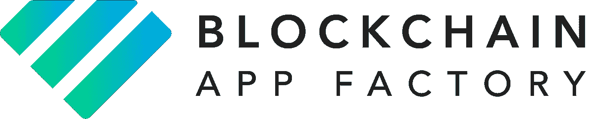
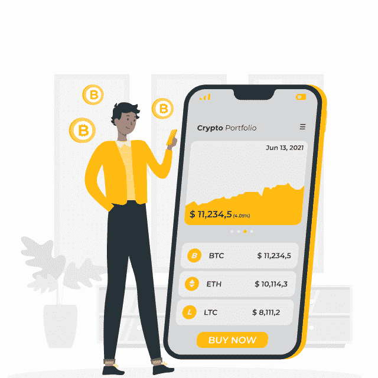
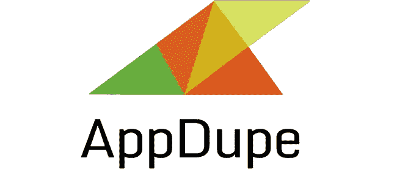
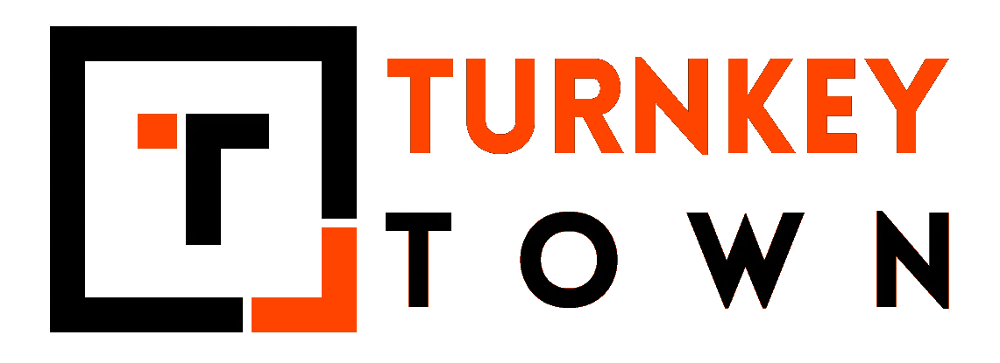
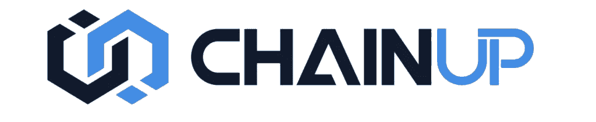

# 十大加密货币交易所开发公司—印度—美国—英国

> 原文：<https://medium.com/geekculture/top-10-cryptocurrency-exchange-development-company-india-usa-the-uk-229552454c18?source=collection_archive---------16----------------------->

随着更多的加密货币和更多的投资者，许多加密货币交易所今天已经建立并运行。但是，哪些公司帮助他们开发交换平台呢？以下是开发加密货币交易所的十大专家公司。

## [**区块链 App 工厂**](https://www.blockchainappfactory.com/cryptocurrency-exchange-software?utm_source=Medium&utm_medium=Geek+Culture+-+11%2F02%2F2022&utm_campaign=vignesh)

凭借近五年的区块链技术经验，印度公司[区块链应用工厂](https://www.blockchainappfactory.com/cryptocurrency-exchange-software?utm_source=Medium&utm_medium=Geek+Culture+-+11%2F02%2F2022&utm_campaign=vignesh)已经看到了我们今天看到的区块链应用的每个方面。他们在各种区块链应用领域的专业知识，如不可替代的代币、加密货币和分散式金融服务，可以从他们在世界各地(如英国和美国)交付的项目质量中看出来。他们的全球办事处分布在日本、澳大利亚、新加坡和马来西亚。

## [**安泰尔解**](https://www.antiersolutions.com/cryptocurrency-exchange-development-company/?utm_source=Medium&utm_medium=Geek+Culture+-+11%2F02%2F2022&utm_campaign=vignesh)

另一家总部位于印度的公司 Antier Solutions 已经与区块链应用合作了 6 年多。他们的主要专长是开发区块链的金融应用，如加密货币、加密交易所、硬币和钱包，甚至 DeFi 应用。该公司已经与世界各地的客户成功完成了 500 多个项目。该公司遍布全球，在英国、美国和加拿大设有办事处。

## [**CES**](https://www.cryptocurrencyexchangescript.com/cryptocurrency-exchange-software?utm_source=Medium&utm_medium=Geek+Culture+-+11%2F02%2F2022&utm_campaign=vignesh)

CES 或 Cryptocurrency Exchange Script 是一家印度公司，专门从事与其同名的产品，即开发现有产品和相关脚本的克隆产品。他们在开发加密交易所方面的经验和知识如此丰富，以至于他们声称可以在 15 天内以客户友好的价格提供定制的加密货币交易所。除了这些加密相关和 DeFi 相关的服务外，他们还为 NFT 项目的客户提供服务。他们通过在美国和英国的办事处向全球提供服务。

## [**Openxcell**](https://www.openxcell.com/exchanges/)

Openexcell 主要是一家软件和移动应用开发公司，在各种软件产品的开发方面拥有超过 12 年的专业知识，最近宣布进入区块链领域，其专业知识是加密产品，如交易所和钱包，以及智能合约解决方案。他们的客户名单中有一些大牌，他们在澳大利亚、英国和美国的全球业务也证明了这一点。

## [T5【IBT】T6](https://www.infiniteblocktech.com/cryptocurrency-exchange-software?utm_source=Medium&utm_medium=Geek+Culture+-+11%2F02%2F2022&utm_campaign=vignesh)

Infinite Block Tech 拥有令人兴奋的客户名单和开发区块链产品的丰富经验，是另一家擅长加密相关产品的公司，如交易所、代币、产品、钱包，甚至一些 NFT 应用程序。他们在区块链即服务(BaaS)相关产品方面的专业知识承诺，数据将受到保护，免受任何威胁，确保隐私在其产品中至关重要。他们遍布全球，在澳大利亚、日本、马来西亚、新加坡、英国、美国和印度都设有办事处。

## [**AppDupe**](https://www.appdupe.com/cryptocurrency-exchange-script?utm_source=Medium&utm_medium=Geek+Culture+-+11%2F02%2F2022&utm_campaign=vignesh)

然而，另一家印度开发公司 AppDupe 十多年来开始为各种客户开发移动应用程序，它已经发展成为一家区块链开发公司，也在一定程度上专注于 NFTs。他们在区块链应用方面的专业知识主要包括开发定制和白标加密交易所，就像其他著名的交易所一样。他们的快速解决方案确保了在更短的时间内开发和部署一个完美的加密货币交易所。AppDupe 目前在印度有 2 个办事处，在英国和美国也有办事处。

## [**Inoru**](https://www.inoru.com/cryptocurrency-exchange-script?utm_source=Medium&utm_medium=Geek+Culture+-+11%2F02%2F2022&utm_campaign=vignesh)

凭借超过 12 年的按需和游戏应用开发经验，Inoru 已经深入区块链世界，提供与加密货币相关的服务，如钱包、交易所、MLM 软件等。Inoru 已经交付了超过 350 个不同开发产品的项目，甚至采用了区块链的技术。他们在印度和新加坡设有办事处。

## [**TurnkeyTown**](https://www.turnkeytown.com/binance-clone?utm_source=Medium&utm_medium=Geek+Culture+-+11%2F02%2F2022&utm_campaign=vignesh)

作为另一家将加密产品开发加入其武库的移动应用程序开发公司，TurnKeyTown 是加密领域相对较新的开发商，尽管他们的早期迹象显示有希望。随着团队不断学习，他们承诺他们的加密货币兑换解决方案与他们的竞争对手不相上下，如果你选择在区块链世界寻找新的视角，他们是一家值得研究的公司。

## [**区块链不减当年**](https://blockchain.oodles.io/not-offer-this-service/)

区块链 Oodles 是另一家专注于使用区块链技术的解决方案的公司，名字相当古怪。作为交付一些有影响力的项目的早期推动者之一，他们希望利用他们已经获得的任何经验，并将客户放在首位。这种方法帮助他们在印度总部之后扩展到美国。

## 

****

**ChainUP 成立于 2017 年，是开发加密交易所的早期专家，是一家总部位于新加坡的公司，擅长其他区块链产品。他们的产品范围包括加密钱包，流动性系统，公共和财团区块链等。他们遍布全球，在日本、香港和加拿大设有办事处。**

## ****最后一条建议****

**尽管每天都有更多的公司提供与区块链技术相关的服务，但接触一家有丰富经验的公司是很重要的，因为他们会让你的工作更容易，同时开发一个无缝且健壮的[加密货币交换平台](https://bit.ly/3JpAr5J)。此类公司还奉行安全第一的政策，这意味着他们的解决方案将拥有更高的安全措施，以确保所有者和用户的安全体验。**