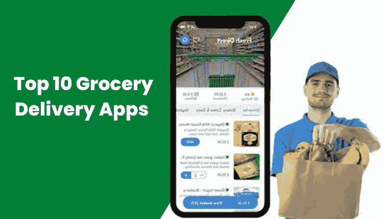
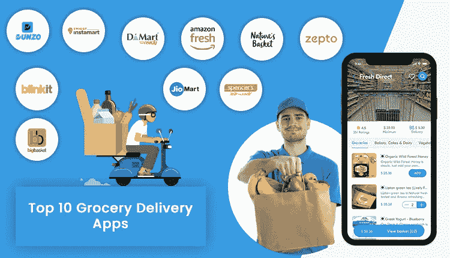

# 印度十大知名即时配送应用

> 原文：<https://medium.com/geekculture/top-10-grocery-delivery-apps-known-for-instant-deliveries-in-india-7262767aac5b?source=collection_archive---------20----------------------->

杂货交付应用程序为人们购买日常物品的方式带来了一场革命。这让他们的日常生活变得更加轻松。他们不再需要花很多时间在杂货店寻找他们想要的东西，因为应用程序使这变得很容易。在世界各地，你会遇到许多这样的解决方案，它们简化了杂货递送服务的执行方式。然而，我们将讨论解决方案及其在印度次大陆日益流行。

印度被称为梦想之乡。因此，如果你在这里开展业务或者已经在做了，那么你就来对地方了。这里的国内生产总值和人均收入很高，所以简而言之，它是一个创收的国家。

所以，如果你可能知道，基拉那的概念在过去的时代非常流行。然而，随着时间的推移，应用程序接管了大众，并由此整合到几乎每一个操作中，尤其是超市商店。第一个让这些产品广受欢迎的应用是 BigBasket。从那以后，新的解决方案开始出现。

这篇文章将揭示 10 个流行的杂货交付应用程序，这些应用程序使这些产品在 2023 年特别受欢迎。在此之前，让我们通过市场统计数据了解一下该解决方案如此受欢迎的原因。

## 印度在线杂货配送市场统计

*   2022 年的当前收入约为 150.6 亿美元
*   2022 年至 2027 年间，收入将以 28.42%的 CAGR 增长
*   预计到 2027 年，市场规模将达到 526 亿美元
*   到 2027 年，用户数量将达到 2.816 亿

## 杂货递送应用在印度流行的原因

除了上面提供的市场统计数据之外，一些因素也说明了这些解决方案的受欢迎程度。在下面检查这些因素。

*   避免在实体店柜台排队的便利。
*   方便购物的灵活性。
*   轻松以最优惠的价格购买，高效省钱。
*   在支付过程中保持安全。
*   简化提货和交付模式。

现在让我们来了解一下 10 个流行的杂货交付应用程序，这些应用程序通过使十分钟交付易于访问，使这些在 2022 年成为可能。

## 2023 年印度 10 大热门杂货配送应用

## 1.大篮子

成立年份— 2011 年，业务领域—印度 30 多个城市

我们名单上的第一个是大篮子。自 2011 年推出以来，它赢得了杂货交付平台的声誉，使家居用品的交付在 10 分钟内成为可能。

除了这些产品，该解决方案还管理订单采购、供应链和物流管理等任务。总而言之，这在很大程度上提高了他们的知名度。其次是它们构成的这些特征。

*   目录中有超过 14，000 种产品，包括水果、蔬菜和家居用品。
*   为客户提供创建个性化产品购物清单的灵活性。
*   方便发现从品牌购物的简单方法。

## 2.Blinkit

成立年份— 2013 年，运营区域—印度超过 27 个城市

布林基特原名格罗佛斯，是我们名单上的下一个。作为像 Blinkit 这样的 10 分钟[杂货交付应用领域的行家，眨眼之间就能确保交付成为可能。](https://www.groceryappclone.com/blog/how-to-develop-grocery-app-like-blinkit/)

该应用程序还具有一些引人注目的元素，这使其具有竞争优势，并使其在印度次大陆的杂货交付服务领域享有盛誉。

*   交付计划选项
*   轻松浏览和下单选项
*   应用内聊天和通话选项

## 3.邓佐

成立年份— 2014 年，运营区域—印度超过 8 个城市

自 2014 年成立以来，Dunzo 已经让客户能够以便捷的方式在家门口获得快速的杂货交付，除了药品和食品之外。

Dunzo 让客户可以灵活地联系到最近的配送合作伙伴，从而使杂货配送成为一个简单的过程。接下来是这些成分。

*   食品杂货的多个投放点
*   直播追踪
*   交货证明

## 4.Instamart

成立年份— 2020 年，运营区域—印度超过 25 个城市

Instamart 通过 Swiggy 平台使杂货配送服务变得容易。他们提供的食物包括谷物、水果、蔬菜等。，不一而足。

它们具有一些独特的功能，例如下面列出的功能，可以确保 10 分钟内完成食品杂货配送服务。请查看以下内容-

*   斯威奇的幽灵商店送来的
*   减少送货费用
*   快速上门送货

## 5.DMart 就绪

成立年份— 2002 年，业务领域—印度超过 302 个城市

自 2002 年以实体店的形式创建以来，DMart 目前通过其 DMart Ready 应用程序在印度超过 302 个城市轻松实现杂货交付。

得益于解决方案中的一些独特元素，客户可以轻松获得这些产品。

*   简单的库存管理使库存易于更新。
*   交付结束时生成发票，以明确交付项目的成本明细。
*   安排订单，为顾客提供在他们需要的时间购买食品的灵活性。

## 6.亚马逊生鲜

成立年份— 2007 年，业务领域—印度超过 15 个邦

自 2007 年成立以来，Amazon Fresh 已经通过其平台简化了杂货交付。他们拥有超过 60 个履行中心，使居住在这两个州的顾客能够轻松获得快速的杂货交付服务。

这一点之所以成为可能，特别是得益于它们所包含的功能，例如下面列出的功能

*   使用亚马逊的会员免订阅费
*   上门和上门取件递送选项
*   计划交货

## 7.大自然的篮子

成立年份-2005 年，经营区域-印度所有城市

自 2005 年以来，大自然的篮子让顾客可以轻松获得快速的杂货交付。他们通过在谷歌 Play 商店和苹果应用商店分别为 Android 和 iOS 平台提供的应用程序实现了这一目标。

它们包含了一些独特的元素，确保了无论发生什么情况，客户都能参与到解决方案中来。

*   定制订单
*   加入购物车
*   多个交付点

## 8.泽普托

成立年份— 2021 年，运营区域—印度 10 多个城市

Zepto 在印度十大最受欢迎的现成杂货交付应用中排名第八，该应用简化了杂货交付的方式。

该应用程序承诺在 10 分钟内交付，让客户可以轻松地完全减少与他们的杂货相关的等待时间。这尤其是由于它们在 like 中具有的特性。

*   全天候客户支持聊天机器人
*   计划交货
*   应用内聊天/通话

## 9.焦玛特

成立年份-2019 年，运营区域-印度 100 多个城市

自从 JioMart 开始运营以来，它已经通过其在线平台轻松方便地购买杂货。该解决方案在必需品上提供有吸引力的价格，确保客户支付合理的价格并获得高质量的产品，无论如何。这特别是由于他们所拥有的这些元素。

*   通过 WhatsApp 进行应用内购物
*   多种支付方式
*   免费送货上门

## 10.斯潘塞的零售业

推出年份— 2015 年，运营区域—印度 10 多个城市

斯潘塞零售让居住在印度的顾客可以更快地获得食品杂货。这是通过它采用的超级交付模式实现的。

自从数字化以来，客户可以灵活地无缝找到大量商品，下订单，然后送货上门。这也是出于礼貌，尤其是因为这些特征

*   购物清单创建
*   订阅时事通讯
*   二维码扫描

## 关键要点

亲身体验这些应用程序，您可以全面了解商业解决方案简化了家居用品的交付方式。这使得印度次大陆成为 2023 年建立杂货递送企业的温床。如果你打算这样做，可以使用现成的杂货配送应用——从一家离岸公司克隆的杂货应用。评估他们在按需杂货交付应用程序开发服务方面的专业知识，并分享您的需求。下一步，你的应用创意成形，你获得收入。