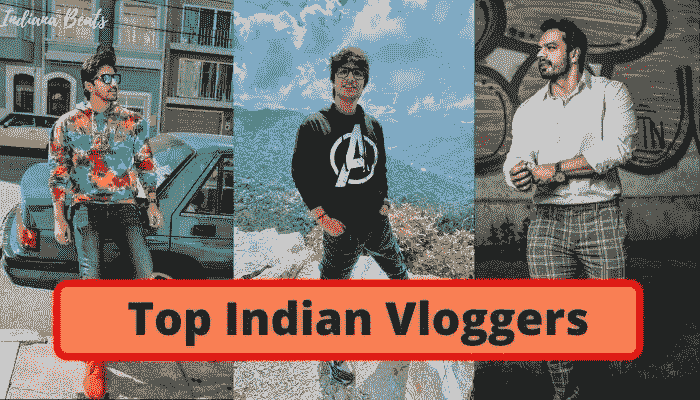

# YouTube 上印度十大每日视频博客

> 原文：<https://medium.com/geekculture/top-10-indian-daily-vloggers-on-youtube-df8135108057?source=collection_archive---------3----------------------->

Vlogging，一种记录个人日常任务的活动，现在正成为一种趋势。如果你现在打开 YouTube，你肯定会看到一个标题为“我生命中的一天”的视频。每天都有博客作者制作视频并发布在他们的社交媒体平台上，让人们对他们的生活有了一些小小的了解。

这是增加观众之间互动和信任的好方法。因此，有影响力的人会建立由忠实追随者组成的在线社区，这些追随者可能会因为他们的内容而追随他们。YouTube 等网站上的这些流行的社交媒体博客帮助企业产生线索，并将其转化为对其品牌的潜在影响者。

由于 YouTube 成为最受欢迎的视频分享网站，视频博客已经成为一个有利可图的职业选择，收入超过百万美元。有影响力的人记录下他们的日常活动，并以视频博客的形式发布，让他们的追随者观看。

随着视频博客越来越受欢迎，品牌已经开始为他们的业务寻求营销伙伴关系。让我们来看看 YouTube 上来自印度的一些最好的视频博客。

**目录**

*   视频日志和 YouTube
*   YouTube 上十大印度博客
*   包扎

## **Vlogging 和 YouTube**

自 2004 年第一个 vlog 发布以来，vlogg 作为一种活动已经慢慢酝酿起来了，2004 年也被称为“VLOG 年”。但是，直到 2005 年 12 月 YouTube 的推出，vlogging 才真正抓住了每个人的注意力。Youtube 是全球超过 20 亿用户的家园。它带动了超过 3000 万次的访问，使其成为一个伟大的平台，为希望获得各种主题信息的大量观众提供信息。此外，vlogging 是一个伟大的媒体，有助于连接来自世界各地的人。此外，这也有助于品牌寻找潜在的影响者，为他们的业务进行合作。在下一部分，我们将看看 YouTube 上的**十大印度博客。**

# **YouTube 上十大印度博客**

> **进位终止**

Ajey Nagar 被称为 Carry Minati，在青少年中很受欢迎。这个优图来自哈里亚纳邦的法里达巴德。他的内容有 360 万订户，主要是烧烤、喜剧小品和对各种在线话题的反应。Nagar 有一个单独的 youtube 游戏频道，名为 CarryIsLive，他在网上玩游戏时播放自己的视频。这个频道增加了 113 亿用户。

> **Ashish Chanchalani**

Ashish Chanchalani 是来自马哈拉施特拉邦的 Youtuber 和有影响力的人。他通过 youtube 视频首次亮相娱乐圈，视频中有多个角色，其中一个你可能会认出是醉酒大叔，这是他在 youtube 视频博客中反复出现的角色。他的粉丝在 YouTube 上有 280 万。

> **布凡巴姆**

Bhuvan Bam 拥有 BB ki Vines 喜剧频道。他是来自德里的印度喜剧演员、作家、歌手、歌曲作者和 Youtube 名人。他的内容集中在一个城市青少年面临的生活和危机，以及他与朋友的异想天开的谈话，所有的角色都由布凡本人扮演。他的 youtube 频道有 250 万订户。他饰演的角色有布凡、班卓达斯、萨梅尔·福迪、提图·妈妈、巴布鲁等。

> **Sourav Joshi**

Sourav Joshi 是印度社交媒体的影响者，也是 YouTuber 和 vlogger 的用户。他有两个 youtube 频道，一个是他的作品，另一个是他的视频博客。他的视频提供了对生活的热情，他的视频伙伴是他的兄弟。他从 2015 年 9 月开始。现在他有超过 16 亿的订户

> **莫斯特莱森**

Prajakta Koli 可能更容易被认出来，因为 MostlySane 是一名制作喜剧视频的印度 YouTuber 和女演员。她的内容侧重于相关的日常生活情况。Koli 曾与赫里尼克·罗申、卡琳娜·卡普尔和卡卓尔等主流宝莱坞演员合作。她在 YouTube 上有 674 万用户。

> **Mumbiker Nikhil**

Mumbiker，又名 Nikhil Sharma，是一位来自马哈拉施特拉邦孟买的知名摩托车 vlogger。他的 YouTube 内容包括他的旅行视频和摩托车视频。他在 2013 年推出了自己的 YouTube 账户，截至目前，该账户已有 390 万名用户。

> **桑巴瓦纳塞斯**

Sambhavna Seth 是一名女演员、舞蹈家，也是印度最著名的视频博客作者之一。她出演了几部电影。她因参加真人秀系列节目《大老板 2》而出名。她的 YouTube 账户有 325 万订阅用户，包括她和她丈夫在封锁期间的日常活动视频。

> **沙尼斯·施雷斯塔**

沙尼斯是另一个流行的视频博客作者，她嫁给了前面提到的另一个著名的旅游和日常生活视频博客作者 Mumbiker Nikhil。大约有 80 万人订阅了她的频道。通过她的博客，我们可以窥见她悠闲的生活。

> **飞行兽**

Gaurav Taneja，又名飞兽，是一名健身爱好者、飞行员，来自印度的 YouTuber。他向观众讲述他的日常活动和个人经历。他与女儿、妻子和其他亲戚的家庭相关活动经常出现在他的博客中。他在 2017 年开始写视频博客，截至目前，他的 YouTube 频道拥有 760 万订户。FitMuscleTV 和 Rashbhari Ke Papa 是 Gaurav Taneja 经营的另外两个频道。

> **Mallika Motiramani**

在目睹了英国的 YouTubers 之后，Mallika 开始思考为什么她没有跟随他们的脚步。所以，她在 15 岁的时候开始写博客。YouTube 上最受关注的频道之一是 Mallika 的，拥有 190 万订户。

**包装**

当然，YouTube 是影响者营销中使用最广泛的社交媒体平台之一。所以，走向这个数字平台，订阅这些 vloggers 娱乐和资讯。这些是 YouTube 上一些**最好的视频博客，现在是信息的主要来源。**