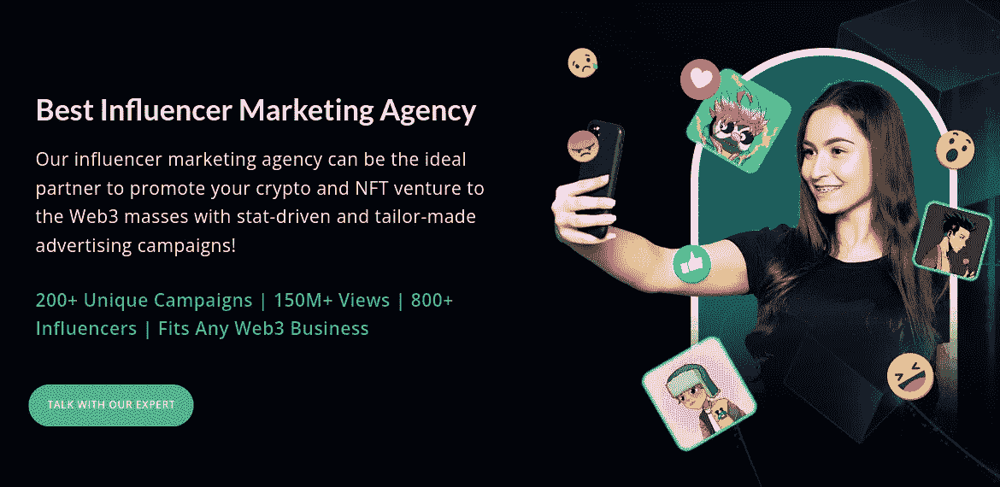

# 2023 年 3 月十大影响力营销机构

> 原文：<https://medium.com/geekculture/top-10-influencer-marketing-agencies-in-november-2022-c684f03c91a6?source=collection_archive---------14----------------------->

区块链技术的兴起为许多新的 NFT 和加密项目的兴起铺平了道路。因此，Web3 领域充斥着大量新的 web3 项目。看到现有的加密和 NFT 项目的数量，任何进入 web3 领域的新企业可能都会感到有点焦虑。因此，在密码市场上，对精心设计的营销策略的需求急剧上升。**尤其是影响者营销，已经成为传播关于一个密码或 NFT 项目的正面口碑的非常成功的营销策略之一。在数字营销策略中，影响者营销被证明是这个社交媒体时代最好的结果导向营销策略。**

**[**聘请最有影响力的营销机构**](https://www.blockchainappfactory.com/influencer-marketing-agency?utm_source=Medium+GC&utm_medium=3%2F11%2F22&utm_campaign=senpagapandian) 👈👈**点击这里****

## ****Web3 影响者营销****

**使用社交媒体影响者和拥有可靠和忠诚追随者的名人来传播即将到来的/现有的加密项目。影响者营销已经成为 **Web3 领域广泛使用的营销工具，因为不需要从零开始建立社区**。你可以利用现有的由有影响力的人建立的社区，不费吹灰之力就能接触到你的目标受众。**

**如果你正在寻找有影响力的人来推广你的 Web3 项目，你来对地方了。我们编制了一份密码领域领先的有影响力的营销机构的名单，可以帮助你的企业。**

# ****2022 年 11 月领先影响力营销机构****

## ****1。区块链 App 工厂****

****

**Blockchain App Factory**

**区块链应用工厂已经发展成为区块链开发和 Web3 营销服务的市场领导者。该公司因其一流的统计数据驱动的影响者营销服务而在 Web3 市场上备受欢迎。**

**[**区块链 App 工厂**](https://www.blockchainappfactory.com/influencer-marketing-agency?utm_source=Medium+GC&utm_medium=3%2F11%2F22&utm_campaign=senpagapandian) 👈👈👈**(点击了解更多)**可以接触市场上领先的加密影响者。它还可以帮助您管理它们、创建创新内容和分析影响者活动。该公司提供的一些影响者营销服务包括 YouTube 影响者营销、Instagram 影响者营销、通过流行页面的模因进行推广以及名人代言。**

**如果你想推广你的 NFT 市场、P2E 游戏、ICO 项目、IDO 项目、IDO launchpads、DeFi 平台和其他 Web3 业务领域，你可以联系区块链应用工厂。如果你正在寻找最好的影响者营销机构，你可以选择区块链应用工厂。**

## ****2。cht box****

**ChtrBox 是印度影响者营销的先驱之一，它将品牌和领先的影响者联系起来，以成功开展营销活动。自 2016 年以来，该公司与许多顶级影响者、内容创作者和社交媒体页面合作，开展了许多成功的营销活动，吸引了数百万用户。**

**超过 80 个品牌和机构与 ChtrBox 及其影响者网络合作。如果你想利用你的营销活动，你可以和 ChtrBox 合作。**

## ****3。影响者营销工厂****

**影响者营销工厂是 Web3 领域领先的影响者营销机构之一。它通过有效的营销活动为客户提供端到端的服务。**

**它是一家全球营销机构，在脸书、Instagram 和 YouTube 等平台上创建最真实、可扩展和以结果为导向的社交媒体影响者营销活动。**

**如果你正在寻找一家旨在为客户提供高投资回报率的公司，你可以联系影响者营销工厂。**

## ****4。成像效果****

**Imagency 是一家著名的营销机构，帮助品牌通过顶级影响者吸引全球受众。该公司以开发和执行优质影响者营销策略而闻名，以扩大品牌并触及数百万人。**

**该公司的服务包括影响者搜索、内容制作、指南、管理和分析。**

**凭借其庞大的网络，Imagency 是市场上最受欢迎的有影响力的营销机构之一。**

## ****5。梅拉齐****

**Meraqi 是一家著名的影响者营销机构，通过战略性和创新性的影响者营销活动，帮助品牌吸引和激活目标受众。**

**Meraqi 提供的服务包括活动管理、活动报告、影响者选择和管理分析。该机构是一个社会本地人，着眼于创造性的内容和结果驱动的战略。**

**如果您正在为您的企业寻找一家有影响力的营销机构，Meraqi 可能是理想的选择。**

## ****6。让我们影响****

**Lets Infleunce 是一家备受推崇的有影响力的机构，专注于获取数据驱动的见解，为品牌带来高投资回报率。从为您联系合适的影响者，到通过适当的执行和规划开展成功的营销活动，让影响力为其客户提供优质的端到端服务。**

**Lets Influence 拥有一个庞大的影响者网络，从 Youtubers 到演员和体育人士，使其成为市场上最好的影响者营销机构之一。**

## ****7。雪地机构****

**Snow Agency 是一家充满激情的影响者营销机构，采用数据驱动的方法来获得营销活动的结果。**

**该机构在各种平台上提供影响者营销服务，如脸书、Instagram、谷歌广告、Snapchat、电子邮件、短信等。它还非常重视品牌发展和转化率优化。**

**凭借在影响者营销方面的良好记录和累积的成功，Snow Agency 已经发展成为最敏捷的影响者营销机构之一。**

## ****8。Kinnect****

**Kinnect 是一家全方位服务的数字营销机构，与企业合作，以扩大其品牌形象。他们提供优质的影响者营销服务，可以把你和你的潜在消费者“联系”起来。**

**该公司以其有机的品牌影响者整合、与影响者的长期合作以提升品牌信息以及分析活动推广的新时代工具而闻名。**

## ****9。AdLift****

**假设你正在寻找一家可以提供可信的影响者营销活动的公司，该公司专注于为你的影响者营销活动创建病毒式的和吸引人的内容。在这种情况下，AdLift 可能是您的最佳选择。**

**AdLift 与市场上的几个领先品牌合作，是 Web3 营销领域的老手。如果你想让你的项目达到最大化，你可以联系 AdLift。**

## ****10。阿凡达工作室****

**阿凡达工作室是一个创造性的机构，对影响者营销有一个美学的方法。该公司花时间了解其客户的需求和要求，以提供快速有效的影响者营销服务。**

**你可以选择阿凡达工作室，因为它在通过影响者营销推广产品和品牌方面拥有丰富的经验和信誉。**

## ****结论****

**影响者营销已经成为 Web3 营销活动中一个突出的推广工具。以上列出的 [**主要影响者营销机构**](https://www.blockchainappfactory.com/influencer-marketing-agency?utm_source=Medium+GC&utm_medium=3%2F11%2F22&utm_campaign=senpagapandian) 对你的 Web3 营销活动会有很大帮助。你可以咨询其中一家机构，以最大限度地扩大你在 Web3 领域的影响力。**