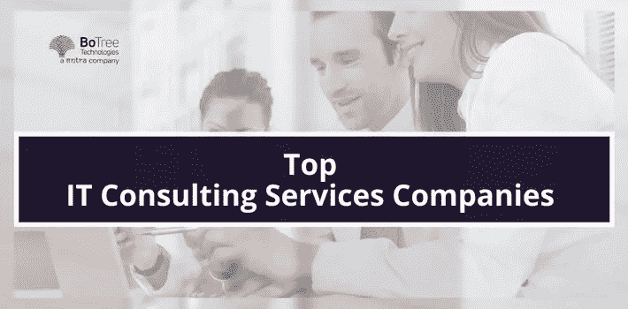

# 全球十大 IT 咨询服务公司

> 原文：<https://medium.com/geekculture/top-10-it-consulting-services-companies-in-the-world-c8184b24fc07?source=collection_archive---------3----------------------->

IT 咨询正以一致但缓慢的速度发展。2016 年至 2021 年，该业务平均增长 2.8%。软件咨询服务市场价值 480 亿美元，通常占整个咨询市场的 20%。技术咨询公司越来越成为希望改善 IT 基础设施和运营的企业和初创公司的选择。

当需要获得正确的指导来管理企业的 it 部门时，IT 咨询至关重要。然而，随着区块链、人工智能和人工智能、物联网等最新创新的出现，雇佣一家[软件咨询公司](https://www.botreetechnologies.com/)来协助这些技术的实施是完全有意义的。

让我们来看看十大最受欢迎的 [IT 咨询公司](https://www.botreetechnologies.com/blog/it-consulting-firms-to-help-digital-transformation/)。

# **最受欢迎的 10 家 IT 咨询服务公司**

IT 咨询可以带来来自深入和经验丰富的技术专业知识的创新观点。它还提高了组织 It 运营的整体效率。这就是为什么雇佣[软件咨询公司](https://botreetechnologies.medium.com/top-10-software-consulting-companies-for-enterprise-software-development-needs-43bfaa4d1515)往往会带来更好的结果。

**下面是要知道的顶级 IT 咨询公司——**

1.  **树木科技:**

*   BoTree Technologies 是一家[值得信赖的企业软件开发公司](https://www.botreetechnologies.com/enterprise-software-development-company)和软件咨询公司，专注于增强客户的整体 IT 运营。
*   该公司提供战略 IT 咨询、托管 IT 服务、 [IT 战略](https://www.botreetechnologies.com/blog/it-strategy-challenges/) &规划、流程优化和数字化转型服务。它利用最新的技术来提供 It 咨询，并确保所有的过程提供最佳的输出。超过 20 个国家的公司信任 BoTree Technologies 的软件咨询服务。

**2。Intellias:**

*   Intellias 成立于 2002 年，是一家全球软件咨询机构，提供广泛的技术咨询服务。它拥有一支由 2600 多名专业人员组成的团队，提供数字咨询、软件工程和 It 基础设施服务。
*   他们为西门子、德勤等公司提供高质量的软件工程和咨询服务。Intellias 遍布全球，并提供一流的咨询服务来增强企业的 IT 运营。

**3。埃森哲:**

*   埃森哲因其 [IT 咨询服务](https://www.botreetechnologies.com/it-consulting-services)而闻名全球。该公司有一个由六部分组成的创新架构，包括创新中心、研究、实验室和工作室。埃森哲拥有超过 450，000 名从事 IT 和管理项目的员工。
*   该公司通常被认为是顶尖的软件开发和 IT 咨询公司。埃森哲还拥有其名称的专利，这使其获得了竞争优势。

**4。Tntra:**

*   Tntra 是一个创新生态系统，提供最好的产品工程和 IT 咨询。该公司拥有拥有 30 多年行业经验的领域专家。它提供软件服务、托管服务、数字化转型，并加快企业的创新步伐。
*   该公司与 10 多个国家的客户合作，并为行业领导者提供软件咨询服务。Tntra 拥有一个由 110 多名专家和开发人员组成的团队，他们具备帮助企业进行 IT 工程的技能。

**5。网络基础设施公司:**

*   Cyber Infrastructure 是一家软件咨询公司，拥有超过 12 年的全球 IT 经验，提供广泛的技术解决方案。该公司已成为提供创新 IT 咨询解决方案和服务的领先公司，始终遵循全球公认的标准和当前的技术趋势。通过他们的产品，网络基础设施帮助企业实现他们的目标，并引领他们走向成功。

> **阅读更多:** [**全球 7 大科技咨询公司**](https://www.botreetechnologies.com/blog/top-technology-consulting-companies/)

**6。塔塔咨询服务:**

*   自 1968 年以来，塔塔咨询服务公司(或称 TCS)一直在利用软件咨询和商业智能的结合来提高企业盈利能力。该公司的智能业务运作通过使用技术来实现最佳结果，降低成本，并增加工作能力，以最大限度地提高生产率。
*   更重要的是，塔塔的客户有机会根据他们独特的需求定制他们的解决方案。TCS 提供 IT 咨询、应用开发、基础设施协助和业务流程外包等服务。

7 .**。万磁王 IT 解决方案:**

*   作为领先的软件咨询公司之一，万磁王是一家屡获殊荣的软件咨询和开发公司。他们的核心竞争力是创造市场领先的端到端电子商务解决方案。
*   他们提供广泛的技术解决方案，以确保公司从其 IT 运营中获得最佳成果。万磁王已经为全球超过 650 家客户提供服务。它还通过提供内部员工扩充服务来简化公司的运营。

**8。斯凯利亚:**

*   十多年来，Skelia 一直是全球值得信赖的软件咨询公司。它为从初创公司到财富 500 强的公司提供 It 咨询服务。它有 300 多名团队成员。
*   该公司提供软件开发、IT 咨询、托管 IT 服务、应用程序开发、流程再造等等。Skelia 拥有一流的商业模式，确保客户物有所值。客户通常控制项目的预算和团队。

**9。凯捷:**

*   凯捷是全球十大咨询公司之一，以其 360 度 [IT 咨询解决方案](https://www.botreetechnologies.com/blog/it-consulting-solutions-for-midsize-enterprises/)而闻名。其技术服务包括软件解决方案的设计、开发和实施，以及系统应用和 IT 技术提升。
*   值得注意的是，凯捷提供外包服务，帮助客户管理应用和基础设施 IT 系统的全部或部分控制，以及相关的业务流程。公司遵循以结果为导向的方法。

**10。Inventorsoft:**

*   凭借其 8 年的经验、专业知识和惊人的声誉，Inventorsoft 帮助企业留下了数字化的影响。它以完全透明和高效的方式向全球客户提供 It 咨询服务。该公司以按时交付软件解决方案而闻名。
*   作为一家 IT 咨询服务公司，Inventorsoft 帮助企业重塑其 IT 流程，并从[其运营]中获得最佳结果。该公司已经完成了 50 多个项目，并得到了客户的积极反馈。

> **阅读更多:** [**雇佣 IT 咨询服务的五大好处**](https://www.botreetechnologies.com/blog/top-5-benefits-of-hiring-it-consulting-services/)

## 结论

全球有数百家软件咨询提供商。从他们中选择最好的一个可能是一个挑战。上面十大软件咨询公司的列表提供了一个关于对 IT 咨询公司的期望的想法。选择合适的公司取决于需求。然而，上述公司在服务客户和提供最佳 IT 咨询服务方面拥有多年的经验。因此，对于希望扩大 IT 运营的企业来说，雇佣他们中的任何一个都是一个巨大的风险。

[**今天免费咨询我们**](https://www.botreetechnologies.com/contact) 。