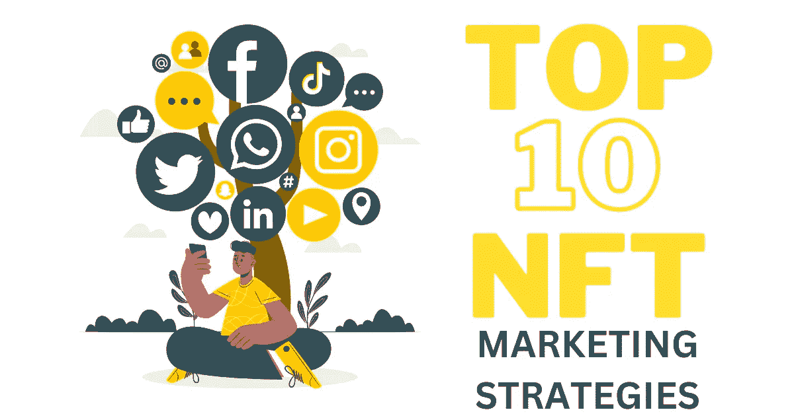

# 十大 NFT 营销服务——让您的 NFT 项目排名第一的关键

> 原文：<https://medium.com/geekculture/top-10-nft-marketing-services-the-key-to-rank-your-nft-project-no-1-a480dba9deec?source=collection_archive---------13----------------------->

NFT Marketing strategies

全球知名的 NFT 市场很快变得饱和，无数艺术家、企业、名人和爱好者渴望成为这个利润丰厚的行业的一部分。

由于许多领先的组织对 NFT 市场的启动和 NFT 的发展表现出极大的兴趣，企业家们进入 NFT 世界的热潮现在变得如此明显。

在如此拥挤的环境中保持领先和独特听起来像是一项艰巨的任务。尽管如此，只要对 NFT 市场**[**有一个清晰的了解，就可以很容易地让他们的项目与众不同。**](https://www.infiniteblocktech.com/nft-marketing?utm_source=guestblog&utm_medium=medium-geekculture-04-11-2022&utm_campaign=muralidharan.g)**

在这篇博客中，我们将讨论 NFT 的含义，为什么 NFT 营销对 NFT 项目至关重要，营销策略如何帮助你的 NFT，以及为什么要考虑与 NFT 营销机构合作。

## **快速复习一下 NFTs**

在过去的几年里，NFTs 被认为是 Web3 领域最引人注目的方面之一。有些人利用 NFT 来出名；有些人用它们来推销自己的品牌。但是有一点是不变的。非功能性测试的需求和用例将会保持不变。

通过不可替换的令牌安全地存储在区块链上的数据可以与包括各种形式的媒体的文件链接，包括艺术品、图像、视频、音频等。除了这些文件，它们还可以被转发到某些物理项目。

NFT 大力支持原创者，让他们享受各种福利，如为他们独特的数字创作获得曝光率和声誉，并获得更多版税，这大大提高了他们的财务状况。

NFT 的价值是投机性的，是由收集和交易它的人们决定的。拥有 NFT 的人将对与令牌相关联的数据或项目拥有排他性权利。这些代币可以在被称为“NFT 市场”的数字论坛上进行交易，以获取高额利润

## **NFT 营销的不可阻挡的角色**

NFT 市场仍处于萌芽阶段，但我们可以见证一场吸引注意力的拉锯战。随着如此多的 NFT 项目显示出在 NFT 领域的主导地位，一个强大的营销备份是非常强制性的。

你可能有一个价值数百万的 NFT 项目，但执行营销策略是必要的，它仍然是埋在地下的黄金门票。

为了传达你的 NFT 的存在和价值，你必须运用可靠的 NFT 营销策略，这才是真正的魔术。

NFT 营销不仅仅是执行一种策略，而是各种数字营销策略的集合。

例如，让我们考虑一下 [Beeple 的案例，他以 6900 万美元的价格出售了自己的艺术品。](https://www.businessinsider.in/tech/news/facebook-announced-a-new-plan-to-help-users-make-covid-19-vaccine-appointments/articleshow/81515468.cms)他的成功并非一日之功，因为他首先致力于在社交媒体平台(Instagram)上建立声誉，让他的艺术更受欢迎。你知道吗？他是最有影响力的人之一，名声很大。

## **千万不要错过的十大 NFT 营销策略！！！**

锁定最佳策略在 NFT 项目的推广过程中起着重要作用。

让创作者和企业高兴的是，各种 [**NFT 营销策略**](https://www.infiniteblocktech.com/nft-marketing?utm_source=guestblog&utm_medium=medium-geekculture-04-11-2022&utm_campaign=muralidharan.g) 可以让你的 NFT 项目成为焦点。

以下是一些行之有效的 NFT 营销策略。我们一个一个解码吧。

## **NFT 上市**

列出你的 NFTs 是你销售你独特作品的第一个策略。

由于 NFT 市场有人流，人们可以很容易地提高投资者的知名度，迅速提升市场价值和需求，而不会出现任何问题。

NFT 上市的一些最好的 NFT 市场是 OpenSea 和 Rarible。

## **社区营销**

在开发了一个奇妙的 NFT 项目后，下一步你要做的就是围绕它建立一个社区。

要建立一个社区，你可以使用很多平台，比如 Discord、Reddit、Twitter 等。社区建设进程成为可能。

这种策略的主要优点是，你可以与观众建立更好的关系，并传达你的 NFT 项目。

由于这种基于参与的活动，他们会对您的 NFT 项目更感兴趣，并对了解其更新充满热情。

## **内容营销**

由于该战略有可能产生最佳结果，因此不可避免地被列入这一清单。内容营销是接触潜在受众的另一种有效方法。

事实是，内容永远是重中之重，它是整个 NFT 营销过程的核心部分。您可以通过发布博客、信息图表等来推广您的 NFT 项目，从而提高品牌知名度

这将使你能够直接针对你的目标市场。确保内容是最高水准的，并且只提供完全基于你的 NFT 项目的相关信息。

在 Reddit、Quora、Pinterest 等热门网站上发布内容。，是明智的选择。

## **利用影响者的力量**

影响者营销是最有前途的营销策略，用于促进非功能性测试。影响者可以在品牌和客户之间建立牢固的纽带，因为他们与个人保持着密切的联系。

这些有影响力的人只不过是拥有强大粉丝基础的知名人士。通过影响者营销来联系你的受众并建立声誉是很简单的。

如今，影响者营销相当流行和普遍。接触适合你的 NFT 有影响力的人将是一个明智的举动。

通过这样做，你的 NFT 项目很有可能会引起目标受众的兴趣。根据他们收取的费用或他们在帖子上收到的喜欢和评论来选择影响者是很重要的。

## **为您的 NFT 项目组织 AMA 会议**

客户关于你的 NFT 项目的问题可以在“问我任何问题(AMA)”会议期间得到回答，这可能有助于他们参与你的独特创作。

通过进行这样的会议，他们对你的项目有了适当的了解，最终有助于增加你在 NFT 的销售额。

## **新闻稿**

新闻稿发布是这个列表中的一个基本策略。这将有利于你的 NFT 项目，因为你将能够以一种可靠的方式告知正确的观众关于你的 NFT。

通过你的新闻稿，你提到了你的项目的价值，以及买家得到的好处。

注意选择最好的媒体来展示你的新闻稿。

## **社交媒体营销**

社交媒体平台有机地提高了你的 NFT 项目的宣传水平。通过社交媒体渠道让目标受众或社区参与进来至关重要。

并非所有的社交网络平台都适合与 NFT 营销服务一起使用。脸书、Instagram、Twitter 和 YouTube 是向许多受众推广 NFT 的一些领先的社交媒体渠道。

## **搜索引擎优化**

通过 SEO 增加你的 NFT 项目的有机可见性是吸引潜在买家要考虑的另一件事。

考虑到如今谷歌搜索结果被频繁用于寻找问题的答案或获得新的视角，这将是一个理想的选择。

你可以通过联系 NFT 顶级营销机构来实现这一点。

## **视频营销**

视觉上吸引观众比文字内容更重要。

制作视频将有利于向不同的目标群体传播更多关于 NFT 项目的知识和清晰度。

使用像 YouTube 这样的在线视频分享服务来使这种营销策略卓有成效。

## **电子邮件营销**

电子邮件营销是古老的，但金。它仍然被认为是营销非功能性食物的最有效的方法之一。当你抓住目标受众的注意力时，潜在客户的转化是下一个要考虑的因素。

毫无疑问，电子邮件营销是成本效益和转换丰富的促销方法，是用于 NFT 营销。

为了有效地执行，需要收集潜在客户的电子邮件地址，并通过向他们发送包含有关您的 NFT 项目的重要细节的电子邮件简讯来通知他们。

## 为什么要与 NFT 营销机构合作？人们从这种合作中获得了什么样的好处？

一家声誉良好的 NFT 营销服务公司帮助您实施上述 NFT 营销策略，这有助于您的 NFT 项目起飞并进入下一阶段。但是主要的任务在于你如何为你的项目选择一个合适的。

与许多缺乏经验的 NFT 营销机构，一个人必须进行彻底的市场调查，以发现一个可靠的营销伙伴。以下是雇佣有经验的 NFT 营销机构的优势:

**专业地实施策略**——当你与合适的营销人员合作时，推广 NFTs 不再是一件难事。该公司的营销专家清楚地阐述了你的项目的最佳方法，使它到达大众没有混乱的机会。

**高投资回报率**——因为他们拥有在 NFT 项目上创造有机炒作的专业知识，他们知道什么策略有利于你的项目。因此，你可以节省大量的钱，最终有助于扩大你的投资回报。

**接触先进技术** —每一个 NFT 都是独一无二的，每天都在进步。一家 NFT 营销机构，拥有最新的技术，对市场变化有清晰的了解，使您能够从其他竞争对手中脱颖而出。

**跟踪结果** —该公司可以使用几个最新的工具来告知客户有关 NFT 营销活动的信息。然后，他们分析这些结果，并作出一定的改进，最终有利于你的 NFT 营销。

## **博客的结尾部分**

我们几乎完成了这本有见地的 NFT 营销指南。我希望它已经让你对 NFT 营销服务有了一些基本的了解。

作为最后的观察，NFT 正在积聚势头，并将在未来几年继续在宣传工具中旅行。

要推广您的 NFT 项目并提高潜在客户转化率，请联系一家行业领先的 NFT 营销机构，它可以为您提供以结果为导向的营销策略，让您的 NFT 项目在竞争中获得明显优势。

祝好运，伙计们！！！