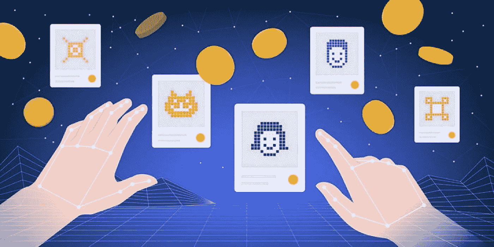

# NFT 十大市场— 2022 年

> 原文：<https://medium.com/geekculture/top-10-nft-marketplaces-2022-5f74e92b6aa2?source=collection_archive---------9----------------------->

NFT 是在区块链上铸造的新时代数字资产。这些新时代资产的价值是由它们的独特性、稀有性和稀缺性决定的。我们都知道当供给少而需求高时，资产意味着什么。价格飙升，这正是过去两年 NFT 阵营所发生的情况。

您可能已经听说过这些不可替换的令牌。虽然更多的是千禧一代和 GenZ 的事情，但大投资者和鲸鱼也开始把他们的钱投入到这些数字收藏品中。除了这些投资者，名人对 NFTs 的狂热是天价的。你现在就去 Instagram，看看你最喜欢的流行歌星的简介，你会发现他们展示他们的 NFT 的照片。如今，这已成为一种现状。

你想过拥有自己的 NFT 吗？如果你让我告诉你在哪里可以买到 NFT。

# 哪里可以买到 NFT？

那就去 NFT 市场吧！NFT 市场是一个数字平台，在这里你可以买卖你的非专利技术。有无数的 NFT 市场。了解 NFT 的顶级市场是很重要的，这样你就不会最终买到一些没有任何价值的抄袭的非功能性翻译。让我在这里记下 2022 年 NFT 十大市场。

# **2022 年 NFT 十大市场**

## [OpenSea](https://www.google.com/search?q=OpenSea&rlz=1C1CHBF_enIN983IN983&oq=OpenSea&aqs=chrome..69i57j46i39i199i465j0i433i512j69i65l2j69i60l3.573j0j7&sourceid=chrome&ie=UTF-8)

如果你对 NFTs 感兴趣，如果你曾经试图购买 NFT，你可能听说过 OpenSea。这就像所有 NFT 市场的 OG。它成立于 2017 年，当 NFT 繁荣发生在 2020 年时，它作为交易 NFT 的最佳平台而屹立不倒。尽管它最近因 NFT 侵权而面临许多问题，但它仍保持着最高的贸易量。

## [**跳跃。**贸易](https://jump.trade/?fsz=Raja)

镇上最年轻的 NFT 市场。Jump.trade marketplace 是最近推出的，它很快就升到了顶端。想知道怎么做？自称是 NFT 名人、品牌和 play2earn 游戏市场的 Jump.trade 随着世界上第一个板球 p2e 游戏 Meta Cricket League 的 NFTs 的推出而开始运营。55，000 张 NFT 在不到 9 分钟的时间内销售一空，这是 NFT 世界从未有过的记录。这个记录是 Jump.trade 进入前十名的门票。

## [**稀有**](https://www.google.com/search?q=Rarible&rlz=1C1CHBF_enIN983IN983&sxsrf=ALiCzsZdRuW9G2t5mwLQ6jda3wBJ_UkGQg%3A1653299490554&ei=IlmLYq66IcmDmAXQ9J3oBw&ved=0ahUKEwiu093GrPX3AhXJAaYKHVB6B30Q4dUDCA4&uact=5&oq=Rarible&gs_lcp=Cgdnd3Mtd2l6EAMyBwgAELEDEEMyBwgAELEDEEMyBAgAEEMyBAgAEEMyBAgAEEMyBAgAEEMyBAgAEEMyBAgAEEMyBAgAEEMyBQgAEIAESgQIQRgASgQIRhgAUABYAGCsBGgAcAF4AIABb4gBb5IBAzAuMZgBAKABAqABAcABAQ&sclient=gws-wiz)

成立于 2020 年的俄罗斯 NFT 市场是另一个在 NFT 留下印记的 OG 市场。目前，它的日交易量为 41.49 万美元，远高于其推出之初的水平。Rarible 是一个逐渐失去名声的王朝。

## [**超稀有**](https://www.google.com/search?q=SuperRare&rlz=1C1CHBF_enIN983IN983&sxsrf=ALiCzsYLbJ364Mj5cvOYz24ElLH04mS7TQ%3A1653299500973&ei=LFmLYpuDO9KYr7wPu7uNUA&ved=0ahUKEwibydnLrPX3AhVSzIsBHbtdAwoQ4dUDCA4&uact=5&oq=SuperRare&gs_lcp=Cgdnd3Mtd2l6EAMyBAgAEEMyBAgAEEMyBQgAEIAEMgoIABCABBCHAhAUMgUIABCABDIFCAAQgAQyCggAEIAEEIcCEBQyBQgAEIAEMgUIABCABDIFCAAQgARKBAhBGABKBAhGGABQAFgAYP4EaABwAXgAgAGUAYgBlAGSAQMwLjGYAQCgAQKgAQHAAQE&sclient=gws-wiz)

SuperRare 是一个建立在以太坊区块链上的 NFT 市场。它非常局限于艺术家和他们的作品。与 NFT 项目列出藏品的其他 NFT 市场不同，SuperRare 是针对单版数字艺术品的。Instagram 与佳士得拍卖行相遇的数字媒体。

## [**基础**](https://www.google.com/search?q=Foundation&rlz=1C1CHBF_enIN983IN983&sxsrf=ALiCzsbqx0dUhGDVRKbZOzpeDfeThnXmRA%3A1653299511739&ei=N1mLYufbLIqgmAWX2b7QDQ&ved=0ahUKEwin0-rQrPX3AhUKEKYKHZesD9oQ4dUDCA4&uact=5&oq=Foundation&gs_lcp=Cgdnd3Mtd2l6EAMyBAgjECcyBwgAELEDEEMyBwgAELEDEEMyCAgAEIAEELEDMgUIABCABDIFCAAQgAQyCAgAEIAEELEDMggIABCABBCxAzIICAAQgAQQsQMyCAgAEIAEELEDOgcIABBHELADOgcIABCwAxBDOgoIABDkAhCwAxgBOhIILhDHARDRAxDIAxCwAxBDGAI6DwguENQCEMgDELADEEMYAkoECEEYAEoECEYYAVDhAljhAmCBB2gBcAF4AIABfYgBfZIBAzAuMZgBAKABAqABAcgBE8ABAdoBBggBEAEYCdoBBggCEAEYCA&sclient=gws-wiz)

基金会是所有艺术家的家。它类似于 OpenSea，但由艺术家和收藏家推动。它建立在以太坊区块链上，日交易量为 21.6 万美元。

## [**俏皮网关**](https://www.google.com/search?q=Nifty+Gateway&rlz=1C1CHBF_enIN983IN983&sxsrf=ALiCzsYoP1Ax2lxINWXm0XxisKe15fQnbQ%3A1653299526716&ei=RlmLYquwK5KI0gTR05H4DA&ved=0ahUKEwir6_zXrPX3AhUShJQKHdFpBM8Q4dUDCA4&uact=5&oq=Nifty+Gateway&gs_lcp=Cgdnd3Mtd2l6EAMyDQguELEDEMcBENEDEEMyBQgAEIAEMgUIABCABDIFCAAQgAQyBQgAEIAEMgUIABCABDIFCAAQgAQyBQgAEIAEMgUIABCABDIFCAAQgAQ6BwgjELADECc6BwgAEEcQsAM6CggAEEcQsAMQyQM6BwgAELADEEM6CggAEOQCELADGAE6DAguEMgDELADEEMYAjoPCC4Q1AIQyAMQsAMQQxgCSgQIQRgASgQIRhgBUPoBWPoBYNMGaAFwAXgAgAHJAYgByQGSAQMyLTGYAQCgAQKgAQHIARPAAQHaAQYIARABGAnaAQYIAhABGAg&sclient=gws-wiz)

Nifty Gateway 是一个优质的 NFT 市场，以其低汽油费交易而闻名。用户可以购买、出售或赠送 NFT，而无需支付汽油费。

## [Axie Infinity market place](https://www.google.com/search?q=Axie+Infinity+Marketplace&rlz=1C1CHBF_enIN983IN983&sxsrf=ALiCzsan4VUFmZaIc_Y-R_f3m1To4PyFCg%3A1653299568320&ei=cFmLYpCVE6XcmAW-9J3YDg&ved=0ahUKEwiQjejrrPX3AhUlLqYKHT56B-sQ4dUDCA4&uact=5&oq=Axie+Infinity+Marketplace&gs_lcp=Cgdnd3Mtd2l6EAMyCAgAEIAEELEDMgUIABCABDIFCAAQgAQyBQgAEIAEMgUIABCABDIFCAAQgAQyBQgAEIAEMgUIABCABDIFCAAQgAQyBQgAEIAESgQIQRgASgQIRhgAUABYAGDtA2gAcAF4AIABgAGIAYABkgEDMC4xmAEAoAECoAEBwAEB&sclient=gws-wiz)

Axie Infinity 是最受欢迎的 RPG 游戏，它让玩家可以通过玩游戏来赚钱，从而彻底改变了游戏行业。在疫情期间，当许多人失业时，这个游戏受到了观众的热烈欢迎。在艰难时期，Axie Infinity 是越南和印度尼西亚许多人的收入来源。Axie Infinity 市场是一个 NFT 市场，用户可以在这里购买或出售他们的游戏资产。

## [**魔法伊甸园**](https://www.google.com/search?q=Magic+Eden&rlz=1C1CHBF_enIN983IN983&sxsrf=ALiCzsbl-e7mDA33pVgATQST7OYbkqgIng%3A1653299581635&ei=fVmLYt64JoWBmAWpmobYBg&ved=0ahUKEwie65TyrPX3AhWFAKYKHSmNAWsQ4dUDCA4&uact=5&oq=Magic+Eden&gs_lcp=Cgdnd3Mtd2l6EAMyBAgjECcyBAgAEEMyCwgAEIAEELEDEIMBMgsIABCABBCxAxCDATIFCAAQgAQyBQgAEIAEMgUIABCABDIFCAAQgAQyBQgAEIAEMgUIABCABEoECEEYAEoECEYYAFAAWABggQRoAHABeACAAdgBiAHYAZIBAzItMZgBAKABAqABAcABAQ&sclient=gws-wiz)

魔法伊甸园是建立在索拉纳区块链上的 NFT 市场。随着索拉纳·区块链以其独特的历史证明机制和建立在此基础上的多个有趣的 NFT 项目越来越受欢迎，魔术伊甸园的交易量令人难以置信地增加了。Magic Eden 上每天约有 434 万美元的数字资产进行交易。

## [**币安 NFT 市场**](https://www.google.com/search?q=Binance+NFT+Marketplace&rlz=1C1CHBF_enIN983IN983&sxsrf=ALiCzsYIb349zWVBlhXV9NlAtxECOJ7zTg%3A1653299598646&ei=jlmLYuqEJ92Er7wP_PyQiA0&ved=0ahUKEwjqg6P6rPX3AhVdwosBHXw-BNEQ4dUDCA4&uact=5&oq=Binance+NFT+Marketplace&gs_lcp=Cgdnd3Mtd2l6EAMyDQgAEIAEEIcCELEDEBQyBQgAEIAEMgUIABCABDIFCAAQgAQyBQgAEIAEMgUIABCABDIFCAAQgAQyBQgAEIAEMgUIABCABDIFCAAQgAQ6CAgAEIAEEMkDSgQIQRgASgQIRhgAUABYAGDdDGgAcAF4AIABtgSIAbcHkgEHMy0xLjAuMZgBAKABAqABAcABAQ&sclient=gws-wiz)

币安是 web3 世界最大的玩家之一。从建设区块链到在其上举办自己的 DApps，币安处于另一个层面。币安 NFT 市场最近一直在与一些令人兴奋的 NFT 项目合作。随着现有的全球流行和对 NFTs 的狂热，币安 NFT 市场是一个我们不能错过的平台。

## [**下放**](https://www.google.com/search?q=Decentraland&rlz=1C1CHBF_enIN983IN983&sxsrf=ALiCzsakIgfnLl_t7OzK2_Z_4e8wkTqBFQ%3A1653299608639&ei=mFmLYsrIJqXLmAWd1qHIAQ&ved=0ahUKEwjK9IT_rPX3AhWlJaYKHR1rCBkQ4dUDCA4&uact=5&oq=Decentraland&gs_lcp=Cgdnd3Mtd2l6EAMyBAgjECcyBAgjECcyBQgAEJECMgQIABBDMgUIABCRAjIECAAQQzIHCAAQsQMQQzIKCAAQgAQQhwIQFDIHCAAQsQMQQzIECAAQQ0oECEEYAEoECEYYAFAAWABguARoAHABeACAAXuIAXuSAQMwLjGYAQCgAQKgAQHAAQE&sclient=gws-wiz)

自从 Meta 公司(原名 FaceBook)的首席执行官马克·扎克伯格(Mark Zuckerberg)发表声明以来，元宇宙这个概念已经在全球范围内引起了巨大的反响。然而，Meta 仍然处于隐形模式，而分散的元宇宙已经有了大量的用户。人们可以为自己创造一个数字化身，进入分散的土地，购买地块，在上面建造建筑，会见其他人，举办虚拟聚会，以虚拟的方式做你在现实世界中做的一切。

## **选择 NFT 商场的技巧**

上面列出的所有 NFT 市场都有其独特之处。在选择你想注册的 NFT 市场之前，你应该决定你想买什么样的 NFTs。你是在寻找一个能让你赚钱的艺术或游戏 NFT，还是在寻找一个有很多公用事业支持的 NFT 项目的数字艺术？一旦你在这里得出一个结论，你可以毫无争议地选择你的 NFT 市场。

## **关闭思路**

目前购买 NFT 的选择非常多。在这篇博客中，我们筛选了 2022 年 NFT 十大市场。祝你幸福！