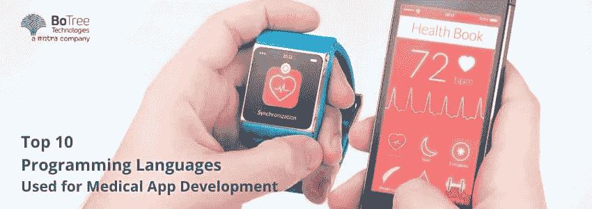

# 用于医疗应用程序开发的 10 大编程语言

> 原文：<https://medium.com/geekculture/top-10-programming-languages-used-for-medical-app-development-f0b57d079746?source=collection_archive---------15----------------------->

全球移动医疗保健市场有着改变整个医疗行业的巨大潜力。2021 年，全球移动健康应用市场规模估计为 382 亿美元。目前，北美主导着移动健康市场，并在 2021 年占据 38.2%的最大收入份额。从 2022 年到 2030 年，全球市场预计将以 11.8%的 CAGR 扩张。不断增长的市场以及使用智能手机收集和跟踪健身数据的健身设备和医疗应用程序的采用是推动该行业的主要原因。

Source: [Grand View Research](https://www.grandviewresearch.com/industry-analysis/mhealth-app-market)

智能手机的快速普及和 4G 技术在全球的广泛应用也有望推动移动医疗应用的发展。此外，疫情期间，许多政府推出了移动医疗应用来管理新冠肺炎。这些年来，这些应用也推动了这些地区的市场增长。例如，2020 年 4 月，印度推出了 Arogya Setu 应用程序，以跟踪印度各地的 COVID 19 病例。

现在，医疗保健应用程序开发正在全球范围内迅猛发展。在开发这些应用时，对编程语言保持谨慎是很重要的。定制医疗保健应用程序的良好语言将确保应用程序毫不费力地运行。

> ***阅读更多:*** [***十大最受欢迎的医疗保健应用实例***](https://www.botreetechnologies.com/blog/most-popular-healthcare-applications-examples/)

这篇文章涵盖了医疗保健软件开发的一些最佳编程语言。

# 医疗应用开发的最佳编程语言

每种编程语言都有自己的特点和意义。医疗保健应用程序开发的编程语言的选择取决于应用程序的需求、设计和基础设施。[医疗保健应用开发公司](https://www.botreetechnologies.com/healthcare-app-development)专注于多种编程语言。他们有专业知识来分析和决定应用程序的最佳语言。

现在让我们深入研究这些语言的细节。

*   Kotlin 是一种相对较新的 Android 语言。许多专家认为，它将在未来的某个时间点取代 Java。当要创建基于 Android 的移动健康应用程序开发解决方案时，选择 Kotlin 而不是其他语言，因为它具有 Java 所没有的功能。
*   Kotlin 是一种不断发展的语言，尽管它的社区目前还很小。它是与 Java 生态系统兼容的最简单的语言之一。
*   PHP 是一种开源编程语言，主要用于 web 开发。许多著名的网站如脸书、雅虎、Flickr、Tumblr 等都是用 PHP 编写的。
*   最近，移动健康应用程序开发者也在使用它来编写基于 iOS 和 Android 的移动应用程序。

> ***阅读更多:*** [***为什么在医疗保健应用中使用 Python***](https://www.botreetechnologies.com/blog/python-in-healthcare-application/)

# 结论

医疗应用开发部门正在快速发展。这就是这个领域的范围，许多开发人员和企业专门从事健康应用程序开发和 web 开发。

当最终涉及到医疗保健 web 或移动应用程序的开发时，最重要的选择之一就是决定编程语言。没有一种语言是绝对完美的。语言的选择取决于开发人员的需求、技术和效率。

如果您正在寻找专业的[医疗 app 开发公司](https://www.botreetechnologies.com/healthcare-app-development)或者需要任何咨询，[联系](https://www.botreetechnologies.com/contact) [博特瑞科技](https://www.botreetechnologies.com/)免费咨询。

*原载于 2022 年 3 月 21 日 https://www.botreetechnologies.com**T21*[。](https://www.botreetechnologies.com/blog/programming-languages-used-for-medical-app-development/)