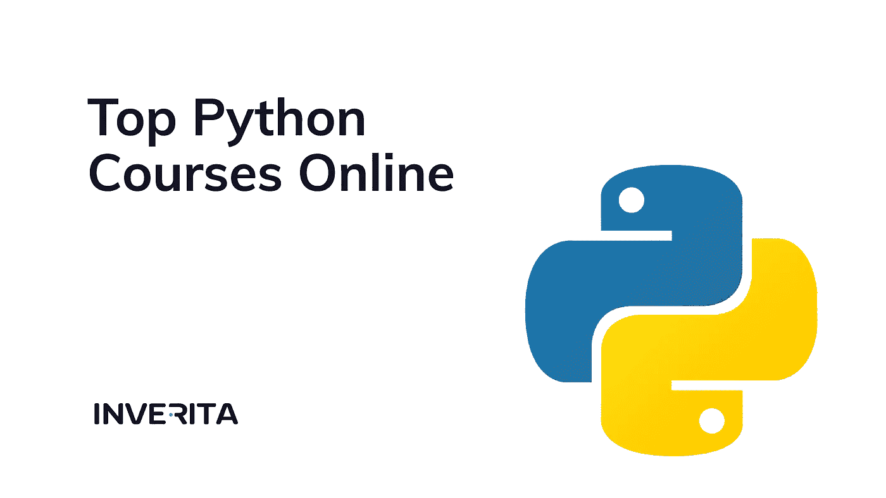

# 2022 年 10 大 Python 在线课程供选择

> 原文：<https://medium.com/geekculture/top-10-python-courses-online-to-choose-in-2022-7743bfd00355?source=collection_archive---------14----------------------->

Python 是世界上最流行的编程语言。世界各地的公司都在使用 Python 通过他们的数据收集见解。在美国，Python 开发者的平均工资是 11.5 万美元。与其他开发商相比，这几乎多了 3 万美元。

谷歌、脸书、Spotify 等大公司都使用 Python。如果你想加入他们的团队，请遵循以下列表…