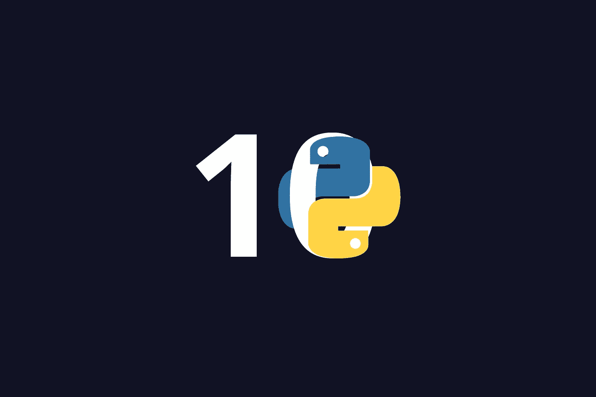

# 十大 Python 开发工具

> 原文：<https://medium.com/geekculture/top-10-python-development-tools-d3205e3bf9a4?source=collection_archive---------46----------------------->

每个开发人员有时都面临一种日复一日被发送的无限堆积的任务的感觉。他们中的大多数组成了一个常规的开发人员的例行程序——编码、测试、调试等等。尽管几乎每个案例都有新的挑战需要克服。这就是 Python 编程工具、库和 ide 的用武之地。

在这个博客中，展示了被 inVerita 程序员经常使用的最好的 Python 工具…