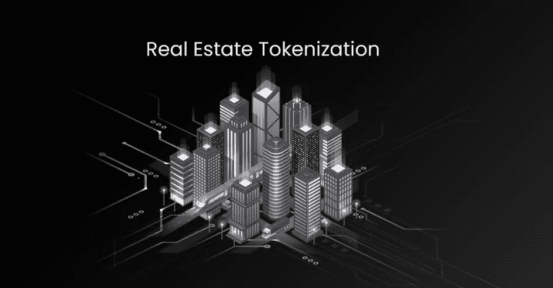
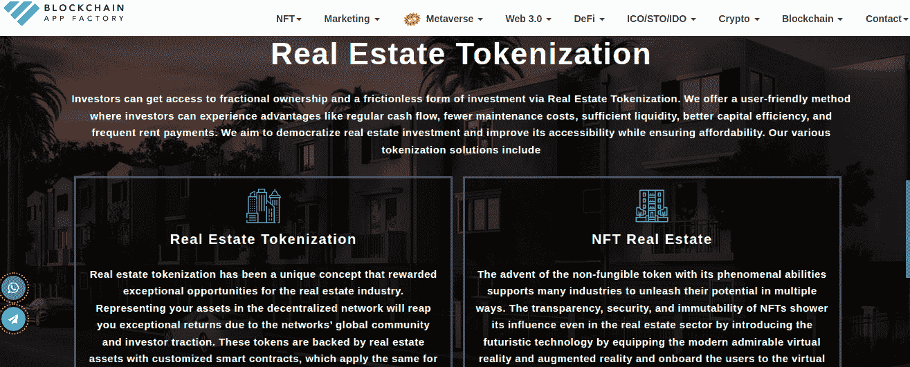
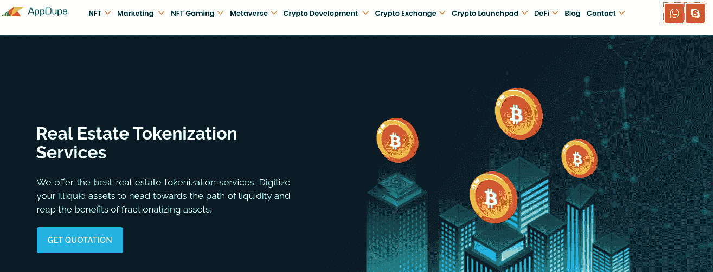
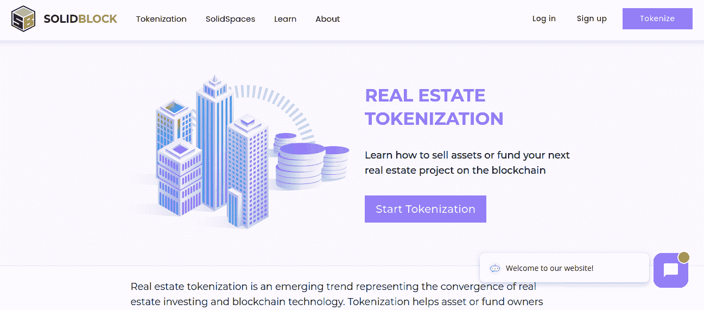
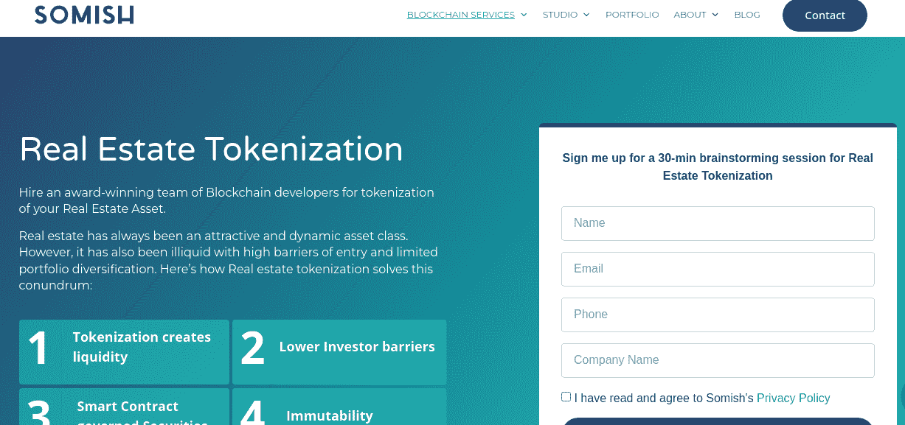
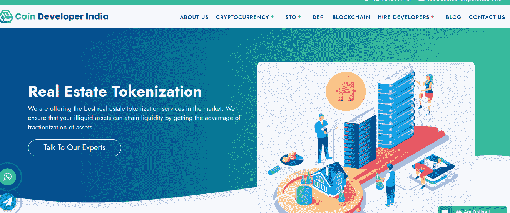
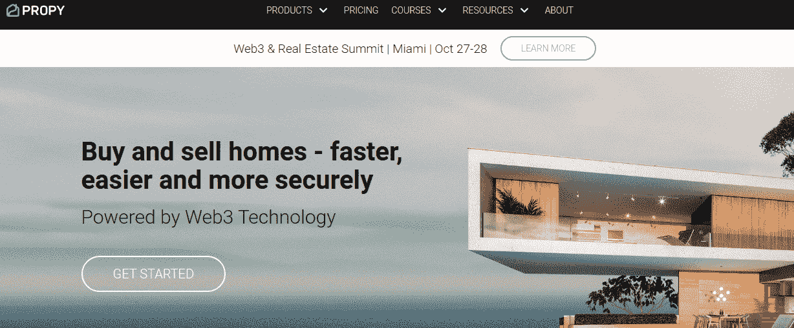
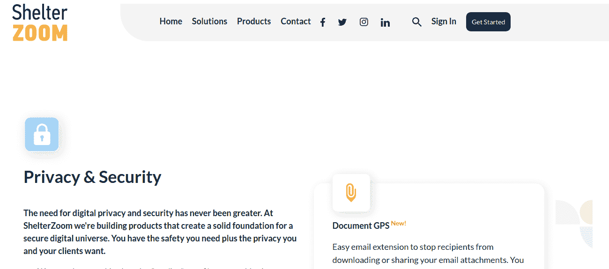
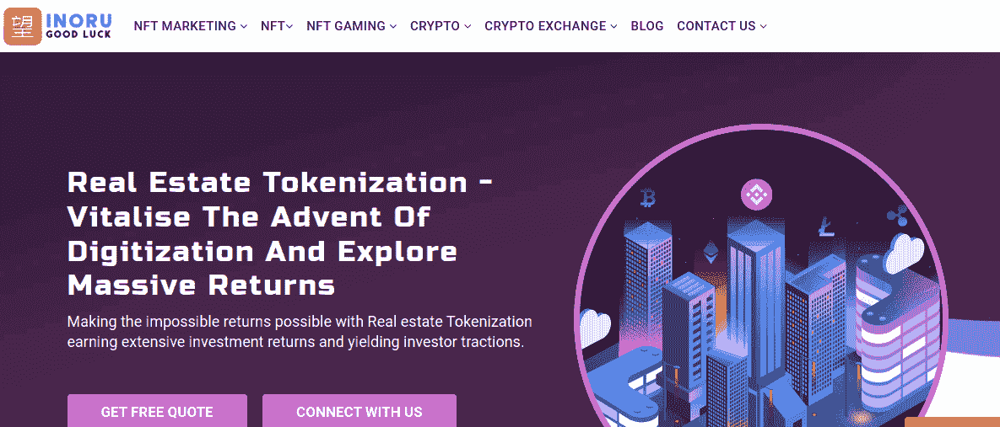
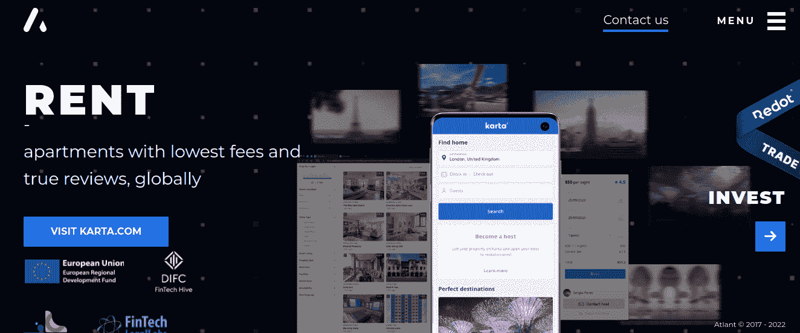

# 2022 年十大房地产品牌化开发公司:提升你的房地产业务

> 原文：<https://medium.com/geekculture/top-10-real-estate-tokenization-development-companies-in-2022-level-up-your-real-estate-business-b4333476722d?source=collection_archive---------13----------------------->

分布式账本技术为众多行业展现了无数可能性。区块链技术是将房地产业务提升到下一个水平的关键发展。房地产企业已经成为众多商业模式的生财产业。尽管如此，传统的房地产模式仍然充满了大量的障碍，如缓慢的交易、中介、大量的文书工作和地理边界。

区块链是 21 世纪革命性的技术发展，为房地产令牌化铺平了道路，使房地产商业企业家能够在没有传统市场障碍的情况下盈利。房地产令牌化已经成为房地产企业家消除传统市场障碍、使房地产交易过程变得轻而易举的救星。

建议企业聘请一家开创性的 [**房地产标记化**](https://www.infiniteblocktech.com/real-estate-tokenization?utm_source=geekculture&utm_medium=guestblog&utm_campaign=dhanushkumar) 公司，以便充分利用房地产标记化过程的好处。

# 十大房地产标记化公司带你创业

以下列出的房地产标记化公司是根据其区块链经验、先驱、服务质量和客户反馈，在多个平台上进行深入研究后排名的。

# 无限块技术

Infinite Block Tech 是区块链领域的先驱和众多获奖的房地产标记化平台之一，在一个屋檐下提供众多基于区块链的端到端开发、房地产营销服务和 [**NFT 营销解决方案**](https://www.infiniteblocktech.com/nft-development-services?utm_source=geekculture&utm_medium=bookmarks&utm_campaign=dhanushkumar) 。

除了事务所的开拓经验，它还是全球房地产标记化市场上著名的房地产标记化公司之一。Infinite Block Tech 的端到端房地产令牌化服务由区块链的专家和开发商提供。该平台根据业务需求和目标，在客户期望的区块链网络上开发房地产令牌。

# 区块链 App 工厂

这家公司是继 Infinite Block Tech 之后的又一个开创性的房地产令牌化平台。区块链 App Factory 的房产令牌化服务仅限于房产挂牌平台开发、混合令牌化开发平台、分数房产令牌化服务、众筹服务、租赁/出租服务。

# Appdupe

Appdupe 是市场上不断成长的 IT 解决方案提供商。该公司提供房地产代币化服务方面的专业知识，使您的企业能够构建和完成房地产交易、营销和房地产代币上市后。Appdupe 是一家受欢迎的房地产标记化公司，根据客户的业务要求提供定制的房地产标记化服务。

# 固体块

SolidBlock 是另一家为房地产企业提供令牌化即服务(Taas)的房地产令牌化公司。这家以色列公司成立于 2022 年，帮助区块链地区新兴的房地产企业转换其现实生活中的房地产并筹集必要的资金。

# Somish

屡获殊荣的房地产虚拟化平台为其全球客户提供最佳的房地产虚拟化服务。Somish 房地产标记化平台为住宅物业、商业房地产物业和奖杯房地产物业提供房地产标记化解决方案。萌芽中的房地产标记化平台拥有交付 25 个以上房地产标记化项目的成功记录。

# 硬币开发商印度

币开发商，印度是一家房地产令牌化平台，其房地产令牌化服务仅限于印度地理边界。real tokenization platform 提供房地产令牌化服务，如完成房地产交易、构建法律结构、选择合适的技术以及房地产令牌的创建和分发。

# 属性

Propy 是一个专注于住宅和豪华房地产的专用房地产令牌化平台。房地产巨头 Propy 见证了分布式账本技术的蓬勃发展，并已介入帮助他们的客户利用房地产令牌化的好处。房地产令牌化平台支持完成交易，并通过其托管机制管理交易。Propy 的房地产标记化服务仅限于亚利桑那州、佛罗里达州和科罗拉多州的地理边界。

# 遮蔽变焦

ShelterZoom 是一家开拓性的房地产营销公司，现已引入区块链技术，将其业务服务扩展到房地产标记化。房地产令牌化平台提供创新、独特的房地产令牌化服务，如 1 报告、文档 GPS 和 Docu Walk 功能。该公司在以太网上开发房地产代币。

# 伊诺鲁

Inoru 是一个独特的房地产令牌化平台，将房地产卖家与全球加密市场联系起来。inoru 已经创建了自己的加密令牌来促进称为 RNTB 令牌的不动产令牌交易。房地产令牌化平台将 RFID 标签集成到重要的建筑中，并跟踪建筑的发展，这被记录在智能合同中，以更新房地产投资者。

# 亚特兰特

ATLANT 是一个房地产令牌化平台，在全球范围内提供由区块链技术支持的房地产服务。房地产令牌化平台专注的两个重要的房地产令牌化服务是通过房地产令牌向合法所有者提供所有权和点对点租赁服务。

根据 ATLANT 的官方网站，他们提供的房地产令牌化服务包括验证财产所有者上传的财产，检查财产的物理状况和债务记录，令牌化房地产财产，向全球市场推广财产，然后成功地向所有者交易与财产价值相等的密码。

# 包裹

凭借革命性的区块链技术，房地产交易流程比以往任何时候都更加高效和节省时间。区块链和房地产令牌化平台使房地产买家和卖家能够体验无缝的房地产转让过程，消除了中介和繁忙的文书工作等传统市场障碍。

为了从记号化技术中获得最大利益，区块链领域中的任何房地产产权所有者或房地产创业公司都必须利用来自开创性的房地产记号化平台的房地产记号化服务。