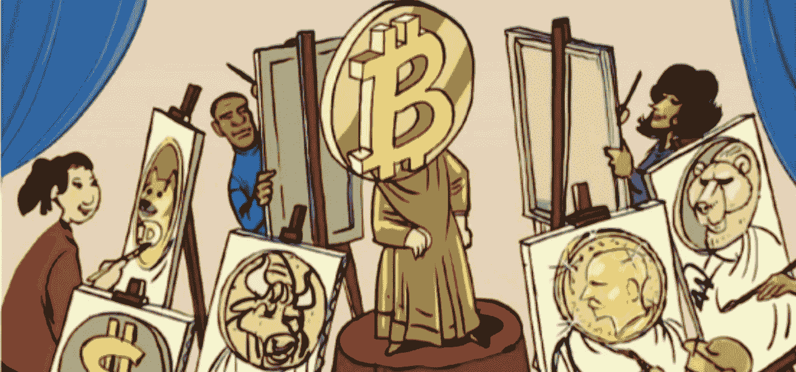
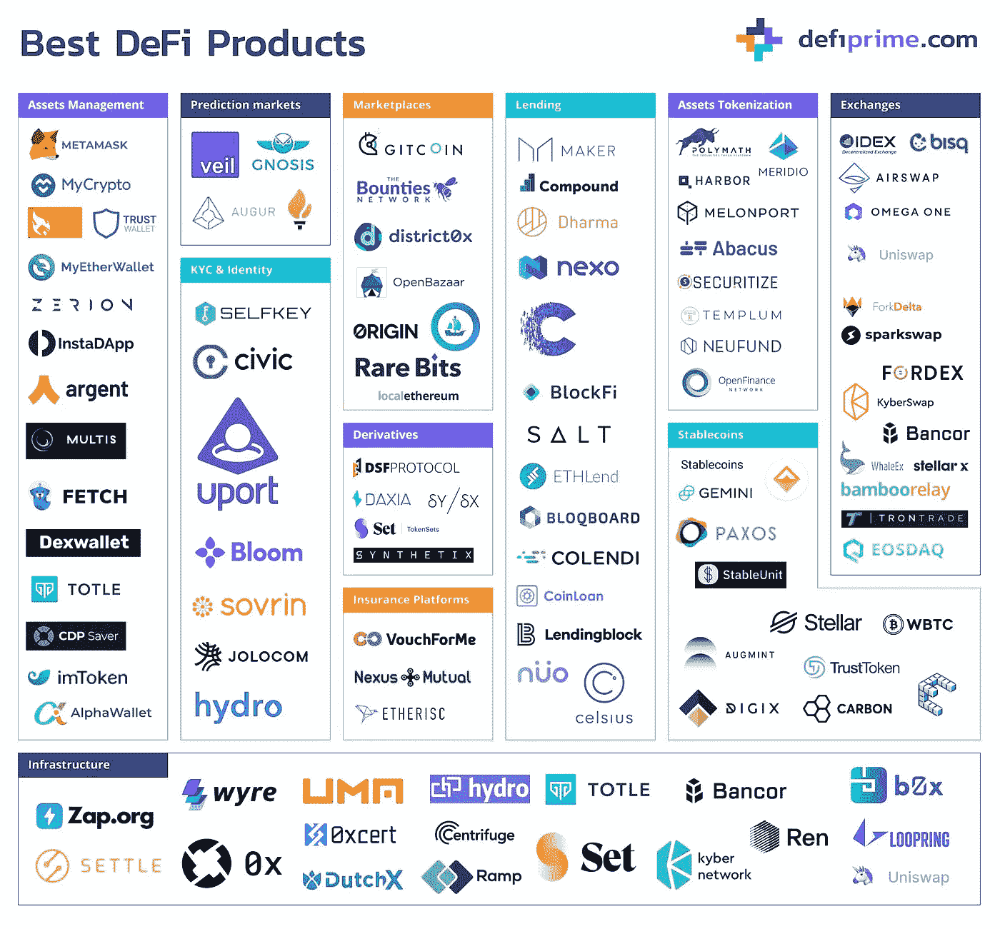
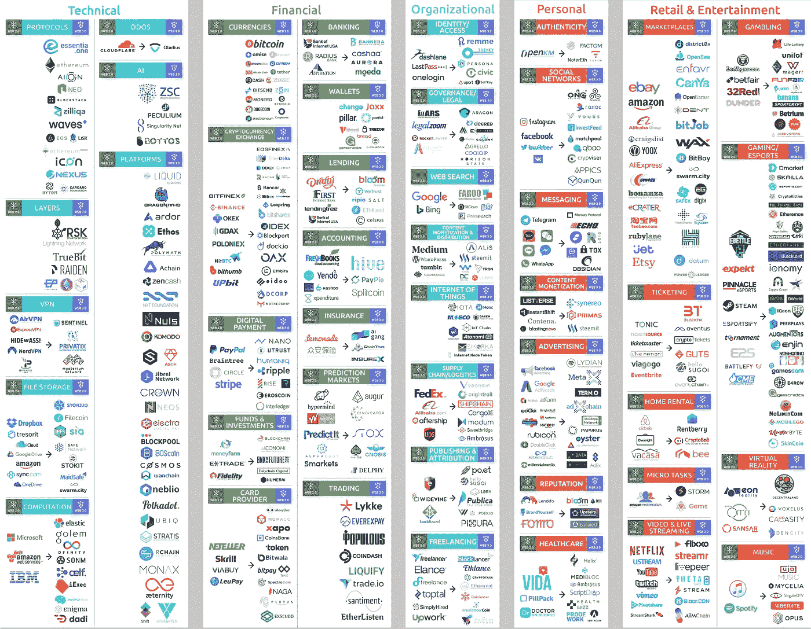

# Crypto 继续存在的十大理由

> 原文：<https://medium.com/geekculture/top-10-reasons-crypto-is-here-to-stay-7a01782b1eac?source=collection_archive---------24----------------------->

From the Goldman Sachs report (image by Armand Homsi)

高盛最近发布了一份关于加密的有趣但最终被误导的报告:[数字资产:情人眼里出西施](https://www.slideshare.net/loukerner2/digital-assets-beauty-is-not-in-the-eye-of-the-beholder)。虽然整篇论文中有一些很好的数据和深思熟虑的评论，但总的来说，它对资产类别是负面的，人们确实感觉到他们与加密领域的实际情况脱节。整个报告中有一种挥之不去的感觉，即加密仍然是无政府主义者、自由主义者、毒贩和赌徒的土地。在许多地方，这读起来有点像上世纪 90 年代末或互联网泡沫破裂后，华尔街在互联网上的报告，声称“实体经济”不会发生太大变化，所以不要投资网飞、亚马逊或谷歌。

尽管这份报告非常令人信服地解释了为什么对加密货币进行估值分析几乎是不可能的，但它忽略了加密正在带来的革命性变化。以下是我认为 crypto 正在释放的 10 大革命性技术和想法(其中大部分在报告中被忽略或淡化):

source: [https://defiprime.com/](https://defiprime.com/)

1.  **DEFI** :在未来的几个月和几年里，目前存在于世界各地银行和交易所的价值将会泄漏到区块链的金融工具、企业和硬币上。分布式金融(或 Defi)将把这些企业推向这样一个点，即它们将成为以前自己的影子。一个人在不毛之地呆的时间越长，这种可能性就越令人震惊(见上图)。已经有稳定的货币跟踪法定货币，借贷和杠杆市场， [AMMs &流动性池](https://haseebq.com/what-explains-the-rise-of-amms/)，衍生品，KYC 技术，资产令牌化/细分，保险产品，预测市场，基础设施技术(如价格[甲骨文](https://www.coindesk.com/what-is-an-oracle))，当然还有连接所有这些部分的市场和交易所(如比特币基地)。
2.  拥有数字产品(特别是收藏品、音乐和视频游戏)的创意产业的很大一部分价值可能会转向[不可替代的代币](https://a16z.com/2021/04/02/nfts-readings-resources/) (NFTs)，这对创意人员来说将是一个非同寻常的福音。诸如歌曲、数字收藏品或艺术品或游戏中的项目之类的数字资产当前是租借的，而不是用户所拥有的。仅在游戏行业，消费者就在游戏中花费了 1000 亿美元。然而他们不能将该皮肤、武器、制造物品或扑克牌移出游戏。他们不能交易它，也不能意识到它潜在的升值。他们不能把它传给他们的孩子，也不能把它送给朋友。NFT 改变了这一切。另一个例子是音乐行业，在音乐行业每年 420 亿美元的收入中，只有 12%流向了音乐人，其余部分流向了中间商——NFTs 将允许这一比例翻转，因为艺术家将能够直接使用区块链技术，以安全和有状态的经济方式与粉丝互动。例如，乐队 Disclosure 上个月在 NFT 首次亮相，在 Twitch 上现场制作了一首全新的歌曲，然后立即将这首歌作为 NFT 的单曲发行并拍卖。这幅名为[“N . f . t-N . r . g .”](https://zora.co/disclosure/1267)[的作品第二天以大约 69，000 美元的价格售出](https://twitter.com/ourZORA/status/1367313033995964422)，这些钱都被披露出去了。然后是这样的:“ [DJ 卖出了有史以来第一张加密专辑，一天赚了 1100 万美元](https://www.businessinsider.com/nft-ultraviolet-3lau-first-ever-crypto-albums-sales-11-million-2021-)”。
3.  **支付**:国际转账可能会收取 1-6%的费用，这取决于你使用的是哪家公司。使用加密，它基本上是免费的——唯一的成本是几美元的汽油费来更新你在账本上的转账。它也是无许可的、即时的、100%数字/人工自由的，并且受加密共识协议的保护。如果一家企业在国际上汇款 10 万美元，他们可能需要通过银行支付 1000-3000 美元的费用(加上所有的麻烦和延误)。或者他们可以花 10 美元用、戴或泰瑟这样的稳定币立即做这件事。国内 B2B 支付也是如此。你可以免费使用区块链铁路，也可以向银行或信用卡公司支付 2-3%或更多的费用，更不用说那些追逐坏账和逾期债务的劳动力了。这一切都随着加密而消失。一旦个人和企业意识到这一现实，涓涓细流就会变成滚滚洪流。
4.  **第二层解决方案**:正如我最近在“[Crypto&the Invention of web 3](/geekculture/crypto-the-invention-of-web3-ccc540d0175b)”中所写的，一波新的创业公司正在解决规模、成本、隐私和 UI 问题，这些问题目前阻碍了区块链技术的大规模采用。正如德尔福数字最近指出的那样，有很多公司在竞争这个新的领域。一旦完成部署和扩展，crypto 将为主流用户采用做好准备。加密钱包将变得像电子邮件地址一样:每个人很快都会有一个(可能不止一个)。
5.  **以太坊**:统治一切的一种加密货币？以太坊的市值仅次于比特币，排名第二(即使在最近下跌后，仍为 2000 亿美元)，其安全性来自数以千计的独立验证者/矿工。但更重要的是，它在我的列表中占据了前四位:支付、Defi、NFTs 和第二层。这些领域的行动几乎都发生在以太坊网络上。这四个特征是推动该协议发展的引擎，并将继续推动对该区块链协议的需求快速增长。
6.  环境:我的预测是，在 12-18 个月内，全球变暖/电力消耗/二氧化碳排放的争论将会结束。无论是[的利益证明](/tqtezos/proof-of-work-vs-proof-of-stake-the-ecological-footprint-c58029faee44)协议还是[的第二层解决方案](https://www.immutable.com/blog/carbon-neutral-nfts)，比如[immutable ex](https://www.immutable.com/)和 [Polygon](https://polygon.technology/) ，这个问题正在迅速消失。
7.  **DLTs** :许多其他传统行业将开始使用分布式账本技术(DLTs)进行所有权跟踪和转让(例如，正如报告所指出的:正如高盛报告本身所指出的:“例如，丹麦航运公司 A.P. Moller- Maersk 使用该技术跟踪世界各地的货运、集装箱和文件。沃尔玛使用该技术来跟踪其食品，以保持安全标准并最大限度地降低污染风险。法国奢侈品公司 LVMH 使用这项技术来跟踪自己的产品和打击假冒产品。医院用它来跟踪新冠肺炎疫苗。”
8.  **Dao**:分布式自治组织(Dao)已经开始重塑公司治理和潜在的启动资金。Dao 是加密的本地“公司”或“有限责任公司”类型的公司或非盈利组织。A16Z 发布了一个有趣的主题为的播客，来自 Scalar Capital [的 Linda Xie 在 Mirror](https://linda.mirror.xyz/Vh8K4leCGEO06_qSGx-vS5lvgUqhqkCz9ut81WwCP2o) 上写了一篇很好的介绍。任何有想法的人都可以像 DAO 一样创办一家公司，并在几分钟内(或者几秒钟，如果你知道自己在做什么的话)获得资金。奇怪的是，监管机构还没有跟上，所以不清楚未来将如何监管这些。最近的一个例子说明了这一点。PleasrDAO 筹集了 540 万美元来购买一件数码艺术品。这是一群人，其中大多数人从未见过面，他们只是在以太坊上创建了一个智能合同，旨在汇集他们的资金，在特定的拍卖中对特定的艺术品出价，达到设定的价格或返还资金。换句话说，一把刀。看好这个空间:真正的创新和荒谬的炒作都将爆发。
9.  ZK 证明:零知识证明(zkp)是一种数学魔法，它允许你证明你知道或拥有某样东西，而不暴露你知道或拥有什么。 [NotBoring 很好地总结了](https://www.notboring.co/p/zero-knowledge)它:“偶尔，一项技术伴随着承诺、模糊性、不可预测性和抽象性的正确组合出现，以充分捕捉和接受蜂群思维的想象力。这些技术不仅仅会改变一些事情；他们将改变*的一切。”*想想互联网、云、区块链、mRNA。ZK 证明属于同一类。NotBoring 继续说道:“我们的数据无处不在。姓名、出生日期、电子邮件地址、信用卡号码、我们过去五年居住的地址、我们母亲的娘家姓……这些只是我们每天都要交给公司、社交媒体网站、客户服务代表，有时还会(不知不觉地)交给骗子的几乎无限的个人信息中的一部分。“集成到加密安全的区块链环境中的 zkp 将结束这种情况。期待听到更多关于这个话题的信息。
10.  dAPPS :互联网的大部分将通过 dAPPS 开始利用区块链的分布式账本和“国家地位”。越来越多的大型互联网企业将在分布式账本技术上构建 Web3“分布式应用程序”(dApps)。例子已经出现在诸如云文件存储、域名系统、网络托管、社交网络、音乐分发、浏览、音频/视频通话、消息传递、市场、票务、房屋租赁等类别中。(见下图，了解已经发生的一系列事件及其 Web2 对应事件)

Web2 companies and their Web3 (or Crypto) counterparts (source: [https://defiprime.com/](https://defiprime.com/))

Z.R