# 2022 年十大 RPA 公司、工具和解决方案

> 原文：<https://medium.com/geekculture/top-10-rpa-companies-tools-and-solutions-in-2022-607531bfd6fe?source=collection_archive---------6----------------------->

在这个快节奏、不断发展的时代，新技术、创新和程序层出不穷，主要表现为当今企业保持竞争力的“基本要素”。

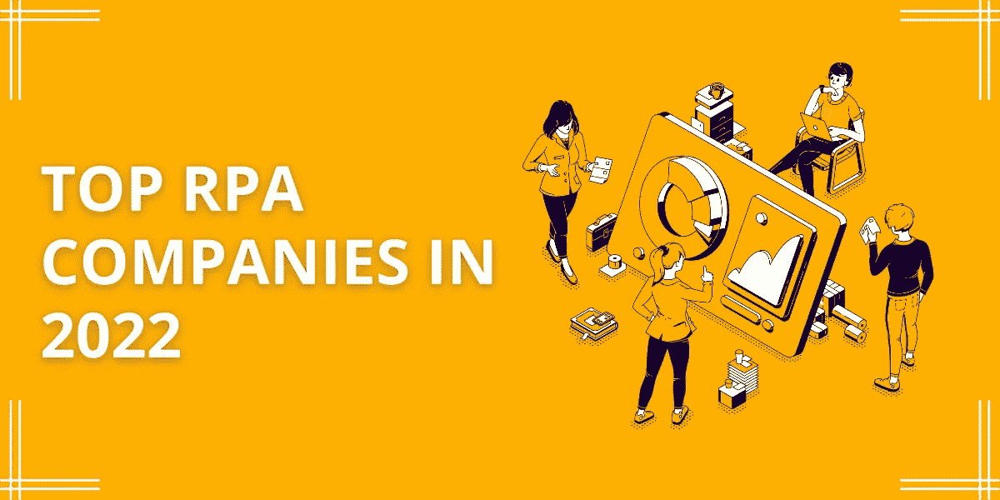

RPA companies

没错，我们正在谈论最热门的词汇——“机器人过程自动化**”**

组织认识到，RPA 有潜力通过数字技术以全新的方式转变其后端运营和流程。简而言之，这是一种自动化公司运营和流程的创新方法。

RPA 实施从“最好拥有”的工具变成了组织的“必备”工具。

RPA 为不同行业的组织带来了诸多好处，例如:

*   成本节约
*   提高生产力和效率
*   更少的错误
*   无缝客户体验

因此，为了利用所有这些好处，需要精确地计划和执行实施过程。否则，RPA 项目可能会错失良机，并对您的业务流程造成阻碍，例如错误和增加的成本。

不用担心；好消息是你不必承担所有的责任。拥有值得信赖的 RPA 合作伙伴是成功集成自动化和克服挑战的一站式解决方案。此外，来自顶级 RPA 公司的专家拥有丰富的知识，可以帮助您实现长期成功的目标。

但是，在我介绍前 10 大 RPA 公司之前，有必要关注一下全球范围内不断增长的 RPA 市场。

> **根据 Statista 的报告，到 2030 年，全球 RPA 市场将增长超过 130 亿美元。**

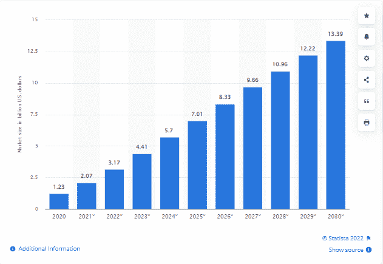

Source: [**Statista**](https://www.statista.com/)

这清楚地表明，全球组织都依赖 RPA 公司来实现自动化，并在竞争日益激烈的世界中磨砺自己的优势。而且，如果在众多选择中，您也对如何选择正确的 RPA 开发合作伙伴犹豫不决，那么答案就在这里！

> **注:这些发现基于** [**离合器**](https://clutch.co/) **综述，并对所有组织背景进行了深入研究。**

# 我已经将领先的 RPA 开发公司收入囊中，在以下关键参数上为您的项目工作。

*   具有使用 UiPath、Automation Anywhere、Blue Prism 和 Microsoft Power Automate 等 RPA 工具的经验。
*   通过 NASSCOM、ISO 和 STPI 的认证。
*   该公司的技术力量
*   通过访问他们的网站完成投资组合审查。
*   客户对谷歌的评价。
*   公司成功完成的项目。
*   公司累计年增长率和客户保持率。
*   值得信赖的 B2B 平台上的反馈和评级，如 Good firms、Clutch 和 Glassdoor。

因此，为了帮助您正确开始，该列表从少数值得信赖的 RPA 工具开始，然后是顶级 RPA 开发公司:

# 领先的 RPA 工具

# # [UiPath](https://www.uipath.com/)

UiPath 是一款激动人心且用户友好的 RPA 工具，可让用户高效、快速地自动化大量重复的流程，旨在简化、加快和优化企业的数字化转型。

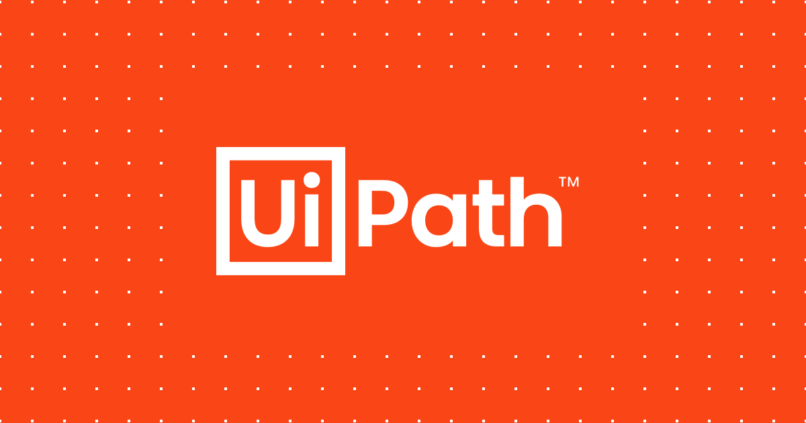

Source: UiPath

此外，UiPath 使用人工智能来自动分析业务流程，并评估最适合自动化的流程。它不仅自动化了电子邮件营销、数据输入和网页抓取等活动，还自动化了通知、日程跟进和文档记录等日常任务。

除了易于设置的自动化之外，UiPath 还具有加密和基于角色的访问控制的潜力，以及管理流程的能力，不管流程的数量或复杂性如何。

# # [佩加斯系统](https://www.pega.com/products/platform/case-management)

Pegasystems 是一个典型的业务流程自动化工具。它用在桌面服务器上，增加了只提供基于云的服务和解决方案。此外，它可以在 Windows、Linux 或 Mac 上工作，并帮助将解决方案部署到客户端。

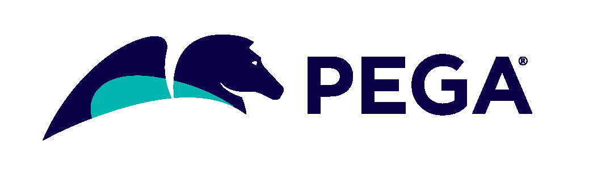

Source: Pegasystems

这个自动化工具不在数据库中存储任何执行数据。相反，一切都存储在内存中。用户还可以在台式机、服务器和员工之间分配工作。此外，凭借 Pega 所需的低编码技能，公司可以根据自己的需求和要求开发应用程序，并迎合他们希望集成的偏好。

总而言之，Pega 是许多知名公司的解决方案，可以帮助他们做出更好的决策并完成工作。因此，他们可以保持精简和敏捷，并随时接受潜在的发展。

最后，由于其可扩展的架构和低代码平台，Pega 可以适应项目的复杂性。

**现在，我们来谈谈一些顶尖的 RPA 开发公司:**

# #顶级 RPA 开发公司

# #1.[重要解决方案](https://www.signitysolutions.com/rpa-consulting-services)

signity Solutions——机器人过程自动化和智能自动化开发公司的缩影。

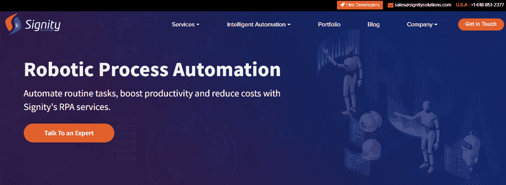

Source: Signity Solutions

他们的核心目标是帮助各行各业的企业和公司将单调重复的流程自动化，加速流程，最大限度地降低运营成本，并发掘员工的生产力。除了在 RPA 咨询服务 __、__ 领域占据领先地位，他们还提供 360 度自动化服务，从流程发现和流程分析、设计概念证明和单流程自动化，到完成多部门 RPA 机器人开发、实施和体系结构设置。他们专门的 RPA 专家最近为 UiPath 开发人员创建了一个独一无二的 Zoho CRM 自动化活动包。

Signity 的团队包括久经考验的 UiPath 认证自动化专家，他们与客户一起绘制他们的流程，开发自动化路线图，并创建可持续和稳定的机器人。此外，他们还为不同行业提供开发后维护和长期客户服务。他们拥有为医疗保健、保险和金融行业构建自动化解决方案的经验。

**成立:** 2009 年

**团队规模:** 200+人

**地理:**印度、纽西兰和美国。

**价格:**$ 25-$ 49/小时

# #2. [Eleviant](https://www.eleviant.com/)

Eleviant Tech 是一家有 17 年历史的技术组织，在移动、云、网络、物联网、ar、RPA 和人工智能技术方面拥有专业知识，适合制造、物流、零售、医疗保健、金融和服务等独特的行业。

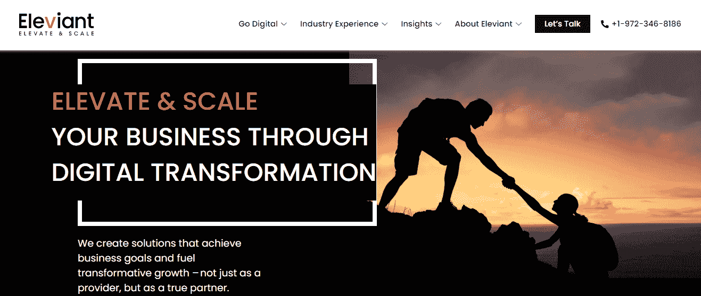

Source: Eleviant

他们拥有 250 多名遍布全球的专业人士，帮助过从初创企业到财富 500 强的各种企业。

此外，他们的内部团队已经创建了 500 多个移动应用程序、350 多个门户网站和 100 多个自动化/参与解决方案来满足客户的独特需求。Eleviant 提供从数字化转型到 RPA 和商业智能的服务。

**成立日期:** 2004 年

**团队规模:** 250 人以上

**地理:**印度和美国

**价格:**$ 25-$ 49/小时

# #3.[利瓦里](https://www.leaware.com/)

Leaware 是一个数字产品工作室，拥有超过 12 年的构建软件权利的经验，以了解用户未满足的需求和关注客户的业务目标为基础。

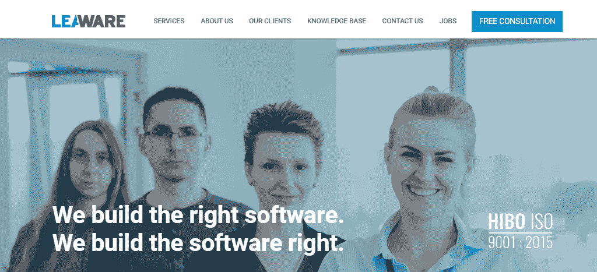

Source: Leaware

他们是领先的 RPA 解决方案提供商，因为他们通过多年帮助客户开发了工具和方法。因此，客户的需求满足了实现后续产品开发领域的最后期限。此外，他们为客户提供能力基础和技术支持，尽管在开发数字产品时面临挑战。

**成立:** 2010 年

**团队规模:** 50 人以上

**地理:**德国

价格:每小时 25-49 美元

# #4.[你在印度的团队](https://www.yourteaminindia.com/hire-rpa-developers)

您在印度的团队是一家值得信赖的数字技术咨询公司，他们加速客户的自动化之旅，让客户轻松打造他们想要的伟大企业。

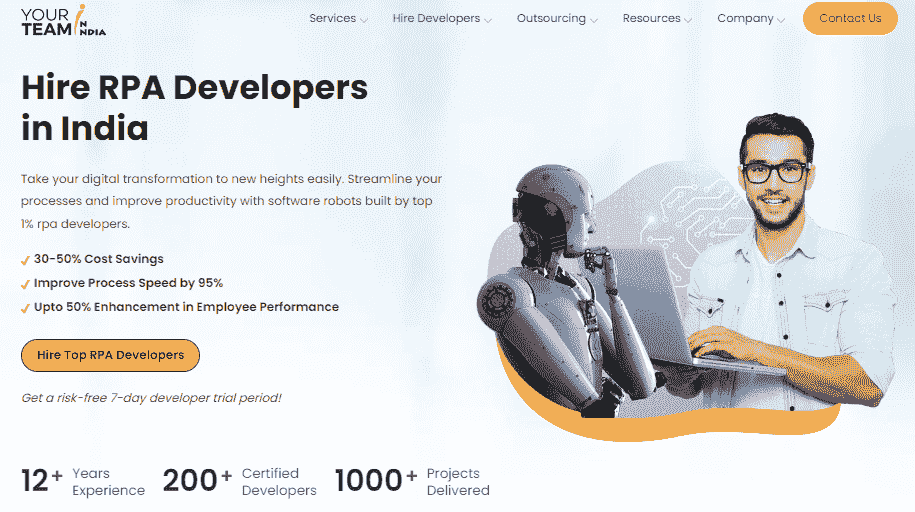

Source: Your Team In India

这叫做超越战略规划。YTII 与领导团队合作，制定愿景、战略和路线图来实现这一目标。更重要的是，他们建立了正确的团队和纪律来执行你的计划。此外，他们还为客户团队的成长做出了贡献。

无论是寻找单个 RPA 开发人员还是专门的团队来从头开始满足他们的自动化要求，您在印度的团队都是从采购和招聘到自动化人才入职的先锋选择。

**成立:** 2017 年

**队伍规模:** 50+人

**地理:**印度和美国

**价格:**$ 25—$ 49/小时

# #5.[尼巴尔科技](https://www.neebal.com/)

自 2012 年以来，Neebal 一直是技术解决方案提供商，为农业、制药和 BFSI 垂直行业提供顶级解决方案。Neebal 的目标是提供顶级 API 集成、RPA 和高级移动解决方案，主要关注超自动化。

Source: Neebal Technologies

除了与大型企业合作，Neebal 还与中小型公司以及独特的初创企业合作，为数字服务创建定制解决方案，从而转变企业用户体验。他们采用设计思维方法，围绕最终用户及其环境条件构建面向未来的解决方案。

成立时间:2012 年

团队规模:50 人以上

地理:印度

价格:每小时 25-49 美元

# #6. [Tooploox](https://www.tooploox.com/)

Tooploox 提供定制软件开发和 RPA 实施服务，帮助创新公司和初创公司利用人工智能、移动和网络技术创建数字产品。

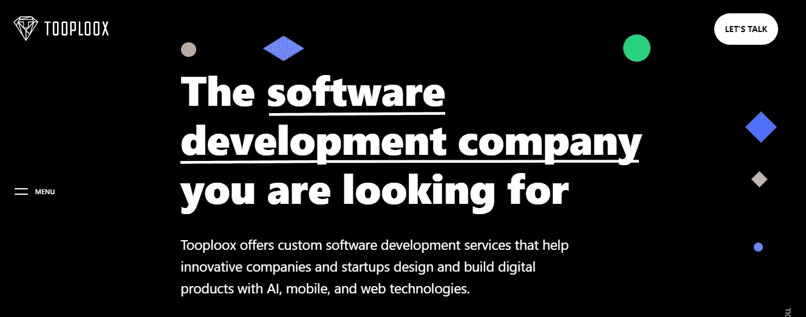

Source: Tooploox

他们的专家建立了长期的合作伙伴关系，并组建了与客户业务一起发展的远程专业团队——通过技术一步一步地改善人们的生活。

作为一家顶级的软件开发公司，Tooploox 在这里支持您的愿景。从创新的想法到赢得市场的产品，他们帮助初创公司、创新者和风投开发他们的技术产品。

成立时间:2012 年

团队规模:50–249 人

地理位置:波兰

价格:100-149 美元/小时

# #7.[软件思维](https://softwaremind.com/)

在 22 年的软件工程业务中，Software Mind 成功地为全球客户群交付了项目和 RPA 解决方案。拥有 2，500 多名专业人员，他们提供了最好的产品，从强大的应用程序、强大的数据分析软件和增强的 BI 平台到整体企业解决方案。

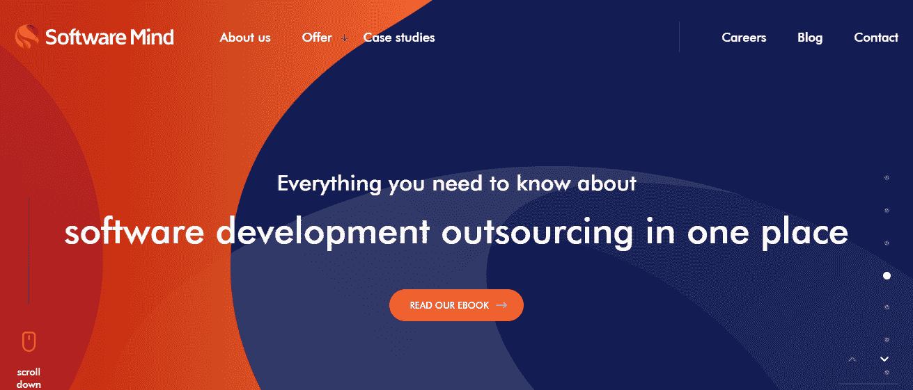

Source: Software Mind

他们的目标是帮助企业级企业整合成熟的软件开发流程，创建可扩展的软件解决方案，以利用市场上的技术优势，并在行业中占据一席之地。

成立时间:1999 年

团队规模:1000–9999 人

地理位置:波兰

价格:50-99 美元/小时

# #8.[融合命中](https://www.fusionhit.com/?utm_source=clutch.co&utm_medium=referral)

自 2008 年以来，Fusion Hit 在美国洛杉矶设立了办事处，并在哥斯达黎加、萨尔瓦多和哥伦比亚设立了开发中心。

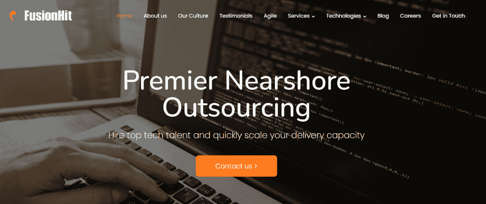

Source: Fusion Hit

除了在顶级软件开发公司中以人为本外，他们的 RPA 解决方案还受到 UiPath 等可信 RPA 工具的支持。

此外，他们的专业团队会指导您了解与 RPA 相关的各种选项，以了解组建数字化员工队伍需要什么，从而让您能够以最佳方式自动化简单和复杂的操作任务。

我们可以帮助指导您了解与 RPA 相关的各种选项，以了解组建数字化员工队伍需要哪些条件，从而让您能够以最佳方式自动化简单和复杂的运营活动。

成立时间:2008 年

团队规模:50–99 人

地理:美国

价格:50-99 美元/小时

# #终于…

起初，选择正确的 RPA 合作伙伴似乎有些费力。但是，通过全面的研究并考虑关键因素，找到合适的 RPA 开发合作伙伴是很容易的。

希望这个列表能帮助你做出正确的选择，满足客户的偏好和需求。请记住，成功实施 RPA 后，您的企业将受益于更好的结果和更高的效率，为更高的收入、更大的成本节约和更高的生产效率铺平道路。