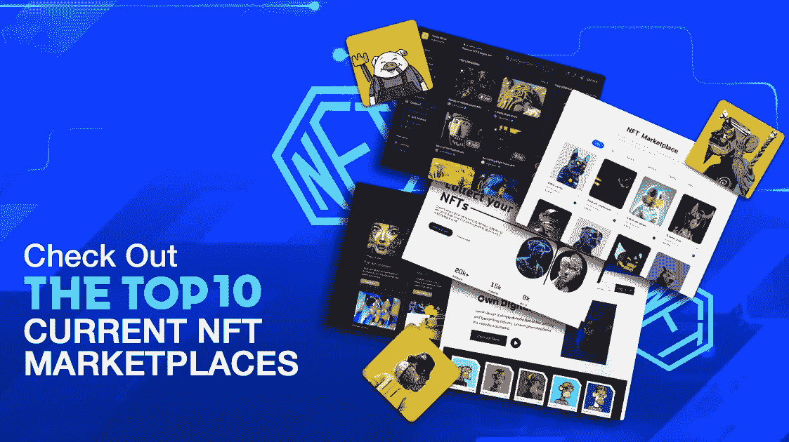
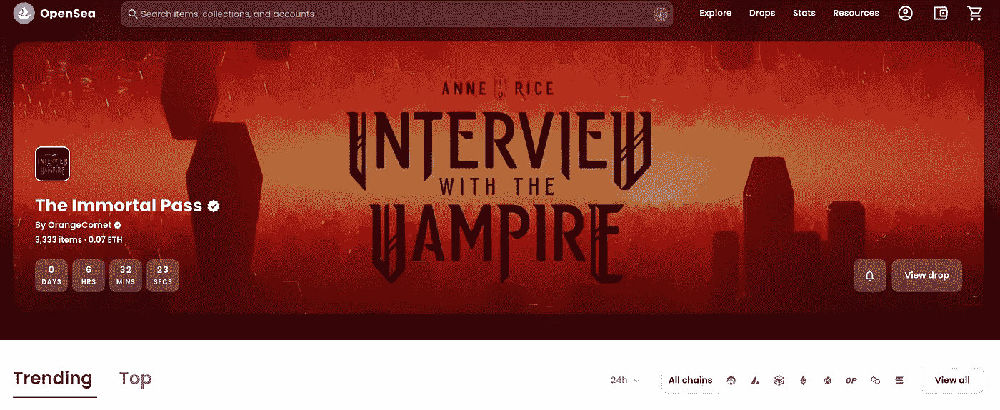
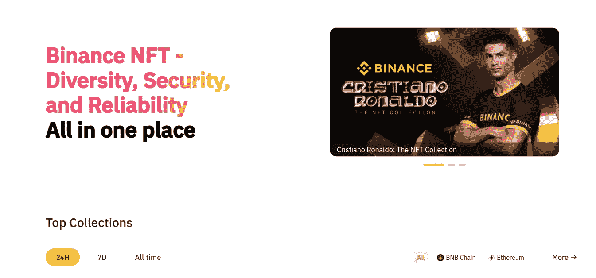
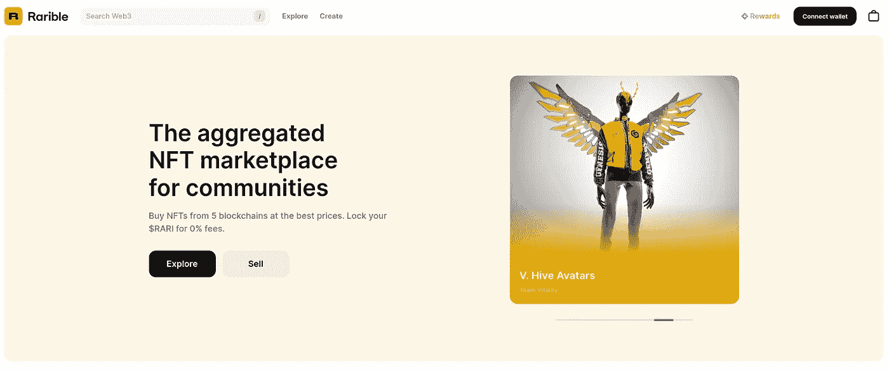
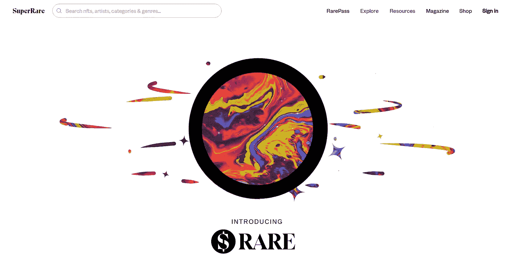
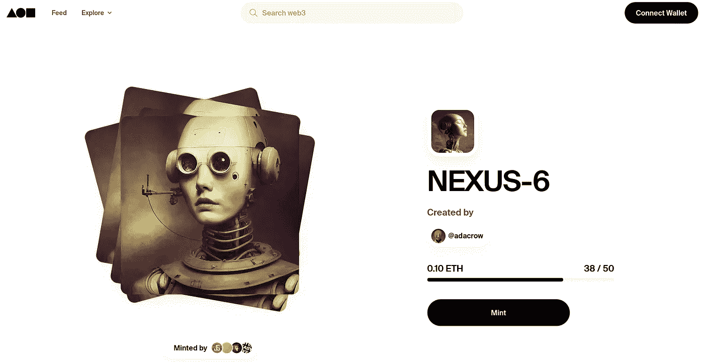
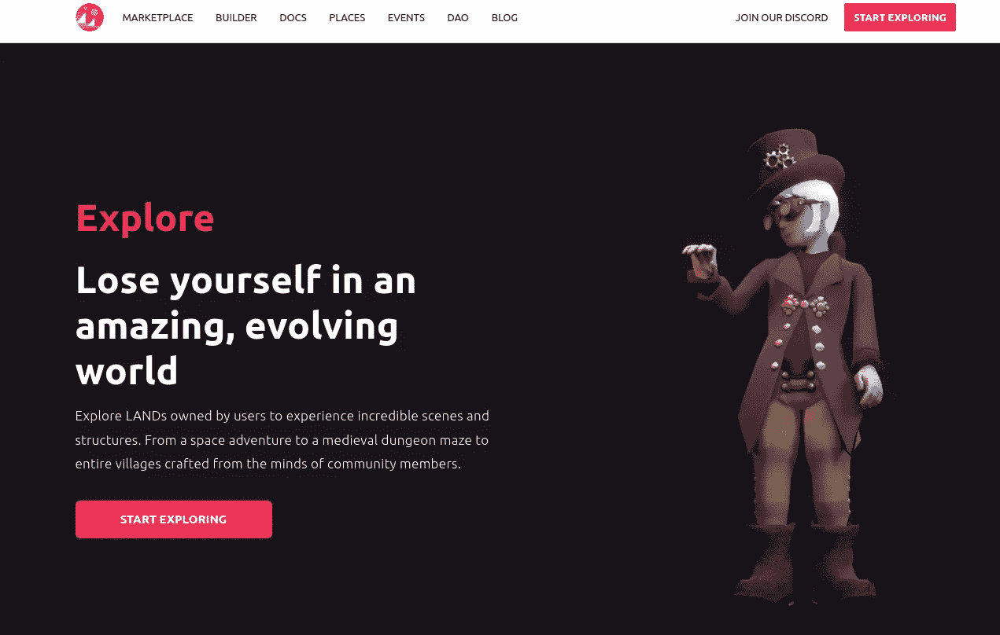
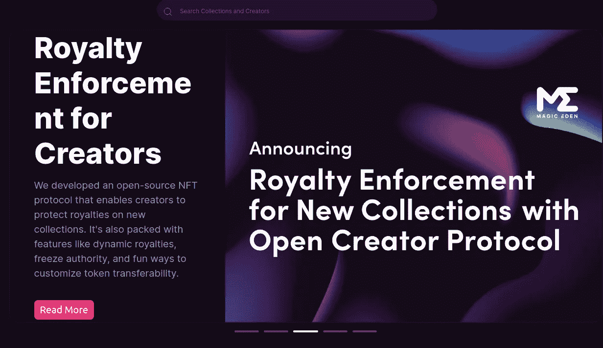
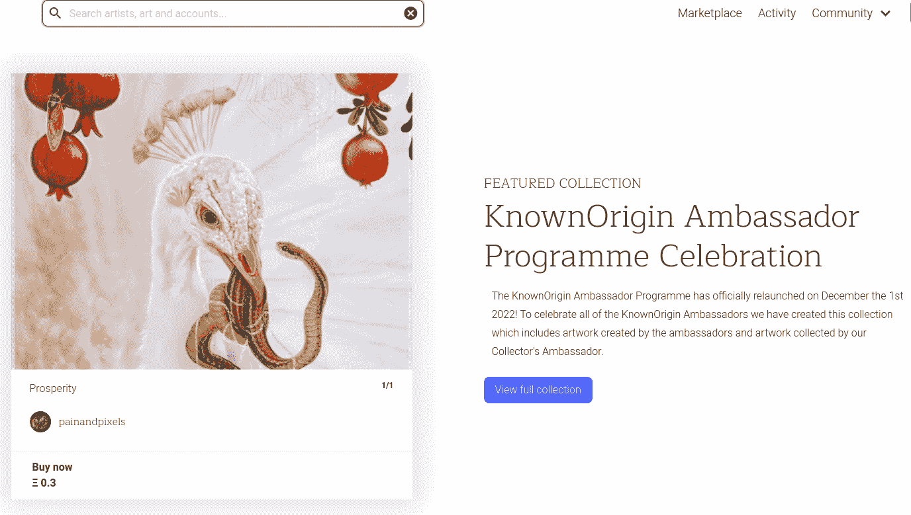
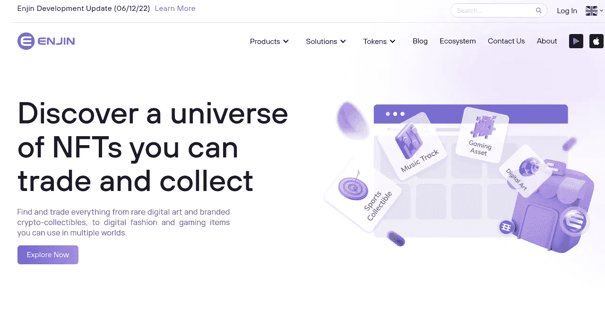

# 2023 年值得关注的十大成功 NFT 市场

> 原文：<https://medium.com/geekculture/top-10-successful-nft-marketplaces-to-look-out-in-2023-35db41012849?source=collection_archive---------13----------------------->

Top 10 Successful NFT Marketplaces to Look Out in 2023

不可替换的令牌拥有单词“digital”这不是因为他们将任何实物转化为数字产品，而是因为他们在倾向于打开购物篮在线购买数字资产的当代人中创建了一个数字实体。当前的系统在用名为 NFTs 的令牌更新未来世界方面已经走了很长的路。

👉👉 [**如何建立 NFT 市场？**T3**🔥🔥**](https://www.blockchainappfactory.com/nft-marketplace-development?utm_source=Medium+GC&utm_medium=8%2F12%2F22&utm_campaign=senpagapandian)

NFT 的交易通常发生在市场上。这个市场决定了 NFT 的命运。但是它允许所有者赚取更多的财富。如果你拥有一个平台，你就能在未来几年登上企业家的榜首。这个平台是基于密码的未来的游戏规则改变者。如果你决定去 NFT 市场，把你的目标转向一个美好的未来，了解一下 2023 年 NFT 的顶级市场。

> 以下是 NFT 市场的汇总列表！

# **2022–2023 年 NFT 十大最佳市场**

## **1。OpenSea(**[OpenSea . io](https://opensea.io/))

OpenSea

OpenSea 坚定地宣称自己是 NFT 最大的市场。它提供了 700 多个不同的项目，如 ENS(以太坊名称服务)这样的名称系统、交易卡游戏、数字艺术项目和收藏游戏。各种不可替代的令牌是可用的，包括收藏品、抗审查域名、艺术、交易卡、体育和虚拟世界情节。包括 ERC721 和 ERC1155 资产。Axies、ENS 名称、CryptoKitties、分散地块和其他独特的数字资产可供购买、销售和发现。

## 2.Binance.com 币安

Binance

币安 NFT 市场是提供独家交易方式的顶级平台之一。在其他主要平台上发现的典型数字商品，如艺术品、游戏和收藏品，在币安 NFT 上也可以买到。然而，事实上，币安 NFT 有极低的费用是一个重大的好处。此外，这是一个用户友好的平台，采用与交易所相同的技术和设计。

## **3。稀有(**[Rarible.com](https://rarible.com/)

Rarible

社区拥有的 NFT 市场 Rarible 的“所有者”使用 ERC-20 RARI 代币进行交易。该平台向在 NFT 市场上购买或销售商品的活跃用户发放 RARI 代币。它每周分发 75，000 RARI。Rarible 被认为是 NFT 最大的市场之一，它买卖艺术、摄影、游戏、元宇宙、音乐、域名、迷因等类别的 NFT。

## **4。超级罕见(**【Superrare.com】T2

SuperRare

SuperRare 是一个顶级的 NFT 市场，可以应对各种挑战，提供一个安全的交易和盈利场所。它主要是一个人们可以买卖独一无二的限量版数字艺术品的平台。每一件艺术作品都是由网络中的一位艺术家真实制作的，并被标记为一个可加密收藏的数字对象，你可以购买、出售和拥有。它提供了一种参与艺术、文化和在线收藏的新方式，就像 Instagram 和佳士得的结合。

## **5。基础(**[**F**](https://foundation.app/)[foundation . app](https://foundation.app/))

Foundation

为了促进文化，基金会是一个专门的平台，旨在连接数字创作者、加密原生者和收藏者。“新创意经济”一词描述了这一点。数字艺术是它的主要兴趣领域。此外，每一次 NFT 作品的基础交易，艺术家都会获得二级交易价值的 10%，也就是说，每当收藏家将他们的作品卖给其他人以获得更多的钱，他们都会得到报酬。它也被认为是 NFT 竞技场上的顶级巨人之一。

## **6。俏皮网关(**[Niftygateway.com](https://www.niftygateway.com/))

Nifty Gateway

Nifty Gateway 是一个著名的 NFT 市场，在这里出售数字艺术家和名人如 Beeple、Pak、Daniel Arsham 和 Grimes 的作品。该平台与知名创作者和品牌的合作关系为其赢得了高端市场的声誉。此外，Nifty Gateway 提供“开放版本”，允许作者在短期内无限量印刷他们的作品。

## **7。分散地(**[**D**【ecentraland.org】](https://decentraland.org/))

Decentraland

分散王国是一个建立在以太坊区块链上的虚拟现实(VR)世界，使其成为一个安全可信的 NFT 市场。它使用户能够通过以太坊区块链上的智能合约购买数字物品，如可穿戴设备、艺术品，甚至名字。分散土地不仅能让你购买数字资产，还能让你生产可以在分散土地的市场上出售的资产。它有一个简单的拖放构建工具，使您能够创建 3D 场景和化身。

## **8。魔法伊甸园(** [Magiceden.io](https://magiceden.io/) )

Magic Eden

作为一个“网络第一的市场”，Magic Eden 是一个基于 Solana 的平台。在这个令人难以置信的平台上，已经有超过 7000 件藏品和 16 亿美元的二级交易。

魔术伊甸园是一个平台，NFT 游戏的索拉纳区块链，也支持游戏开发商，并推出伊甸园游戏，一个枢纽 NFT 游戏。此外，它还提供白标和合作市场，以便其他人可以建立自己的市场。在由魔法伊甸园驱动的 NFT 市场中，银河壁虎 NFT 和 Thugbird'z Thugstore 很受欢迎。

## **9。KnownOrigin(**[KnownOrigin . io](https://knownorigin.io/))

KnownOrigin

KnownOrigin 是一个市场，在这里你可以找到并获得稀有的数字艺术。KnownOrigin 上的每一件数字艺术作品都是真实而独特的。该平台允许创作者向重视真实性的收藏者出售他们的产品。以太坊区块链作为其安全保障。KnownOrigin 画廊接受以 JPG 或 GIF 文件形式提交的数字艺术作品，所有文件都存储在 IPFS 上。KnownOrigin 是这样一个市场，它提供了一种新的方式来珍藏你的收藏品，并让人们相信可以继续下去。

## **10。金恩市场(** [Enjin.io](https://enjin.io/products/marketplace) )

Enjin Marketplace

您可以使用金恩市场研究和交换区块链资产。金恩钱包使上市和购买收藏品和视频游戏商品变得简单。它是以金恩为基地的非关税壁垒的官方市场。迄今为止，它已经实现了总额为 4380 万美元和 21 亿 NFT 的数字资产的金恩硬币交易。已经有 832.7K 的交易了。

## **包装完毕！**

NFT 市场是许多成功购买数字产品的关键。他们是即将到来的一年的数字氛围不可或缺的一部分。NFT 与 NFT 爱好者和其他想成为加密时代一部分的人携手并进。因此，选择 [**最好的 NFT 市场进行交易或者按照它们的路线**](https://www.blockchainappfactory.com/nft-marketplace-development?utm_source=Medium+GC&utm_medium=8%2F12%2F22&utm_campaign=senpagapandian) 建立一个市场总是具有挑战性的。从上面的列表中选择任何一个来组成你的 NFT 收藏。如果你想成为 NFT 顶级市场的一部分，与领先的平台服务提供商携手合作。