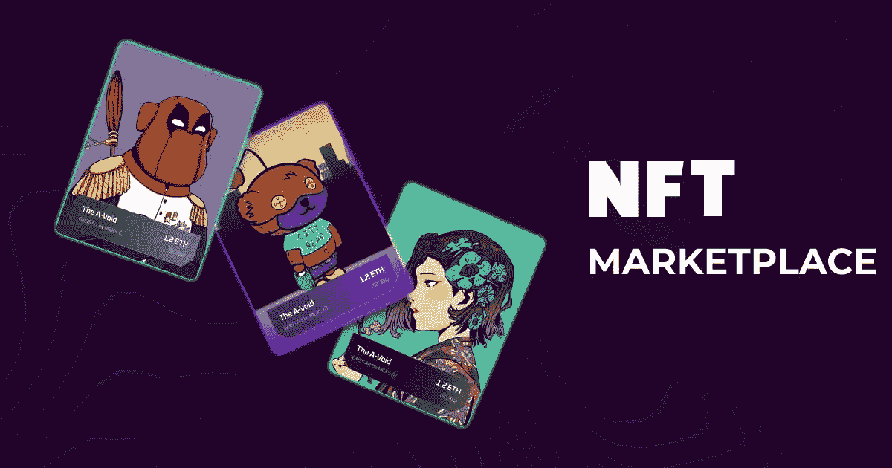

# 2023 年前印度 12 大最佳 NFT 市场开发商！

> 原文：<https://medium.com/geekculture/top-12-best-nft-marketplace-developers-in-india-by-2023-7d77c91fa149?source=collection_archive---------21----------------------->

Top 12 Best NFT Marketplace Developers in India by 2023!

自过去十年化名为中本聪的人发现比特币区块链以来，区块链世界一直在演变。自那以后，该行业通过加密货币和不可替代代币(NFT)在多个领域持续增长。NFT 市场开发商在印度的出现加速了市场的演变，因为这个亚洲国家传统上一直是 Web3 业务外包服务的热点。这篇博客涉及了创建功能丰富的 NFT 市场应用程序的前 12 家公司，概述了它们在该领域的主要能力。

> [*是时候更深入地了解 NFT 的市场空间，获取供应商*的详尽列表了！](https://www.blockchainappfactory.com/nft-marketplace-development?utm_source=Medium+GC&utm_medium=29%2F12%2F22&utm_campaign=senpagapandian)

# 让我们来看看印度 12 大最佳 NFT 市场开发商

## 1.[区块链 App 工厂](https://www.blockchainappfactory.com/nft-marketplace-development?utm_source=Medium+GC&utm_medium=29%2F12%2F22&utm_campaign=senpagapandian)

区块链应用工厂是一家领先的公司，拥有超过七年经验的印度最佳 NFT 市场开发人员。该公司专门从事从零开始创建市场应用程序和白标解决方案。它还在英国、美国、澳大利亚、加拿大和日本设有全球办事处。其专家精通主要的区块链网络，包括以太坊和 BNB 链。

## 2. [AppDupe](https://www.appdupe.com/nft-marketplace-development)

AppDupe 是为全球客户提供 NFT 市场平台的知名提供商。它的应用程序开发人员专注于直观的 UI/UX 门户和健壮的后端，从而产生充满活力和强大的平台。该公司有能力推出平台，以数字、实物和实物形式销售各种 NFT 收藏品。其顾问团队在 2022 年是最好的团队之一。

## 3. [OpenGeeksLab](https://opengeekslab.com)

OpenGeeksLab 是 NFT 市场应用程序的一个受欢迎的提供商，今年它的认可度激增。该公司以具有竞争力的价格为各种规模的企业提供功能丰富的应用程序，能够实现多链和跨链功能。这家公司可以成为那些希望进军 NFT 主流领域的企业家的首选。

## 4.[车途](https://www.chetu.com)

Chetu 是一家总部位于印度的老牌 Web3 应用公司，拥有熟练的 NFT 市场开发人员。该公司在多个区块链网络上为客户提供具有丰富特性和功能的平台。它的端到端开发者团队可以推出类似于现有创业公司的平台，以最小的成本和时间在 Web3 领域获得立足点。

## 5. [Softermii](https://www.softermii.com)

Softermii 由一组热情的开发人员组成，他们擅长前端和后端开发 NFT 市场应用程序。该公司的能力使其客户能够更有效地运行用户界面和区块链聚合的平台。对于希望在 NFT 做大的各种规模的企业来说，该公司是理想的合作选择。

## NFT 市场开发商:2022 年的情况如何？

随着这一年接近尾声，NFT 市场给我们上了很多课。比特币基地和北海巨妖等众多老牌加密公司已经推出了他们的 NFT 应用，而 Sudoswap 和 Magic Eden 等新公司已经占据了头条。人们还应该记得 LooksRare 和 X2Y2 是如何开展业务的(不过，这不是建议！).

围绕创作者版税、汽油费和 NFT 市场模式的多连锁店扩张，一直有很多声音，在这些方面，我们已经从经验中获得了宝贵的教训。2023 年将是改进和主流采用的一年。

## 6.[安泰尔解决方案](https://www.antiersolutions.com)

安提尔解决方案公司是在印度拥有 NFT 市场发展的著名公司之一。它是市场领导者之一，拥有开发、咨询、营销和支持各方面的专家团队。该公司一直引领着 NFT 的发展空间，为客户提供了数百个成功的市场应用。该公司的全球存在使它能够在国际上展开翅膀。

## 7. [Appinventiv](https://appinventiv.com)

Appinventiv 是印度著名的 NFT 市场应用程序提供商，为亚洲、澳洲和欧洲的客户提供服务。该公司通过从无到有的开发和白标解决方案，专注于现有 NFT 市场模式的创新。通过提供这种新时代的平台，该公司一直处于 Web3 业务空间的创新方面的最前沿，确保所有人的成功。

## 8.Kevuru 游戏

虽然 Kevuru Games 主要致力于 NFT 游戏，但其 NFT 市场的发展最近受到了关注，尤其是那些与 Web3 游戏相关的市场。这家总部位于印度的应用程序提供商还擅长利用其经验丰富的员工将市场功能集成到现有游戏平台中。它的优秀似乎没有限制，因为它经常提供基于其他数字收藏品的高质量 NFT 市场。

## 9.Solulab

Solulab 是推出 Web3 应用程序的多面手，尤其擅长利基型 NFT 市场。其专业人员专注于满足客户需求，同时确保平台功能不会受到影响。该公司还为其客户企业提供广泛的启动后支持，使他们能够成功运作。Solulab 为收藏品、艺术品、音乐和体育收藏品创造市场。

## 10.冗长

Prolitus 是印度 NFT 市场发展的新兴公司之一，迄今为止为其客户提供了有希望的结果。该公司依靠构建基于横向和纵向商业模式的丰富的市场应用程序而蓬勃发展。随着时间的推移，其区块链兼容性也在不断增长，预计未来几个月将增加多链和跨链功能。

## 11.达姆科集团

Damco Group 是最近在印度成立的 NFT 市场开发公司之一，在几个国家设有外部基地。该公司通过基于新一代商业利基的众多平台，挖掘了 NFT 市场模式的潜力。Damco 的专业人员提供轻量级平台，这些平台在用户体验和后端功能方面表现出色。

## 12.网页库

Webkul 最近投身于 Web3 开发，能够创建精致的 NFT 市场应用程序。该公司已被确定为 Web3 圈子中最友好的服务提供商之一，这是由于其根据自身能力和客户需求安排活动的能力。Webkul 还通过其现成的 NFT 市场解决方案为初创公司提供 Web3 平台。

## 结论

因此，我们已经看到了印度前 12 名 NFT 市场开发商的名单。如果你是一个企业家，想进入广阔的 Web3 空间做生意，这个列表可能对你有帮助。也就是说，最终取决于你的偏好和决定，选择最适合你的公司来实现你的新业务平台。