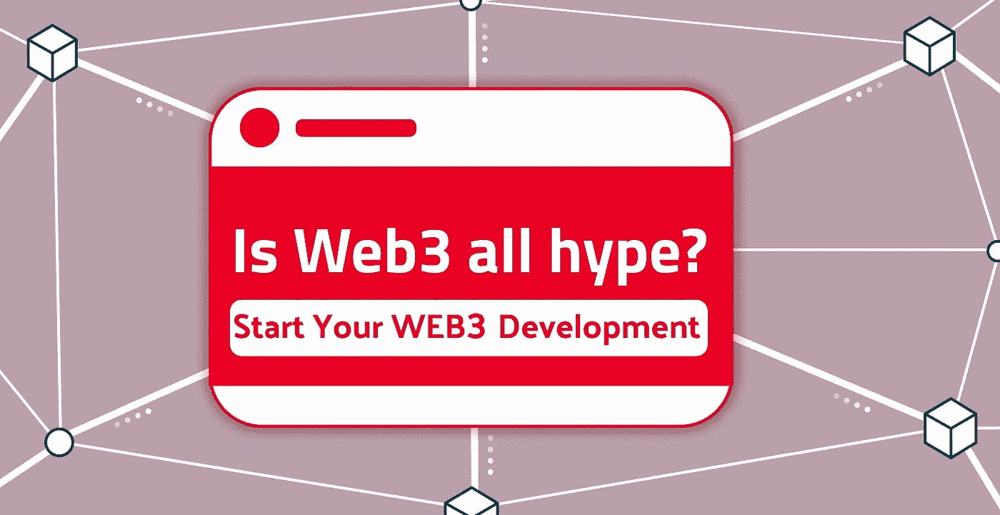

# 美国前 12 家 Web3 开发公司

> 原文：<https://medium.com/geekculture/top-12-best-web3-development-companies-in-usa-d0d9e80edba1?source=collection_archive---------11----------------------->

互联网的未来被预测在 Web3。然而，在这个基于区块链的未来网络愿景中，包括了货币、非功能性金融工具、DAOs、分散金融等等。它提供了一个读/写/拥有的网站，用户在这里有经济利益，对他们的在线社区有更多的控制权。类似于个人电脑和智能手机如何改变了在线体验，Web3 也有潜力做同样的事情。然而，这涉及到一些风险。由于 Web3 计划带来的潜在欺诈和环境危害，一些公司进入市场只是遇到阻力。尽管区块链被宣传为金融排斥、隐私和中央集权的解决方案，但它恶化了许多这些问题。公司在涉足之前必须权衡风险和优势。

> **点击链接**👉👉 [**进入网页 3**](https://www.blockchainappfactory.com/web3-development-solutions?utm_source=Medium+GC&utm_medium=17%2F11%2F22&utm_campaign=senpagapandian) 👈👈

然而，如果你想成为这个名为 web3 的分散式未来的技术革命的一部分，你可以接触到提供基于 web3 的开发解决方案的顶级公司。此外，为了让你和最不可思议的公司一起工作，我们整理了一份美国前 12 家 Web3 开发公司的名单。因此，你可以指望他们有一个美好的未来。

# **美国前 12 大 Web3 开发公司**

## **1。区块链 App 工厂**

> **了解更多:**[**https://www.blockchainappfactory.com/**](https://www.blockchainappfactory.com/web3-development-solutions?utm_source=Medium+GC&utm_medium=17%2F11%2F22&utm_campaign=senpagapandian)**👈👈**

**区块链应用工厂是基于 web3 的解决方案的堡垒。他们通过创建各种基于 Web3 和区块链的应用程序，成功地为全球客户提供服务。作为当今美国顶尖的 web3 开发公司之一，他们不断提高对各种 web3 相关技术的理解，并将其融入区块链，以实现整个 web3 生态系统。由于商业有无限的可能性，他们得出了一个更好的未来的最佳等式。**

## ****2。加燃料****

**Fueled 是美国最好的 Web3 开发公司，它提供最好的服务，在加密领域拥有知识渊博的专业人员。Fueled 一直为各种 web 应用程序提供独特而丰富的个性化用户体验，但 Web3 让我们走得更远。他们希望在每个阶段都改进产品，而不仅仅是推动一个想法完成。因此，对于基于 web3 的应用程序来说，在飞机上加油就像在最安全的地方完成工作一样。**

## ****3。AppDupe****

**作为美国领先的 Web3 开发公司，AppDupe 提供加密领域最好的未来解决方案。他们用右手雕刻出不可思议的策略来改善事物。然而，通过去除分散式财务应用程序中的中介并授予用户真实性，Web 3.0 开发解决方案引发了控制问题。此外，从电子商务到银行再到房地产的能力扩大了企业的覆盖范围。提供用户友好、功能丰富的应用程序在公司和客户之间架起了一座桥梁。**

## ****4。Accubits****

**借助他们使用区块链、NFT、人工智能和虚拟现实技术创建的尖端 Web3 开发服务和解决方案，您可以释放 Web3 的潜力并转变您的业务。然而，通过解决您公司的独特需求，他们帮助企业实现分散网络的真正潜力，以提供高透明度、高效率和自动化。因此，让最好的 Web3 开发公司加入进来会帮助你达到更高的境界。**

## ****5。兴趣点****

**使用 Interexy 的 Web3 开发服务，您可以创建尖端的交易、游戏或其他平台，从而提高透明度、扩大客户群并增加利润。他们被认为是美国顶尖的 Web3 开发公司，拥有一支规模可观的区块链专家团队。他们提供广泛的 web3 软件开发服务，同时利用最新的技术，遵守法规，并产生一流的成果。**

## ****6。马克瓦特****

**Markovate 是美国领先的 Web3 提供商。然而，使用区块链、人工智能、NFTs、物联网和加密技术，他们熟练的开发人员创建了交互式 web3 解决方案。此外，它们使用 web3 工具、框架、API、Oracles 和编程语言(如 Rust、Solidity、Truffle、Ganache 和 EVMour)覆盖了众所周知的市场，如游戏、金融科技、银行、房地产、投资、医疗保健、教育和娱乐。**

## ****7。Cubix****

**Cubix 是美国提供最好的 Web3 开发服务的领导者。他们基于分散的对等网络创建了一个不断发展的 web 解决方案，以便在竞争中脱颖而出。此外，在 web3 互联网阶段加入分布式协议，有助于为网络空间增加价值。世界顶级企业之一的 Cubix 保证提高您的产品质量。**

## ****8。最佳 Web3 开发****

**作为美国顶尖的 Web3 开发公司之一，Best Web3 Development 为您提供了一种珍惜未来需求的方式。但是，有了它们，您就可以通过专门的 Web3 解决方案在行业中处于领先地位。由美国顶尖的 web3 开发者创建，他们创建高性能的电子商务架构和转换驱动的用户界面。此外，他们的优质平台吸引了当今挑剔客户的注意力。**

## ****9。LeewayHeartz****

**LeewayHeartz 正在奋力开拓最好的 web3 解决方案，以改变许多企业的未来。他们还提供智能合约开发、NFT 游戏开发、加密货币钱包开发、加密货币兑换开发、NFT 代币开发和其他区块链项目，以使自己在竞争中脱颖而出。他们的区块链专家利用他们的知识，努力创造吸引目标受众的解决方案。**

## ****10。安泰尔解决方案****

**Antier Solutions 是引领潮流的公司，让区块链看起来像是小菜一碟。该公司雇佣了一批经验丰富的初级软件工程师，他们支持创造性商业解决方案的开发。然而，为了确保最高水平的客户满意度，美国最好的 web3 开发公司使用灵活的开发方法和透明的定价政策。**

## **11。上升最大值**

**开发 web3 平台的顶级美国公司之一是 RisingMax。这家 web3 开发公司自 2013 年以来一直为全球客户提供动态软件解决方案。此外，他们的开发团队利用其对尖端技术的精通来创建易于使用的高级平台。**

## ****12。Maticz****

**作为美国最好的 web3 平台开发公司之一，Maticz 为其全球客户创造有效的商业解决方案。许多企业利用他们的专业知识，利用区块链、人工智能、云计算、web 开发和其他顶级技术来开发尖端的商业解决方案。**

****包装完毕！****

**基于 Web3 的未来永远是任何企业成功的关键。然而，为了利用你的工作在美国找到最好的 Web3 开发公司，我们已经为未来的广泛游戏计划汇编了内部最好的运营商。因此，利用名单上的任何人来建立一个基于 web3 的企业。**