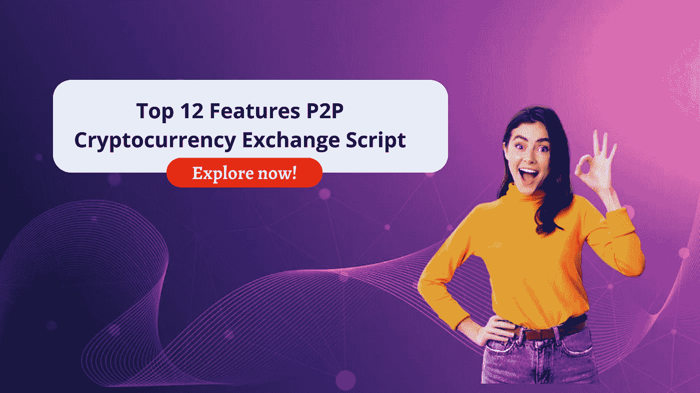

# 12 大 P2P 加密货币交换脚本

> 原文：<https://medium.com/geekculture/top-12-features-p2p-cryptocurrency-exchange-script-68ff2cbacf25?source=collection_archive---------9----------------------->

在过去十年中，加密货币在资产中排名第一。另一方面，密码交换业务是当前时代的完美商业标准。在今天的加密领域，推出 p2p 加密交换业务成为高收入的商业风险。从头到尾开发一个密码交换平台是一件烦恼的事。

开始加密交易业务的有效方式之一是使用 [**加密货币交易脚本**](https://www.cryptocurrencyscript.com/cryptocurrency-exchange-script) 。加密交换克隆脚本是现成的、经过预先测试的、无错误的、经济高效的软件。

来，让我们进入下一个话题各种类型的加密交易平台

## **在这里，我们来看看 P2P 加密货币交易脚本**的最佳特性

## 多种付款方式

加密用户可以通过平台的各种支付渠道发送和接收货币，进行简单快捷的加密交易。

## 快速交易方式

由于高效的交易引擎功能，客户可以更容易、更安全、更快速地选择他们喜欢的交易。

## 用户界面

Zodeak 提供用户友好的解决方案，允许用户在这个平台上轻松注册、登录和交易。

## 托管服务

P2P 加密交易所提供安全可信的基于智能合约的托管系统燃料，以实现平台用户之间的成功交易。

## 自动化交易

受信任用户的交易由自动加密交易驱动，消除了对中间人的需求，并减少了不必要的交易费用。

## 多因素身份认证(MFA)

为了确保安全性，管理员和用户都启用了多因素身份验证功能，如电子邮件身份验证或 Google 2FA。

## **无漏洞加密交换**

加密交换选项使交易者能够在没有任何第三方参与的情况下进行安全的交易。

## 精确和私密的交易

买家和卖家可以从大量的密码交易指令中选择他们想要的指令，反之亦然。

## 多语言支持

为了在全球范围内实现和吸引加密交易，我们的点对点加密交换脚本支持多种语言和各种加密货币。

## 趋势市场价值

我们的增强型 p2p 交换脚本旨在显示易变的加密货币价值，可以轻松地进行实时监控。

## 顶级匹配引擎

简单、快速、安全的匹配引擎被用来寻找完美的买家和卖家，没有时间延迟。

## 即时 KYC 和配置文件验证

内置的自动化 KYC/AML 允许管理员有效地授权用户配置文件，并防止未经授权的用户访问平台。

上面我已经提到了 [**P2P 加密货币交换脚本**](https://www.cryptocurrencyscript.com/blog/p2p-crypto-exchange-script) 的顶级特性。如果你了解 P2P 加密交换脚本。你可以自己研究。