# 2022 年 12 大软件测试外包公司

> 原文：<https://medium.com/geekculture/top-12-software-testing-outsourcing-companies-in-2022-a9c95087392b?source=collection_archive---------8----------------------->

软件测试外包行业一直在以惊人的速度增长，预计到 2022 年年收入将达到 30 亿美元。

下面是十大软件测试外包公司的名单，显示了他们的收入和商业模式。

**最佳软件测试外包公司**

**1。**

**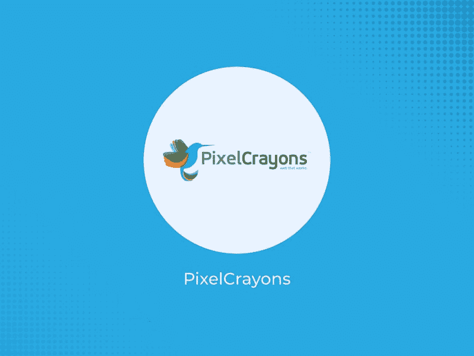**

**PixelCrayons 是印度值得信赖的 IT 外包、应用和软件开发公司之一。该公司与 38 个国家的 1000 多家企业合作，为世界各地的客户提供高效、经济的服务。他们提供广泛的测试服务，包括功能性、非功能性、手动和探索性测试。他们拥有一支专业的测试团队，精通自动化测试、移动和 web 应用测试、性能工程测试。**

****2。**[**quality logic**](https://www.qualitylogic.com/)**

**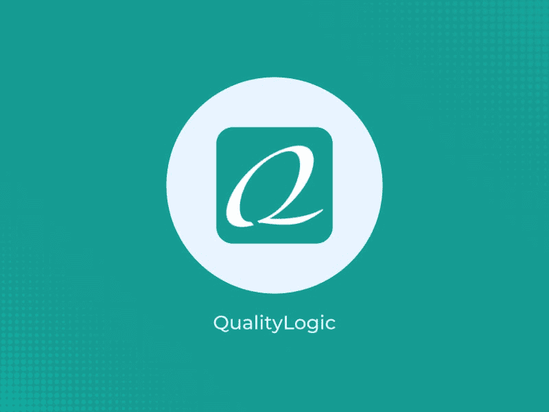**

**QualityLogic 提供各种软件测试服务，例如手动和自动测试。总部设在美国爱达荷州博伊西，他们已经提供这些服务超过 35 年，并以其顶尖的人才团队，质量保证和客户服务而闻名。他们提供回归测试、预发布测试、移动应用测试、API 集成等服务。**

**发布周期越短，软件发布前的测试就越难。QualityLogic 作为外包软件测试和 QA 合作伙伴，确保产品在发布前后都能正常工作，并且用户体验是无缝的。**

**QualityLogic 拥有超过 5，000 个成功的项目，拥有以最低成本提供高质量解决方案的良好记录。**

****3。** [**估价师**](https://www.valuecoders.com/)**

**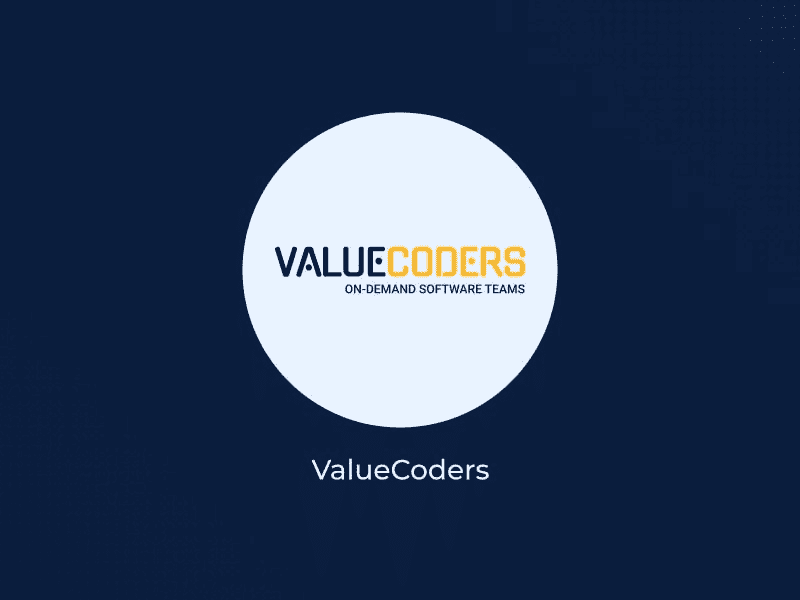**

**ValueCoders 是一家领先的软件测试外包公司，在全球拥有超过 100，000 家客户。ValueCoders 总部位于印度 Gurugram，提供广泛的 IT 服务，如 QA 和测试、开发、编程和移动应用程序开发。该公司拥有一支经验丰富的专家团队，他们精通行业的最新技术和趋势。**

**他们提供灵活的服务包，并允许客户选择他们想要的项目期限。他们甚至提供各方面的质量保证报告，如项目管理、工作流程效率、质量监控报告等。**

****4。**T22**QA source****

**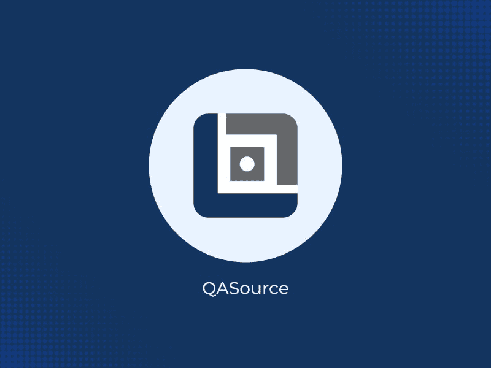**

**QASource 是一家领先的软件测试外包公司，提供独特和创新的质量保证方法。QASource 总部位于硅谷，在印度(昌迪加尔)和墨西哥(阿瓜斯卡连特斯)设有办事处。**

**该公司自 2006 年以来一直提供经济高效的软件测试服务，有着良好的业绩记录。凭借经验丰富的世界级软件测试团队，QASource 可以在任何平台或设备类型上提供全面而强大的测试覆盖。**

****5。** [**iBeta 质量保证**](https://www.ibeta.com/)**

**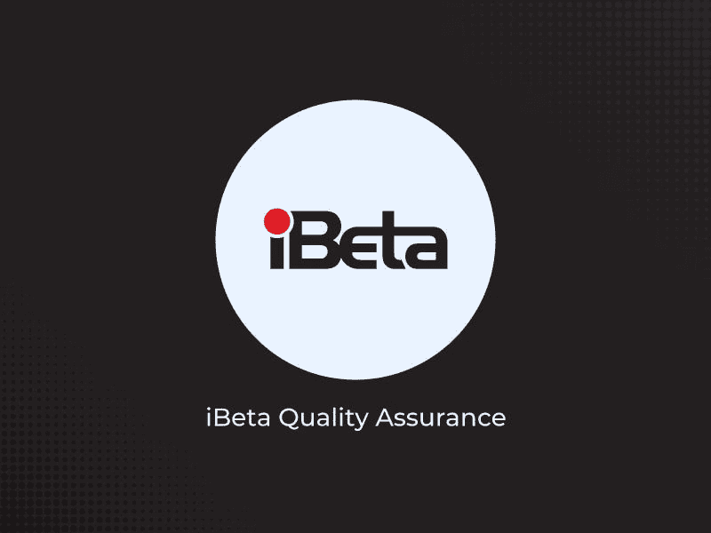**

**iBeta Quality Assurance 是美国领先的软件测试外包公司，提供最广泛的测试服务，包括安全测试、移动应用和 web 测试。**

**该公司提供基于金融机构、电信、制造业和医疗保健等垂直行业的定制解决方案。**

**iBeta 质量保证为初创企业和中小型企业(SME)提供服务。**

**iBeta 质量保证还提供全面的培训计划，帮助组织从头到尾创建成功的测试策略。**

****6。**[**iTechArt**](https://www.itechart.com/)**

**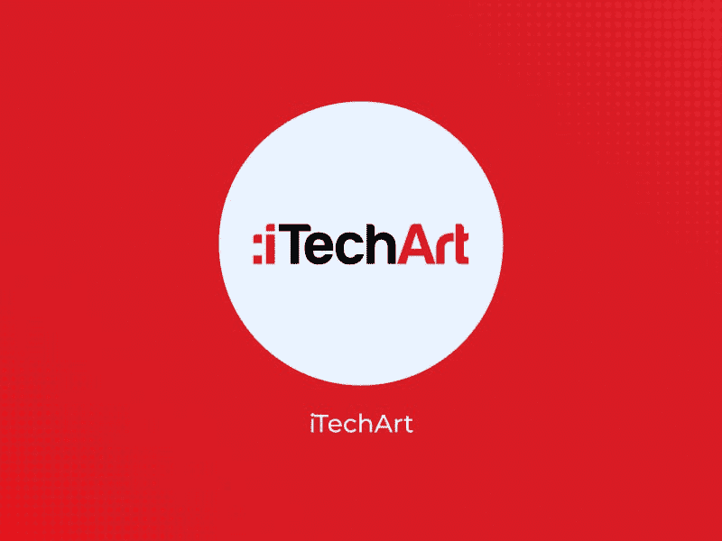**

**iTechArt 是一家领先的软件测试外包公司，为全球公司提供创新的解决方案和服务。该公司提供具有顶级质量支持的尖端技术，提供低代码开发平台和跨平台移动应用程序开发技术。**

**iTechArt 是初创公司和快速发展的科技公司值得信赖的软件测试合作伙伴。**

**质量保证团队中有 200 多名人才，iTechArt 能够同时处理多个项目。该公司已经成功地帮助了各个行业的客户，如医疗保健、零售、金融服务和教育。**

****7。** [**全局 App 测试**](https://www.globalapptesting.com/)**

**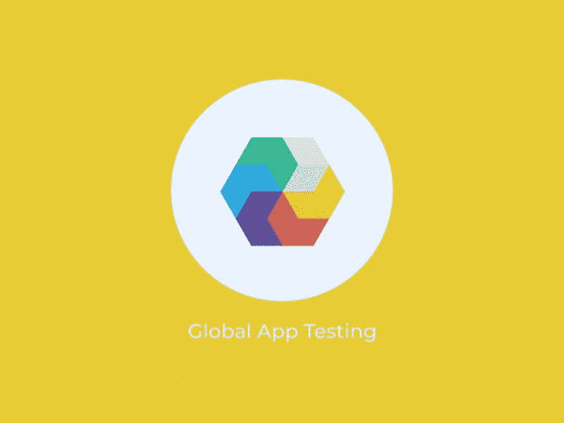**

**位于英国伦敦的 Global App Testing 是 10 大软件测试外包公司之一。该公司专门从事移动应用程序测试、web 应用程序测试和桌面应用程序测试。全球 App 测试旨在以有竞争力的价格为客户提供高质量的服务。**

**该公司提供探索性测试和测试用例执行，在 36 小时内交付可操作的结果。此外，30 分钟是运行定制测试所需的最长时间。**

**全球应用测试提供的服务包括众测、移动应用测试、本地化测试、探索性测试和测试用例执行。**

**微软、德普、思杰、脸书、谷歌、Spotify、Craigslist、Evernote 和威瑞森都是他们满意的客户。**

****8。** [**QA 狼**](https://www.qawolf.com/)**

**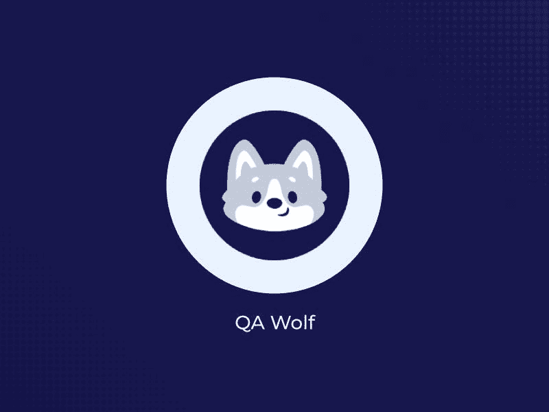**

**QA Wolf 位于美国弗吉尼亚州赫恩登，提供高质量、高性价比的软件测试外包服务。该公司拥有一支精通各种测试领域的专业团队。这些包括功能、单元、系统、安全性、本地化和兼容性测试。**

**除了以上服务，QA Wolf 还提供质量保证咨询服务。QA Wolf 是预算紧张的初创公司或中小企业寻找经验丰富的 QA 团队的完美选择，无需昂贵的价格标签。**

**除了功能测试，QA Wolf 还测试 ui、集成、API、Salesforce 等等。**

**9. [**科学软件**](https://www.scnsoft.com/)**

**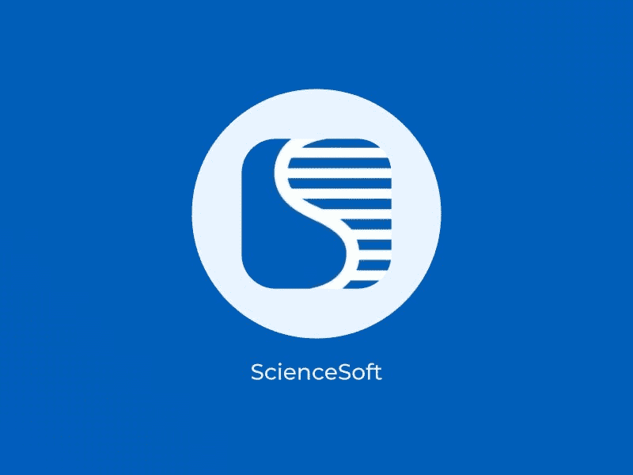**

**ScienceSoft 是一家领先的 [**质量保证外包**](https://www.pixelcrayons.com/blog/quality-assurance-outsourcing-importance-and-benefits/?utm_source=medium&utm_medium=quality-assurance-outsourcing&utm_campaign=AT-HG) 供应商，拥有 33 年的经验，可以处理整个或部分质量保证过程，以确保软件的功能稳定性。**

**ScienceSoft 是软件测试外包领域的全球领导者。该公司为移动和网络应用提供质量保证和测试服务。这些服务在内部或通过我们的虚拟云环境提供。**

**ScienceSoft 的软件专业人员拥有广泛技术的实践经验，包括 AngularJS、ReactJS、PHP、Ruby on Rails 等等。**

****10。** [**合格**](https://qalified.com/)**

**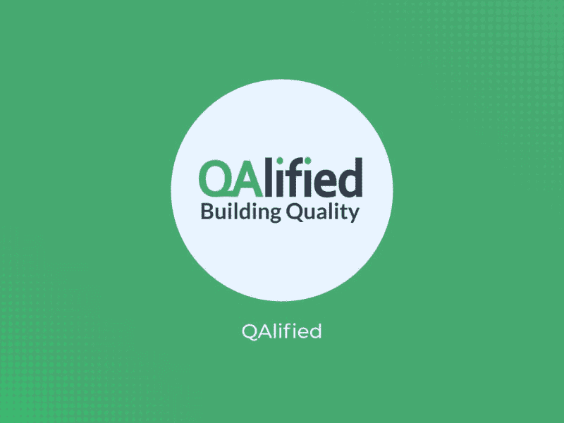**

**QAlified 是一家软件测试和质量保证公司，专注于通过最小化风险、提高效率和支持业务来解决质量问题。**

**QAlified 位于乌拉圭的蒙得维的亚，提供诸如测试自动化、应用程序测试、安全测试、可访问性测试、性能测试和可用性测试等服务。**

**它是一个很有前途的合作伙伴，在许多技术方面有专长，可以评估任何软件的质量。该公司已经在信息技术、公共管理、银行、金融和医疗保健领域开展了 600 多个项目。**

**11。[**TestMatick**](https://testmatick.com/)**

**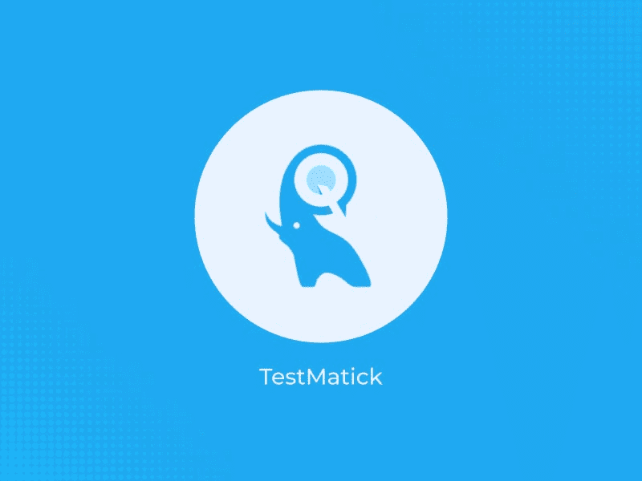**

**TestMatick 是一家领先的软件测试外包公司，提供创新的解决方案来帮助客户实现他们的业务目标。TestMatrick 的 QA 专家随时准备接手您的业务项目，并在要求的时间范围内交付高质量的结果。**

**该公司有 51-200 名员工，他们的平均时薪是 25 美元。TestMatick 在纽约、乌克兰和塞浦路斯设有办事处。**

**该公司提供许多服务，如功能和可用性测试、安全检查、beta 测试、跨浏览器兼容性等等。**

****12。** [**QA 导师**](https://www.qamentor.com/)**

**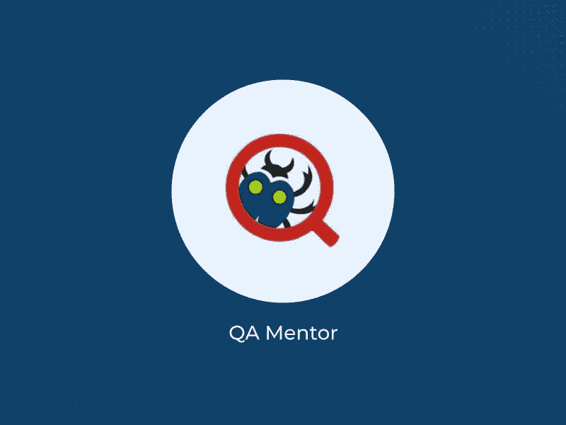**

**QA Mentor 是一家屡获殊荣的软件测试服务提供商。这家总部位于纽约的公司提供各种各样的合同软件测试服务，包括功能、性能、兼容性和安全性测试。全球财富 500 强公司都是他们的客户。**

**QA Mentor 拥有超过 12 年的经验和超过 800 名 QA 专业人员的团队，是您可以找到的最可靠的外包软件测试公司之一。**

**该公司在俄罗斯、法国、新泽西、布鲁克林、突尼斯、以色列、印度、泰国、英国、罗马尼亚、乌克兰和白俄罗斯设有办事处。**

****软件测试外包的好处****

**软件测试外包是软件开发的最新趋势之一。它允许公司快速、经济地扩展他们的软件测试工作。外包软件测试有几个令人着迷的好处，其中一些列举如下:**

*   ****性价比****

**软件测试外包是在不超出预算的情况下获得质量保证的一种经济有效的方式。**

**你不必为你的 QA 团队雇佣额外的员工或租用办公室。你雇佣的公司为你做了所有的软件测试工作，让你专注于你的核心产品和业务。**

*   ****提高测试质量****

**质量保证外包是一种不依赖内部资源的测试软件的经济有效且可扩展的方法。QA 外包为您的产品质量提供了一个客观的视角，并保证它已经按照行业标准进行了测试。**

*   ****提高效率****

**在发布软件之前对其进行测试可能很耗时，但是将这一过程外包给第三方可能是提高效率的一个很好的方式。通过与外包公司合作，您可以专注于营销和业务发展，同时允许外包公司开发软件和修复漏洞，让您有更多时间专注于对您的业务最重要的事情。**

*   ****更好的灵活性****

**测试软件可能是一个乏味且耗时的过程。通过将这项工作外包给第三方，您可以腾出资源来处理公司日常运营中更紧迫的事务。灵活性可以让你更好地监控现金流，并专注于为客户开发新产品或服务。**

****总结****

**这篇文章仔细观察了 2022 年排名前 12 的软件测试外包公司。它们都提供不同的服务，根据工作类型和公司规模有不同的定价结构。在寻找公司时，要记住的最重要的因素是确保他们为你的企业提供的服务。**

**如果您需要帮助为您的项目找到合适的 [**软件测试公司**](https://www.pixelcrayons.com/testing-and-qa-service?utm_source=medium&utm_medium=software-testing-company&utm_campaign=AT-HG) ，请不要犹豫与我们联系。**