# 12 大系统设计面试问题及答案(2023)

> 原文：<https://medium.com/geekculture/top-12-system-design-interview-questions-with-answers-2022-dc2b6599f39a?source=collection_archive---------1----------------------->

通过练习这些问题，你可以增加许多成功的机会！

FAANG System Design Interview Questions

在过去的几年里，系统设计面试获得了很多关注。现在，这是每个软件工程面试的标准部分，这些面试评估候选人处理复杂系统的能力。这些面试中的表现决定了面试公司**提供的**职位**和**薪资**。**

今天我们将讨论顶级科技公司的**12 大系统设计面试问题**，包括 **FAANG** (脸书、苹果、亚马逊、网飞和谷歌)。

# **1。设计 Facebook Messenger**

设计一个像 Facebook Messenger 一样的即时消息服务，用户可以通过网络和移动界面互相发送文本消息。

**功能需求:**

1.  Messenger 应该支持用户之间的一对一对话。
2.  Messenger 应该跟踪其用户的在线/离线状态。
3.  Messenger 应该支持聊天记录的持久存储。

**非功能需求:**

1.  用户应该有一个实时聊天体验，最小的延迟。
2.  我们的系统应该是高度一致的；用户应该可以在他们所有的设备上看到相同的聊天记录。
3.  Messenger 的高可用性是可取的；为了一致性，我们可以容忍较低的可用性。

## 高级解决方案

在高层次上，我们将需要一个聊天服务器，它将是协调用户之间所有通信的核心部分。例如，当一个用户想要给另一个用户发送消息时，他们将连接到聊天服务器，并将消息发送到服务器；然后，服务器将该消息传递给其他用户，并将其存储在数据库中。

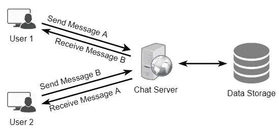

详细的工作流程如下所示:

1.  用户 A 通过聊天服务器向用户 B 发送消息。
2.  服务器接收消息并向用户 a 发送确认。
3.  服务器将消息存储在其数据库中，并将消息发送给用户 b。
4.  用户 B 收到消息，并向服务器发送确认。
5.  服务器通知用户 A，消息已经成功传递给用户 b。

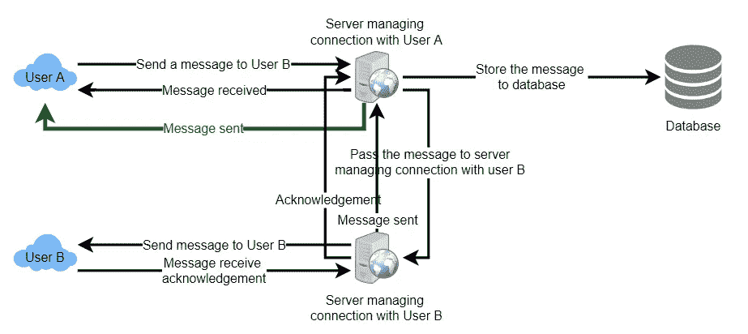

Request flow for sending a message

了解更多关于 [**设计 Facebook Messenger**](https://designgurus.org/path-player?courseid=grokking-the-system-design-interview&unit=grokking-the-system-design-interview_1626970153011_2Unit)**的信息。**

# **2。设计 Youtube**

设计一个类似 Youtube 的视频共享服务，用户可以上传/观看/搜索视频。

**功能需求:**

1.  用户应该能够上传视频。
2.  用户应该能够分享和观看视频。
3.  用户应该能够根据视频标题进行搜索。
4.  我们的服务应该能够记录视频的统计数据，例如，喜欢/不喜欢，总浏览量等。
5.  用户应该能够添加和查看视频评论。

**非功能需求:**

1.  该系统应该是高度可靠的，任何视频上传不应丢失。
2.  系统应该是高度可用的。一致性可能会受到影响(为了可用性)；如果用户有一段时间没有看到视频，应该没问题。
3.  用户在观看视频时应该有实时体验，不应感到任何滞后。

## 高级解决方案

总体而言，我们需要以下组件:

1.  **处理队列:**每一个上传的视频都将被推送到一个处理队列中，以进行编码、缩略图生成和存储。
2.  **编码器:**将每个上传的视频编码成多种格式。
3.  **缩略图生成器:**为每个视频生成几个缩略图。
4.  **视频和缩略图存储:**在一些分布式文件存储中存储视频和缩略图文件。
5.  **用户数据库:**存储用户信息，如姓名、电子邮件、地址等。
6.  **视频元数据存储:**一个元数据数据库，用于存储关于视频的所有信息，如标题、系统中的文件路径、上传用户、总浏览量、喜欢、不喜欢等。它还将用于存储所有的视频评论。

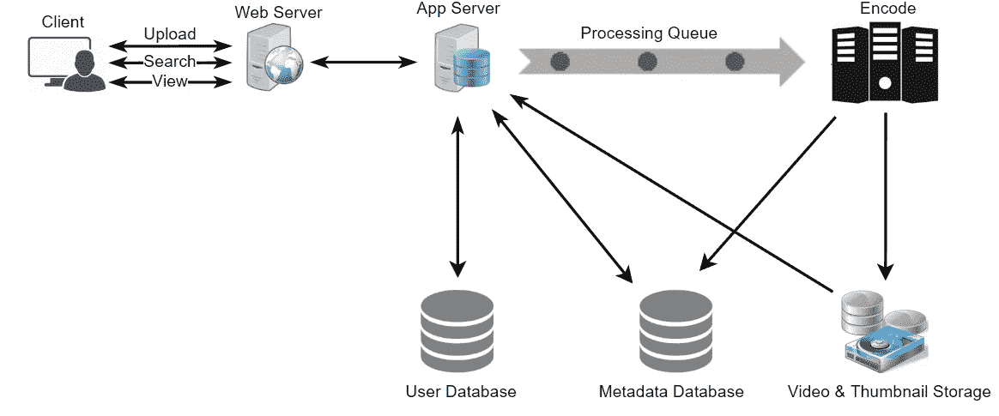

High-level design of Youtube

了解更多关于 [**设计 Youtube**](https://designgurus.org/path-player?courseid=grokking-the-system-design-interview&unit=grokking-the-system-design-interview_1626970192981_4Unit) **。**

# 3.设计脸书的新闻源

设计脸书的新闻源，其中包含用户关注的所有人和页面的帖子、照片、视频和状态更新。

**功能需求:**

1.  新闻订阅源将基于用户关注的人、页面和组的帖子生成。
2.  用户可能有许多朋友并关注大量页面/群组。
3.  提要可能包含图像、视频或文本。
4.  我们的服务应该支持为所有活跃用户在新帖子到达新闻提要时添加新帖子。

**非功能需求:**

1.  我们的系统应该能够实时生成任何用户的新闻订阅——最终用户看到的最大延迟是 2s。
2.  假设有新的新闻订阅请求，一篇文章不应该花超过 5 秒的时间到达用户的订阅源。

## 高级解决方案

概括地说，我们的新闻订阅服务需要以下组件:

1.  **网络服务器:**维持与用户的连接。此连接将用于在用户和服务器之间传输数据。
2.  **应用服务器:**执行在数据库服务器中存储新帖子的工作流程。我们还需要一些应用服务器来检索新闻提要并将其推送给最终用户。
3.  **元数据数据库和缓存:**存储用户、页面和群组的元数据。
4.  **文章数据库和缓存:**存储关于文章及其内容的元数据。
5.  **视频和照片存储，以及缓存:** Blob 存储，用于存储帖子中包含的所有媒体。
6.  **新闻提要生成服务:**为用户收集所有相关的帖子并对其进行排序，以生成新闻提要并存储在缓存中。该服务还将接收实时更新，并将这些较新的提要条目添加到任何用户的时间表中。
7.  **提要通知服务:**通知用户他们的新闻提要有更新的条目。

下面是我们系统的高层架构图。用户 B 和 C 跟随用户 a。

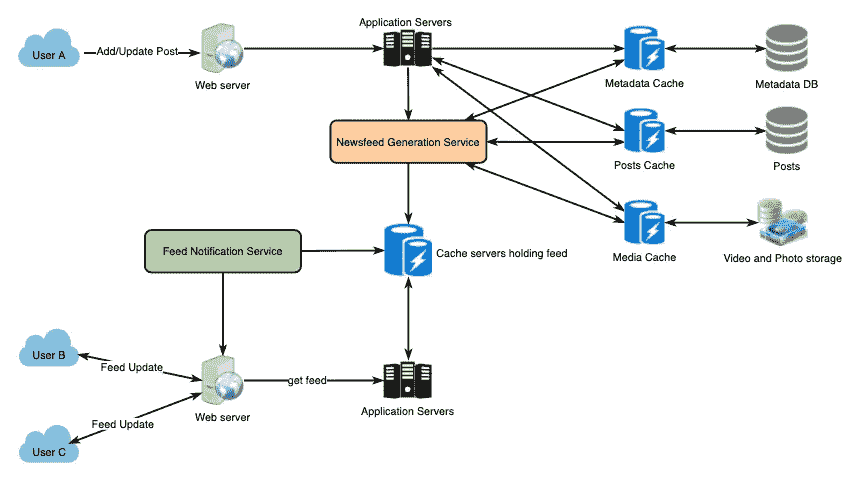

Facebook Newsfeed Architecture

了解更多关于 [**设计脸书的新闻订阅**](https://designgurus.org/path-player?courseid=grokking-the-system-design-interview&unit=grokking-the-system-design-interview_1626970300115_9Unit) **。**

# **4。设计一个 API 速率限制器**

设计一个 API 速率限制器，它将根据用户发送的请求数量来限制用户。

**功能需求:**

1.  限制一个实体在一个时间窗口内可以发送给 API 的请求数量，例如每秒 15 个请求。
2.  API 可以通过集群访问，因此应该考虑不同服务器之间的速率限制。无论是在单个服务器中还是在多个服务器的组合中，只要超过了定义的阈值，用户就会收到一条错误消息。

**非功能需求:**

1.  系统应该是高度可用的。速率限制器应该总是工作，因为它保护我们的服务免受外部攻击。
2.  我们的速率限制器不应该引入影响用户体验的大量延迟。

速率限制器将负责决定哪些请求将由 API 服务器服务，哪些请求将被拒绝。一旦一个新的请求到达，Web 服务器首先要求速率限制器决定它是被服务还是被限制。如果请求没有被限制，那么它将被传递到 API 服务器。

## 高级解决方案

速率限制器将负责决定哪些请求将由 API 服务器服务，哪些请求将被拒绝。一旦一个新的请求到达，Web 服务器首先要求速率限制器决定它是被服务还是被限制。如果请求没有被限制，那么它将被传递到 API 服务器。

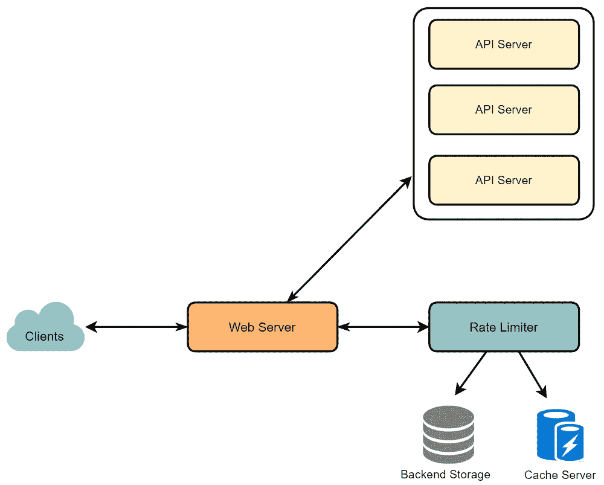

High-level design for Rate Limiter

了解更多关于 [**设计 API 速率限制器**](https://designgurus.org/path-player?courseid=grokking-the-system-design-interview&unit=grokking-the-system-design-interview_1626970236163_6Unit) **的信息。**

# **5。设计推特**

设计一个类似 Twitter 的社交网络服务。该服务的用户将能够发布推文，关注其他人和喜欢的推文。

**功能要求**

1.  用户应该能够发布新的推文。
2.  用户应该能够关注其他用户。
3.  用户应该能够将推文标记为收藏夹。
4.  该服务应该能够创建和显示用户的时间表，其中包括用户关注的所有人的热门推文。
5.  推文可以包含照片和视频。

**非功能需求**

1.  我们的服务需要高度可用。
2.  系统可接受的时间线生成延迟为 200 毫秒。
3.  一致性可能会受到影响(为了可用性)；如果用户有一段时间没有看到推文，应该没问题。

## 高级解决方案

我们需要一个能够高效存储所有新推文的系统，每秒 100M/86400s => 1150 条推文，每秒读取 28B/86400s => 325K 条推文。从需求中可以清楚地看出，这将是一个重阅读的系统。

在高层次上，我们需要多个应用服务器来服务所有这些请求，在它们前面有负载平衡器来分配流量。在后端，我们需要一个高效的数据库，可以存储所有的新推文，并支持大量的阅读。我们还需要一些文件存储空间来存储照片和视频。

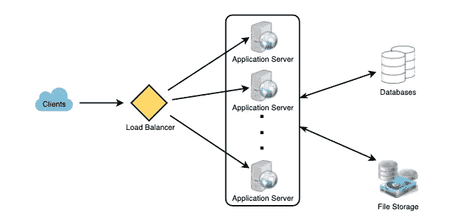

虽然我们的预期日写负载是 1 亿条，读负载是 280 亿条。这意味着我们的系统平均每秒将接收大约 1160 条新推文和 325，000 条阅读请求。这种流量在一天中的分布是不均匀的，但是，在高峰时间，我们预计每秒至少会有几千个写请求和大约一百万个读请求。在设计系统架构时，我们应该记住这一点。

了解更多关于 [**设计 Twitter**](https://designgurus.org/path-player?courseid=grokking-the-system-design-interview&unit=grokking-the-system-design-interview_1626970171139_3Unit) **。**

# 6.设计 **Dropbox 或 Google Drive**

设计一个像 Dropbox 或 Google Drive 这样的文件托管服务。云文件存储使用户能够将数据存储在远程服务器上。通常，这些服务器由云存储提供商维护，并通过网络(通常通过互联网)提供给用户。用户每月为他们的云数据存储付费。

**要求**

1.  用户应该能够从任何设备上传和下载他们的文件/照片。
2.  用户应该能够与其他用户共享文件或文件夹。
3.  我们的服务应该支持设备之间的自动同步，也就是说，在一个设备上更新一个文件后，它应该在所有设备上同步。
4.  系统应该支持存储高达 1gb 的大文件。
5.  酸性是必需的。应该保证所有文件操作的原子性、一致性、隔离性和持久性。
6.  我们的系统应该支持离线编辑。用户应该能够在离线时添加/删除/修改文件，一旦他们上线，他们的所有更改都应该同步到远程服务器和其他在线设备。

**扩展需求**

*   系统应该支持数据的快照，以便用户可以返回到文件的任何版本。

## 高级解决方案

用户将指定一个文件夹作为他们设备上的工作空间。任何放在这个文件夹里的文件/照片/文件夹都会被上传到云端，每当文件被修改或删除，都会以同样的方式反映在云存储里。用户可以在他们的所有设备上指定相似的工作空间，并且在一个设备上进行的任何修改都将传播到所有其他设备，以便在任何地方都具有相同的工作空间视图。

在高层次上，我们需要存储文件及其元数据信息，如文件名、文件大小、目录等。以及该文件的共享者。因此，我们需要一些可以帮助客户端上传/下载文件到云存储的服务器，以及一些可以方便更新关于文件和用户的元数据的服务器。我们还需要一些机制来通知所有的客户端更新的发生，这样他们就可以同步他们的文件。

如下图所示，数据块服务器将与客户端一起从云存储中上传/下载文件，元数据服务器将在 SQL 或 NoSQL 数据库中更新文件的元数据。同步服务器将处理向所有客户端通知同步的不同更改的工作流。

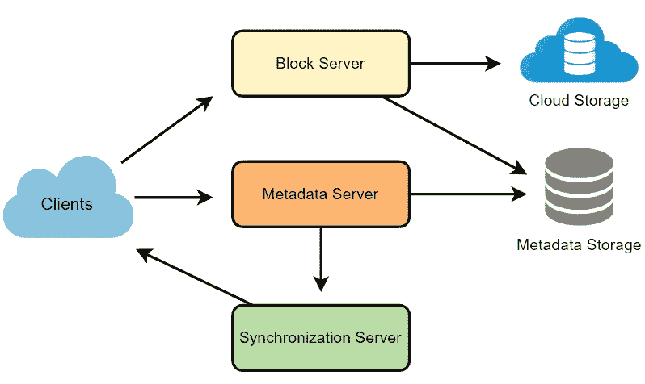

High-level design for Dropbox

了解更多关于 [**设计 Dropbox**](https://designgurus.org/path-player?courseid=grokking-the-system-design-interview&unit=grokking-the-system-design-interview_1626970134090_1Unit) **的信息。**

# **7。设计一个网络爬虫**

设计一个网络爬虫，系统地浏览和下载万维网。网络爬虫也被称为网络蜘蛛、机器人、蠕虫、步行者和机器人。

**要求**

让我们假设我们需要抓取所有的网页。

**可伸缩性:**我们的服务需要是可伸缩的，这样它就可以抓取整个网络，并且可以用来获取数以亿计的网络文档。

**可扩展性:**我们的服务应该以模块化的方式设计，并期望有新的功能加入其中。将来可能会有更新的文档类型需要下载和处理。

## 高级解决方案

一个最小的爬虫至少需要这些组件:

**1。URL frontier:** 存储要下载的 URL 列表，并区分哪些 URL 应该首先被抓取。
**2。HTML Fetcher:** 从服务器获取网页。
**3。提取器:**从 HTML 文档中提取链接。
**4。重复消除器:**确保相同的内容不会被无意中提取两次。
**5。数据存储:**存储检索到的页面、URL 和其他元数据。

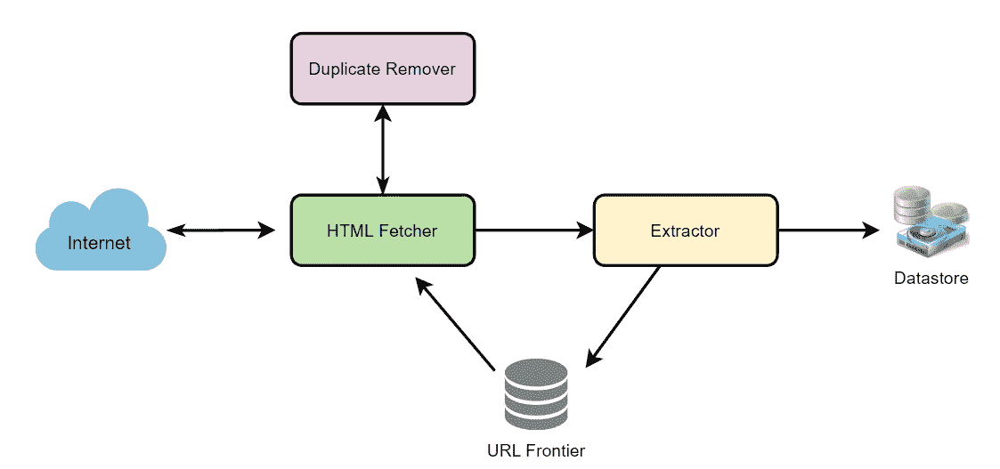

了解更多关于 [**设计网络爬虫**](https://designgurus.org/path-player?courseid=grokking-the-system-design-interview&unit=grokking-the-system-design-interview_1626970282267_8Unit) **。**

# 8.**设计推特搜索**

Twitter 是最大的社交网络服务之一，用户可以在这里分享照片、新闻和基于文本的消息。让我们设计一个可以存储和搜索用户推文的服务。

**要求**

*   让我们假设 Twitter 有 15 亿用户，每天有 8 亿活跃用户。
*   Twitter 平均每天有 4 亿条推文。
*   一条推文的平均大小是 300 字节。
*   让我们假设每天会有 5 亿次搜索。
*   搜索查询将由用 AND/OR 组合的多个单词组成。

在高层次上，我们需要将所有的 tweet 存储在一个数据库中，还需要建立一个索引来跟踪哪个单词出现在哪个 tweet 中。这个索引将帮助我们快速找到用户试图搜索的推文。

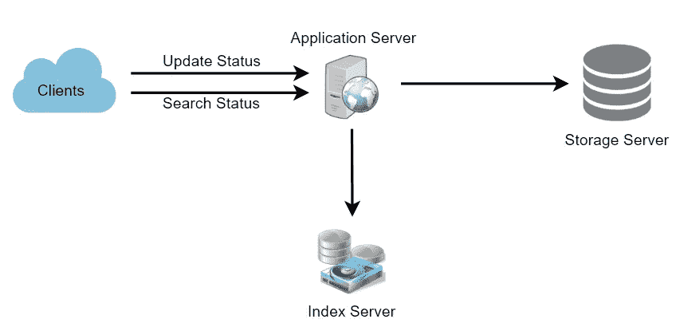

High-level design for Twitter search

了解更多关于 [**设计 Twitter 搜索**](https://designgurus.org/path-player?courseid=grokking-the-system-design-interview&unit=grokking-the-system-design-interview_1626970258715_7Unit) **。**

# **9。设计一个类似 TinyURL 的 URL 缩短服务**

设计一个类似 TinyURL 的 URL 缩短服务。该服务将提供重定向到长 URL 的短别名。

**功能需求:**

1.  给定一个 URL，我们的服务应该为它生成一个更短且唯一的别名。这叫做短链接。这个链接应该足够短，以便于复制和粘贴到应用程序中。
2.  当用户访问一个短链接时，我们的服务应该将他们重定向到原来的链接。
3.  用户应该可以选择为他们的 URL 选择一个自定义的短链接。
4.  链接将在标准的默认时间跨度后过期。用户应该能够指定到期时间。

**非功能需求:**

1.  系统应该是高度可用的。这是必需的，因为如果我们的服务关闭，所有的 URL 重定向将开始失败。
2.  URL 重定向应该以最小的延迟实时发生。
3.  缩短的链接不应该是可猜测的(不可预测)。

**扩展需求:**

1.  分析；例如，重定向发生了多少次？
2.  其他服务也应该可以通过 REST APIs 访问我们的服务。

## 高级解决方案

我们在这里解决的问题是如何为一个给定的 URL 生成一个简短且唯一的密钥。

我们可以计算一个唯一的散列(例如，MD5 或 SHA256 等。)的链接。然后可以对散列进行编码以供显示。这种编码可以是 base36 ([a-z，0–9])或 base62 ([a-z，A-Z，0–9])，如果我们添加“+”和“/”，我们可以使用 Base64 编码。一个合理的问题是，短键的长度应该是多少？6、8 或 10 个字符？

使用 base64 编码，一个 6 个字母长的密钥将产生 64⁶= ~ 687 亿个可能的字符串。使用 base64 编码，一个 8 个字母长的密钥将产生 64⁸ = ~281 万亿个可能的字符串。

有了 68.7B 个唯一的字符串，让我们假设六个字母键对于我们的系统就足够了。

如果我们使用 MD5 算法作为散列函数，它将产生一个 128 位的散列值。经过 base64 编码后，我们将得到一个超过 21 个字符的字符串(因为每个 base64 字符编码 6 位哈希值)。现在我们每个快捷键只能容纳 6(或 8)个字符；那么我们将如何选择我们的密钥呢？我们可以用前 6(或 8)个字母作为密钥。这可能导致密钥重复；为了解决这个问题，我们可以从编码字符串中选择一些其他字符或者交换一些字符。

**我们的解决方案有哪些不同的问题？**我们的编码方案存在以下几个问题:

1.  如果多个用户输入相同的 URL，他们可以获得相同的缩短 URL，这是不可接受的。
2.  如果 URL 的一部分是 URL 编码的呢？例如，[http://www.designgurus.org/distributed.php?id=design,](http://www.designgurus.org/distributed.php?id=design,)和[http://www.designgurus.org/distributed.php%3Fid%3Ddesign](http://www.designgurus.org/distributed.php%3Fid%3Ddesign)除了 URL 编码之外完全相同。

**问题的解决方法:**我们可以为每个输入 URL 添加一个递增的序列号，使其唯一，然后生成它的散列。但是，我们不需要将这个序列号存储在数据库中。这种方法可能存在的问题是不断增加的序列号。能溢出来吗？附加递增的序列号也会影响服务的性能。

另一个解决方案是将用户 id(应该是惟一的)附加到输入 URL 上。然而，如果用户没有登录，我们将不得不要求用户选择一个唯一性密钥。即使在这之后，如果我们有冲突，我们必须继续生成一个密钥，直到我们得到一个唯一的。

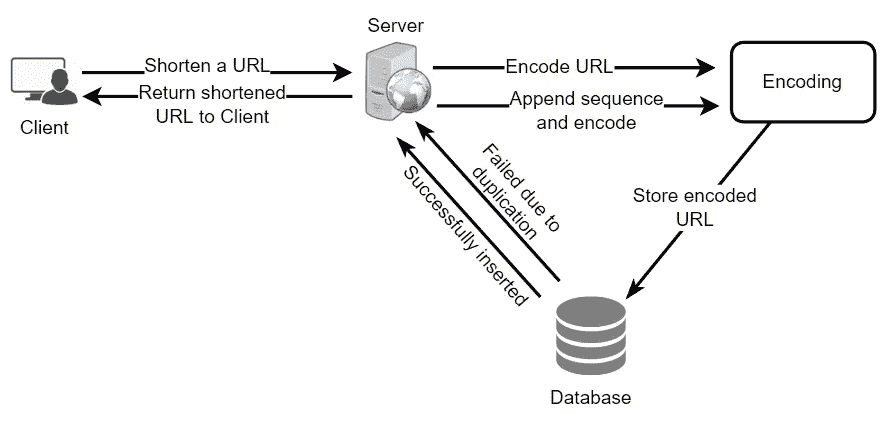

Request flow for shortening of a URL

了解更多关于 [**设计一个网址缩短服务**](https://designgurus.org/path-player?courseid=grokking-the-system-design-interview&unit=grokking-the-system-design-interview_1626455248243_1Unit) **。**

# **10。设计 Instagram**

设计一个类似 Instagram 的照片分享服务，用户可以上传照片与其他用户分享。

**功能需求**

1.  用户应该能够上传/下载/查看照片。
2.  用户可以根据照片/视频标题进行搜索。
3.  用户可以关注其他用户。
4.  系统应该生成并显示用户的新闻提要，包括用户关注的所有人的顶级照片。

**非功能性需求**

1.  我们的服务需要高度可用。
2.  对于新闻提要生成，系统的可接受延迟为 200 毫秒。
3.  如果用户有一段时间没有看到照片，一致性会受到影响(为了可用性)；应该没问题。
4.  该系统应该高度可靠；任何上传的照片或视频都不应丢失。

## 高级解决方案

在高层次上，我们需要支持两种场景，一种是上传照片，另一种是查看/搜索照片。我们的服务需要一些对象存储服务器来存储照片，需要一些数据库服务器来存储关于照片的元数据信息。

了解更多关于 [**设计 Instagram**](https://designgurus.org/path-player?courseid=grokking-the-system-design-interview&unit=grokking-the-system-design-interview_1626970106319_0Unit) **。**

# 设计 Yelp 或附近的朋友

设计一个类似 Yelp 的服务，用户可以搜索附近的地方，如餐馆、剧院或购物中心等。，还可以添加/查看地方评论。

**功能需求:**

1.  用户应该能够添加/删除/更新的地方。
2.  给定他们的位置(经度/纬度)，用户应该能够找到给定半径内所有附近的地方。
3.  用户应该能够添加关于一个地方的反馈/评论。反馈可以包含图片、文本和评分。

**非功能需求:**

1.  用户应该有一个实时的搜索体验，最小的延迟。
2.  我们的服务应该支持繁重的搜索负载。相比增加一个新的地方，会有很多搜索请求。

## 高级解决方案

在高层次上，我们需要存储和索引上述每个数据集(位置、评论等)。).为了让用户查询这个庞大的数据库，索引应该是高效的，因为在搜索附近的地方时，用户希望实时看到结果。

鉴于一个地方的位置不会经常改变，我们不需要担心数据的频繁更新。相比之下，如果我们打算构建一个服务，其中的对象经常改变它们的位置，例如人或出租车，那么我们可能会提出一个非常不同的设计。

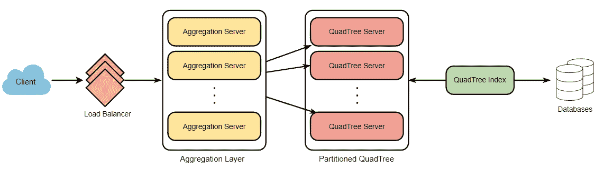

了解更多关于 [**设计 Yelp 或附近的朋友**](https://designgurus.org/path-player?courseid=grokking-the-system-design-interview&unit=grokking-the-system-design-interview_1626970328123_10Unit) **。**

# 12.设计票主

设计一个在线售票系统，像 Ticketmaster 或 BookMyShow 一样出售电影票

**功能需求:**

1.  我们的订票服务应该能够列出其附属影院所在的不同城市。
2.  一旦用户选择了城市，该服务应该显示在该特定城市发行的电影。
3.  一旦用户选择了一部电影，该服务将显示播放该电影的电影院及其可用的放映时间。
4.  用户应该能够选择一个特定的电影院放映，并预订他们的门票。
5.  该服务应该能够向用户显示电影院大厅的座位安排。用户应该能够根据自己的喜好选择多个座位。
6.  用户应该能够区分已预订的座位和可预订的座位。
7.  用户应该能够在付款完成预订之前保留座位五分钟。
8.  如果座位有机会变得可用，例如当其他用户的保留到期时，用户应该能够等待。
9.  应该以公平、先到先得的方式为等候的顾客服务。

**非功能性需求:**

1.  该系统需要高度并发。在任何特定的时间点，对于同一个座位都会有多个预订请求。服务应该优雅而公平地处理这个问题。
2.  服务的核心是订票，也就是金融交易。这意味着系统应该是安全的，数据库应该是 ACID 兼容的。

## 高级解决方案

在高层次上，我们的 web 服务器将管理用户的会话，应用服务器将处理所有的门票管理，将数据存储在数据库中，并与缓存服务器一起处理预订。

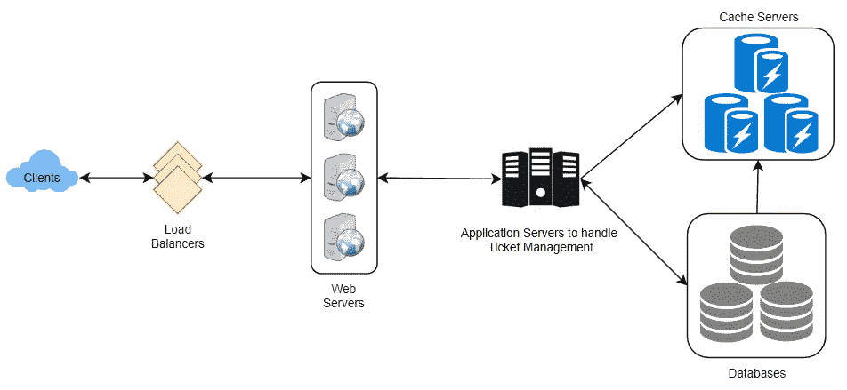

了解更多关于 [**设计 Ticketmaster**](https://designgurus.org/path-player?courseid=grokking-the-system-design-interview&unit=grokking-the-system-design-interview_1626970362841_12Unit) **的信息。**

# 从这里去哪里？

➡练习这些问题是为了让自己与众不同！

➡在“ [**钻研系统设计面试**](https://designgurus.org/course/grokking-the-system-design-interview)**”****[**钻研高级系统设计面试**](https://designgurus.org/course/grokking-the-advanced-system-design-interview) 中了解到更多关于这些问题的信息**

**➡在 Linkedin 上关注我，了解系统设计和编码面试的技巧。**

** [## 系统设计面试生存指南(2023):准备策略和实用技巧

### 2023 年系统设计面试剧本。

levelup.gitconnected.com](https://levelup.gitconnected.com/system-design-interview-survival-guide-2023-preparation-strategies-and-practical-tips-ba9314e6b9e3)** 

# **感谢阅读**

*   **👏请为这个故事鼓掌，然后跟我来👉**
*   **📰查看更多关于[编码和系统设计访谈](https://arslan-ahmad.medium.com/)的内容**
*   **🔔关注我:[LinkedIn](https://www.linkedin.com/in/arslanahmad/)|[Twitter](https://twitter.com/arslan_ah)|[时事通讯](https://designgurus.org/interview-noodle-page)**