# 2023 年 NFT 14 大营销机构

> 原文：<https://medium.com/geekculture/top-14-nft-marketing-agencies-for-2023-bbb9093163f1?source=collection_archive---------12----------------------->

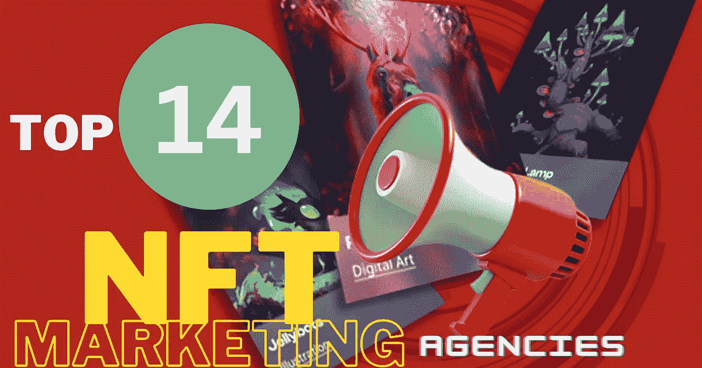

除非你住在山洞里，否则你不会知道 NFT 的巨大成功。价值数十亿美元的 NFT 市场和 NFT 销售额多年来呈指数增长，而且没有任何迹象表明会很快放缓步伐。为了利用蓬勃发展的 NFT 趋势，脸书、HBO、Instagram 和阿迪达斯等市场领导者已经加入了 NFT 市场。

一个人可能拥有一个 NFT 项目，这个项目很有可能成为继 Beeple 之后的下一个大事件，但是你必须永远不要忘记一件事——“你在这场比赛中并不孤单。”寻求有经验的 [**NFT 营销机构**](https://www.infiniteblocktech.com/nft-marketing?utm_source=medium&utm_medium=geekculture-24-11-2022&utm_campaign=muralidharan.g) 的指导，让你不必在需要修改的方法上浪费额外的钱。仍然需要澄清如何有效地宣传你的 NFTs？

你的担心今天结束了，我的朋友。这里有一个指南，将启发你对顶级的 NFT 营销机构，确保你的 NFT 项目保证结果。让我们马上开始吧。

## **NFTs——快速纲要**

近年来，技术进步以惊人的速度复苏。区块链技术是最近获得巨大声誉的主要领域之一。这项技术不仅局限于加密货币，还将其支持扩展到另一场更引人注目的数字革命——NFT。

不可替换的代币可以被描述为利用区块链技术创建的数字艺术品。非功能性思维是独一无二的表征，每一种都显示出独特的能力和特质。NFT 的独特之处在于它不能被另一个相似的物体复制。

众多的数字资产，包括艺术品、音乐、迷因、图像、gif 等。，可以被铸造成 NFT，并在一个被称为 NFT 市场的分散数字平台上进行交易。n 个企业家和多个社区以他们独特的资产进入了 NFT 领域，使得市场更加拥挤。

## **NFT 营销——NFT 项目的主要炒作因素**

最近，我们目睹了许多 NFT 项目被创造性地推销，并以巨额利润出售。一个需要更好的视野和曝光度的 NFT 项目，可能会在一个充斥着竞争对手的市场中茁壮成长。

让一个人的 NFT 项目在全球传播的主要标志是它如何被推广到目标受众。在 NFT 领域，骚动变得更加激烈，为了领导它，他们必须有一个适当的促销策略，带来更好的结果。这就是 NFT 营销在图片中的作用。

NFT 创作者必须有一个稳定的在线存在，这可能会增加他们的目标观众对项目的炒作水平。真正的任务是让你的 NFT 项目或系列从竞争者中脱颖而出。你猜怎么着答案很简单。你所需要做的就是投资 NFT 促销活动。

因此，NFT 营销活动必须进行最大的关注。该活动必须通过社交媒体渠道、影响者合作等方式显著增加 NFT 的需求。

通过这样做，你的项目的成功概率得到提高，它到达正确的观众群，建立其忠实的社区基础，并最终最大化 NFT 销售比率。

## NFT 营销机构的角色是什么？

同样，数字营销和 NFT 营销也需要许多有前途的策略，可以推动你的 NFT 项目走向成功之路。

一家领先的 NFT 营销服务公司拥有高素质的营销专业人员和无可挑剔的专业知识，提出了各种 NFT 营销策略，可以让你的 NFT 项目病毒式传播。

凭借他们在营销领域的专业知识，他们知道推广 NFT 项目的来龙去脉。他们精确定位理想的营销策略，完全有利于潜在客户的产生。

以下是一家理想的 NFT 营销机构为提高您的项目在市场上的可信度和曝光率而提供的最佳 NFT 营销策略:

*   公关营销
*   社区营销
*   搜索引擎优化
*   内容营销
*   视频营销
*   付费广告
*   电子邮件营销
*   直播带货
*   社交媒体营销
*   联盟营销

## **14 大 NFT 营销机构帮助您提升 NFT 销售额**

"如何找到最好的 NFT 营销机构？"是一个常见而又有效的问题。以下是排名前 13 位的 NFT 营销机构的名单，这些机构凭借其先进和成功的 NFT 营销服务在市场上显示出完全的主导地位。我们开始吧:

## **#1** [**无限闭塞技术**](https://www.infiniteblocktech.com/nft-marketing?utm_source=medium&utm_medium=geekculture-24-11-2022&utm_campaign=muralidharan.g)

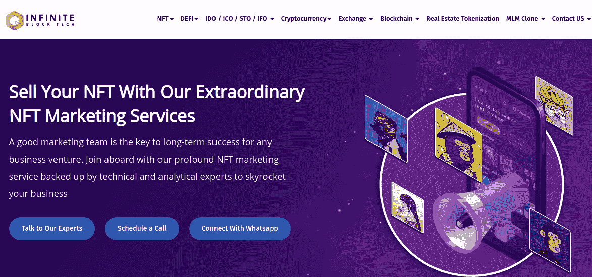

Infinite Block Tech 是一家成功的 NFT 营销机构，在市场上赢得了良好的声誉。凭借其完成成功项目的良好记录，该公司在这份名单中占据了突出的位置。

Infinite Block Tech 由一个专注的 NFT 营销专家团队组成，他们支持 NFT 创作者和加密企业家(客户)利用其尖端的 NFT 营销策略在全球范围内营销其有价值的 NFT 项目。

他们提供一整套营销服务，包括构思、市场分析、启发你的目标受众，以及实施有利于你的项目或系列的最佳策略。

此外，他们还为 NFT 品牌设计了一个清晰的计划，以可靠的方式确立其在市场中的地位。该机构提供的一些最佳策略有——社交媒体营销、影响者营销、内容营销等。

## **# 2**[AppDupe](https://www.appdupe.com/nft-marketing-services)

如果你正在寻找一家蓬勃发展的 NFT 营销公司，它可以通过以结果为导向的营销活动和战略来推动销售，那么 Appdupe 是一个在任何时候都不能忽视的名字。

该机构致力于开发 NFT 营销战略，帮助其客户(NFT 创作者)在 NFT 的成功阶梯上攀升，并吸引潜在观众。

为了接触到目标受众并最大限度地提高 NFT 的销售额，该机构的营销策划人员创造了创新的营销策略，这些策略是当今流行的。他们努力通过提高网站流量和转化率来推动你在 NFT 的业务。

## **#3** [**区块链 App 工厂**](https://www.blockchainappfactory.com/nft-marketing-services)

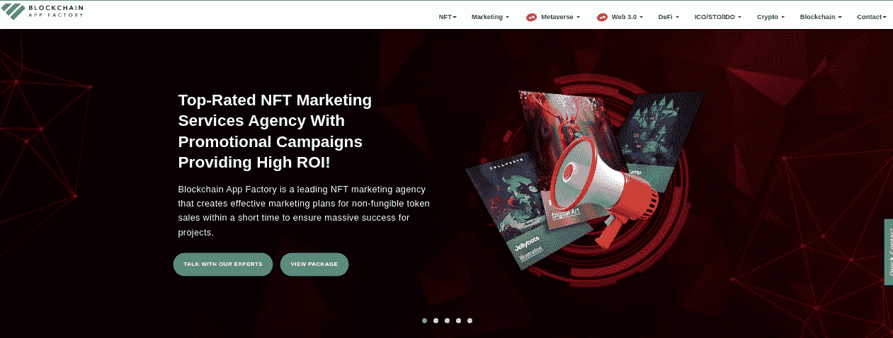

区块链应用工厂是这份名单上最著名的 NFT 营销公司之一。它在国内外完成了许多项目。

区块链应用工厂可以成为更好的选择，通过尖端的数字营销活动高效地接触到你的目标受众并为你的企业做广告。

从了解你的项目的根源开始，并制定一个完美的阅读来将计划付诸行动，该公司为其客户提供全面的支持。

## **# 4**[**INORU**](https://www.inoru.com/nft-marketing-services)

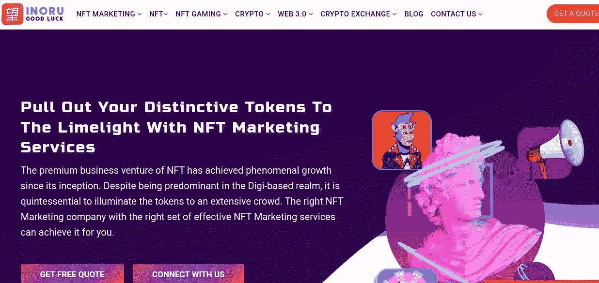

INORU 最出名的是以合理的价格向客户提供尖端的营销策略。通过强调三个关键要素——热情的分析方法、全渠道程序和彻底的战略实施——它在短时间内成为了最好的 NFT 营销服务提供商之一。

该公司彻底检查市场，控制整个营销方法，并保证你的 NFT 项目百分之百成功。

他们的营销资源将提高你向目标受众推销 NFT 系列的能力。他们的服务包括社交媒体营销、电子邮件营销、公关营销、Discord 社区营销等。

## **# 5**[**chain cella**](https://www.chaincella.com/nft-marketing-service)

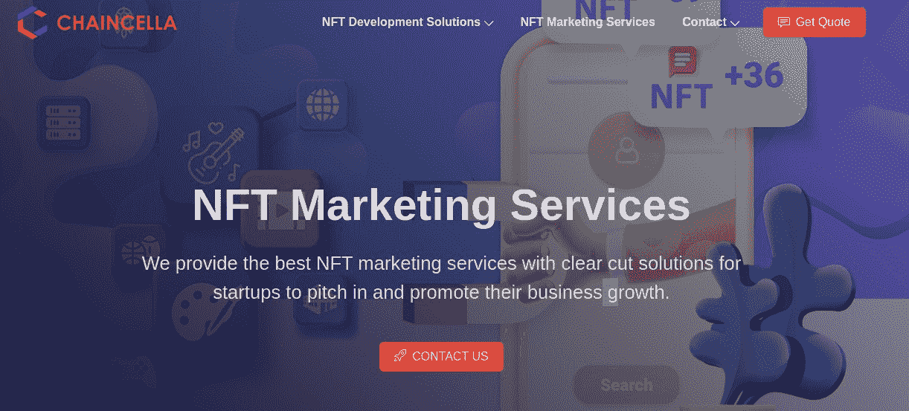

Chaincella 是一家市场领先的 NFT 营销机构，通过提供完整的端到端 NFT 营销服务来满足其客户的目标。该机构在推广 NFTs 方面有着绝对的优势，其熟练的营销团队会帮助您提高营销水平，使您的 NFT 项目吸引正确的受众。

他们简单的方法将提高你的 NFT 项目在市场上的知名度。他们特别强调社交媒体广告、公共关系、内容营销、组织与影响者的互动会议、电子邮件营销以及其他优秀的营销服务。

## ****

****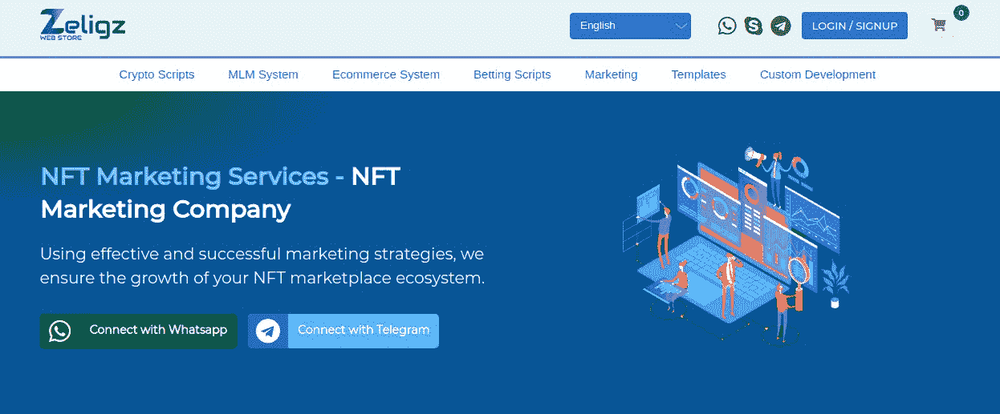****

****Zelig 因其客户的 NFT 项目采用成功的营销阶段并取得最佳效果而闻名。****

****该机构的营销人员想出了最好的和最可靠的营销策略，最终使 NFT 项目迅速达到他们的曝光水平更快。****

****事实证明，他们独特的营销方式很快就在竞争中脱颖而出。他们的工作方式将提供优质的服务，并导致将你推向市场顶端的结果。****

## ******# 7******

******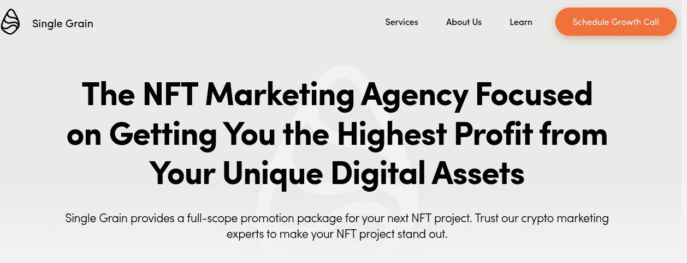******

******作为一家提供全方位服务的数字营销机构，Single Grain 已经扩展到 NFT 营销领域。他们使用独特的数据驱动战略进行 NFT 营销，产生由准确数据支持的结果。******

******此外，他们还根据客户的业务需求来策划期望的结果。随着正确营销策略的完美实施和执行，该公司在 2022 年获得了全球观众的关注。******

## ********#8** [**众筹**](https://crowdcreate.us/blockchain-marketing-agency/)******

****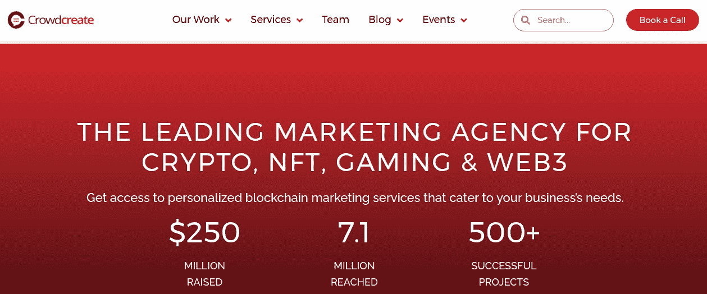****

****通过与著名的 NFT 营销机构 Crowdcreate 合作，你可能会接触到一些顶级的 NFT 影响者、思想领袖和投资者。该公司提供的服务包括 Web3 营销、NFT 咨询、加密投资者营销和加密影响者营销。****

****他们的营销策略与众不同，目标明确。他们将首先与有影响力的人建立联系，并传播你的 NFT。公司的营销团队分享了他们的想法和策略，当你向他们推销你的 NFT 时，他们会保护业务。他们有各种各样的想法来改善你的 NFT 创业，从内容营销到影响者营销。****

## ******# 9**[**CryptoPR**](https://cryptopr.com/nft-marketing/)****

****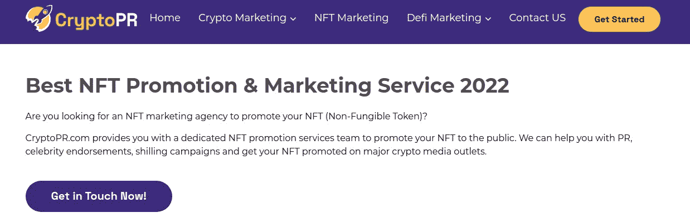****

****CryptoPR 是 NFT 顶级营销机构，拥有高素质的营销人员，为客户提供无与伦比的 NFT 营销服务。他们提供的一些突出的服务是——社交媒体活动、影响者营销、名人代言、先令活动和公关。即使你是这个行业的新手，该公司概述了他们的目标是如何推动你的 NFT 项目或集合的流量，让你在整个过程中保持更新。****

## ******# 10**[**Meta Mint**](https://meta-mint.io/dashboard)****

****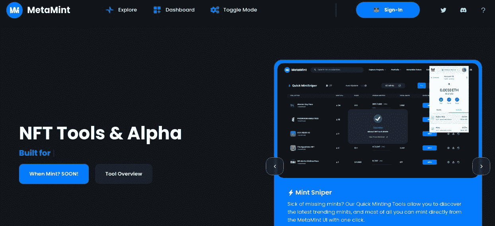****

****Meta Mint 作为第一家由女性拥有的 NFT 营销机构而为数字人所熟知，它提供广泛的服务，包括影响者营销、不和谐营销、电报营销和社交媒体营销。他们的 360 度全方位营销服务提高了您的企业在拥挤的市场中的盈利能力。他们更具体地提供最佳营销服务，使您的 NFT 项目在竞争生态系统中成为明显的赢家。****

## ******# 11**T8**NinjaPromo******

****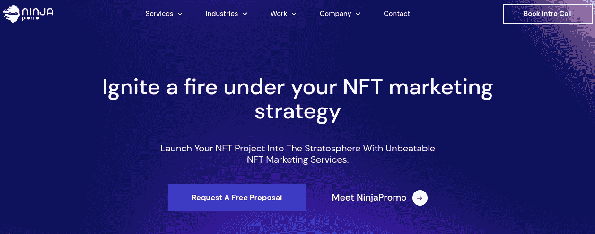****

****NinjaPromo 于 2017 年进入营销领域，由一支营销高手团队组成，他们为区块链、金融科技、加密货币和 B2B 领域提供广泛的营销服务。他们准备通过电子邮件营销、付费社交媒体或有机社交媒体促销等策略来帮助你扩大 NFT 的影响力。因此，他们先进的营销策略增加了您在残酷竞争市场中的业务知名度。****

## ******#12** [**杂格**](https://zage.io/)****

****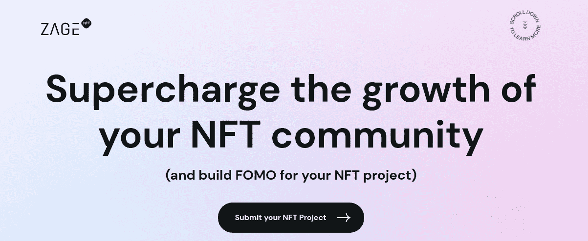****

****Zage 是另一家著名的 NFT 营销机构，拥有强大的活动组合，这使其在其他顶级营销机构中保持领先地位。凭借可承受的价格结构，该机构提供了适合其客户业务需求的最佳策略。他们首先投资时间，彻底了解你的业务的细微差别，然后据此制定完美的营销策略，以提高你的 NFT 的成功率。****

## ******# 13**[**neo reach**](https://neoreach.com/crypto/)****

****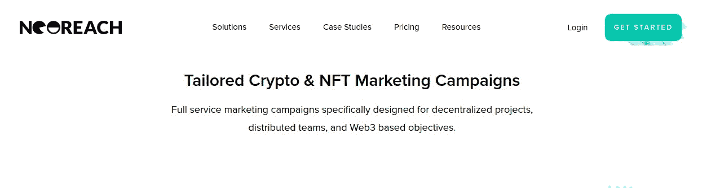****

****NeoReach 是一家领先的 NFT 营销机构，全力提供顶级的推广服务。该公司擅长与远程团队一起宣传各种分散的项目，并为其客户实现基于 Web3 的目标。该机构可以利用其现有资源和技术能力锁定区块链的主要受众。它提供了一整套从概念到实施的 NFT 营销解决方案。****

## ************

******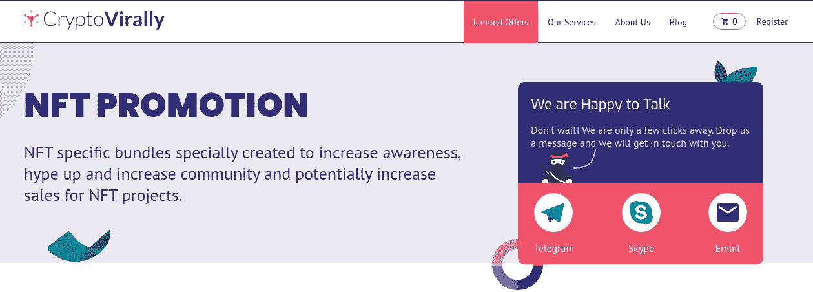******

******为了帮助企业消除成功的障碍，CryptoVirally 向其客户提供高质量的营销服务。该公司巧妙地利用公共关系和品牌认知度在全球范围内推销你的 NFT 资产。几家知名媒体都强调了 CryptoVirally 针对不同 NFT 应用的整体交钥匙解决方案。该机构使用现代营销策略，尤其是影响者、在线出版物和社交媒体平台。******

## ******光荣地开始吧！！！******

******希望您对市场上表现最佳的 NFT 营销机构有所了解。您可以与这些机构合作，随时解决您的疑问。做一个完整的市场研究，与最好的 NFT 营销人员交往，消除促销障碍。既然 NFT 热还在继续，现在就开始宣传你的 NFTs 吧。******