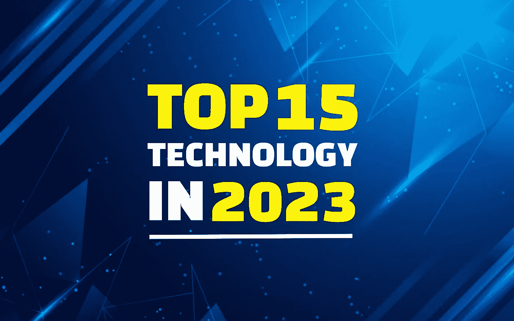
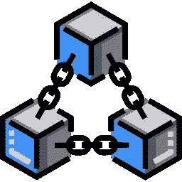
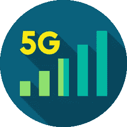
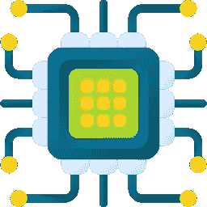
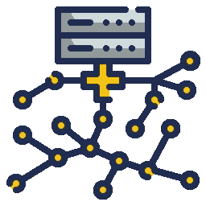
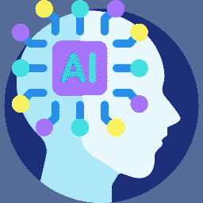
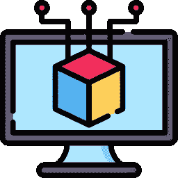
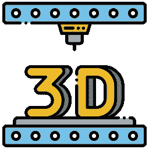
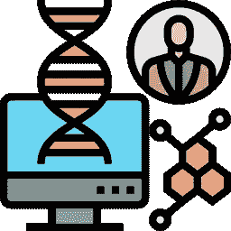
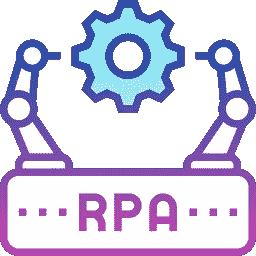

# 15 大新技术趋势主宰 2023 年

> 原文：<https://medium.com/geekculture/top-15-new-technology-trends-rule-the-2023-f25ddff23f5d?source=collection_archive---------5----------------------->

Top 15 New Technology Trends for 2023

技术继续统治着世界。它让数百万企业繁荣起来。每天新技术的使用增加了每个企业的工作方式，并使人们选择一些基于技术的及时发展。年复一年，新技术层出不穷。这就是世界充满致命创新的原因。 [**技术也进入了未来，在那里人们开始使用化身**](https://bit.ly/3yrGTpJ) 生活。即使是去中心化的互联网体系，也是建立在技术创新的基础上的。所以，要确定技术是这个现代世界中任何新尝试的唯一原因。

让我们看看 2023 年的技术趋势会产生什么影响。

# **2023 年需要关注的顶级技术趋势**

## **1。** [**区块链**](https://bit.ly/3rIAXVz)

Blockchain

区块链是一个安全的地方，在这里您可以安全地存储任何形式的数据。它类似于银行账户中的资金，资金放在里面永远不会丢失或被盗。存储在这种链中的信息不能被更改或删除。区块链也是共识驱动的，这意味着没有一个组织可以控制数据。它不需要可靠的第三方来监督或验证交易。

## **2。5G 网络**

5G Network

5G 技术是可能改变人们生活的最新进展，也是移动硬件的最新操作标准。它的特点包括更快的数据速度、低延迟通信和更高的移动设备数据上限。由于它扩展了移动频谱，使其频率越来越低，5G 网络可以处理更高的带宽。

## **3。虚拟现实和增强现实**

Virtual Reality and Augmented Reality

市场一直在快速增长，随着欢迎人们进入竞争激烈的领域的趋势，创造了新的机会。虚拟现实(VR)、增强现实(AR)和扩展现实(ER)是即将到来的突出技术趋势。AR 改善环境的同时，VR 让用户沉浸其中。

## **4。计算能力**

Computing Power

由于数字时代的每一个电器和设备都是计算机化的，计算能力已经巩固了它在世界范围内的地位。此外，数据科学专家预测，目前正在开发的计算基础设施将在未来几年内得到改善，因此它将继续存在。

## **5。智能设备**

Smarter Devices

总是需要智能软件应用程序来使您的工作生活更易于管理。然而，这些设备是 IT 部门的又一大需求。这是因为更多的企业正在进入数字领域。

## **6。量子计算**

Quantum Computing

接下来值得注意的技术发展是量子计算，这是一种利用叠加和量子纠缠等量子现象的计算。无论来源如何，它都可以轻松地查询、监控、分析和处理数据。它还用于银行和金融行业的高频交易、管理信用风险和发现欺诈。

## **7。数据化**

Datafication

我们生活中的一切都被“数据化”或转换成由数据驱动的软件或设备。换句话说，就是手工劳动向数据驱动技术的转变。然而，从智能手机到人工智能驱动的电器，再到工业机械和办公软件，数据存在的时间将比我们记忆中的长得多。因此，安全可靠地维护数据已经成为经济领域中一个受欢迎的专业。

## **8。人工智能和机器学习**

Artificial Intelligence and Machine Learning

尽管人工智能(或称 AI)在过去十年里引起了很多热议，但它仍然是最新的技术趋势之一，因为它对我们生活、工作和娱乐方式的影响才刚刚开始被感受到。人工智能因其在许多领域的优势而闻名，包括乘车共享应用程序、智能手机个人助理、图像和语音识别、导航应用程序等。

## **9。扩展现实**

Extended Reality

虚拟现实、增强现实、混合现实和所有其他模拟现实的技术统称为“扩展现实”。目前这是一个重要的趋势，因为他们渴望超越所谓的世界真实边界。这项技术创造了一个没有任何物理存在的现实，受到游戏玩家、医疗专业人员、零售和建模专业人员的欢迎。

## **10。数字信托**

Digital Trust

另一个将刺激更多创新的重要趋势是数字信任。数字信念是指技术可以创造一个安全、可靠的数字世界，允许企业创新，而不必担心维护公众的信任。

## **11。3D 打印**

3D Printing

使用 3D 打印来创建原型是创新和技术的一个重要趋势。工业和生物医学领域已经感受到了这种影响。我们从来没有考虑过用打印机打印一个真实的物体，但今天这是可能的。因此，3D 打印是一项将会持续的进一步创新。对于医疗保健和数据行业的企业来说，这是一个重要因素，因为 3D 打印机需要打印他们的产品。

## **12。基因组学**

Genomics

基因组学是一种用于研究你的 DNA 并通过治疗任何疾病来改善你的健康的技术。它可以帮助量化你的基因，并导致发现以后可能成为健康问题的条件或其他潜在问题。

## **13。新能源解决方案**

New Energy Solutions

为了地球生态系统的利益和消耗的能源，每个人都同意走绿色之路。因此，家庭使用更绿色的选择，如太阳能和可再生能源，汽车依靠电力或电池运行。

## **14。机器人过程自动化(RPA)**

Robotic Process Automation (RPA)

机器人过程自动化(RPA)是一种自动化人工智能和机器学习工作的技术。它是指使用软件来自动化业务流程，包括应用程序解释、交易处理、数据处理，甚至电子邮件回复。

## **15。边缘计算**

Edge Computing

随着组织处理越来越多的数据，他们越来越意识到云计算的局限性。边缘计算的工作原理是绕过云计算的延迟，将数据直接传输到数据中心进行处理。

## **结论**

技术是巨大的，而且随着人们每天尝试新技术以保持在潮流的顶端，技术已经变得越来越高。所以，成为即将到来的趋势的一部分，进入 Web3。为了简化你的生活，你可以通过数字化你想要的一切开始在元宇宙生活。