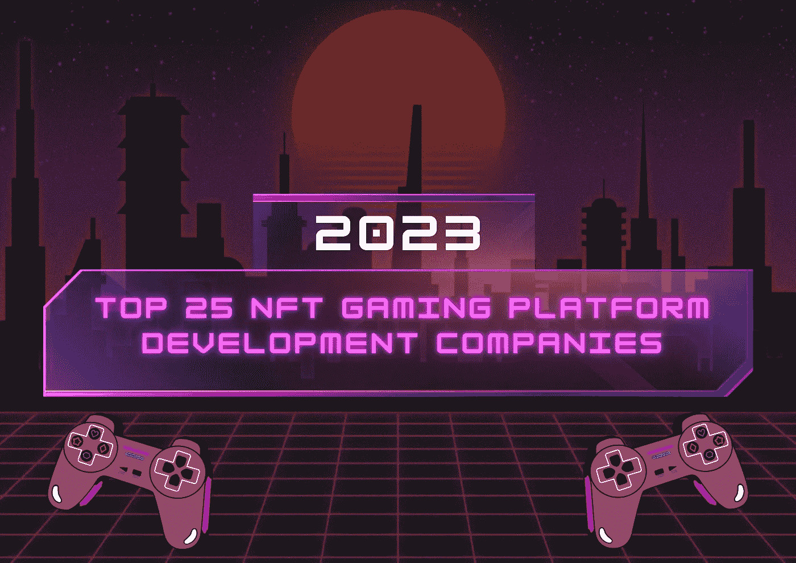

# 2023 年 NFT 游戏平台开发公司 25 强

> 原文：<https://medium.com/geekculture/top-25-nft-gaming-platform-development-companies-2023-a7b7c3048850?source=collection_archive---------17----------------------->

在游戏迷的世界里，玩游戏一直是令人兴奋的冒险。随着游戏模式的创新突破，web 3、区块链技术和其他技术娴熟的游戏应用程序的吸收促进了 NFT 游戏平台的发展，该平台拥有广泛而活跃的粉丝群。

也就是说，最近， [**NFT 游戏平台开发**](https://www.turnkeytown.com/nft-gaming-platform-development) 已经成为几位 NFT 商业企业家和初创公司的热门商业风险投资。因此，让我们深入 NFT 游戏平台开发公司前 25 名的名单，并找出如何才能在这一商业冒险中留下印记。

**为什么开发 NFT 游戏平台成为潮流？**

NFT 的游戏平台允许玩家在同一个地方玩游戏和赚钱。(即)当玩家在 NFT 游戏平台中游戏时，它给予他们获得游戏内资产的特权。这些游戏中的资产是有价值的，可以和其他玩家进行交易。也就是说，有助于 NFT 博彩业发展的一些因素包括

*   游戏玩家对游戏内资产的真实所有权，
*   通过分散的网络与游戏伙伴轻松交换游戏中的资产，
*   游戏赚取模式，让玩家在玩游戏时赚取。

所有这些因素使得区块链游戏开发成为一个时髦的商业目标。今天，我们有几家 NFT 游戏平台开发公司为 NFT 游戏企业提供最好的、卓越的服务和可定制的解决方案。

所以，让我们来看看 NFT 顶级游戏平台开发公司的名单。

**NFT 游戏平台开发公司 25 强**

1.  [**交钥匙城镇**](https://www.turnkeytown.com/nft-gaming-platform-development)

Turnkey Town 是世界上最好的 NFT 游戏平台开发公司之一，拥有超过 5 年从事区块链和分散金融等发展中技术的工作记录。

他们为客户提供智能和可定制的游戏解决方案，并在多个游戏开发项目中为客户提供帮助，如区块链游戏开发、游戏资产开发和克隆解决方案，用于推出类似于 crypto kitties、Axie Infinity 等著名游戏平台的 NFT 游戏平台。

他们的一些最显著的 NFT 游戏开发服务包括可定制的游戏解决方案，如冒险游戏、街机游戏、棋盘游戏等。

Turnkey Town 拥有一支由 150 多名专业设计师和营销人员组成的开发团队，能够为客户提供出色的游戏平台。

**2。** [**AppDupe**](https://www.appdupe.com/nft-gaming-development)

AppDupe 从事从区块链开发到游戏平台开发的多个加密项目，专门帮助 NFT 企业推出激动人心的 NFT 游戏平台。他们的一些服务围绕白色标签 NFT 游戏软件解决方案，P2E NFT 游戏开发，游戏内资产的令牌化服务，特别版收藏品等。

他们的可定制游戏开发解决方案专注于在动作和冒险游戏、街机游戏、桌游、PvP 对战游戏等领域设计时尚的 NFT 游戏平台。

**3。INORU**

凭借对 NFT 游戏开发的直观观点，INORU 为每个人提供了几种基于区块链的游戏解决方案。他们的一些杰出服务包括

*   战斗游戏、幻想体育、赛车游戏、角色扮演游戏等的 NFT 游戏模型解决方案。
*   可定制的白牌游戏解决方案
*   即玩即赚游戏解决方案，
*   克隆解决方案等。

INORU 拥有一支经验丰富的团队，是游戏世界中最好的 NFT 游戏平台开发公司之一。

**4。区块链 App 工厂**

Blockchain App factory 的使命是为 web 3 领域的广大客户群提供一流的 web 3 服务，它致力于几个游戏保真应用程序。

也就是说，他们已经在游戏行业积累了超过 7 年的经验，他们的服务围绕以下游戏领域:

Web2 到 Web3 游戏开发、可定制的游戏-fi 模型游戏解决方案、NFT 游戏市场开发等。

**5。无限块技术**

Infinite Block Tech 是一家领先的区块链游戏开发公司，拥有一支技术高超的开发团队。他们根据客户的要求，通过一系列步骤定制 NFT 游戏解决方案，包括头脑风暴会议、目标装置、概念创建、编码和开发、软件测试运行和 NFT 游戏部署。他们的一些 NFT 游戏开发服务是可定制的游戏内虚拟资产，用于模拟游戏、冒险游戏、纸牌游戏等的 NFT。

**6。加密货币兑换脚本**

作为加密世界中最成功的区块链开发公司之一，Cryptocurrency Exchange Script 为基于技术的初创公司、企业主和 NFT 游戏企业提供了几种专业的 web 3 解决方案。也就是说，他们的一些典型的 NFT 游戏开发服务围绕着游戏赚钱、游戏内资产创造和区块链游戏开发。

**7。Chaincella**

Chaincella 是 NFT 最著名的游戏平台开发公司之一，致力于与当前区块链游戏发展趋势保持同步。

由经验丰富的开发团队提供支持，他们提供的一些游戏解决方案包括

*   动作、赛车、卡牌游戏等游戏开发解决方案。
*   为 Axie Infinity、Splinterlands、Crypto kitties 等著名的 NFT 游戏平台提供白标解决方案。
*   基于区块链的游戏平台开发服务等。

**8。九赫兹**

NineHertz 是最好的 IT 咨询公司之一，他们专门为各种领域提供数字解决方案，如移动应用程序开发、游戏开发、区块链游戏开发、web 开发等。

凭借在 100 多个游戏项目上的出色表现，他们的游戏开发团队在 NFT 游戏概念设计、游戏赚取游戏开发、NFT 代币、收藏品创作、定制 NFT 游戏平台等方面拥有专业知识。

**9。Suffercom 解决方案**

作为区块链领先的开发公司之一，Suffercom solutions 在 web 3 领域提供广泛的服务，如 NFT、加密、dApps 和区块链。他们的使命是为客户提供创新和经济高效的解决方案，他们为 NFT 游戏平台开发提供的一些专业服务包括 P2E 游戏开发、元宇宙游戏开发、区块链游戏开发等。

**10。QuyTech**

Quy Technology 成立于 2010 年，是 NFT 最好的游戏平台开发公司之一，在移动应用程序开发、移动 UI/UX 设计、游戏开发、区块链开发和许多其他技术领域提供多种服务。

Quy Tech 拥有 200 多名具有专业经验的开发人员，从事 1000 多个项目，专门从事分散式游戏平台开发，其 NFT 游戏开发服务包括

游戏模型解决方案、游戏资产设计、概念艺术、3D 建模和装配等。

他们还为冒险游戏、动作游戏、开放世界游戏等提供可定制的 NFT 游戏平台开发。

11。Kevuru 游戏

凭借 10 年的技术专业知识和对区块链游戏开发的新潮方法，Kevuru games 利用其尖端的工具和见解帮助开发者和公司建立**NFT 游戏平台。一些值得注意的游戏服务横跨全周期 NFT 游戏开发、游戏内资产创建、游戏概念创建以及维护和支持。**

****12。Juego 工作室****

**Juego Studio 在游戏平台开发项目方面堪称典范，在区块链游戏开发、NFT 游戏、web3 游戏开发、元宇宙游戏开发等领域拥有出色的工作组合。他们提供的一些游戏开发服务包括 NFT P2E 游戏开发服务、PvP 游戏、NFT RPG 游戏、NFT 纸牌和赌场游戏等。**

**13。搞怪游戏**

**以提供高度专业的游戏开发服务为使命，奇思妙想游戏是一家游戏开发公司，拥有令人印象深刻的产品组合和丰富的游戏开发经验。从传统游戏开发到今天的 NFT 游戏平台开发，他们为以下领域提供了广泛的解决方案**

**代币开发，可定制的 NFT 游戏，NFT 概念游戏等。**

****14。安泰尔解决方案****

**Antier Solutions 是 NFT 最好的游戏开发公司之一，采用设计驱动的方法在区块链、加密和其他几个技术领域提供各种服务。**

**也就是说，他们有超过 10 年与 web 3 公司合作的经验记录。他们的 NFT 游戏开发服务围绕着开发、推广和管理 NFT 游戏平台。他们的一些 NFT 游戏开发服务包括游戏赚取游戏开发和其他游戏 fi 模型游戏，加密育种游戏开发，基于策略的游戏开发等。**

****15。游戏王牌****

**游戏王牌是最熟练的 NFT 游戏平台开发公司之一。凭借超过 13 年的游戏开发项目经验，他们的游戏开发团队通过以下服务帮助 NFT 游戏公司进军游戏保真世界。**

*   **全周期 NFT 游戏开发，**
*   **可定制的 NFT 游戏平台开发解决方案，**
*   **建立便携式设备 NFT 游戏平台等。**

**16。红苹果科技**

**RedApple Tech 是一家游戏开发公司，在提供多个 web3 解决方案方面拥有超过 11 年的经验，参与了 500 多个项目。在一个高度熟练的开发团队的帮助下，他们的 NFT 游戏开发服务专注于为客户创造时尚和令人兴奋的 NFT 游戏。**

**也就是说，他们专注于开发、推广和管理客户的游戏项目。**

****17。比特交易****

**Bitdeal 是 NFT 顶级游戏平台开发公司之一，其使命是在 NFTs、Defi、DAO、和区块链技术等各个领域为加密创业者提供最佳服务。在为客户提供定制游戏开发解决方案的专业团队的支持下，他们提供的一些服务包括**

*   **NFT 游戏克隆脚本，**
*   **用于动作和冒险游戏、棋盘游戏、赛车游戏等的 NFTs。,**
*   **白牌 NFT 游戏开发等。**

**18。阿尔温**

**Alwin 在区块链开发领域有着 5 年的丰富经验，它提供了从令牌开发到基于加密的服务等多种 web 3 服务。也就是说，他们的游戏开发服务专注于区块链游戏开发。**

****19。延长期****

**Prolitus 是 NFT 最好的游戏平台开发公司之一，擅长于几个基于加密的领域，如区块链、加密货币、区块链咨询等。凭借面向 NFT 游戏开发的创新方法，他们为 NFT 游戏公司提供多种服务，以利用游戏行业的尖端工具和最新趋势来推出激动人心的 NFT 游戏平台。他们的服务侧重于游戏 NFT 令牌化和设施，以高安全性和透明度交易游戏中的资产。**

****20。Maticz****

**Maticz 专注于在区块链开发、Defi staking 平台开发、dApps 等不同领域提供多种 IT 解决方案和软件服务。也就是说，凭借创新的设计方法和专业知识，他们提供了几个 NFT 游戏平台开发。**

****21。上升最大值****

**RisingMax 是领先的移动应用程序开发公司之一，专注于为各种领域的大中型企业提供定制解决方案，如 web 开发、AI 聊天解决方案、CMS 开发等。**

**他们的 NFT 游戏开发解决方案专注于基于角色的游戏开发、M2E 游戏开发、P2E 游戏开发等。,**

****22。区块链技术****

**Blockchainx Tech 是加密世界中最顶级的区块链开发公司之一。它专门为各行各业的商务人士定制区块链发展解决方案。凭借一支由经验丰富的开发人员和设计人员组成的技术团队，他们提供的一些游戏开发解决方案如下。**

*   **NFT 概念游戏开发，**
*   **面向移动用户的 NFT 游戏开发，**
*   **NFT 游戏创作等**

****23。奥兹科技公司****

**受为加密企业家提供无缝 web 3 服务的使命的启发，Osiz Technologies 是最专业的 NFT 游戏开发公司之一。**

**他们的服务旨在为 M2E 游戏带来去中心化的游戏生态系统。**

****24。索夫斯特****

**Sofster 在为不同行业的公司提供 web 解决方案方面拥有超过 12 年的专业知识和经验，能够提供无缝的下一代 NFT 游戏开发服务。也就是说，他们的一些游戏服务围绕区块链游戏平台开发、NFT 游戏市场开发，以及针对冒险游戏、棋盘游戏、动作游戏等的可定制游戏解决方案。,**

****25。Shamla 技术解决方案****

**Shamla Tech solutions 是 NFT 最好的游戏开发公司之一，其使命是满足提供顶级加密服务的全球标准。**

**结合尖端技术和经验丰富的专业人员，他们提供的游戏平台开发服务包括**

**NFT 游戏市场开发、区块链游戏平台开发和 NFT 游戏开发服务。**

**现在，这些是加密世界中排名前 25 位的 NFT 游戏平台开发公司，准备好接受各种具有挑战性的游戏开发项目来帮助 NFT 企业。**

****结论****

**也就是说，随着游戏保真模型吸引了全世界狂热游戏玩家的注意力，NFT 游戏开发充满活力，利润丰厚。然而，要在游戏行业的竞争中获胜，寻求一家 [**NFT 游戏发展公司的帮助是至关重要的。**](https://www.turnkeytown.com/nft-gaming-platform-development)**