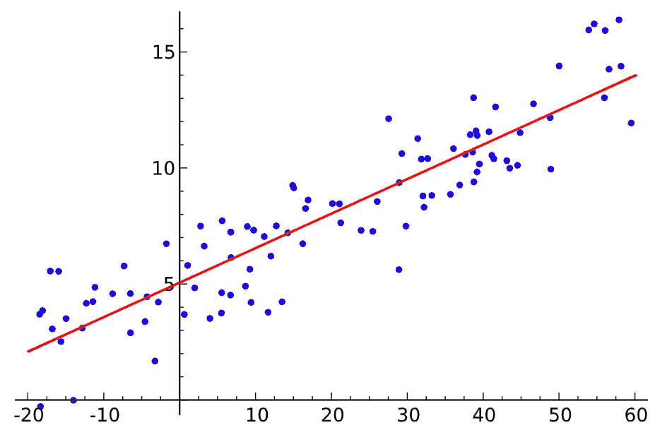
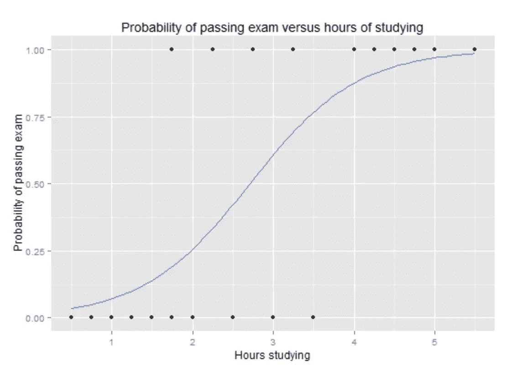
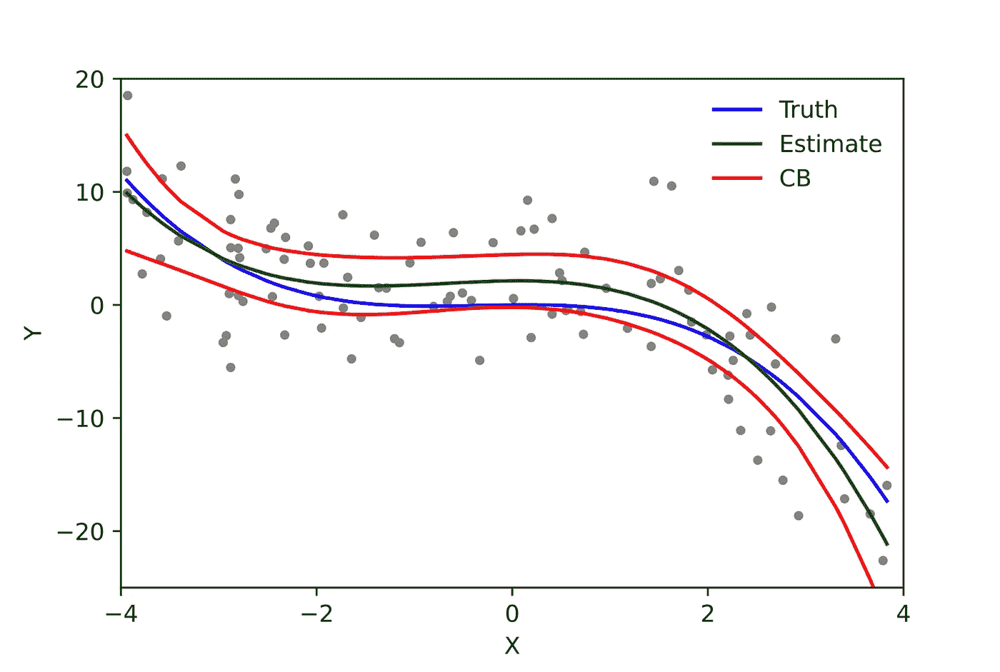
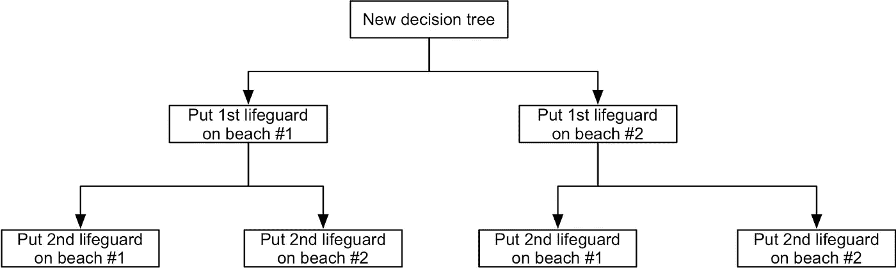

# 3 大数据科学算法

> 原文：<https://medium.com/geekculture/top-3-data-science-algorithms-520429d95d10?source=collection_archive---------18----------------------->

[Unsplash](https://unsplash.com/photos/pjAH2Ax4uWk)

有多少次你浏览一个网站，听到乒声提醒你，聊天机器人已经准备好脱口而出你甚至还没有的问题的答案？通常，利益相关者决定，因为他们的竞争对手有一个人工智能工具，他们也需要有一个。不对。例如，很有可能想要一个聊天机器人的冲动是基于本能的决定，并没有被数学真正证明。说清楚一点，这是一个典型的基于直觉而非数据的问题描述。对于拥有数据流的组织，例如软件公司、电信、电子商务等，算法在理解整个商业生态系统中起着至关重要的作用。无论是了解他们的运营、营销、技术，甚至是人力资源。

解决业务问题需要对特定问题采取整体方法。告诫在于如何解释问题，以便能够选择如何解决它。通常，公司会寻找他们认为人工智能可以解决的问题，而不是考虑他们面临的实际问题，并用正确的工具来解决它们。

世界上最杰出的人工智能领袖之一吴恩达表示，将人工智能应用到你的业务中的最佳方式是从小处着手。在最近的一次演讲中，他以自己在谷歌的经历为例，讲述了在解决广告部更大的商业问题之前，他如何使用机器学习(ML)来增加语音识别和谷歌地图的价值。

我们不会继续讨论如何解决业务问题，因为互联网上充斥着一篇又一篇分解业务流程的文章。但是我们将为您指出正确的方向，让您选择正确的算法来解决手头的业务问题。

1.  **回归算法**

# 为什么使用回归？

假设你在运营部工作。绩效取决于员工的管理方式。无论是通过激励还是过程，我们都希望根据激励来预测绩效。凭直觉，你知道业绩与你能实施的激励措施数量有关，业绩越好，收入越高。逻辑回归采用两个变量，一个因变量(收入)和一个自变量(流量)。自变量驱动因变量，因为两者之间存在某种相关性。然后，我们可以使用自变量对因变量进行预测。例如，在下面的图表中，您可以确定员工每月将获得多少收入。
‍

你可以在 Y 轴上画一条线标出答案，但在这种情况下，我们会生成一个方程，我们称之为模型，然后我们可以将自变量代入方程，找出因变量输出，我们称之为预测。

# 那么什么是回归呢？

回归是两个或多个变量之间的统计关系，其中自变量的变化与因变量的变化相关联。

# 回归的类型

# 线性回归

当因变量(连续)和自变量(连续或离散)之间存在线性关系时。

图片来源:[维基百科](https://en.wikipedia.org/wiki/Linear_regression)

# 何时使用线性回归的例子？

*   评估风险
*   做出估计
*   进行预测
*   分析活动效果

例如，一家健康保险公司可能会对每位客户的索赔额与年龄进行线性回归分析，并发现年龄较大的客户往往会提出更多的健康保险索赔。

# 逻辑回归

当图中的 Y 值本质上是分类的(是/否)并且依赖于 X 变量时。

图片来源:[维基百科](https://en.wikipedia.org/wiki/Logistic_regression)

# 何时使用逻辑回归的例子？

*   预测事件发生或做出选择的可能性
*   如果一个产品将被购买或不被购买
*   预测客户保持率
*   信用评分

# 多项式回归

当因变量 Y 和自变量 X 之间的关系是 X 的 n 次方时。如果您的数据点显然不适合线性回归(通过所有数据点的直线)，则它可能是多项式回归的理想选择。

多项式回归与线性回归一样，使用变量 x 和 y 之间的关系来寻找通过数据点绘制直线的最佳方式。

图片来源:[维基百科](https://en.wikipedia.org/wiki/Polynomial_regression)

# 何时使用多项式回归的例子？

*   它被用于许多实验程序来产生结果
*   提供自变量和因变量之间的确定关系
*   研究不同疾病在任何人群中的发病率。

——研究任何合成的生成。

1.  **决策树**

决策树是一种决策支持工具，它使用决策及其可能结果(包括偶然事件结果、资源成本和效用)的树状模型。这是显示只包含条件控制语句的算法的一种方式。

例如，如果您在一个家庭用品仓库工作，您可以使用决策树模型来决定如何组织产品货架。所以你会从沙发、椅子和桌子等一系列产品入手。决策树可以帮助你根据结果对它们进行组织，例如它们的长度是否像沙发一样长，或者它们是像椅子一样的单人座位。然后，通过用织物或颜色将它们分开，圣诞树会变得更有条理。

图片来源:[维基百科](https://en.wikipedia.org/wiki/Decision_tree)

# 何时使用决策树的例子？

*   分类
*   回归(预测公司利润)

1.  **聚类算法**

与监督学习(如预测建模)不同，聚类算法只解释输入数据，并在特征空间中找到自然组或聚类。当没有要预测的类时，而是当要将实例分成自然组时，应用聚类技术。

图片来源: [GeeksforGeeks](https://www.geeksforgeeks.org/clustering-in-machine-learning/)

# 聚类算法的类型

亲和传播

凝聚聚类

桦树

基于密度的噪声应用空间聚类

k 均值

小批量 K 均值

均值漂移

光学

谱聚类

高斯混合

# 何时使用聚类算法的示例？

*   根据集群的自然行为将集群分开，以细分市场。
*   图象分割法
*   网页分组
*   信息检索

# 如何运行机器学习算法？

通过使用 Datagran 的工具运行几乎没有代码的机器学习模型来深入研究。Datagran 将 ML 世界与商业世界结合在一起。它可以让您连接您最喜爱的应用程序，运行 ML 模型，并通过一个友好的用户界面实现工作流自动化，该界面几乎可供团队中的任何人使用。

[什么是 Datagran？](https://www.youtube.com/watch?v=6i85MGzVk0w)

[如何运行回归模型](https://blog.datagran.io/posts/how-to-run-a-regression-model)

[学习如何通过回归分析降低库存周转率](https://blog.datagran.io/posts/reduce-inventory-turnover-with-machine-learning-and-regression-analysis)

[ML 如何给多米诺披萨一个优势](https://blog.datagran.io/posts/how-machine-learning-in-intercom-gives-dominos-pizza-an-edge)