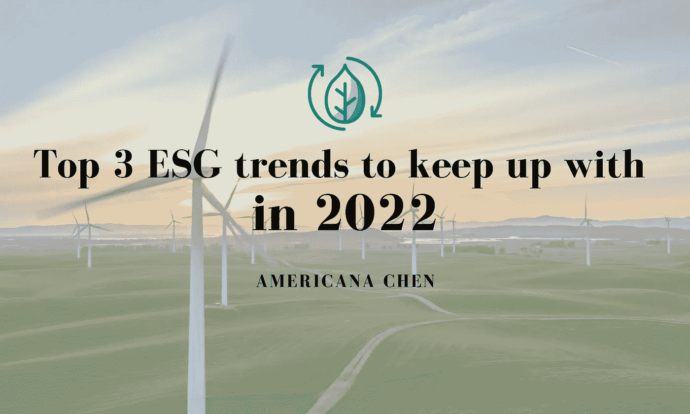

# 2022 年要跟上的三大 ESG 趋势

> 原文：<https://medium.com/geekculture/top-3-esg-trends-to-keep-up-with-in-2022-bbc5c2d4ca70?source=collection_archive---------5----------------------->

2021 是**“ESG 投资年”**(路透社，2021)，专注于 ESG 的基金从 2019 年的 2850 亿美元，2020 年的 5420 亿美元迅速增长到 2021 年的惊人的 6490 亿美元(截至 11 月 30 日)。MSCI 世界 ESG 领袖指数在 2021 年表现出色，上涨超过 22%，相比之下，MSCI 世界指数仅上涨 15%。随着我们越来越意识到解决可持续发展问题的紧迫性…