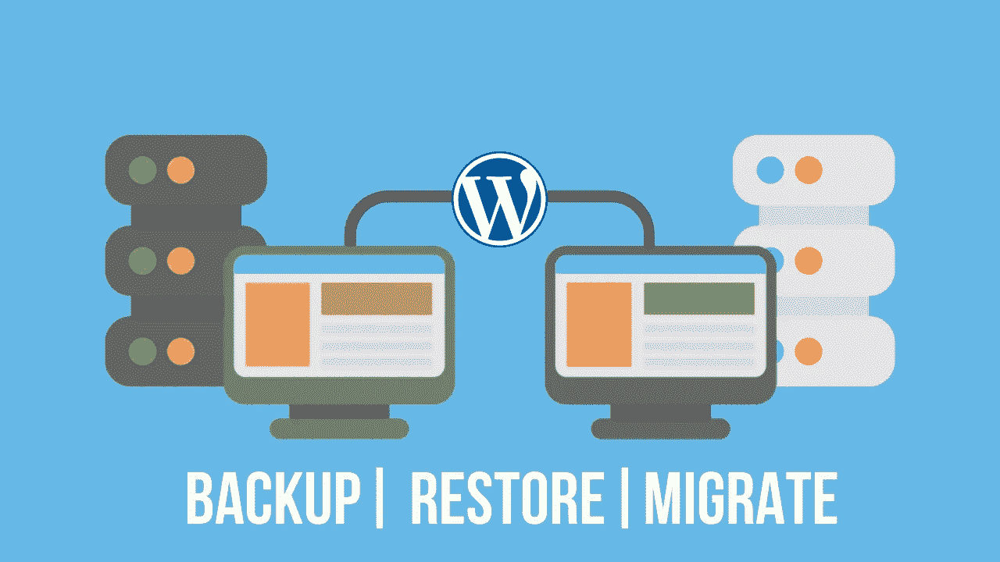
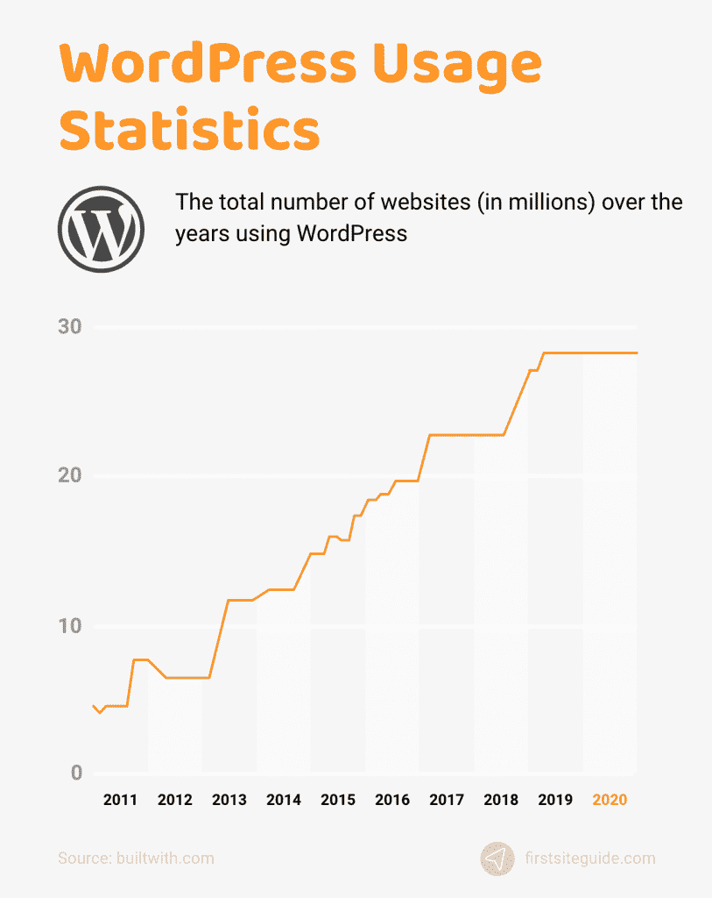
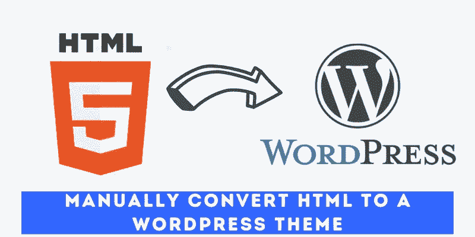
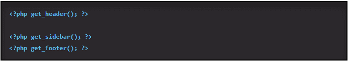
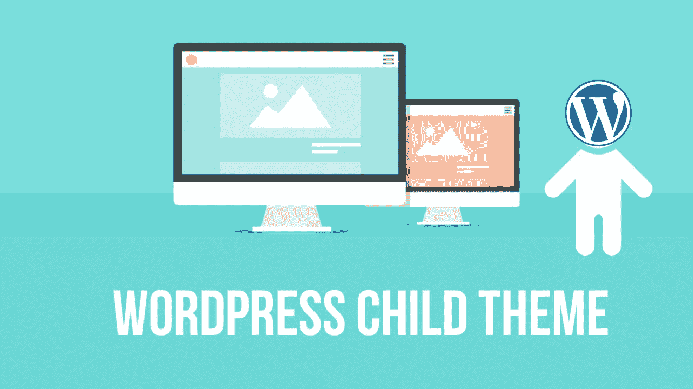
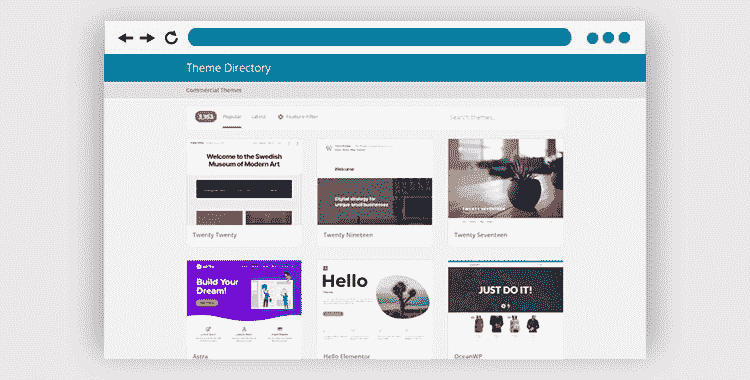
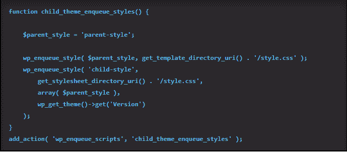
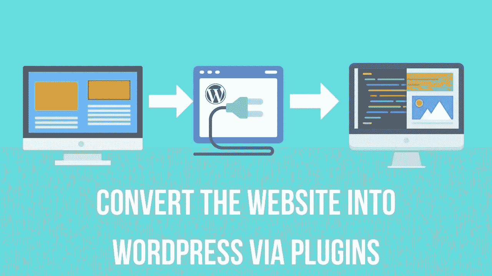

# 将旧网站转换成 WordPress 网站的三大方法

> 原文：<https://medium.com/geekculture/top-3-methods-to-convert-your-old-website-into-a-wordpress-website-2dfb64b7293b?source=collection_archive---------4----------------------->

渴望将你的旧网站从 HTML 转换成 WordPress？跳到任何趋势科技都会迫使你在做出决定之前深入研究完整的信息，收集所有必要的细节。

WordPress 的市场正在日新月异地发展。截至 2021 年，超过 4.55 亿个网站活跃在 WordPress 上，预计未来几年网站数量将会增长。

[Image Source](https://trends.builtwith.com/cms/WordPress)

## 关于 WordPress 的主要统计数据

*   WordPress 是最人性化的开源内容管理系统，每半年有 110 万次新下载，每年超过 200 万次。
*   它支持 62%的 CMS 网站，如 Joomla 或 Shopify。
*   它提供了超过 54，000 个插件，11，000 个主题，以及用于定制网站开发的不同布局。
*   WooCommerce 是 WordPress 最常用的电子商务插件，占总在线销售额的 7%。

## 为什么选择 WordPress 做网站开发？

如果你不理解这个内容管理系统的重要性，那么把你的网站导入 WordPress 是没有价值的。在开始使用 WordPress 之前，让我们先来解释一下为什么你应该考虑使用 WordPress 进行网络开发:

*   WordPress 网站是 SEO 友好的，帮助用户在 Google 的 SERP 上提升他们坚实的数字形象。
*   当你通过网站规划你的业务时，你寻求用户参与的可访问性、定制和扩展。有了 WordPress，扩展和更新网站来分享有价值的见解变得很容易。
*   使用 54，000 个现成的插件，将定制功能集成到您的网站将变得很容易。这将有助于使您的网站项目更具活力和响应性。
*   WordPress 是一个开源的内容管理系统。它有一个庞大的在线专家社区，使这个 CMS 更加进步和平易近人。它使网站维护更有成效。

**HTML 到 WordPress 的逐步转换**

> 在将 HTML 转换为 WordPress 的过程中，您需要将 HTML 设计更改为 WordPress 主题。作为一个 IT 界的新手，你可能会觉得转换你的网站是一项繁琐的任务。因此，搜索最好的 [**WordPress 网站开发服务**](https://www.valuecoders.com/top-wordpress-development-services-company-india?utm_source=medium-html-wordpress&utm_medium=d7) 进行无缝转换。这将有助于克隆一个网站到 WordPress。

然而，如果你热衷于用 WordPress 替换现有的网站，确保按照一个准备好的计划一步一步地实施:

# 方法 1:手动将 HTML 转换成 WordPress 主题

现在，是时候展示你的技术专长和 HTML、CSS 和 PHP 知识了。在这种手动转换中，您必须执行复制和粘贴:

**第一步:创建一个新的主题文件夹和文件**

在桌面上创建一个新的主题文件夹，并命名为。转到代码编辑器，创建五个文本文件:

*   Style.css
*   Index.php
*   Header.php
*   Sidebar.php
*   Footer.php

**第二步:用 WordPress 样式表替换现有的 CSS**

将网站转换成 WordPress 的另一个重要步骤是复制和粘贴。确保将网站上完整的 CSS 代码复制到 WordPress 样式表中。这意味着您需要创建一个 style.css 文件并完成以下详细信息:

*   **主题名称:**反映你的主题名称
*   **主题网址:**网址
*   **作者:**你的名字
*   **作者 URL:** 表示链接到您正在工作的主页
*   **描述(可选):**描述你的主题
*   **版本:**是关于你的主题。你可以用 1.0，因为它不会被发布。
*   **许可证，许可证 URL，标签:**当你提交你的主题到 WordPress 主题目录时，这些细节是很重要的。

**第三步:分离现有的 HTML**

在 WordPress 上，开发者使用 PHP 提取数据库信息。这就是为什么他们需要将 HTML 分成不同的部分，并允许 CMS 将这些部分绑定在一起，以反映完整的细节。

点击 index.html 文件并打开它。现在，从 WordPress 复制代码并粘贴到以下部分:

**Header.php**:它覆盖了你的 HTML 代码顶部和主要内容之间的区域，用“< main >或者< div class="main" >来表示复制粘贴<？PHP WP _ head()；？>就在</头>之后。

**Sidebar.php:** 将<下的内容复制到 WordPress 文件中。

**Footer.php:** Footer 部分描述了从侧边栏末尾到文件末尾的信息。之后贴<？PHP WP _ footer()；？>在<之前/车身>。

关闭“index.html”文件，并将必要的数据保存到主题文件夹中。

关闭除 header.php 和 index.php 以外的所有文件。

第四步:改变 WordPress 的 Header.php 和 Index.php

更改 Header.php 和 Index.php，使它们与 WordPress 格式兼容。

**代表 Header.php**

首先在部分搜索与<link rel="”" stylesheet="" href="”" style.css="">相似的链接。

将链接替换为:

<link rel="”stylesheet”" href="”<?php" echo="" get_template_directory_uri="">/style . CSS " type = " text/CSS " media = " all "/>。

保存并关闭头文件。

**对于 Index.php**

您的 Index.php 可能是空白的，因此，请在其中粘贴以下信息:

[Image Source](https://websitesetup.org/html-to-wordpress/)

***注意:*** *维护页眉和侧边栏之间的空间，用于添加循环。*

**第五步:截图并上传**

最后也是最重要的一步是给你的主题截图。在上传之前，确保它大约是 880×660 像素。

为了更清楚，截图是 WordPress 的后台进程。您可以使用截图预览您的网站。因此，保存文件为 screenshot.png，并将其包含在您的主题文件夹中。

使用以下步骤将主题上传到 WordPress:

*   创建一个 zip 文件。
*   去 WordPress。选择所需的外观和主题，然后单击顶部的添加新项。
*   上传主题，然后上传 zip 文件。
*   选项卡至“立即安装”
*   激活主题

# 方法 2:使用 WordPress 子主题

手动转换似乎是技术性的，有点复杂。但是，你可以使用 WordPress 子主题来管理一切。它需要一个父主题，但允许你做必要的修改。

**第一步:选择一个主题**

[**Image Source**](https://www.brainvire.com/blog/seamlessly-convert-html-into-wordpress/)

从 WordPress 主题目录中选择一个与你现有设计相似的主题。

安装它，但不要激活它。

**第二步:新建一个文件夹**

按照前面的方法创建一个新的主题文件夹。请确保将文件夹命名为父主题，并在末尾添加形容词“child ”,不带任何空格。

**第三步:准备样式表**

像我们在前面的方法中执行的那样设置一个样式表，并添加一个名为“template”的标签为了使工作表正常工作，请确保包含父主题名称。

**第四步:创建一个 Functions.php**

在处理子主题时，您需要创建一个 functions.php 文件并继承父样式。为此，创建一个新文件并命名为 functions.php，它应该从第五步

[Image Source](https://websitesetup.org/html-to-wordpress/)

**开始:激活子主题**

最后，激活子主题。确保首先截取一个需要在 WordPress 后端处理中显示的截图。创建一个 zip 文件并上传。现在，相应地调整设计。

# 方法 3:安装插件来导入内容

如果你不知道如何在不删除旧网站的情况下创建一个新的 WordPress 网站，请联系 WordPress 网站开发公司。或者，应用第三种方法，通过插件把网站转换成 WordPress。

第一步:安装一个插件

进入 WordPress 插件，搜索 HTML 导入 2。找到所需的插件，安装并激活它。

**第二步:准备导入**

上传你想要导入的页面到你的 WordPress 安装的服务器上。要导入所需的文件，您需要在所需的选项卡中输入以下信息:

*   **导入目录:**输入已有 HTML 代码文件的路径。
*   **旧网址:**输入你的旧网址。它被用作重定向。
*   **默认文件:**index.html 的分享信息。
*   **要包含的文件扩展名:**需要导入的文件的扩展名。
*   **要排除的目录:**任何不想导入的文件。
*   **保留文件名:**默认使用文件名作为新的 URL。

完成上述步骤后，导航到 content 选项卡并配置 HTML 标记。现在，进入以下选项卡:

*   通知你的插件你想要的 HTML 模板的标题。
*   使用自定义标签导入自定义数据。
*   为导入的内容定义类别和标签。
*   在工具标签中，将必要的工具从 HTML 导入 WordPress。

***保存您的设置并开始导入***

制作一个更具动态性和响应性的网站是超越业务的最终要求。将对商业的理解和学习落实到网站中，启发了定制网页设计的概念。

今天，我们更加重视定制网页设计，以完全满足我们的业务需求。如果你还需要设计一个定制的网站，或者把你的需求投射到一个现有的网站上，最好雇佣 WordPress 开发者。接近一家顶级 WordPress 开发公司，分享你的需求，让你的网站最恰当地表达你的观点。

## **最终想法**

因此，你可以根据你的理解选择最好的方式，用一个新的 WordPress 站点替换你的旧站点 ***。*** WordPress 将帮助你实现你想要的网站设计和功能。除此之外， [**从**](https://www.valuecoders.com/hire-developers/hire-wordpress-developers?utm_source=medium-html-wordpress&utm_medium=d7) **[**WordPress 网站设计公司**](https://www.valuecoders.com/top-wordpress-development-services-company-india?utm_source=medium-html-wordpress&utm_medium=d7) 雇佣一名经验丰富的 WordPress 开发者** 并获得最好的 WordPress 网站开发服务。