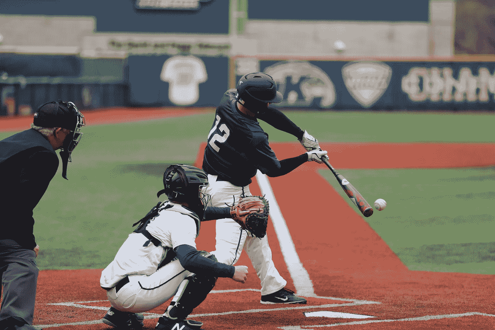

# 用于体育预测分析的前 3 个最重要的机器学习库

> 原文：<https://medium.com/geekculture/top-3-most-important-machine-learning-libraries-for-sports-predictive-analytics-874e99b318ff?source=collection_archive---------3----------------------->

针对体育预测分析的 3 个特定机器学习库的最佳实践、使用案例和实施程序

By [Chris Chow](https://unsplash.com/@chris_chow) from Unsplash

## 足球、篮球，尤其是棒球——机器学习和自然语言处理悄悄地进入了体育领域，给…