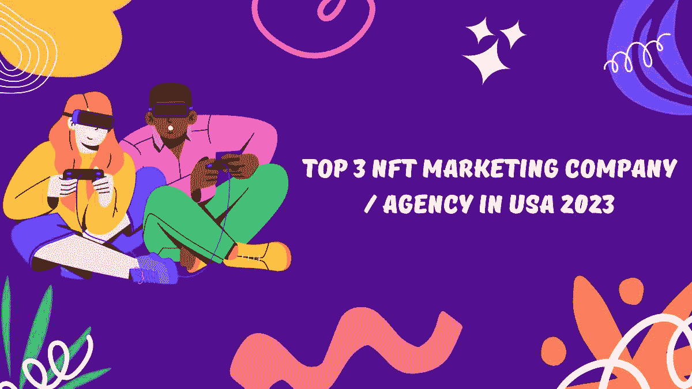

# 2023 年美国前三大 NFT 营销公司/机构

> 原文：<https://medium.com/geekculture/top-3-nft-marketing-company-agency-in-usa-2023-dbe99352e526?source=collection_archive---------18----------------------->

Top 3 NFT Marketing Company / Agency in USA 2023

体验和优质的 NFT 营销服务是为您的 NFT 项目选择最佳 [**NFT 营销公司**](https://www.turnkeytown.com/nft-marketing-services) 时必须勾选的复选框。为您的 NFT 项目配备一家领先的 NFT 营销公司的 NFT 营销服务已成为许多 NFT 项目的当务之急。

随着 NFT 越来越受欢迎，大量大众和知名品牌正试图利用 NFT 的知名度，带着大量 NFT 收藏品进入 NFT 市场。在 2023 年的 Q1，有超过 100 万个新创建的 NFT 项目，在 Q2，有超过 10 万个新开发的 NFT 项目。

这些新的 NFT 项目，在短短六个月内，挤满了 NFT 的市场。市场的激烈竞争产生了对 NFT 营销服务的需求。

即使加密货币市场表现不佳，NFT 市场也不会停止闪耀，NFT 市场的受欢迎程度和竞争推动了 NFT 市场的增长。

人气和竞争帮助 NFT 市场成长。对你的 NFT 企业来说，为你的 NFT 项目配备业内最好的 NFT 营销服务是至关重要的，即使在如此拥挤的市场中，这也有助于你的 NFT 项目获得关注。

## NFT 营销服务公司

下面提到的 NFT 营销服务列表将帮助你把你的 NFT 业务提升到一个新的水平。将以下提到的所有 NFT 营销服务纳入您的营销战略是至关重要的。如果所有的 NFT 营销服务携手并进， [**NFT 营销策略**](https://www.turnkeytown.com/nft-marketing-services) 可以为你的 NFT 项目创造奇迹。

## 社交媒体营销

在这个数字时代，社交媒体营销是你的 NFT 营销战略中的必备要素，因为它将极大地帮助你的品牌在短时间内到达众多目标受众。如果使用得当，社交媒体平台 Discord 和 Telegram 可以促进 NFT 项目的销售。

Crypto 和 NFT 爱好者将这些社交媒体平台视为获取全球 NFT 项目相关信息的专用平台。例如，Twitter 可以用于向目标受众提供有关 NFT 项目的更新，或者在项目发布之前进行宣传。

谈到 Discord，它已经从一个游戏玩家的交流平台发展成为一个最适合建立 NFT 社区和开展 Discord 营销活动的平台。Discord 是 NFT 营销活动和社区参与的有效社交媒体平台，通过举办关于 NFT 项目的竞赛、询问关于 NFT 项目的各种问题以及为观众参与提供适当的奖励。也适合进行赏金计划来扩大社区。

Telegram 可用于开展“向我提问”会议，参与者可直接向项目负责人提问，专门的竞赛和活动可在 Telegram 平台上有效开展。此外，Telegram 是全球著名的平台，为将广大受众转化为您的 NFT 项目的潜在买家铺平了道路。

一家经验丰富的 NFT 营销公司能够以最佳方式利用这些社交媒体平台，提供有效的营销成果。

## 直播带货

影响者营销是一种有效的营销工具，你可以用它来装备你的企业。在你的 NFT 营销策略中加入影响者营销可以让你的品牌在短时间内获得良好的转化率。影响者营销帮助您的 NFT 项目轻松抓住目标受众的注意力。

在早期营销阶段部署的影响者营销策略可以帮助您的品牌围绕项目建立目标受众群体。

## 内容营销

内容营销为你的业务铺平了道路，向目标受众解释品牌是什么，它的产品和它的商业目的。内容营销有助于加深目标受众心中对品牌的理解。

当目标受众清楚地了解为什么需要品牌及其产品时，销售产品就变得更加容易。这同样适用于你的 NFT 项目。

内容营销不仅有助于建立对你的品牌的理解，也有助于在目标受众的心目中建立品牌形象和声誉。有许多创新和有效的方式来营销你的内容。例如，可以创建一个视觉效果很好的专业视频来解释内容。

## 媒体新闻稿

在领先的加密新闻平台上发布关于您的 NFT 项目的新闻是您的品牌在全球加密爱好者中提高其可靠性和品牌声誉的有效方式。

媒体新闻稿 NFT 营销战略使您的企业能够发布 NFT 新闻，关于您的 NFT 发布或任何其他有新闻价值的领先加密新闻广播网站的信息。

一家领先的 NFT 营销公司在 NFT 市场有丰富的经验，可以很容易地在 100 多个可靠的加密新闻网站上发布关于您的 NFT 品牌的新闻。

## 电子邮件营销

电子邮件营销帮助您的企业通过电子邮件向目标受众和潜在投资者提供 NFT 最新消息、时事通讯和新闻稿。电子邮件营销是一种以更专业的方式展示您的企业的有效方式，它有助于使您的 NFT 品牌在目标受众和潜在投资者中更加可靠。

# 顶级 NFT 营销公司

有成吨的 NFT 营销公司在那里的业务，但这里是前 3 名 NFT 营销公司的服务值得每一分钱花。

## [交钥匙城:](https://www.turnkeytown.com/nft-collection-marketing-services)

Turnkeytown 是 NFT 密码行业的先驱营销公司之一。他们的营销团队会根据您的所有业务需求制定营销策略，并定制营销策略以达到预期效果。作为 NFT 市场的先驱，他们能够为您的企业提供开发服务和全方位的营销服务。

他们还根据你的预算提供 NFT 营销服务，这对初露头角的企业家很有帮助。Turnkeytown 可以在一个屋檐下提供 NFT 营销以及 NFT 开发服务。

## 象征性思维

Token Minds 是一家屡获殊荣的 NFT 营销公司，成立于 2016 年。Token Minds 旨在提供高质量的 NFT 营销服务，起价 14，900 美元。Token Minds 也是能够在一个屋檐下提供 NFT 营销以及开发服务的公司之一。

Token Mind 的专业在于 NFT 营销服务，他们通过提供营销见解和定位策略来帮助您的业务。他们已经帮助了 42 家企业进行代币销售，总共筹集了 1.75 亿美元。Token mind 的营销服务包括社区建设、社交媒体管理和 NFT 影响者营销。

## 忍者宣传片

Ninja Promo 是一家 NFT 营销公司，成立于 2017 年。崭露头角的 NFT 营销公司为您的企业提供量身定制的营销服务。

忍者推广 NFT 营销公司的优势是在研究和分析你的 NFT 业务。Ninja Promo 分析您的品牌目前的市场地位，然后注意到您的品牌的优势和劣势，以便在 NFT 市场更好地定位您的业务。他们帮助您的企业衡量营销过程中每个阶段的增长。

## 总结一下

正如博客中所说，NFT 市场充满了潜力和赚钱的可能性，吸引了许多人潜入 NFT 市场，最终导致了市场人群。

来自先锋 NFT 营销公司的有效的 NFT 营销肯定能帮助你的 NFT 项目获得关注。它可以有利于你的品牌聘请 NFT 营销公司，可以提供所有的 NFT 营销服务在一个屋檐下。此外，如果同一个 [**NFT 营销公司**](https://www.turnkeytown.com/nft-collection-marketing-services) 也精通开发服务，这可能是你的 NFT 项目的奖金。