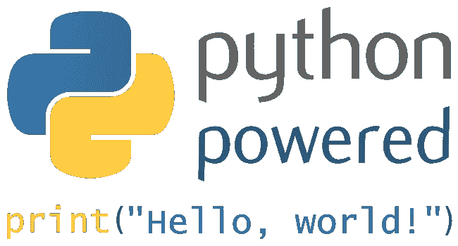
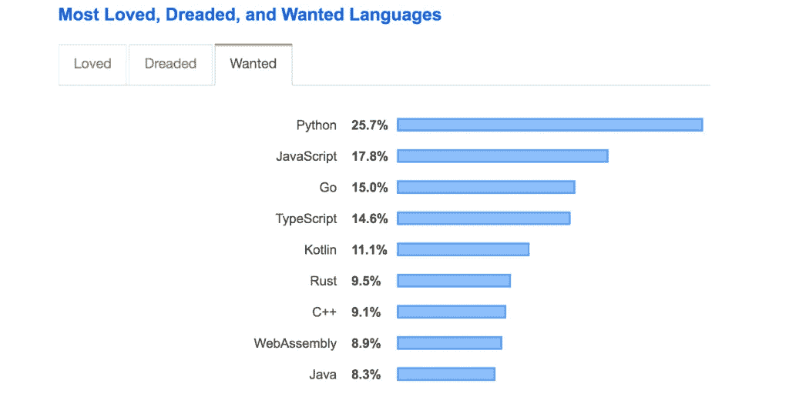
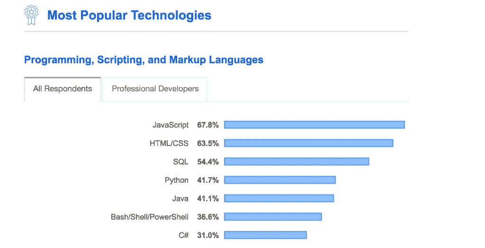

# 2023 年最需要学习的 3 种编程语言

> 原文：<https://medium.com/geekculture/top-3-programming-languages-to-learn-in-2021-7b2b41dc7484?source=collection_archive---------1----------------------->


随着 2023 年的临近，分析一下今年软件开发人员要学习的前三种编程语言是个不错的主意。在我的职业生涯中，我使用过各种编程语言，唯一不变的就是变化。

让我们来看看下图，根据 Google trends 显示，已经成为趋势的顶级编程语言，将是你在 2023 年学习的最大选择。


没错！

一些调查和研究已经将 Python、JavaScript 和 Java 确定为顶级编程语言。在本帖中，我们将仔细看看这些语言，看看它们之间的区别和不同之处。

# 计算机编程语言



[Python](https://www.python.org/) 是使用最广泛的编程语言之一。它使用起来非常简单，而且不杂乱。

> 在美国，一名 Python 开发者[的平均年薪为 118，626 美元。](https://www.indeed.com/career/python-developer/salaries)

根据 2019 年 [Stackoverflow 对开发者的调查](https://insights.stackoverflow.com/survey/2019#most-loved-dreaded-and-wanted)，Python 是今年最受欢迎的编程语言。这并不奇怪，因为 Python 是开发人员友好的语言。



## Python 代码看起来怎么样？

让我们写一些代码来更好地理解 Python 的语法。让我们开发一个简单的程序来判断用户输入的数字是奇数还是偶数。

```
num = int(input("Enter a number to check if odd or even: "))
if (num % 2) == 0:
   print("{0} is Even".format(num))
else:
   print("{0} is Odd".format(num))
```

如果您不熟悉 Python，您会注意到它的语法与其他编程语言有些不同。花括号、类和公共/私有修饰符都不存在。它非常简单明了，而且不杂乱。Python 在程序员中如此受欢迎的原因之一就是因为这个。让我们来看看上面程序的输出。

```
Enter a number to check if odd or even: 56
56
56 is Even
```

## 为什么是 Python？

下面是为什么 Python 是当今最流行的编程语言之一的简要概述。

*   简单易用。
*   代码中没有混乱。
*   编程初学者简单易学。
*   最适合机器学习，人工智能项目和研究。
*   遵循面向对象的范例。
*   可用于构建前端和后端应用程序。
*   被数据科学家广泛使用。
*   巨大的社区支持。

这里有一个视频解释 [***为什么大家都在学 Python***](https://bit.ly/pythontutorialforbeginners) 。

## 为什么不是 Python？

Python 是一种流行的、开发人员友好的编程语言，然而每种编程语言都有缺陷。这里列出了 Python 可能不是最佳选择的原因。

*   由于 React Native 和 Flutter 等各种框架以及 Swift 和 Java 等原生语言的可用性，Python 很少用于移动开发。因此，您不会找到任何基于 Python 的移动应用程序。
*   如果 Python 是你的第一语言，其他编程语言很难学。你可能会爱上它的简单，觉得学习其他编程语言很难。当从 Python 迁移到另一种编程语言(如 Java)时，可能会显得复杂。
*   Python 没有在大规模软件开发中广泛使用——Python 没有在大公司的企业软件开发中广泛使用。相比之下，像 Java 和 JavaScript 这样的语言使用得更频繁。Python 在运行时速度较慢，并且有数据库访问限制。Python 的数据库访问层不如 JDBC 或 ODBC，不适合大规模应用。

# Java 语言(一种计算机语言，尤用于创建网站)


Java 是 2023 年第二受欢迎的编程语言。Java 是最受欢迎的编程语言之一，在 2023 年，它将是一门值得学习的优秀语言。

> 在美国，一名 Java 开发人员的[](https://www.indeed.com/career/java-developer/salaries)**平均年薪为 103464 美元。**

**在职业生涯的初期，我为一个企业软件程序写了很多 Java 代码。Java 是一种常用于大型软件应用的编程语言。**

# **让我们来看看一些 Java 代码**

**让我们用 Java 重新创建我们之前创建的 Python 应用程序。应用程序验证用户输入的数字是奇数还是偶数。**

```
import java.util.Scanner;
public class EvenOdd {
    public static void main(String[] args) {
        Scanner reader = new Scanner(System.in);
        System.out.print("Enter a number: ");
        int num = reader.nextInt();
        if(num % 2 == 0)
            System.out.println(num + " is even");
        else
            System.out.println(num + " is odd");
    }
}
```

**值得注意的是，语法与 Python 的完全不同。我们已经讨论了类、公共/私有访问、扫描仪等主题。与 Python 这样的语言相比，Java 程序更有组织性。在 Java 中，一切都必须包含在类或接口中。**

# **为什么是 Java？**

**下面是关于为什么应该学习 Java 的简要概述:**

*   ****Java 用于企业软件应用程序—** 学习 Java 的一个主要原因是，在世界各地的许多科技企业中，Java 被用于构建大规模的应用程序。优步、Airbnb、Twitter 和许多其他公司的技术团队都使用 Java。因此，获得 Java 开发人员的工作非常简单。**
*   ****性能** — Java 应用比动态类型语言更快，因为它们针对性能进行了优化。JVM 已经升级，速度很快，非常适合大型项目。**
*   ****Android 开发** — Java 用于原生 Android 应用的开发。如果你想成为一名专注于创建原生 Android 应用的移动开发人员，了解 Java 是一个好主意。**
*   **巨大的社区 —十多年来，Java 一直是一种流行的编程语言，它背后有一个相当大的社区。当你第一次开始学习 Java 时，你会遇到大量的工具、论坛和书籍来帮助你。**
*   ****平台和工具**—Java 生态系统已经随着时间的推移发生了变化，现在有各种各样令人惊叹的工具和 ide 来辅助 Java 开发，比如 [IntelliJ](https://www.jetbrains.com/idea/) 、 [Eclipse](https://www.eclipse.org/) 等等。**

# **为什么不是 Java？**

**让我们看看为什么 Java 不是一个选项。**

*   ****冗长代码** — Java 代码相当冗长，这可能会让一个新程序员感到困惑。这表明代码有很多样板文件，一些开发人员可能会觉得很乏味。通过比较上面例子中的代码片段，可以看出 Java 有多冗长。**
*   ****旧语言**—Java 的替代品在新开发人员和初创公司中越来越受欢迎。这是因为它是一种更古老的编程语言，他们宁愿学习一种更新的、前沿的编程语言。如果你想为初创公司或尖端技术工作，你可能希望学习一门新的编程语言。**

# **Java Script 语言**

****

**我最喜欢的编程语言之一， [JavaScript](https://www.w3schools.com/js/) ，是 2023 年下一个要学习的顶级编程语言。**

> **在美国，JavaScript 开发人员的平均年薪为 113，615 美元。**

**在 StackOverflow 进行的一项研究中，JavaScript 连续第七年被认为是最受欢迎的编程语言。**

****

# **JavaScript 中的代码**

**我们构建了一个函数 isEven，它接受一个整数，并在下面的代码片段中检查它是偶数还是奇数。console.log 文件用于记录控制台的响应。最终用户将看不到这一点。开发人员可以将控制台日志记录用于测试和调试目的。**

```
function isEven(num) {
    if (num % 2 === 0) {
        console.log(num + " is even");
        return true;
    } else {
        console.log(num + " is odd");
        return false;
    }
}
```

# **为什么是 JavaScript？**

**在 2023 年，有很多理由让你学习 JavaScript。**

*   ****无处不在** —如今，JavaScript 几乎被用在所有当前的前端应用中。在开发现代前端软件时，无法避免或忽略 JavaScript。**
*   ****许多现代框架** —现在有许多高质量的 JavaScript 框架和工具可以帮助前端开发。许多框架，如 [React](https://reactjs.org/) 、 [Vue](https://vuejs.org/) 、 [Angular](https://angular.io/) 、 [React Native](https://reactnative.dev/) 等，通常被用来构建现代前端应用。**
*   ****开发人员友好且易于学习** — JavaScript 是一种初学者友好的语言，该语言的新手往往会爱上它。这可能是由多种情况造成的。这种语言本身对开发人员很有吸引力，当前支持开发的生态系统进一步增强了开发人员的体验。**
*   ****工作机会** — JavaScript 程序员在世界各地需求量很大。许多财富 500 强公司，如谷歌、脸书和优步，都在 JavaScript 开发方面进行了大量投资，从而在 JavaScript 领域产生了大量的职位空缺。**
*   ****前端和后端开发**——值得注意的是，虽然 JavaScript 在前端开发领域占据主导地位，但它也积极用于后端开发，如 [Node.js](https://nodejs.org/en/) 。这意味着你可以成为当代 JavaScript 的前端和后端开发者。**
*   ****速度—** JavaScript 应用运行速度很快，因为所有代码都在客户端运行。**

# **为什么不是 JavaScript？**

*   ****快速变化:**这取决于你如何看待它，这可能是赞成也可能是反对。JavaScript 及其框架正在快速变化，今天的 JavaScript 与三年前大不相同。事实上，它总是在变化，这意味着它有很多的动力和社区参与。然而，这可能很难跟上。**
*   ****安全顾虑:**在客户端，执行 JavaScript 代码，代码正常暴露。因此，如果在开发过程中没有遵循最佳实践，可能会出现安全漏洞。**

# **结论**

**这里有一些资源可以帮助你开始使用这三种编程语言，以便进一步学习。**

*   **[***终极 Java 精通教程***](https://bit.ly/3jycLCw)**
*   **[***完成 Python 精通教程***](https://bit.ly/3qEX6mi)**
*   **[***完成 Node.js 速成班***](https://bit.ly/2UXJg2F)**
*   **[***终极 JavaScript 课程捆绑***](https://bit.ly/3dHdv4t)**

**我们已经到达这篇文章的结尾。如果你喜欢这篇文章，请分享并评论你最喜欢的 2023 年的选择。**