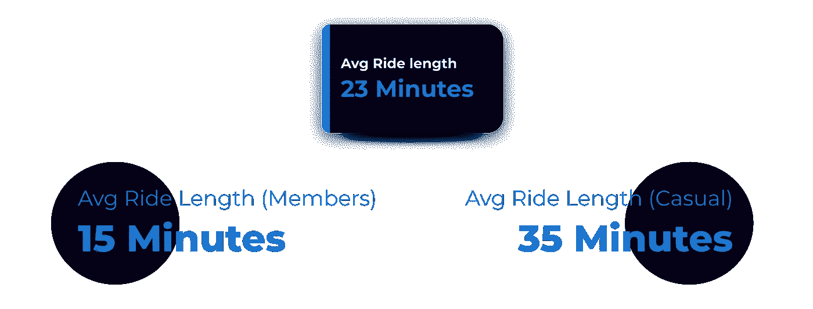
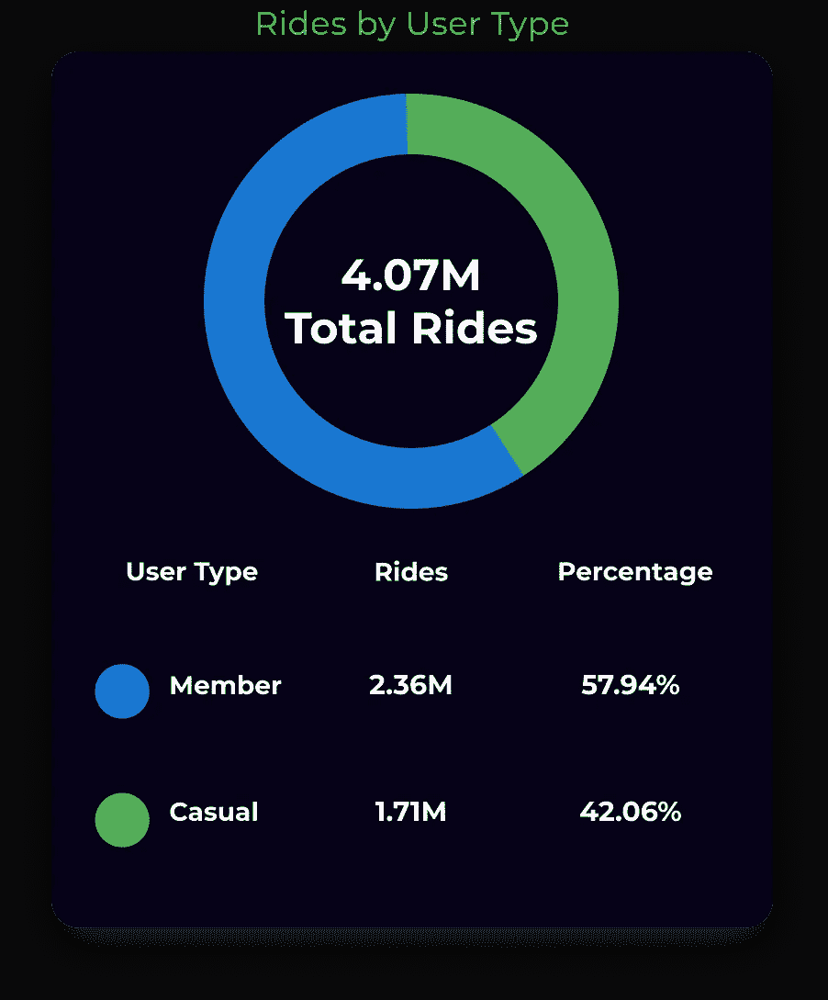
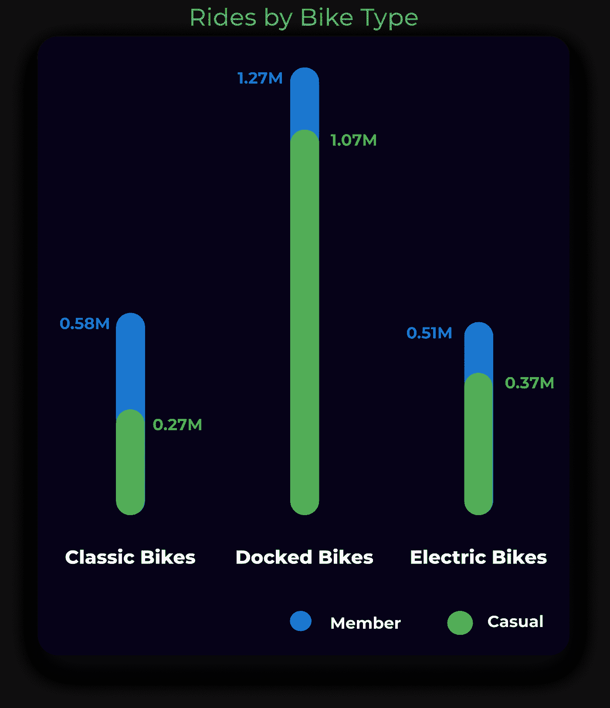
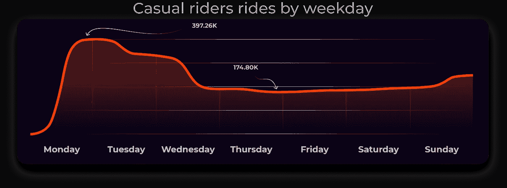
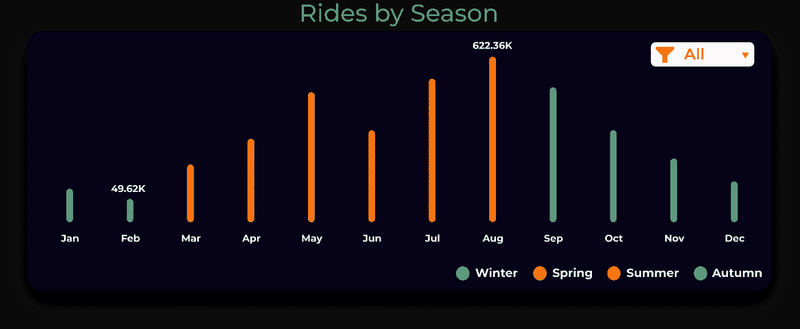
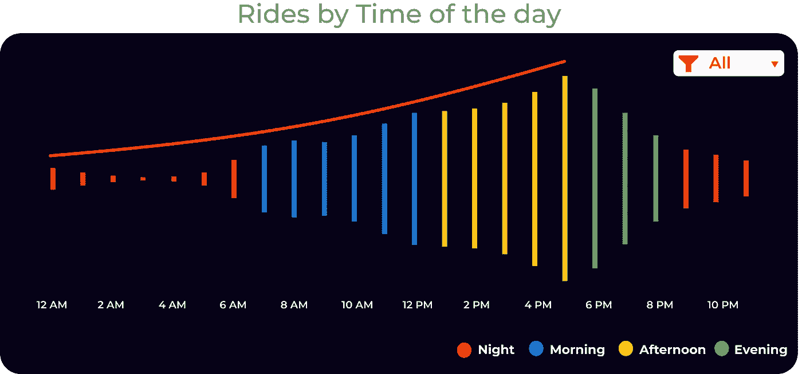

# 完成数据分析项目后的前 3 条建议

> 原文：<https://medium.com/geekculture/top-3-recommendations-after-completing-data-analytics-project-a409afdd40aa?source=collection_archive---------15----------------------->

## 以细节为导向的分析，使用 SQL 和 Tableau 进行分析，以收集关于如何发展自行车共享公司的见解。

Photo by [Mitchell Luo](https://unsplash.com/@mitchel3uo?utm_source=medium&utm_medium=referral) on [Unsplash](https://unsplash.com?utm_source=medium&utm_medium=referral)

两个月前，我注册了谷歌数据分析专业证书，这个案例研究是这个专业的一个顶点项目。

从介绍开始，我得到了一个场景，我是一名初级数据分析师，在芝加哥自行车共享公司 Cyclistic 的营销分析师团队工作。公司未来的成功取决于年度会员数量的最大化。因此，我的团队想了解休闲骑手和年度会员如何不同地使用 Cyclistic。

读完剧本后，我脑海中闪现的第一个想法是，

> “这是一个比我过去所做的更容易的分析”。

**嗯，我大错特错了。**

这个案例研究很有挑战性，但它教会了我很多新东西，对此我很感激。

**任何人想看可视化的画面，** [***点击这里***](https://public.tableau.com/app/profile/navneet.singh7813/viz/Cyclist_CaseStudy_Main/Dashboard1) **。**

**查看 Linkedin 帖子，** [***点击这里***](https://www.linkedin.com/posts/navneetsingh0501_data-datavisualization-dataanalytics-activity-6828202975232618496-YGdT) **。**

**为 SQL 代码，** [***点击此处。***](https://github.com/navneet0501/PortfolioProjetcts/blob/main/Cyclistic_Casestudy_Google.sql)

在我们开始之前，我想指出，本案例研究中的数据涵盖了从 2020 年 6 月**到 2021 年 5 月**这段时间。

现在让我们开始吧！

# 关于公司的详细信息

Cyclistic 在 2016 年开始了一项成功的自行车共享计划。从那时起，该计划已经发展到包括一个由 5824 辆自行车组成的车队，这些自行车被地理跟踪并锁定在芝加哥 692 个站点的网络中。自行车可以解锁，并在任何时候返回到系统中的任何其他站。

直到最近，Cyclistic 的营销策略一直侧重于提高公众意识和吸引广大消费者。

其定价计划的灵活性，包括单程通行证、全天通行证和年度会员资格，是帮助实现这些目标的一种策略。

## Cyclistic 的客户大致分为两类

*   购买单日票或全天票的顾客被称为**临时乘客**。
*   购买年度会员资格的客户是**cyclic istic 会员**。

# 冲突

我们的财务分析师得出结论，年度会员比临时骑手更有利可图，我的经理 Lily Moreno 认为，最大限度地增加年度会员的数量将是未来增长的关键。她还认为，与其创建一个针对全新客户的营销活动，还不如创造一个将临时骑手转化为会员的好机会。

总而言之，我们必须想出一个办法，将临时骑手转化为会员。

***但是，我们要怎么做呢？***

# 我的角色

这就是我参与进来的原因，我需要通过分析 Cyclistic 的历史自行车出行数据来确定趋势。

但是在分析数据之前，我问了自己几个问题

*   ***年度会员和休闲骑友使用单车有何不同？***
*   ***为什么休闲车友会购买周期性年度会员资格？***
*   ***Cyclistic 如何利用数字媒体影响休闲车友成为会员？***

这些问题帮助我给出了分析的方向和结构。

# **分析**

## **让我们先看看平均骑行长度，**

Image by the Author | This chart shows the average ride lengths

我们可以观察到所有用户的平均乘车时间为 **23 分钟**，

骑自行车的成员平均只骑了 **15 分钟**，而休闲骑手平均骑了 **35 分钟**，与成员相差 **20 分钟**。

## 现在，让我们更详细地了解一下周期性用户群。

Image by the Author | This chart shows the overall rides by users

在这里我们可以观察到，在之前的十二个月中，cyclic istic 共向其客户提供了**407 万**次乘坐，cyclic istic 会员占**236 万**次乘坐，散客占**171**万次乘坐。

这表明骑自行车的人骑自行车的次数是普通人的 1.38 倍。

一个**同时减少**临时骑手的骑行次数和**增加**骑行周期成员的骑行次数将意味着临时骑手正在购买会员资格和**转化为**周期成员。

## 现在进入我们的下一个图表，它展示了三种类型的自行车以及骑行的次数。

Image by the Author | This chart shows the number of rides by bike type

从**经典自行车**开始，它们的受欢迎程度与**电动自行车**相同，**85 万**次骑行占总骑行的 **20.71%** 。休闲骑行者仅使用经典自行车**27 万**次，占总骑行 **6.52 %** 次，而自行车骑行者成员使用经典自行车**58 万**次，占总骑行 **14.19 %** 次。

接下来是**停靠自行车**，它们是最受欢迎的自行车，有**234 万**次骑行，占总骑行的 **57.48%** 。休闲骑行者使用停靠自行车**107 万**次，占总骑行 **26.37 %** 次，骑行圈成员使用停靠自行车**127 万**次，占总骑行 **31.11 %** 次。

然后是电动自行车，它和经典自行车一样受欢迎，但不如停靠自行车受欢迎，88 万次骑行占总骑行的 **22.35 %** 。休闲骑行者仅使用电动自行车 **0.37 万次**，占总骑行的 **9.17 %** ，骑自行车者使用电动自行车 **0.51 万次**，占总骑行的 **12.64 %** 。

总结这张图表，我们可以得出结论，大多数会员和休闲骑行者更喜欢**停靠自行车**而不是其他两种类型的自行车。

## **现在进一步探究休闲骑手的行为，**

Image by the Author | This chart shows the number of rides of casual riders by day of the week

该图表显示，周一是一周中**最繁忙的一天**，占总乘车次数的 **23.19 %** 。暗示周末过后，休闲骑手更喜欢使用 Cyclistic 从家通勤到工作或从工作到家。

随着一周时间的推移，**周二**是一周中**第二繁忙的一天**，占总乘车次数的 **19.29 %** 。虽然休闲骑手在周二没有像周一那样频繁使用 Cyclistic，但周二仍占总骑行的很大一部分。

休闲骑手在周三乘坐**的次数**大幅下降**，仅占所有骑行的 **11.01 %** ，比周二下降 **8.28 %** 。**

随着时间的推移，周四**和周五**的乘车次数与周三的**的**几乎相同，周四占总乘车次数的 **10.20 %** 和周五占总乘车次数的 **10.67 %** 。

在周末，乘车次数有所增加，周六**占总乘车次数的 **11.21 %** 周六**，在一周第三繁忙的周日**有相当大的增加，占总乘车次数的 **14.43%** 。**

## **现在是时候按季节分解游乐设施了，**

Image by the Author | This chart shows the number of rides by season

在所有季节中，冬季的骑行次数**最少**，仅占总骑行次数 **6.83%** ，这意味着顾客不喜欢在寒冷的气温下骑自行车。在冬天，骑自行车的人骑行了总骑行的 9.31 %，而休闲骑行的人只骑行了总骑行的 3.41 %。

**春季**是**第三繁忙的季节**，占所有乘车的 **26.94 %** ，暗示天气转暖，顾客开始多出行。在春季，骑自行车的成员骑行了总骑行的 26.26 % ，而休闲骑行者骑行了总骑行的 27.86 % 。

**夏季**是**骑自行车最繁忙的季节**，占所有骑行的 **37.24 %** 。骑行的数量在这个季节达到高峰，表明顾客更喜欢在温暖的天气骑自行车旅行。在夏天，骑自行车的成员骑行了总骑行的 34.04 % ，而休闲骑行者骑行了总骑行的 41.66 % 。

**秋季**是**第二繁忙的季节**，占所有游乐项目的 **29.0 %** 。虽然随着季节从夏季过渡到冬季，骑行的数量有所减少，但许多客户希望在这个季节骑自行车。在秋季，骑自行车的成员骑行了总骑行的 30.4 % ，而休闲骑行者骑行了总骑行的 27.06 % 。

## **现在让我们分析一下一天中不同时间的乘车次数，**

Image by the Author | This chart shows the number of rides by the time of day

最不受欢迎的骑车时间是在**晚上**，仅占所有骑车时间**的 12.32 %** 。这可能是因为大多数人在这段时间都在睡觉。在晚上，骑自行车的成员骑行了总骑行的 10.72 % ，而休闲骑手骑行了总骑行的 14.55 % 。

第二个最受欢迎的骑车时间**是在**早上**，占所有骑车时间的 **27.37 %** 。这表明消费者更加积极，骑自行车上下班。早上，骑自行车的人骑行了总骑行的 30.46 %** ，而休闲骑行的人骑行了总骑行的 23.07 % 。

在**下午**骑自行车是最受欢迎的，占所有骑行的 **40.36 %** 。大多数骑自行车的顾客选择在下午去骑自行车，也许是因为他们从学校或大学回家。下午，骑自行车的成员骑行了总骑行的 39.16 % ，而休闲骑行者骑行了总骑行的 41.97 % 。

在**晚上骑自行车也很受欢迎**，占所有骑行的 **19.93%** 。这可能表明，人们使用自行车从他们的日常工作通勤回家。晚上，骑自行车的成员骑行了总骑行的 19.65 % ，而休闲骑手骑行了总骑行的 20.3 % 。

# 结论

完成所有的分析后，我得出了以下结论

*   临时骑手比会员平均多骑 20 分钟。
*   休闲骑手和会员都倾向于喜欢**停靠自行车**超过其他两辆自行车。
*   休闲骑手倾向于在周一和周二进行他们大部分的旅行。
*   **夏季是最受欢迎的季节**，所以最有**潜力**将休闲骑手转化为会员。
*   大多数临时骑手**在下午**骑行，然而**上午**和**晚上**加起来也占了**骑行**的巨大数量。

# 这些建议

**现在，在本案例研究的最后，我给循环营销团队的建议如下:-**

1.  通过会员计划中的**个性化折扣**和**津贴**来获取休闲骑手的巨大市场份额，以满足他们的**品味、偏好和骑行习惯。**
2.  强调会员的好处，比如折扣和特权，给临时骑手。
3.  **奖励现有成员**在社交媒体上分享他们的个人故事，讲述他们如何使用 Cyclistic，以及 Cyclistic 如何成为他们生活中的重要部分****使用标签创造一种社区意识。****

# **感谢阅读！**

**我希望您会对这个案例研究感兴趣。:)**

**下面我们连线上[***Linkedin***](https://www.linkedin.com/in/navneetsingh0501/)*|[***Tableau***|](https://public.tableau.com/app/profile/navneet.singh7813)[***Link***](https://public.tableau.com/app/profile/navneet.singh7813/viz/Cyclist_CaseStudy_Main/Dashboard1)to Dashboard |[***SQL***](https://github.com/navneet0501/PortfolioProjetcts/blob/main/Cyclistic_Casestudy_Google.sql)代码。***