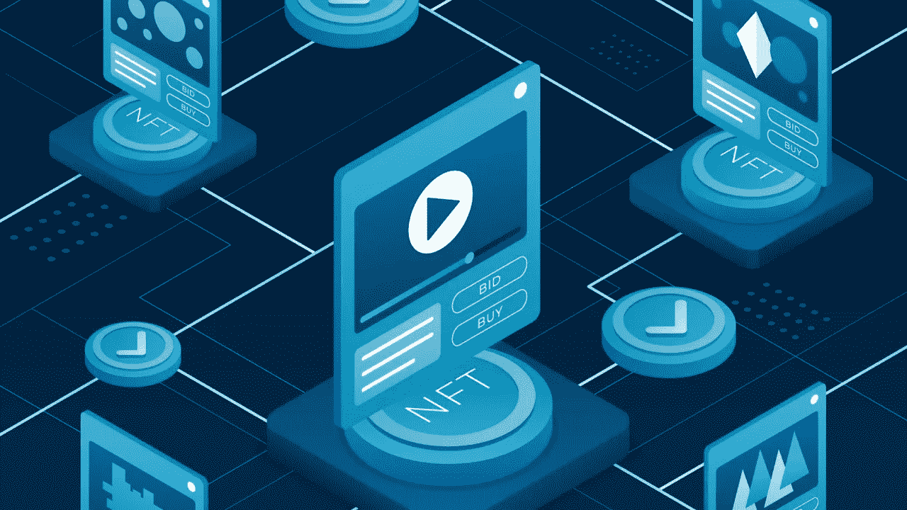

# 推动 2023 年 NFT 市场发展的四大关键趋势

> 原文：<https://medium.com/geekculture/top-4-key-trends-boosting-nft-marketplace-development-in-2023-6cc9c3d6808b?source=collection_archive---------14----------------------->

Fig: Top 4 Key Trends Boosting NFT Marketplace Development In 2023

2014 年出现了 NFTs 然而，炒作和热潮始于 2021 年，不可否认这是一个突破性的一年。这时，非功能性食物已经成为镇上每个角落谈论最多的话题。NFTs 的成功主要是因为见证了 NFT 市场的流行，如 OpenSea、Rarible、Magic Eden、LooksRare、NBA Top Shot、CryptoPunks、Atomic Market 等。

随着 NFTs 的人气与日俱增，投资 [**NFT 市场开发**](https://www.turnkeytown.com/nft-marketplace-development) 将是一个明智的选择，最终将带来巨大的成功率和创收。许多个人和企业家都渴望利用目前的市场趋势，并推出他们的 NFT 市场，奠定了坚实的基础，在 NFT 宇宙。这是一篇让你深入了解 2022 年 NFT 市场流行发展趋势的博客。穿过去！

# 2022 年 NFT 市场发展趋势值得期待

## NFT 游戏市场发展

区块链驱动的游戏在交易游戏中的物品时给用户一种真实的体验。这可能是配件，化身的武器，虚拟土地等。玩赚游戏的概念在游戏玩家中非常流行，因为他们可以购买游戏中的物品并玩游戏。当他们赢了，他们会得到奖励。

Axie Infinity 就是这样一个 NFT 游戏市场，用户/玩家可以在这里购买 Axie 并参与战斗。他们甚至可以选择繁殖 axies 来升级功能。这个平台是由以太坊区块链支持的。

NFTs 彻底改变了游戏行业，带来了积极的影响。因此，不可否认，在这个区块链时代，推动 NFT 游戏市场的发展是合理的。

## 多连锁 NFT 市场开发

在这里，多链 NFT 市场表示在多个区块链上运行的 NFT 市场。这将极大地保留用于发展的每一个区块链的好处。

以太坊是第一个被广泛使用的区块链。但是，由于它的缺点，出现了其他克服以太坊缺点的区块链，拥有各种好处。支持多种区块链技术带来了额外的好处。

## 名人 NFT 市场开发

知道了 NFTs 趋势的流行和突出，这引起了名人的注意，随后，他们在市场上推出了他们的 NFTs。一些流行和顶级名人抓住了这个机会，如格兰姆斯、史努比·道格、肖恩·蒙德兹、帕丽斯·希尔顿、艾伦·德杰尼勒斯、托尼·霍克、杰克·多西、莱昂内尔·梅西等等。

这是名人 NFT 市场发挥重要作用的时候。通过这一点，个人将能够跟随名人 NFT 市场的发展，并为名人提供一个空间来推出他们的数字资产，并在他们的追随者中变得越来越熟悉他们的作品，随后实现货币化。

## 元宇宙 NFT 市场发展

‘元宇宙’这个词是尼尔·斯蒂芬森(Neal Stephenson)在他的科幻小说中杜撰出来的，不再是科幻概念；成为现实。自从脸书改名为梅塔后，元宇宙一直很热闹。

元宇宙和非功能性脂肪的混合物有很多好处。元宇宙 NFT 市场是一个虚拟的媒介或平台，用户可以在其中交易头像、虚拟土地等。分权制就是一个很好的例子。

元宇宙 NFT 市场的发展为有抱负的企业家提供了机会，启动元宇宙的 NFT 交易平台，并成为元宇宙 NFT 世界的先驱。

## 定论

非正规金融交易的兴起和 NFT 市场人气的高涨推动了这股力量，点燃了企业家精神的火花，让他们步入 NFT 世界。你打算潜入 NFT 浪吗？进军 2022 年 NFT 市场发展，顺应潮流，为享受收益铺平道路。