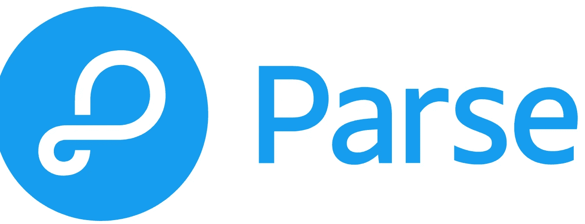

# 4 大开源 BaaS 平台

> 原文：<https://medium.com/geekculture/top-4-open-source-baas-platforms-26c79c01843f?source=collection_archive---------3----------------------->

在构建 web 或移动应用程序时，大多数时候您需要一个后端来处理数据存储和身份验证，让我们来看看 BaaS 的最佳开源解决方案。

Parse Logo is one of the open-source BaaS

# 什么是 BaaS？

让我们从一些基本概念开始，什么是 web 或移动应用后端？