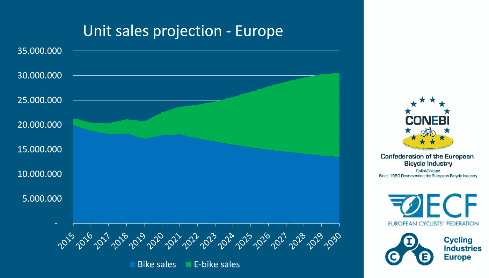
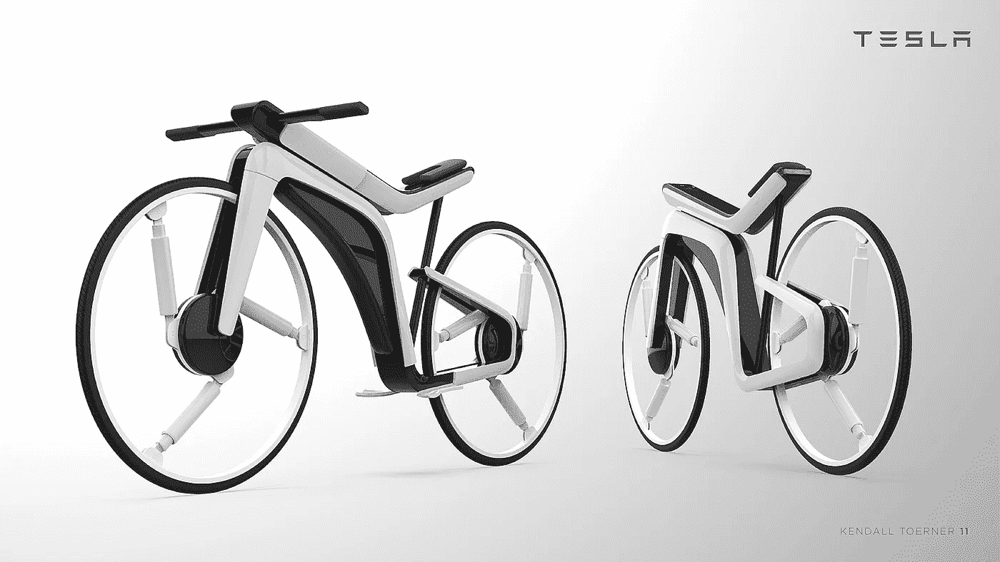

# 投资自行车的 4 大理由？

> 原文：<https://medium.com/geekculture/top-4-reasons-why-investing-in-bicycles-c3b0c3dbaf93?source=collection_archive---------33----------------------->

Photo by [Satria Hutama](https://unsplash.com/@satriahutama?utm_source=medium&utm_medium=referral) on [Unsplash](https://unsplash.com?utm_source=medium&utm_medium=referral)

我们在同一个城市的移动方式正在发生变化。交通消费模式从拥有私人车辆作为唯一的旅行形式的传统位置发展到一种整合了所有现有交通模式的足够信息的模式，以便用户可以个性化他们的旅行，如何快速舒适地访问这些交通工具，完全改变到目前为止构思的旅行体验。这种集成的可能性被称为移动即服务( [MaaS](https://nordicroads.com/european-mobility-as-a-service-roadmap-2025/) )，包括传输网络和电信基础设施以及服务的支付系统。

这种新的共享移动模式的流行是由经济、社会和环境因素推动的。那么，为什么投资自行车是个好主意呢？让我们开始吧。

# 催化剂#1:增长

自行车销售开始加速。自行车行业正在蓬勃发展，它们对欧盟的绿色复苏至关重要。预计到 2030 年，自行车市场将从[的 2000 万辆扩大到 3000 万辆。](https://ecf.com/news-and-events/news/get-ready-cycling-boom-experts-predict-30-million-bicycle-sales-2030)

电动自行车的年增长率预计为 15%，到 2030 年将售出 1800 万辆。

e-bike is the biggest driver of the market surge, [ECF](https://ecf.com/news-and-events/news/get-ready-cycling-boom-experts-predict-30-million-bicycle-sales-2030)

2019 年，共售出 370 万辆电动自行车。预计到 2030 年，欧盟 28 国的电动自行车销量将达到每年 1700 万辆。这表明，由于自行车销售被电动自行车购买所取代，传统自行车行业最近的下滑将在 2020 年结束。

> *“电动自行车是改变的最有力工具。我们远远领先于电动汽车。”* —凯文·梅恩，欧洲自行车工业公司首席执行官

# 催化剂 2:绿色转型

循环产业创造新的绿色就业和经济增长。我们希望为绿色转型做出贡献。我们希望支持该行业，并在欧洲发展绿色工作。

自行车和自行车旅游业具有巨大的经济潜力。在整个欧洲地区，估计有 75 万个与自行车相关的工作岗位。自行车在欧盟的使用份额翻一番将创造 400，000 个额外的就业机会，并为€增加 35 亿欧元的自行车零售额。如果欧洲主要城市达到哥本哈根的自行车模式份额，每年将有超过 76，600 人受雇于绿色健康的交通运输。

根据 CIE 的最新调查结果，*“94%的公司计划在未来两年增加员工。54%的人已经这样做了。”*

欧盟每年生产约 2000 万辆自行车，其中电动自行车占 2019 年销量的 333 万辆。这一增长起点不高，但增幅很大。到 2030 年，电动自行车的销量预计将达到 1350 万辆。对电动自行车的新投资正值自行车运动在全球蓬勃发展之际，自行车销量，尤其是电动自行车销量创下纪录。

[欧盟移动地图报告](https://eu.boell.org/en/European-Mobility-Atlas-2021-PDF?dimension1=euma2021)描绘了欧洲的移动景观及其随时间的演变。电动自行车的销量目前占欧盟[自行车总销量](https://cyclingindustry.news/electric-bike-sales-now-17-of-all-eu-cycle-sales-growth-rate-accellerating/)的 17%。例如，电动货运自行车将骑行的快乐、刺激和健康优势与小型货车的[实用性结合在一起。在德国，电动自行车的销量增速远高于电动汽车。](https://www.wired.com/gallery/best-electric-cargo-bikes/)

就销售趋势而言，欧洲[收银台 60%的电动自行车销售主要是在欧盟制造的。波兰、意大利、荷兰、保加利亚和罗马尼亚预计将成为自行车行业的主要招聘国。](https://www.mordorintelligence.com/industry-reports/europe-bicycle-market#:~:text=The%20Europe%20bicycle%20market%20is%20highly%20fragmented%20and%20comprises%20many,Ltd)

> “欧盟国家需要认识到，在创造绿色就业和提振经济的同时，循环投资是从结构上改善人们流动模式的最佳方式。”— **欧洲自行车工业联合会总经理 Manuel Marsilio**

# 催化剂 3:对社会的益处

一次自行车旅行对社会有益，减少了公共卫生成本、交通拥堵和 GHG 排放。

共享移动平台正在失去力量，消费者选择拥有自己的自行车，可以得到适当的护理和消毒，并且运输舒适。在这个行业中，电动自行车的发展已经成为以无污染方式在城市中移动的理想方式。健康危机进一步加速了这一部门的增长预测。

将目前的自行车数量增加一倍将防止 30，000 人过早死亡，这主要是由于身体活动的增加，间接经济效益将达到每年 780 亿欧元。你不知道如何摆脱那个肚子吗？骑自行车作为交通工具是一项提供许多健康益处的活动，包括燃烧卡路里、改善心血管健康和加强下背部。

汽车和其他车辆排放的气体已经成为世界城市的主要问题。当在城市环境中循环时，骑自行车意味着一种更可持续的选择，因为它不会污染环境，并鼓励人们始终尊重环境。将目前的自行车数量增加一倍将减少 800 万吨二氧化碳当量(CO2)的温室气体排放，每年带来 11 亿欧元的间接经济效益。

电动自行车是将汽车之旅转变为自行车之旅的绝佳方式。改变的关键是让公司自行车变得像过去的公司汽车一样简单。我们已经在短途旅行中这样做了。你坐过多少次车，停车比开车花的时间还长？自行车可以节省时间，因为游览结束后，你不必把它停在任何地方。

# 催化剂 4:动力

由于新冠肺炎，欧洲委员会和各国政府推荐自行车作为理想的交通工具，自行车行业正经历着巨大的繁荣。它保证保持社会距离，也是一种经济的交通工具，不需要很大的维护费用。

目前零部件短缺，原始设备制造商将不得不决定是否增加产量。甚至大型汽车制造商([特斯拉](https://www.kendalltoerner.com/project/tesla-modelb)、[阿斯顿马丁](https://petrolicious.com/articles/french-bike-maker-teams-with-aston-martin-for-db4-homage)、[奥迪](https://www.audi-technology-portal.de/en/mobility-for-the-future/audi-future-lab-mobility_en/audi-urban-future_en/audi-e-bike-woerthersee_en)或[哈雷戴维森](https://www.serial1.com/))也开始了新的双轮挑战。这种势头反映了自行车如何继续表现良好。

Kendall Toerner — [Model B](https://www.kendalltoerner.com/wp-content/uploads/2020/01/modelb7.jpg)

特别是，就欧洲公共政策而言，这是一个重大转变。第一个促进自行车使用的泛欧洲计划开始实施，这将为我们的社会带来三重好处:通过更多的绿色工作促进当地经济，提高人们的健康水平，积极保护我们的气候。

> 比利时在相关数字上领先，为€的自行车投资预算为 4 . 73 亿欧元，相当于其恢复计划的 8%,如在佛兰德北部地区和布鲁塞尔周围建设自行车高速公路。义大利承诺建造 1，770 公里的自行车道，并将投资€6 亿欧元加强自行车的机动性。罗马尼亚将向€投资 1.2 亿欧元，开发 3000 公里的旅游自行车道，并完成 EuroVelo 6 长距离自行车道。斯洛伐克已经为€拨款 1 亿英镑，用于修建 200 公里长的高质量自行车道。拉脱维亚在其恢复计划中纳入了为日常出行发展自行车基础设施的内容。法国向€拨款 1 亿欧元资助其国家自行车计划，还将在新的气候法律中引入一项计划，让人们报废汽车，以换取购买电动自行车的高额溢价。—ecf.com

# 摘要

*   欧洲自行车市场增长迅速，到 2030 年将从 2000 万辆增长到 3000 万辆。
*   这一扩张有助于绿色转型，支持行业发展，并在欧洲创造绿色就业机会。
*   自行车在许多层面上为社会带来好处，减少公共卫生成本、交通拥堵和 GHG 排放。
*   欧洲公共政策提出了一个重大转变。

欧洲在迈向更健康、更可持续的未来的竞赛中押注于自行车。

我们提供数字工具，让每个人都能骑自行车。人们的福祉与日常流动性密切相关。

现在的挑战是不断帮助创业公司创新！

感谢阅读。

 [## 为自行车热潮做好准备——专家预测，到 2030 年，自行车销量将达到 3000 万辆

### 由于冠状病毒的影响改变了我们整个欧洲的生活和日常习惯，欧洲大陆也…

ecf.com](https://ecf.com/news-and-events/news/get-ready-cycling-boom-experts-predict-30-million-bicycle-sales-2030)  [## 2021 年欧洲交通地图集|海因里希·伯尔基金会|欧盟布鲁塞尔办事处

### 可持续交通和流动性是解决气候危机和实现欧洲发展目标的关键

eu.boell.org](https://eu.boell.org/en/European-Mobility-Atlas-2021-PDF?dimension1=euma2021)  [## 欧洲移动即服务路线图 2025

### 由 CEDR 资助的 MAASiFiE 项目(连接欧洲的移动服务，2015-2017)旨在确定和…

nordicroads.com](https://nordicroads.com/european-mobility-as-a-service-roadmap-2025/)  [## 欧洲自行车市场展望:2017-2030 年(2021 年版)

### 欧洲自行车市场的规模、销量、份额、其他数据、新冠肺炎疫情对欧洲自行车市场的影响…

www.goldsteinresearch.com](https://www.goldsteinresearch.com/report/europe-bicycle-industry-analysis)  [## 家庭最佳电动货运自行车

### 有许多物理、哲学、环境和逻辑上的原因说明为什么骑自行车更好…

www.wired.com](https://www.wired.com/gallery/best-electric-cargo-bikes/)  [## 欧洲自行车市场规模和增长| 2021-2026 年行业分析报告- Mordor Intelligence

### 研究周期:2016 - 2026 下载免费样本 2020 年欧洲自行车市场价值为 163.8741 亿美元…

www.mordorintelligence.com](https://www.mordorintelligence.com/industry-reports/europe-bicycle-market#:~:text=The%20Europe%20bicycle%20market%20is%20highly%20fragmented%20and%20comprises%20many,Ltd)  [## 欧盟成员国在大流行后的恢复计划中忽视了自行车运动

### 欧洲自行车运动员联合会(ECF)对成员国国家恢复和复原计划的新分析…

ecf.com](https://ecf.com/news-and-events/news/eu-member-states-are-neglecting-cycling-post-pandemic-recovery-plans)  [## 自行车事实和数字

### 两年后，ECF 决定看看自 2013 年以来事情发生了怎样的变化，以及从中可以看到什么

ecf.com](https://ecf.com/resources/cycling-facts-and-figures)  [## 自行车-流动性和运输-欧洲委员会

### 骑自行车是利用城市地区昂贵和稀缺空间的有效方式，并且健康、清洁和便宜。它有…

欧盟](https://ec.europa.eu/transport/themes/clean-transport-urban-transport/cycling_en)  [## 欧洲电动自行车市场到 2024 年将达到 235 万辆，Accell Group NV 和 BH BIKES EUROPE SL…

### 伦敦- () - Technavio 一直在关注欧洲的电动自行车市场，预计今年将增长 235 万辆…

www.businesswire.com](https://www.businesswire.com/news/home/20201004005012/en/E-bike-Market-In-Europe-to-Reach-2.35-mn-Units-by-2024-Accell-Group-NV-and-BH-BIKES-EUROPE-SL-Emerge-as-a-Key-Contributors-to-Growth-Technavio)