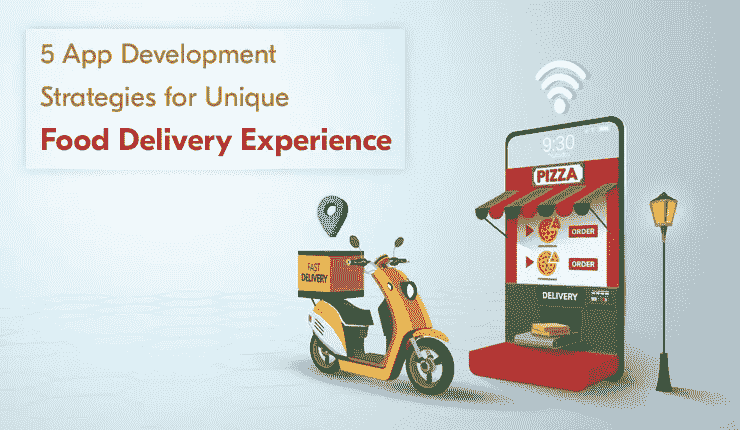
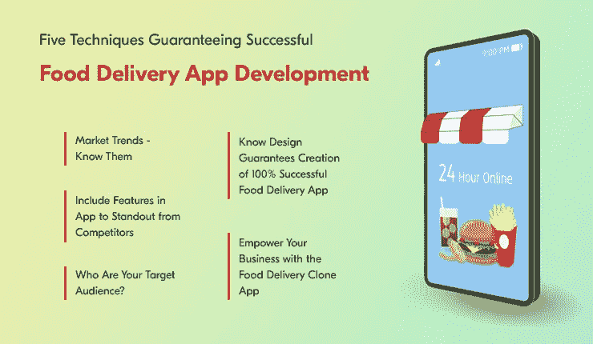

# 独特送餐体验的五大应用开发策略

> 原文：<https://medium.com/geekculture/top-5-app-development-strategies-for-unique-food-delivery-experience-1039f65eaf3b?source=collection_archive---------23----------------------->

Food Delivery App

今天的企业正在寻找各种方法，为他们提供一种媒介，在客户面前展示他们的服务。换句话说，有必要提高他们的知名度。这要归功于我们生活的智能手机世界。随着应用程序成为生活中不可或缺的一部分，对于那些寻求最大限度地成功利用(应用程序)的人来说，它变得更加重要。这将有助于他们(企业)向客户提供无缝服务，并确保通过他们提供的服务获得最大收益。

以传统的食品连锁店和餐馆为例。曾经有一段时间，顾客们会亲自去餐饮店品尝美食。然而，随着按需送餐应用程序的出现，其受欢迎程度成倍增长，特别是在疫情之后，客户在家里享受这些食物变得非常方便。这导致在线食品配送市场的收入快速增长，根据研究，在线食品配送市场[将增长约 8.4%](https://www.statista.com/outlook/dmo/eservices/online-food-delivery/worldwide) 。

这些数字表明，食品配送应用程序确实是一个有利可图的想法，可以用于食品配送企业。它不仅允许顾客在应用程序上点击几下就能获得快餐。这也可以让他们根据自己的口味定制食物。

与此同时，餐馆和小吃店也将有机会通过订单获得稳定的收入，并建立知名度。

因此，如果你是第一次建立基础的食品配送企业，或者已经建立但没有利用食品配送应用程序，这篇文章就是为你准备的。

# 目录

*   **送餐应用——受欢迎的原因**
*   **保证成功开发送餐 App 的五大技巧**

1.  *市场趋势—了解它们*
2.  *了解保证 100%成功送餐应用的设计*
3.  *在应用中加入功能，从竞争对手中脱颖而出*
4.  谁是你的目标受众？
5.  *通过食品配送克隆应用程序让您的企业如虎添翼*

*   **开发一款送餐克隆 App 的成本是多少？**
*   **结尾词**

# 送餐应用——受欢迎的原因

感谢[按需送餐 app](https://www.peppyocean.com/food-ordering-delivery-app-development/) 确保快速送餐；顾客的饥饿感也很容易得到满足。然而，这是这些解决方案首先获得如此广泛流行的原因之一。

这些解决方案如此引人注目还有其他原因。

***以下同入伍。***

加强客户拓展
确保餐厅获得更高的投资回报率
成为餐饮店和餐厅的创收来源，使其能够最大程度地提高知名度。

考虑到这些原因，很明显，拥抱食品交付应用程序以获得业务优势将有助于最大程度地提高收入。它还将帮助他们确保快速食品配送服务。

然而，它需要坚持一些提示。这将有助于确保这些方面的顺利实现，并帮助企业从第一天起就获得良好的可见性。

 [## 十大流行在线食品配送应用在美国掀起浪潮

### 按需分配的零工经济席卷了全世界。这主要是为了确保客户能够快速获得…

smitheliza175.medium.com](https://smitheliza175.medium.com/top-10-popular-online-food-delivery-apps-creating-wave-in-the-usa-f7cc21abc9b8) 

这里有五个最好的方法可以让这变得轻而易举。

# 保证成功开发食品配送应用程序的五项技术

## **1。市场趋势—了解它们**

研究是生意成功的关键。尤其是当你想要满足数百万人的饥饿感时，你必须对竞争对手在其应用中采用的最新趋势进行彻底的研究。这包括应用程序中的功能，以确保无缝的食品交付服务。最后，了解顾客的购买行为和他们点餐时采用的技巧。所有这些都将帮助您为您的送餐应用程序设计策略，以确保无缝的送餐服务。

## **2。Know Design 保证创建 100%成功的送餐应用**

史蒂夫·乔布斯曾就设计说过一句话，“设计不仅仅是它看起来和感觉起来的样子……设计是它如何工作的。”这无疑是真的。

按需送餐应用的设计和用户体验应该是这样的，不仅在视觉上吸引他们，而且使送餐过程无缝顺畅。所有这些都将有助于长期提高你的应用程序的客户保持率。

## **3。在应用中加入功能，从竞争对手中脱颖而出**

你的竞争对手有一款送餐应用。然而，他们可能没有一些实际上可以增加价值的功能。一定要确认他们的身份。这可以帮助你的应用获得 USP(独特的销售主张)。这也会唤起你的客户对你的应用程序的关注。因此，渠道技术栈像人工智能。这将确保用户可以无缝地与应用程序进行交互，并轻松地从应用程序中订餐。

## 4.你的目标受众是谁？

策略、设计和功能对于创建一个成功的食品配送应用程序是不可或缺的。了解你的目标受众无疑也是至关重要的。这意味着你应该了解你的应用程序希望瞄准的客户的人口统计数据、年龄组等。

这将最终帮助您以适合他们要求的方式提供服务，这将通过您创建的食品交付应用程序为您的企业带来最大价值。

## 5.使用食品配送克隆应用程序增强您的业务

最后，利用[食品配送克隆应用开发](https://www.peppyocean.com/)为你的业务带来优势。从头开始构建一个应用程序无疑会消耗大量的时间和资金。使用克隆应用程序，您可以在这些方面节省成本，并确保您获得一个易于根据不断变化的业务需求进行更新的解决方案，并在 iOS 或 Android 平台上无缝工作。

因此，为你的企业提供食品配送克隆应用将保证你为顾客、配送专业人员、餐馆和你获得单独的应用。此外，你还可以为这些用户提供网络平台。与此同时，你将能够根据不断变化的业务需求修改功能，并轻松地在 iOS 和 Android 上操作应用程序。

因此，如果你是第一次在食品交付领域建立基础，或者有一个应用程序无法提供你想要的结果，食品交付克隆应用程序是你的解决方案。

要知道，现在市场上有许多克隆产品。因此，要更好地了解一个，你需要做好你的研究。这会给你一个市场上最好的估计。

***最后，分析一下你开发这个产品所招致的成本。***

# 开发一款送餐克隆 App 的成本是多少？

为了构建一个食品交付克隆应用程序，你可能需要花费大约 2000 到 5000 美元。这取决于您在中包括的功能和自定义。这也包括您采用的技术堆栈。

因此，基于技术规格、特性等等，你能无缝地确定你需要为构建食品交付克隆应用留出的资金吗？

# 结尾词

食品配送应用程序简化了客户的食品配送服务。这也让餐馆在网上建立了良好的知名度，并获得了可观的收入。然而，由于从头构建一个应用程序可能需要大量的时间和资金，所以你最好获得食品交付克隆应用程序 edge。它将帮助您提供独特的食品配送服务，满足客户的需求，从而从第一天起就获得最大的投资回报！