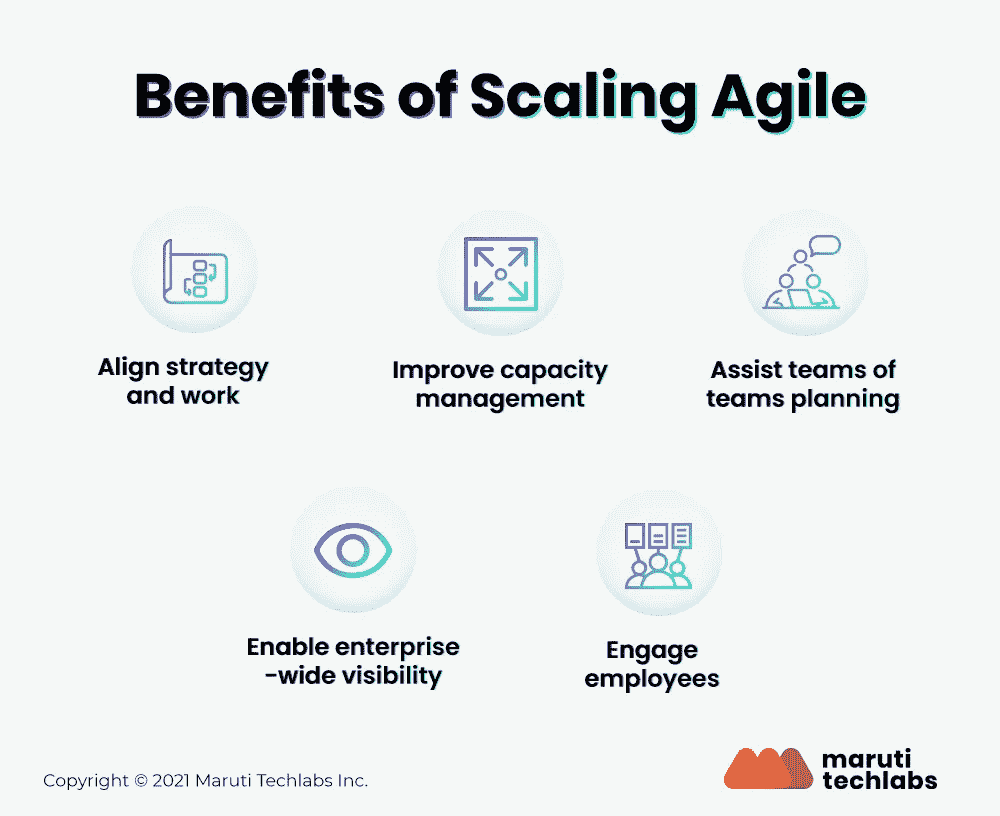

# 扩展敏捷的五大好处

> 原文：<https://medium.com/geekculture/top-5-benefits-of-scaling-agile-9ed6ff0e21e6?source=collection_archive---------6----------------------->

伸缩敏捷是风靡软件行业的时髦词汇，在制造业、电子商务和零售业等其他领域也越来越受欢迎。敏捷软件开发已经存在了 20 年。软件开发的方法从一开始就在发展，以帮助企业跟上市场的步伐。敏捷归结为一个概念，即软件应该定期交付，让客户选择接受软件，而不是等待他们接受。

# “扩展敏捷”是什么意思？

扩展敏捷是采用经过验证的敏捷方法的过程，比如 scrum 和看板，并在更大的团队中与更多不同的人一起使用它们。传统上，敏捷在不超过 11 人的团队中工作得最好。

公司的成功在于允许员工定义自己的目标和设计产品。他们最终希望将同样的自由和成功应用到更广泛的部门。不幸的是，这是大多数公司陷入困境的地方:他们的员工缺乏持续的动力，过于依赖经理的指导。这就是扩展敏捷的用武之地。

# 扩展敏捷的好处

因为扩展敏捷涉及到管理、文化和技术的转变，所以好处远远大于挑战。一致性、内在质量、透明度和程序执行代表了可伸缩敏捷框架的核心价值。

在一个组织中，将工作流转换成一个可扩展的敏捷框架会带来无数有形和无形的好处。扩展敏捷的企业往往会更快地推向市场，同时提高客户满意度和投资回报率。此外，成功的敏捷公司报告说，他们比那些不太敏捷的敏捷同行更能吸引顶尖人才。让我们在下面详细讨论其中的一些好处:

# 1.调整战略和工作

扩展敏捷将组织的顶层目标与负责实现这些目标的人联系起来。这种一致性有助于创造许多效果，如促进跨团队协作、培养透明度、实现更快的响应时间等等。

扩展敏捷还强调创建 ARTs(敏捷发布系列),以确保团队目标一致，组织中的每个人都专注于为客户创造价值。

# 2.改善容量管理

管理有助于从用特定的度量标准稳定团队到坚持做出关于谁能承担多少工作的明智决策。容量管理与艺术保持一致，并定期使用扩展的敏捷方法进行评估。这些方法侧重于灵活性和变化，使领导层能够定期反思和重新平衡，并最大限度地减少对组织流程的干扰。

# 3.协助团队的团队计划

在整个组织中扩展敏捷需要来自多个团队和部门的不同的人在同一个保护伞下。它可能发生在整个组织的每个部门，如开发和运营，但它总是需要更好的协调。

扩展的敏捷框架通过季度计划活动解决了这个问题，这些活动将跨职能团队聚集在一起，并制定计划来强调潜在的依赖性，根据公司目标交付，并识别风险。这些“团队中的团队”通过让组织中的每个人都清楚地了解季度交付成果，在扩展敏捷中扮演着重要的角色。

# 4.实现企业范围的可见性

可见性不仅仅来自规划。通过连接和可视化每个团队成员的工作，扩展敏捷实现了整个组织的透明性。

领导者和管理者对潜在的障碍有一个全面的了解，并做出明确的选择来恰当地分配工作。扩展敏捷允许他们可视化艺术或团队团队如何测量他们的进展和表现，交付他们的产品，以及评估他们工作的财务影响。

# 5.吸引员工

扩展敏捷深深植根于团队和个人层面的信任。人们有权选择如何交付他们的工作，从而影响高层业务目标。这种信任转化为更快乐、更敬业的员工，他们最终会以更低的离职率、更高的生产率和出色的用户体验为企业带来好处。

# 你应该使用可扩展的敏捷框架吗？

总之，SAFe，一种定期评估的敏捷方法，是组织中最流行的扩展敏捷的框架，因为它的许多特性集中在消除团队成员面临的挑战上。

换句话说，如果您的业务开始向敏捷性过渡，SAFe 是弥合转型差距的最佳选择。与规范的敏捷相比，安全的框架是一种规定的方法，它提供了更多的灵活性，但同时要求组织完全理解敏捷哲学。

阅读关于[扩展敏捷框架及其特征](https://marutitech.com/guide-to-scaled-agile-frameworks/)的整篇文章。