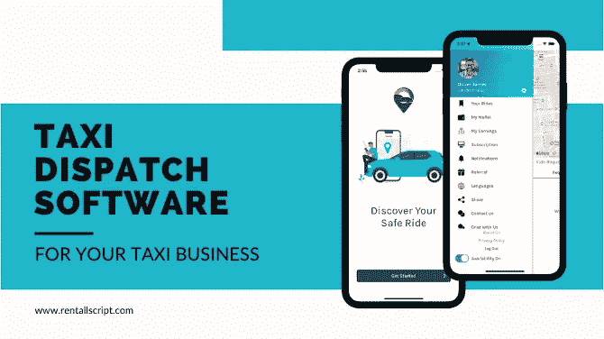

# 出租车调度软件的 5 大好处

> 原文：<https://medium.com/geekculture/top-5-benefits-of-taxi-dispatch-software-8669ebcaa63d?source=collection_archive---------23----------------------->

Taxi dispatch software

出租车调度软件提供了运营高效车队、改善服务和增加收入所需的功能。该系统的核心是一个调度功能，它使用路线优化和 GPS 跟踪来确保乘客被迅速接走和交付。此外，面向司机和客户的移动应用程序提高了便利性，并为拼车公司提供了类似的体验。

# 出租车调度软件的好处

以下是大多数出租车调度车队管理软件共有的几个主要优点。

## 1.实时出租车跟踪

现代出租车调度软件将为您提供精确的 GPS 位置，以最大限度地增加特定区域的行程。您可以利用这种实时 GPS 跟踪来更好地分配工作，或者让自动化服务为您完成。当你扩展到多地点出租车服务并正确跟踪你的车队时，这是至关重要的。

## 2.自动支付

大多数出租车调度软件可能接受不同的支付方式，或者将其转发给第三方服务。不使用另一个应用程序进行支付处理，而是将所有东西都放在一个软件应用程序中是可能的。

## 3.更好的客户体验

客户希望通过多种方式预订出租车服务。出租车调度软件应该能够帮助整合所有的预订请求，无论这些请求来自移动应用程序、电话、网站还是其他来源。客户查看可用性并遵循明确的标准将有助于获得更多预订。这也有助于你为旅行设定明确的期望，并确保更好的客户服务。

## 4.多位置使用

每个乘客市场都是独特的。出租车调度服务可以帮助你适应新的环境，从协调机场交通和接送到在公共交通有限的城市中竞争。例如，出租车调度服务可以帮助你计算城市间的价格。

## 5.分析学

准确的数据对于做出有效的商业决策至关重要。出租车调度服务可以为您提供诸如行驶里程数、运送乘客数、高峰时段、恶劣驾驶条件等信息。利用这些数据可以帮助您优化峰值性能。

这些是出租车调度软件的最大好处，有助于改善您的出租车业务。

## 想融入？

你想让你的出租车生意更上一层楼吗？您准备好更有效地优化和管理您的出租车车队了吗？

Wooberly 是一款 [**打车调度软件**](https://www.rentallscript.com/taxi-dispatch-software/) ，帮助创业者管理运输业务。它是用 Flutter 技术开发的，具有很强的可扩展性。Wooberly 具有视觉吸引力的用户界面——一款出租车调度软件解决方案，让您的用户可以轻松预订行程。

简化的仪表板使所有者能够监控所有平台操作，如预订、交易、骑手和司机管理等。借助 Wooberly 的顶层特性，您可以获得该脚本的完整源代码