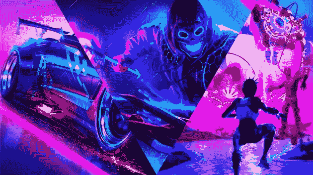
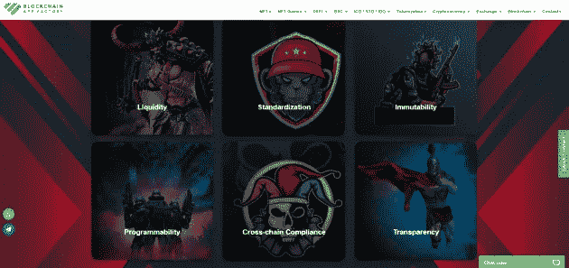
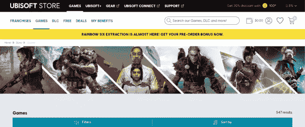
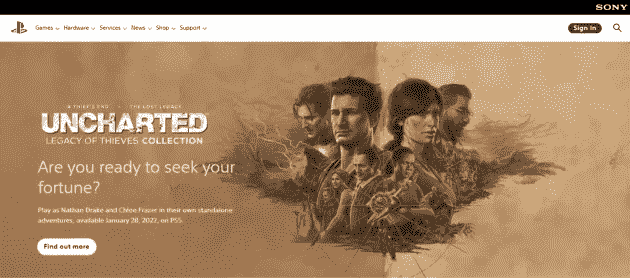
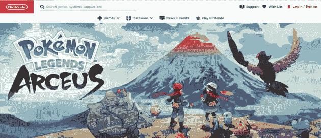
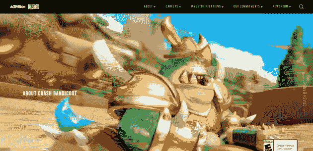

# 2022 年前五大最佳游戏公司

> 原文：<https://medium.com/geekculture/top-5-best-gaming-companies-2022-bb59ea4338c0?source=collection_archive---------7----------------------->

## 这里我们解释了最有价值的视频游戏公司和拥有最好的视频游戏开发者的顶级游戏公司。这些最大的游戏公司将成为游戏时代的市场决定者

**Top Gaming Companies**

# **最有能力决定未来的 5 家游戏公司**

游戏产业不仅仅是让用户体验玩游戏的代码片段。他们有情感，他们有故事，这让游戏行业经历了一次浪潮和演变。从像素化、非常少图形的环境到与真实世界高质量视频游戏**竞争的高纹理图形，数字时代的游戏正在顽强地前进。视频游戏有自己的生态系统，从程序到硬件。这个生态系统真的很大，许多工业巨头正在控制着雕刻业&,影响着娱乐产业中的许多人。**

****游戏遗产有****

**如上所述，游戏绑定了各种情绪，从快乐、浪漫到背叛。玩家可以体验一个真实世界的人可以见证的所有情感。高纹理图形为人们创造了一条参与许多不切实际的任务和沙盒游戏的道路，如侠盗猎车手系列，而社会关注的看门狗系列确实产生了很大的影响。博彩业的遗产可以从他们每年的销售额和每次获得的财富中看出来。**

****接下来呢？****

**时代开始改变，对游戏的关注也开始演变。从包装精美的剧情动作游戏中，人们开始在 PvP 对战皇家游戏中找到更多的乐趣和娱乐。进化仍将发生，以找到下一个最好的游戏来享受和参与。但是数字发展和技术进步正在制作非常精细的游戏。所以下一次进化将会是一个完美的结构&更吸引人。这里有许多游戏公司为游戏空间的发展做出了传奇般的贡献。这个博客将列出最显著增长的**游戏产业，以创造更美好的未来**。**

**在这里，我们不会谈论迄今为止最好的游戏公司或游戏，这将完全基于未来的进步和范围。这将是非常理性的，尽可能地满足和启发我们对未来的理解。**

# **五大游戏公司**

****

****Top 5 Gaming Companies****

****1。** [**区块链 App 工厂**](https://bit.ly/3O8YJDM)**

****

****NFT Game Development company Blockchain App Factory****

**区块链应用工厂听起来更像一家应用公司，但他们制作基于 NFT 的游戏和 NFT 的游戏平台。他们已经有了像 NFT 游戏平台这样的密码朋克，甚至还有像 DungeonSwap 这样的游戏平台，这样的例子不胜枚举。该公司被认为是游戏行业的主要参与者之一，是因为 NFT 在加密金融科技时代打开了局面。NFT 引入了**游戏赚概念**，玩家可以一边玩游戏一边赚钱。他们有各种可能的方法在游戏中赚钱。成为游戏开发公司之一，而不是一个更大范围的平台，是影响游戏行业未来的最佳方式。因此，通过这种方式，区块链应用工厂将在游戏平台中发挥更大的作用。**

****2。** [**育碧**](https://www.ubisoft.com/en-us/games)**

****

****Ubisoft****

**育碧在游戏开发方面有很多事情要考虑，这也是游戏行业最早赚到几十亿美元的公司之一。育碧推出的游戏总是有一个非常优秀的游戏环境&对社会有远见。育碧拥有大约 70 亿美元的净资产，但它被认为是最具未来感的游戏开发公司，因为它在游戏开发中表现出了创造力和创新精神。育碧是极少数能够开发基于城市和技术的黑客游戏的公司之一，同时，他们也可以开发具有历史价值的游戏。育碧已经展示了他们的创意和互动游戏在市场上的成功。因此，在不久的将来，育碧可能成为抓住发展脉搏的杰出游戏公司之一。**

****3。** [**索尼娱乐**](https://www.playstation.com/en-us/)**

****

****Sony Entertainment****

**索尼娱乐，仅仅是这个名字，就有很高的品牌价值，因为他们已经在大多数可能的技术中成功地开辟了道路。尽管在智能手机行业遭遇挫折，索尼娱乐仍是游戏机游戏的主要市场领导者。他们在游戏机游戏行业拥有超过 45%的市场份额。索尼娱乐在游戏领域拥有最好的硬件份额。在未来，对显卡和其他支持驱动程序等硬件的需求将是一个重要因素。因此，有了生态系统，索尼可以轻而易举地横扫并主导游戏发展的空间。这个巨人有大约 2600 亿美元的净资产来支撑未来。**

****4。** [**任天堂**](https://www.nintendo.com/store/games/)**

****

****Nintendo****

**任天堂是另一家基于主机的视频游戏开发公司，其更大的愿景是制作一系列引人入胜的游戏。任天堂 Switch 是最受欢迎的游戏控制台之一。紧凑的设计和流畅的游戏体验让许多人选择了任天堂的游戏机。该平台凭借传奇的超级马里奥游戏系列取得了巨大突破，游戏商店有许多只能在任天堂商店内购买的优秀&独家游戏，增加了购买比例。他们是非常优秀的游戏开发者&他们的硬件非常好。这使得该平台成为游戏行业非常可靠的未来玩家，目前的净资产为 600 亿美元。任天堂已经征战多年。他们有非常大的盒装显示器有机发光二极管床单。他们的遗产也可以成为未来依赖他们的理由。**

****5。** [**动视暴雪**](https://www.activisionblizzard.com/)**

****

****Activision Blizzard****

**动视暴雪是一家优秀的游戏开发公司，拥有非常高的实验率，更重要的是，他们基于故事的游戏拥有庞大的粉丝群。尽管如此，使命召唤现代战争被认为是玩游戏的最佳情节。动视在游戏领域也有许多失败和失败。他们的 RPG 和幻想游戏都有非常庞大的粉丝群。他们向移动平台的新发展也获得了很好的反响。凭借袖下的大量资源，动视也将成为游戏行业未来的最佳玩家之一。以 250 亿美元的净值，他们可以更好地领导游戏行业的市场。**