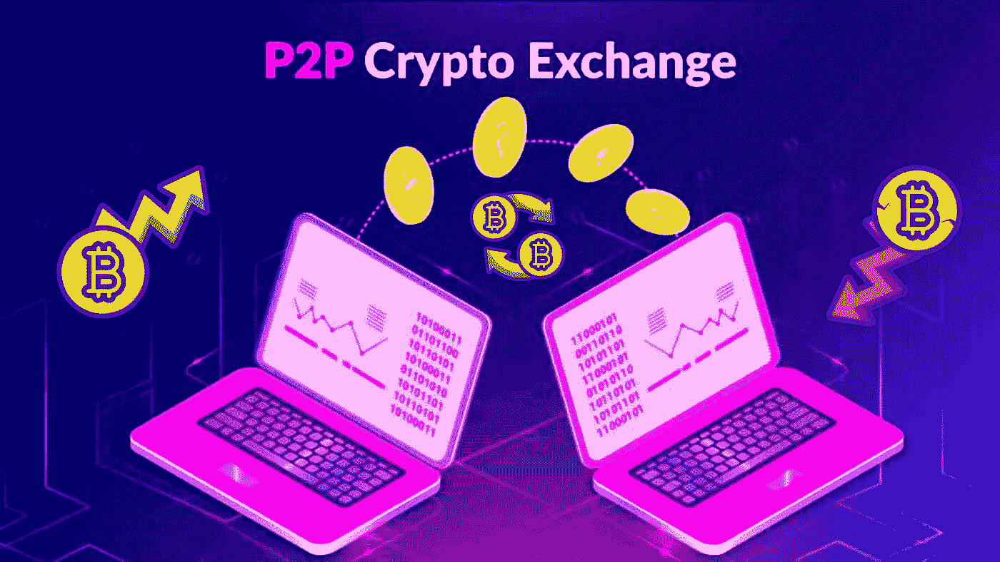

# 2022 年最佳 P2P 加密交易所前五名

> 原文：<https://medium.com/geekculture/top-5-best-p2p-crypto-exchanges-2022-8308cb04458f?source=collection_archive---------9----------------------->

## 这里我们解释了最好的 P2P 加密交换。顶级分散的 P2P 加密交换天然气费也可以在这个博客。

**Best P2P Crypto Exchanges**

P2P 加密交易所是被称为加密货币的虚拟货币交易的基石。加密货币正在成为数字空间中一个广为人知的实体。自从它进入数字空间以来，它就变得非常不可思议。一开始，当它被创建和推出时，每个人都不确定是否要投资它，因为它对每个人来说都是相对新的。但是，现在，加密货币正在成为增长最快的数字经济的代表。这些新颖的货币是在顶级 p2p 加密交易所的帮助下在买卖双方之间进行交易的。数字空间中有各种加密货币交易所。但是，只有少数几个脱颖而出，成为最好的 p2p 加密交易所。点对点加密交换平台直接与买方和卖方交易，并在智能合约和区块链技术的帮助下进行加密货币交易。因此，取消了中间商，从而实现了快速、安全和分散的交易。P2P 加密货币交易所的发展正在成为数字空间中每个人的坚实商业模式和巨大投资池。因此，如果你想开始交易加密货币并体验新奇，这是目前数字市场上最好的 5 个 p2p 加密交易所。此外，在安全有效的交易方面，这些交易所将是一个很好的盟友。

# **我们现在最喜欢的 P2P 加密交易所**

*   [币安 ](https://bit.ly/3kOZ0ih)

币安是数字世界中最好的 p2p 加密交易所之一。它最出名的是在点对点网络环境中令人印象深刻的比特币交易。这种加密交换使用户不仅可以购买比特币，还可以购买其他 60 种加密货币，包括 Chainlink、Litecoin、Dogecoin 等。此外，在使用 p2p 系统时，收取者费用被取消，但收取的制作者费用高达 0.35%。最重要的是，这被 P2P 网络大量使用，它统治着世界各地想要有效交易加密货币的人。

*   [**WazirX**](https://bit.ly/3kuuR7y)

WazirX 是一个印度 p2p 加密交换平台。这个平台支持各种加密货币的买卖。这是印度最可靠的点对点加密货币交易所。Wazirx 实际上是在 2019 年被币安收购的，截至 2021 年底，这家加密货币交易所的日交易量为 1.53 亿美元。这是一个明显的迹象，表明这个平台的清算是巨大的。因此，允许用户有效地参与交易。在 WazirX，只有 USDT 的买卖是可能的，而其他稳定的硬币不能交易。这些因素为 WazirX 成为数字领域最好的 p2p 加密交易所铺平了道路。

*   [**库币**](https://www.kucoin.com/)

KuCoins 是世界上最大的 T4 P2P 加密交易所之一。这个平台是专为非美国交易者准备的，他们准备向更先进的交易机制迈进，并拥有丰富的功能。关于这种加密交换的有趣因素是，当加密货币在加密货币钱包中休息时，它允许你获得利息。因此，这为成为数字空间中最好的 5 家 p2p 加密交易所之一铺平了道路。

*   [**Bybit**](https://www.bybit.com/)

Bybit 通常被认为是加密市场中顶级的 p2p 加密交易所之一。这个平台允许来自不同国家的商人开始交易。这种加密交易帮助用户以优化的价格开始买卖两个交易者的资产。Bybit 支持多种支付模式，最多可达 80 种。

*   [**火币**](https://www.huobi.com/en-us/)

火币是亚洲大陆顶尖的 p2p 加密交易所之一。这个交易平台从 2013 年开始就一直高居榜首。这个平台上的客户服务运行速度很快，响应速度也很快。这些因素是成功的，因为市场是不稳定的。在这种加密交易中，买卖双方不需要支付任何交易费用。因此，使这个平台成为数字空间中一个强有力的竞争者。

## **结论**

P2P 加密交易所是交易加密货币的最佳方式。因此，当你开始在分散的生态系统中交易时，知道最好的 5 个 p2p 加密交易所将是非常容易和有用的。因此，有效地为广泛的投资和商业机会铺平了道路。