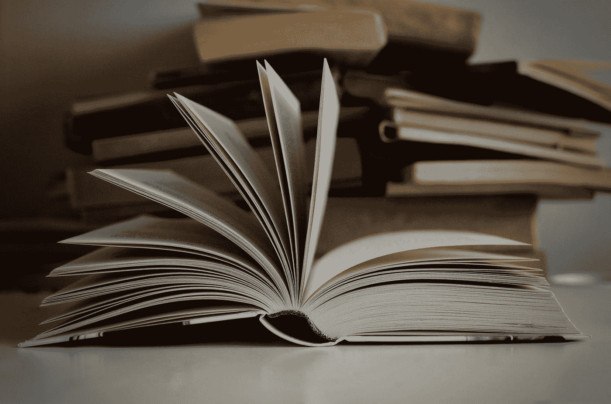

# 完全初学者 2022 年学习数据科学的前 5 本书

> 原文：<https://medium.com/geekculture/top-5-books-to-learn-data-science-in-2022-for-complete-beginners-ad96bc911e63?source=collection_archive---------2----------------------->

Photo by [Mikołaj](https://unsplash.com/@qmikola?utm_source=medium&utm_medium=referral) on [Unsplash](https://unsplash.com?utm_source=medium&utm_medium=referral)

那么，你已经学习了[数据科学的先决条件](https://betterdatascience.com/best-data-science-prerequisite-books/)并准备好面对真正的交易了吗？这就是排名前五的数据科学书籍的来源。我们将分享初学数据科学的初学者可以遵循的最佳选择。

这些书已经帮助成千上万的人学习数据分析，可视化，高级编程技能，机器…