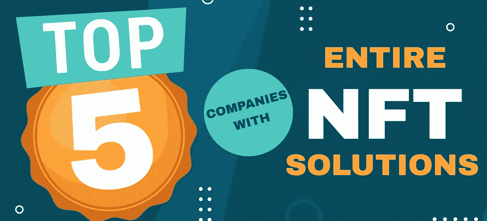
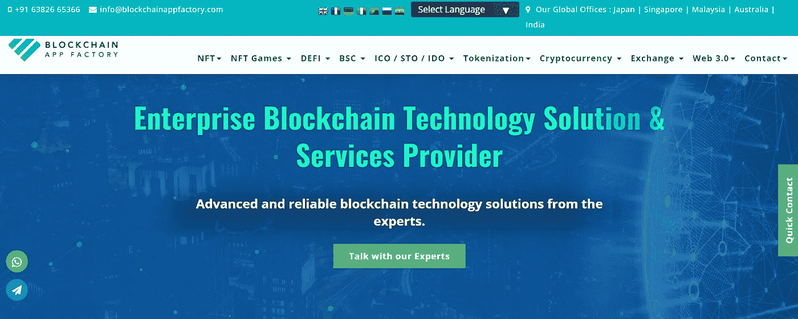
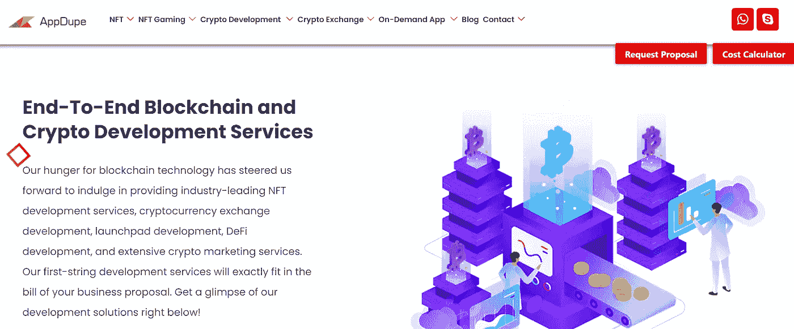
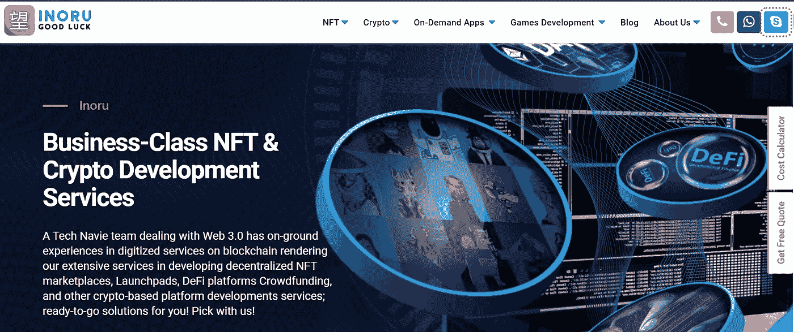
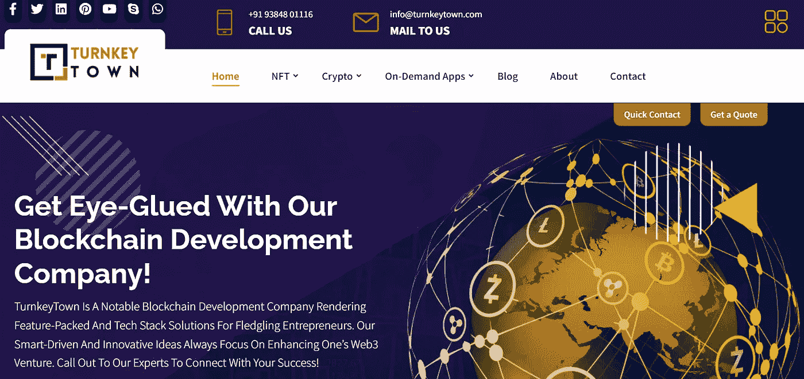
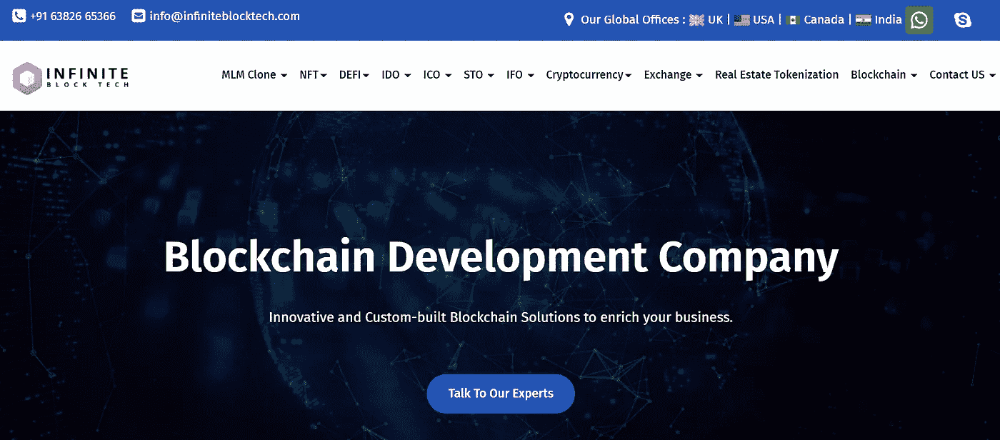

# 通过营销开发 NFT 市场的前 5 家公司

> 原文：<https://medium.com/geekculture/top-5-companies-that-develop-nft-marketplace-with-marketing-b771f178ff96?source=collection_archive---------20----------------------->

自从不可替代令牌(NFT)在 2014 年首次出现以来，声称可以提供所有权和真实性的证明，区块链专家表示，这些令牌将决定我们在虚拟环境中度过时间的方式。在不到十年的时间里，这些代币的地位迅速上升，我们见证了 2021 年全球销售热潮中 NFT 的能力。短时间内这种水平的潜力使 NFTs 成为计划成为 Web3 革命一部分的新企业家的首选解决方案。这篇博客给你一些关于 2022 年 NFT 市场发展和 NFT 营销公司前五名的见解。

# 区块链 App 工厂

该领域的先驱区块链应用工厂(Blockchain App Factory)甚至在流行的 CryptoKitties 到来之前就已经看到了 NFTs 的发展。该公司拥有经验丰富的专业人员，他们开发了许多基于区块链的应用程序，包括从零开始的[**【NFT 市场】**](https://bit.ly/38F0zgg) 和现成的白色标签解决方案。除了作为一家核心开发公司， [**区块链应用工厂还为 NFT 应用提供营销服务**](https://bit.ly/39Oaos8) ，这些应用因其采用的各种策略而获得了大量关注。重要的一点是要注意，公司对每个项目都采用了以客户为中心的方法，并且通过结果可以清楚地看到这一点。该公司的其他服务包括开发 NFT 游戏、加密货币、加密交易所和分散金融(DeFi)应用。

# AppDupe

AppDupe 最初是一家移动应用开发公司，由于技术的潜力，它已经转向区块链领域。该公司现在提供与 NFTs、市场、首次发行发射台、密码交易所等的开发和营销相关的服务。当谈到 [**NFT 市场开发时，AppDupe**](https://bit.ly/3wJD8Kr) 是细分市场中的佼佼者之一，因为它在从头创建这些应用程序和现成的解决方案方面拥有专业知识。此外，AppDupe 的 NFT 营销服务工作侧重于以正确的比例混合传统和加密特定的数字营销策略，以促进其客户企业。

# 伊诺鲁

INORU 是一家商业级的 NFT 和加密应用程序开发公司，它有一个相当好听的日文名字，意思是“希望”。INORU 的专家专门开发 NFT 应用程序，如从零开始的市场和游戏，以及随时可部署的软件。特别是该公司的**NFT 市场解决方案，在最近几个月凭借一些流行的市场产品获得了很多关注。INORU 还有一个极客推广部门，利用各种 NFT 营销服务技术有效地推广客户项目。INORU 提供的其他服务包括开发加密交换、DeFi 应用程序和首次发行(ICO 和 IDO)发射台。**

# **交钥匙城镇**

****

**Turnkey Town 是一家专注于不同 Web3 应用的开发公司，包括 NFTs 和基于加密的平台。该公司的一系列白色标签 NFT 市场解决方案和从零开始的开发已经帮助许多 NFT 企业在虚拟世界打上了自己的印记。该公司还开发加密应用程序，如交易所、发射台和 DeFi 平台，这些应用程序在客户反馈方面赢得了很高的声誉。你可以利用优秀的 NFT 服务，特别是 [**NFT 市场开发**](https://bit.ly/3yZ68ka) 和公司专业人士针对任何区块链的促销活动。**

# **无限块技术**

****

**另一家上榜的区块链巨头无限街区科技公司专门提供与 NFT 发展和营销相关的服务。该公司为各种区块链网络的 NFT 市场提供高质量的开发解决方案。此外，Infinite Block Tech 的专家还开发基于加密的应用程序，包括 ICO/IDO launchpads、加密交换和安全令牌产品等。该公司的专业人士应用的营销策略对他们的客户业务产生了巨大的影响，包括各种 NFT 市场的公司。**

# **一些结束语**

**尽管我们可以说开发 NFT 市场并向公众营销是一项艰巨的任务，但更艰巨的工作在于选择合适的合作伙伴来为您的业务奠定基础。选择一家最符合你的兴趣和财力的公司是很重要的。上述五家公司在 NFT 市场开发和 NFT 营销服务的各个方面都表现出色。您可以选择其中任何一种，因为它们都专注于满足客户需求，同时为您的业务创建完美的平台。**