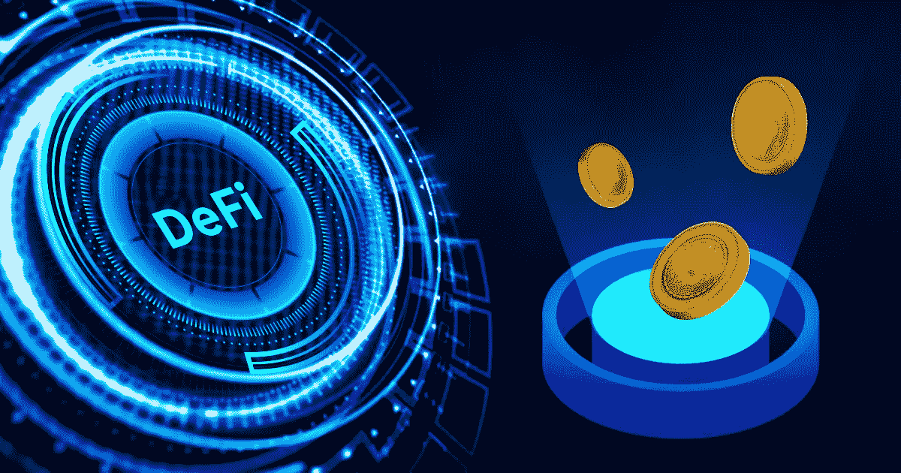
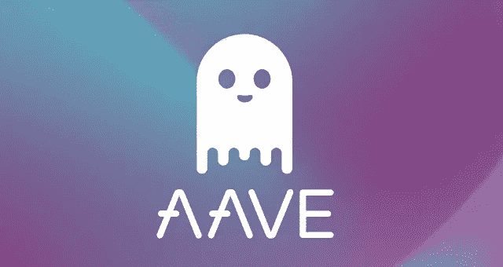
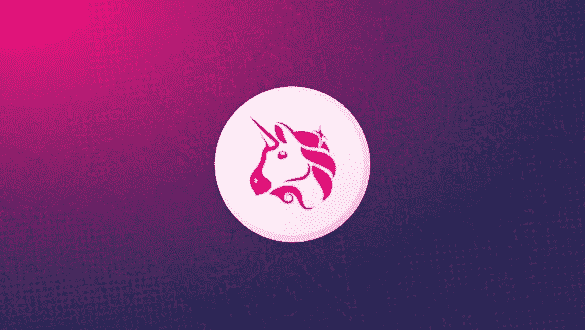
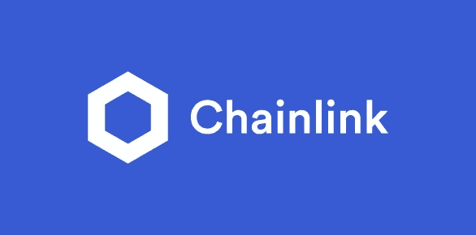

# 2022 年五大 DeFi 发展

> 原文：<https://medium.com/geekculture/top-5-defi-developments-in-2022-6a463221570e?source=collection_archive---------19----------------------->

Decentralized Finance ( Defi)

自远古以来，人类就对交换资产有着敏锐的眼光，并主要开创了借贷文化。这种文化是如此强烈，以至于它慢慢开始成为他们生活的来源。这种文化的目的是和谐地生活，并帮助他的邻居或同胞。简而言之，“这是一种帮助需要，与善行”遵循了一个特定的时期，直到名为饕餮的容器击中了人的头部。

这种文化慢慢被更高的组织和官员接管。然而，这是对暴民的一个更大的倡议。具有讽刺意味的是，这些中介机构对几乎每笔交易和维护都收取费用，以至于它成为了一个巨大的商业平台。

分散金融(Defi)打破了这一厄运，它直接消除了中间人，并让用户可以随时随地进行全职访问。它只在对等加密协议上运行。交易和可访问性更加保密和无障碍，使用户的愿景是一个双赢的局面，并直接去争取。

由于低估事物的暴民的本性，这种未来技术起初受到怀疑。但是，正如大多数 genii 最终所做的那样，这种 Defi 是一种有益的、基于用户的技术，人们可以与之携手。

# **遵守其辉煌的未来:**

Defi 打开的前景将在接下来的短时间内大大加速。这把锁最终打开的关键在于，它消除了中间环节，消除了对金融官僚主义的需求。这种基于区块链的金融系统提高了来源的概率，这显示了比第三方集中融资更高的资本可用率和更低的利率。

随着自动化技术的统治，手工作业开始慢慢消失。与在我们手下工作的人类相比，技术更适合作为我们的仆人。老人说，“技术必须永远是我们的仆人，而不是控制我们。”

未来的 Defi 技术运行在一种创新的智能合同方式上，这种方式涉及用户以更先进和自动化的方法访问平台。当满足特定的先决条件时，所有的交易、购买和销售都会自动发生。交易费用也是去中心化平台的一个显著特点。由于没有机构、银行等中介，交易费用大幅降低。,

区块链以其最佳的安全功能和不可破解的程序而闻名，它标榜以无损的方式构建其链。例如，如果你通过区块链技术发送一封电子邮件，这封电子邮件是完全发送的，你不会有它的副本，这意味着应用程序复制数据的主要功能在区块链中不再可能。你发的消息只有下一端的人发回来给你才能找回，只有他才有权限。这显示了这个多层安全平台是如何处理事情的。

内置以太坊、比特币、系绳等多币种支持。该平台提供多种可能的交易。流动性期权也是 [**分散**](https://en.wikipedia.org/wiki/Decentralized_finance) 领域中的一个主要期权。独特的前景，如保险，匿名，令牌化，等等。那么，作为一种未来金融技术，它还需要什么？

# **2022 年要找的 5 家当红的 Defi 开发公司:**

知道了它在未来的价值，顶级组织和公司选择了追逐它。他们通过巨大的失误和重复而繁荣的东西，是陷阱和企业跳上这一点的声明和证据。 [**德菲发展公司**](https://www.appdupe.com/decentralized-finance-defi-development) 的开拓者有:

# 复合的

Compound

这款 [**复合**](https://www.appdupe.com/compound-clone-script) 平台在 Defi 贷款协议中鹤立鸡群，以其多功能性而闻名，包括:

*   **提取:**根据用户的舒适性和便利性提取代币(存款)的功能。
*   **供应:**整合流动性池，提供足够的 Defi 令牌。
*   **借款:**快速、便捷地获取借款金额。
*   以低利率偿还所获得贷款金额的无缝偿还方法。

# Pancakeswap

Pancake

Pancakeswap 是去中心化宇宙中的又一个金融平台。该平台的显著特点包括:

*   自动做市商:这个词回答了这个问题，它消除了中介，并致力于智能商业算法。
*   **快速审核:**快速审核确保快速完成交易者提出的订单。
*   交易历史跟踪:随时随地跟踪整个交易将是一个透明的过程，以保持我们的信心。

# Aave

Aave

这个世界级的借贷协议给了网民们一个完美的环境来为他们的处境融资。以下是他们值得注意的几点:

*   **独特担保品:**不同的担保品可用性，如 ETH、KNC、LINK、DAI 等。,
*   **无信用检查:**通过规避金融法规和限制，任何有网络连接的人都可以获得虚拟信用。
*   **闪贷:**[**Aave**](https://www.appdupe.com/aave-clone-script)DEX 的显著特点是闪贷，借款人可以在有限的时间内利用贷款而无需锁定抵押品。

# Uniswap

Uniswap

迷人的德克斯舞台运行在永远可靠的以太坊区块链技术上。这个 [**DEX 平台**](https://www.appdupe.com/uniswap-clone) 的闪光点是:

*   **自有保管:**用户可以存储自己的私钥，成为自己资产的全权保管人，可以直接在流动性池中进行交换。
*   **高安全性:**基于区块链，毫无疑问，交易和资产都在正确的位置，对我们来说是可访问和透明的。
*   匿名交易:交易时的匿名性防止了机密信息的丢失。即使没有 KYC 和反洗钱验证，这些也可以实现。

# 链环

Chainlink

由于对分散式协议的需求， [**Chainlink**](https://chain.link/) 已经成为一种首选的分散式 oracle 网络，用于以安全的方式将现实生活中的数据融合到虚拟领域中。它有几个令人兴奋的特点:

*   **防篡改网络:**有了一个分散的高级加密网络，要干预这个平台的网络几乎是不可能的。
*   **智能合同:**自 2014 年以来，DEX 一直致力于革命性的自动化智能合同
*   **著名的合作关系:**炫耀他们与谷歌云、甲骨文和 SWIFT 等巨头的合作，激励企业家和投资者登上他们的平台。

# **缩写为:**

分散金融交易所(DEX)已经达到了一个新的金融网络水平。投资者和企业家对其未来协议和安全技术(区块链)有巨大需求。Defi 发展公司的解决方案将通过其服务和援助带来金融系统的革命。想搭顺风车吗？