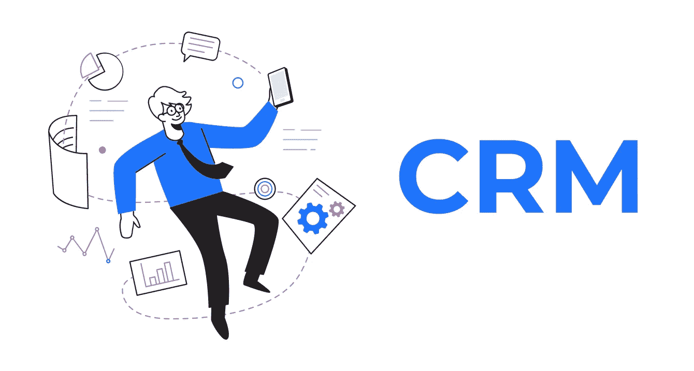
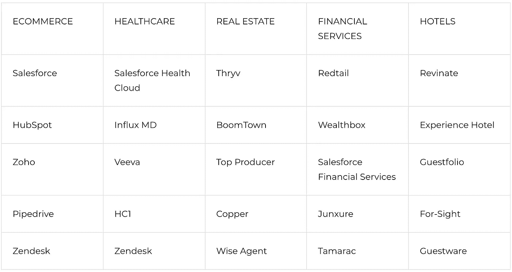

# 使用客户关系管理系统的五大行业

> 原文：<https://medium.com/geekculture/top-5-industries-that-use-crms-2599d2130d0e?source=collection_archive---------14----------------------->

尽管客户关系管理在不久前才成为一件事，但这个概念本身在 20 世纪 70 年代就出现了，当时企业依靠一线反馈、年度调查和客户数据库统计来评估客户满意度。

今天，客户关系管理，或简称 CRM，是一个全面的战略，包括实践，原则，指导方针和技术，一个组织用来管理和分析客户数据和互动的整个客户生命周期。

我们在博客上谈论了很多关于客户关系管理的内容，尤其是 CRM 软件。我们讨论了 CRM 软件开发中的[重要里程碑](https://steelkiwi.com/blog/how-to-create-a-custom-crm-software-for-your-business/)，比较了[最佳 CRM](https://steelkiwi.com/blog/ecommerce-crm-software-examples/)，并与[分享了我们构建 CRM 系统的经验](https://steelkiwi.com/blog/how-to-develop-a-crm-system-for-client-management/)。现在是谈论最需要 CRM 软件的行业的好时机。

# 零售和电子商务

购物通常包括去商店或在网上买东西。在过去的一年里，封锁、零售店关闭和旅游禁令使得电子商务增长更快。据麦肯锡称，在 2020 年 2 月至 2020 年 4 月期间，电子商务仅用了三个月就领先了 10 年。消费者和品牌在网上蜂拥而至，使得网上零售成为经济的甜蜜点。

与客户有效沟通并不容易。[销售 CRM 软件](https://steelkiwi.com/blog/custom-ecommerce-crm/)帮助零售商和电子商务企业管理客户互动和内部沟通。下面详细讨论一下 CRM 软件的好处。

# CRM 软件在零售和电子商务中有什么好处？

*   **了解客户**

客户关系管理可以让你随时掌握所有的客户信息。您可以在一个地方存储关键数据、管理客户记录和自动化客户交互。

*   **更好地了解您的销售线索并保持其畅通**

有了 CRM 软件，你可以看到谁与你的业务互动，如何互动，你的机会在哪里，以及你与潜在客户和客户的互动有多好。您还可以通过关键数据洞察和营销自动化发现和追加销售最有利可图的机会，并防止销售线索泄露。

*   **统一所有渠道的客户支持**

使用 CRM，您可以提供快速的客户服务，尤其是在管理时间敏感的查询时。CRM 软件存储与客户的每一次互动，允许您进行个性化交流，快速提供解决方案，并使用消息模板响应支持请求。

*   **查看您的业务进展情况**

CRM analytics 让您能够更好地了解您的业务相对于您的目标的表现，并允许您衡量销售和营销业绩。

*   **高效管理库存**

深入了解商店中最受欢迎和最不受欢迎的产品有助于优化库存，确保手头有必要的商品，并剔除卖不出去的产品。

# 卫生保健

医疗服务提供者和患者应该作为一个团队来提供高质量的医疗服务。医疗 CRM 使诊所能够安排、优化和同步所有患者交互，分析整个患者护理流程中的信息，并自动化业务流程。

[Medgadget](https://www.medgadget.com/2021/02/healthcare-customer-relationship-management-market-2020-current-trends-new-technology-growth-opportunites-demand-prominent-players-updates-business-environment-analysis-and-forecast-2025.html) 预计，到 2026 年，全球医疗 CRM 市场将达到 96 亿美元，CAGR 增长率为 10.4%。这种预期的市场增长是由于患者参与的重要性日益增加，对结构化数据的需求不断增长，以及医疗保健技术的进步。

# CRM 系统在医疗保健行业有什么好处？

*   **跨部门协调数据**

跨医疗保健系统统一和共享信息是一项挑战。CRM 软件收集并同步实验室、计费、交付和供应等部门之间的关键数据。

*   **获得患者见解**

理解病人的行为是理解你的业务表现的关键。它帮助您发现自己的优势和劣势，看到您的患者面临的共同问题，并找到改善患者体验的方法。此外，您可以按部门查看患者数量，并了解患者将某人转介到您的诊所的可能性。

*   **改善和个性化患者体验**

CRM 软件加快了与客户的沟通，因为所有重要的客户数据都在您的指尖，并且可以自动化客户服务响应、营销任务和重复的工作流程。此外，您可以利用客户洞察来实现个性化。

*   **减少缺席**

医疗保健 CRM 的另一大好处是，它通过提醒患者即将到来的约会，减少了失约和迟到的患者。

*   **减少人为错误**

CRM 通过自动化大部分管理流程，最大限度地减少了人工交互和管理错误(如不准确或不完整的患者记录)。

# 不动产

CRM 软件是奢侈品还是房产中介的必备品？这绝对是必须的。想想房地产经纪人每天都在做什么。安排会议和开放参观；归档房地产建议书、协议和其他房地产文件；与房东和客户打交道——尤其是那些需要立即回复的人；接听电话和回复电子邮件；与过去的客户保持联系。

有了[房地产 CRM](https://steelkiwi.com/blog/build-a-custom-real-estate-crm/) ，你就可以自动处理日常事务，比如收集和存储重要信息。您还可以组织所有的销售活动，分析业绩，并找出营销和销售渠道中的任何漏洞。

# 房地产 CRM 有什么好处？

*   **优化房地产流程**

CRM 减少了手工工作，让您组织、简化和自动化您的销售过程。这可以帮助你提高效率和组织能力，节省管理任务的时间，并有效地与客户沟通，给予他们你的全部注意力。

*   **看看你的表现有多好**

你可以通过销售预测和转换率来衡量你的业务表现。此外，关键指标可以帮助您了解生产力低下的原因，以便您可以进行必要的更改。

*   **有效地创造和培育销售线索**

及时确认、细分、培育、跟进和跟踪销售线索。有了单一的联系人数据库，您可以根据不同的参数和标准对他们进行细分。

*   **处理会议**

让 CRM 为你安排会议，减少无休止的来回邮件。

*   **管理营销活动**

你可以通过自动点滴营销和社交媒体活动每天节省时间，将更多时间花在重要的业务任务上。

# 金融服务

因为金融服务行业很大，金融机构面临着激烈的竞争，努力实现差异化。许多企业——无论是保险公司、银行还是资本市场——已经意识到，他们需要建立和维护良好的客户关系，以获得竞争优势，赢得并留住客户，并使他们的业务更上一层楼。

金融机构使用两种类型的 CRM 软件。*多用途客户关系管理系统*可根据财务流程和工作流程进行定制。*行业特定的客户关系管理系统*自带有用的功能，帮助企业简化现有的运营流程。

# 金融服务行业的 CRM 有什么好处？

*   **建立以客户为中心的文化**

CRM 系统提供了一切必要的东西来细分客户，通过他们喜欢的渠道与他们交流，并个性化客户旅程。您可以在所有渠道和设备上实时交付客户喜爱的一致的数字体验和轻松互动。

*   **提高生产率**

最大限度地减少重复流程，简化提案，提供满足并超越客户期望的服务。

*   **让营销工作更加有效**

有了产品购买趋势和参与渠道等重要数据，有了每个客户的完整资料，您就可以打造个性化的营销之旅。

*   **培养高效的跨部门协作**

跨部门管理和跟踪数据将有助于您了解客户与您的每次互动、他们最关心的问题以及其他数据点，从而帮助您改进营销并促进团队合作、协作和数据共享。

*   **培养客户忠诚度**

客户服务是客户价值的主要驱动力。CRM 系统提供了方便的功能，可以帮助您改善客户服务和客户满意度。即时回答支持问题，获取客户历史记录，将投诉转化为机会。

# 酒店

提高效率是大多数酒店通过使用 CRM 所能取得的最大成功之一。许多酒店经营者转向 CRM 软件来改善客户体验。

可以说，酒店业最重要的因素是客户服务。最成功的酒店非常了解他们的客人，并根据他们的需求提供产品和个性化服务。好客 CRM 在这里派上用场。

# CRM 软件在酒店业有什么好处？

*   **准备好所有重要数据**

CRM 是一个集中的中心，您可以在其中存储客户数据。这些数据可以帮助您评估客户旅程，以获得客户的 360 度视图，打造超个性化和集成的全渠道客户体验，并根据各种标准对客户进行细分。

*   **自动化重复性任务**

通过自动化电子邮件营销和报告等手动任务，将员工从更重要的任务中解放出来。

*   **提高品牌知名度**

有了 CRM 软件，你不仅可以设置自动营销活动，而且可以有效地做到这一点。CRM 可以让您更好地了解目标受众，锁定特定的客户群，轻松找到新的潜在客户，制作个性化的内容，并发现受众的偏好和趋势。

*   **提高客户忠诚度**

通过亲身经历与客户建立联系，让客户有归属感，赢得他们的忠诚度。

# 行业最佳 CRM

有相当多的现有 CRM 系统可以满足上述行业的特定需求。

# 2021 年行业顶级 CRM 软件

[steelkiwi.com](https://steelkiwi.com/)

# 对你的企业来说，最好的 CRM 系统是什么？

医疗保健、电子商务、房地产、金融服务和酒店业并不是唯一使用 CRM 软件的行业。农业、咨询、旅行和旅游、人力资源管理、呼叫中心、制造和制药行业的公司也普遍使用 CRM 软件。

# 找 CRM 开发公司？

无论你在哪个行业，CRM 软件都可能是你业务的必需品。如果现有的 CRM 解决方案都不符合您的业务工作流程和需求，您可以使用定制的 CRM 软件开发。这样做，你就会得到你想要的东西。您将能够:

*   为您的特定业务需求设计一个系统
*   选择要自动化的流程以及授予哪些部门访问哪些信息的权限
*   创建足够灵活的软件，以便随着业务的增长而扩展
*   遵循软件安全最佳实践

想招聘 CRM 应用程序开发人员？在 Steelkiwi，我们拥有构建 CRM 软件的专业知识和经验。查看我们的 [CRM 开发服务](https://steelkiwi.com/expertise/crm-development-company/)，了解更多关于我们的外包服务、技术熟练程度和服务产品的信息。您还可以通过虚拟方式与我们联系，获得您所有问题的答案！请[给我们留言](https://steelkiwi.com/contacts/)，我们会尽快回复您。

这篇文章最初发表于[Steelkiwi.com](https://steelkiwi.com/blog/top-industries-that-use-crms/)