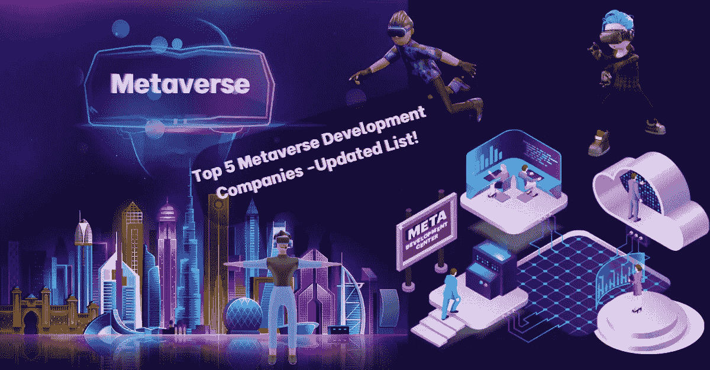
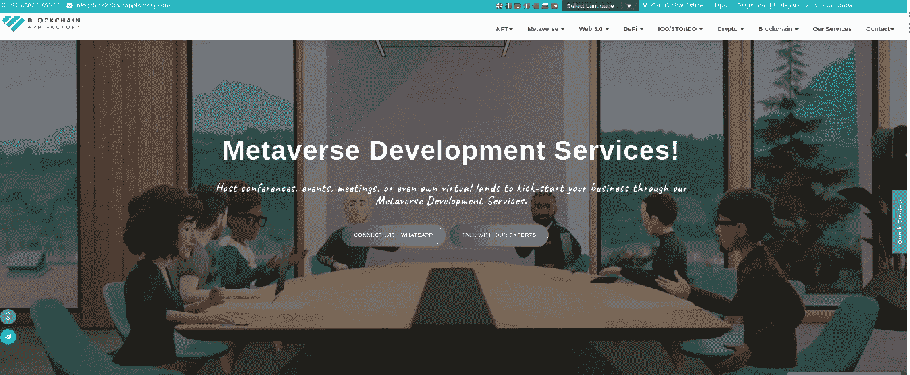
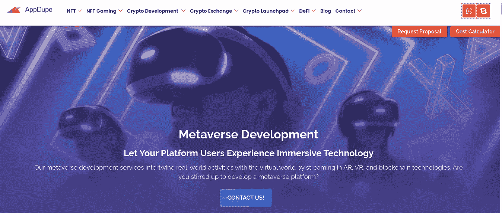
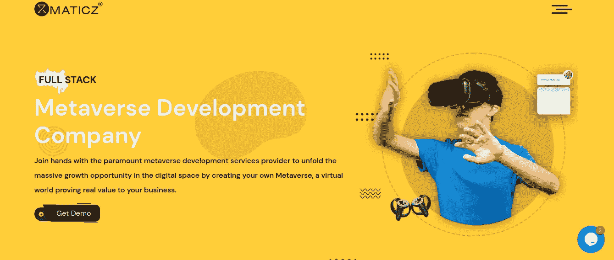
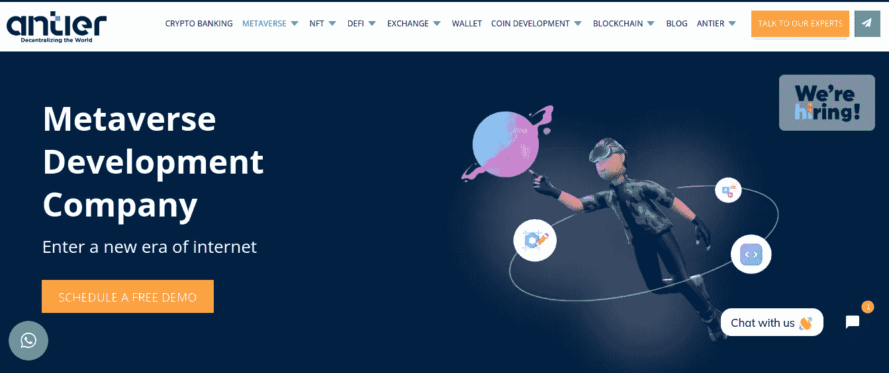

# 元宇宙五大发展公司-最新名单！

> 原文：<https://medium.com/geekculture/top-5-metaverse-development-companies-updated-list-e558f72d082?source=collection_archive---------10----------------------->

**Top 5 Metaverse Development companies**

eb3 技术已经统治世界很长一段时间了，因为不同的原因，各种创新已经走到了最前沿。加密货币、不可替代的代币和相关应用已经大致创造了一个虚拟世界，并已经开始与现实世界平行运行。其中，在 2021 年 NFT 繁荣之后，元宇宙发展因其改善世界的潜力而成为热门话题。虽然一些项目有自己的团队，但大多数元宇宙解决方案选择从[顶级元宇宙开发公司](https://bit.ly/3eox8l5)获得帮助。我们现在将看到领先的公司在元宇宙发展。

[**区块链 App 工厂**](https://bit.ly/3eox8l5)

Blockchain App Factory

区块链应用工厂是元宇宙应用开发领域的顶级玩家，已经在 Web3 领域发展了 7 年多。其专家团队精通从零开始创建元宇宙解决方案和预制平台。该公司可以帮助风险投资公司在多个著名区块链的 metaverses 上推出 NFT 市场、游戏平台和分散式金融应用程序。它认真考虑迎合客户的需求，这使得区块链应用工厂成为世界上顶尖的元宇宙开发公司之一。

[**AppDupe**](https://bit.ly/3TLzfPM)

APPDupe

AppDupe 是世界上最受欢迎的元宇宙开发公司之一，拥有一些全球项目。该公司在元宇宙 NFT 市场开发方面表现出色，这可以从其在 Web3 领域成功运行的客户平台中看出来。其专家专注于在规定的资源范围内工作，同时不影响平台质量。AppDupe 还通过创建除元宇宙解决方案之外的其他 Web3 业务平台来帮助风险投资，使其成为 Web3 领域的多维开发公司。

[**Maticz**](https://bit.ly/3RDZTZ4)

Maticz

Maticz 是一家元宇宙开发公司，主要致力于元宇宙游戏平台的开发。该公司的专家因其元宇宙开发技能而闻名，因为他们可以接触到最新的技术堆栈和与当前一代趋势相关的创新战略。作为最受欢迎的元宇宙开发公司之一，Maticz 参与了一些流行的虚拟空间平台，特别是基于游戏的平台。它还为客户提供值得称赞的元宇宙 NFT 市场开发服务。

****

****LeewayHertz****

**LeewayHertz 是一家总部位于美国的元宇宙开发公司，通过其元宇宙应用程序开发专业知识，已经实现了许多初露头角的企业家的梦想。该公司在推出元宇宙解决方案方面的卓越表现延伸到如此多的风险投资可能性，其中一些甚至是随着时间的推移可能会出现的新颖想法。该公司为元宇宙的初创公司开发 NFT 市场、游戏、社交空间和医疗保健解决方案。除了在元宇宙的开发，LeewayHertz 还专注于风险企业的一般 Web3 开发解决方案。**

**[**安泰尔解**](https://bit.ly/3RkSfmT)**

****

****Antier Solutions****

**Antier Solutions 是一家全球知名的元宇宙应用开发公司。它的专业人员努力而聪明地工作，以确保他们为总部设在元宇宙的企业创造的任何东西都能产生影响，无论其规模大小。该公司掌握元宇宙平台的创意解决方案，如游戏、时尚、房地产、旅游和社交。Antier Solutions 通过为客户构建基于新时代理念的平台，也成为元宇宙发展革命的一部分。**

## **总结想法**

**从上述元宇宙开发公司目前推出的客户产品可以看出，元宇宙开发已成为近期成功的关键。尽管对于任何一家关系紧密的公司来说，与内部团队合作都是必不可少的，但这种想法会带来资源负担，包括时间和金钱。但是，从上述列表中选择一家[元宇宙解决方案](https://bit.ly/3eox8l5)提供商可能会减轻您的负担，因为这些公司的专家知道他们在做什么，并且往往非常了解客户需求。与元宇宙应用程序开发公司合作，亲眼看看结果吧！**