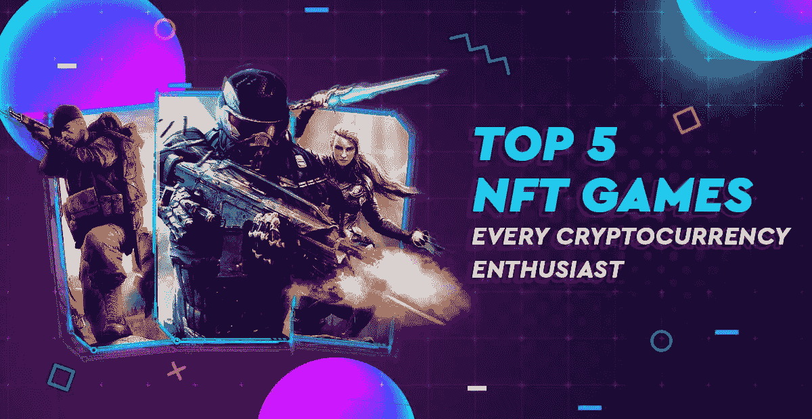
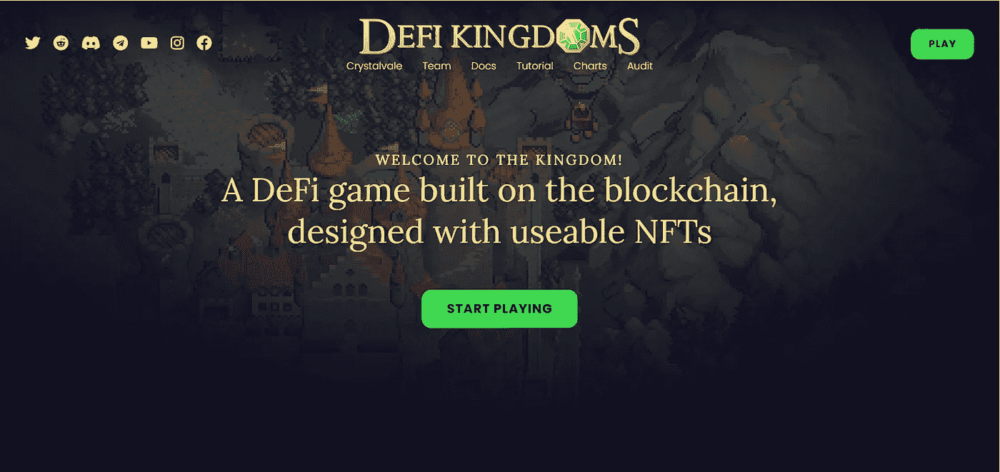
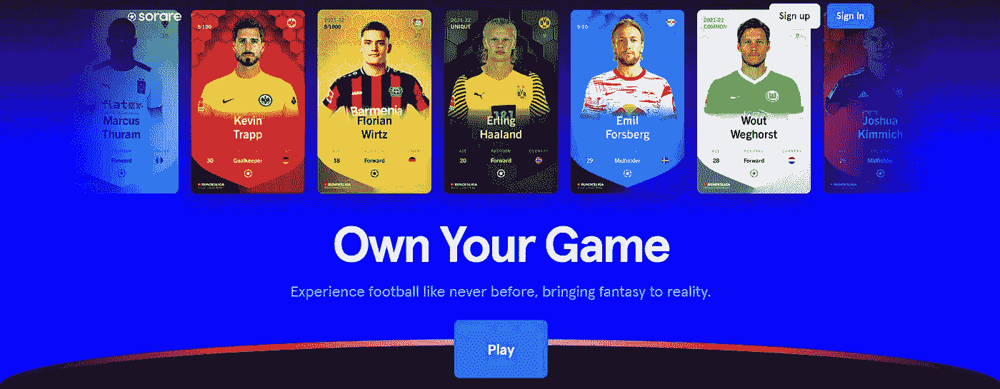
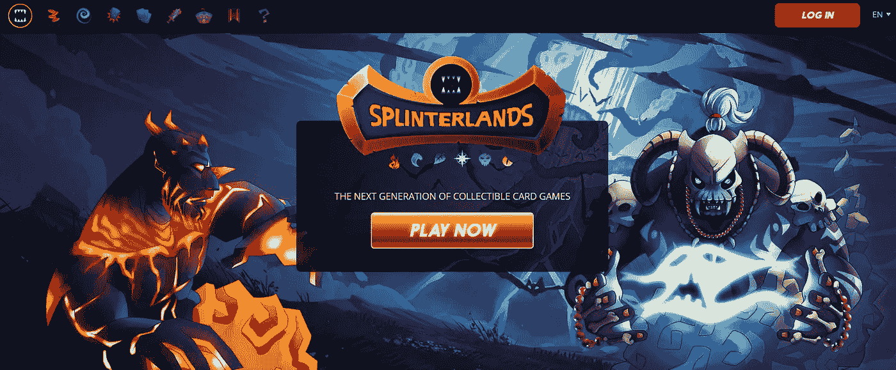
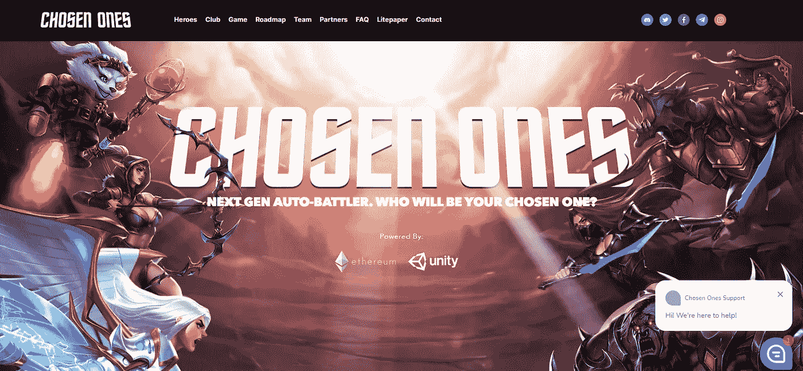
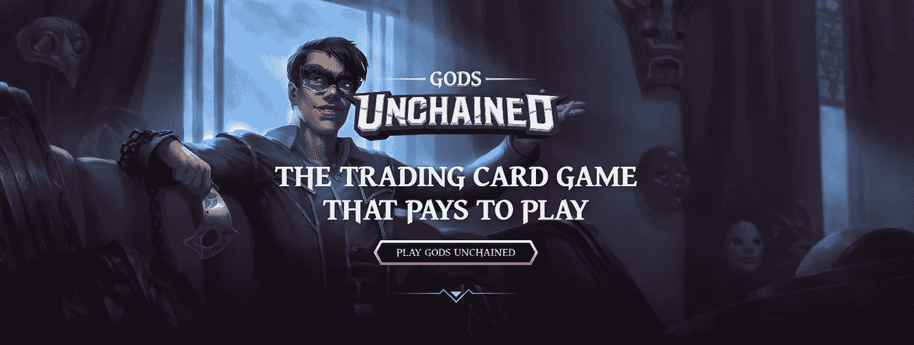

# 每个密码爱好者都应该看看的 5 大 NFT 游戏

> 原文：<https://medium.com/geekculture/top-5-nft-games-every-crypto-enthusiast-should-check-out-c2e90ebc6d3e?source=collection_archive---------12----------------------->

**TOP 5 NFT GAMES**

NFT 游戏有多种风格和流派，很难选择玩哪一种。有些是简单的养怪角色扮演游戏，有些是复杂的战术模拟。它们也不全是“为了赚钱而玩的”；有些只是为了好玩。

由于种类繁多，加密货币和区块链技术的复杂性，NFT 游戏可能很难掌握。

然而，一些有趣的故事正在被讲述，这些故事完美地整合了加密的一些更广泛的哲学和技术成分。让我们来看看现在和不久的将来最热门的 NFT 游戏。

# **NFT 博彩一瞥**

随着基于 Web 3.0 和区块链技术的 NFT 游戏越来越受欢迎，了解哪些游戏不仅能娱乐，还能赚钱，这一点至关重要。

如果你想创建一个 NFT 游戏市场，你需要寻求专业人士的帮助，因为开发过程需要很多步骤。让我们来看看加密货币爱好者的五大 NFT 游戏。 [**获得你想要的 NFT 游戏平台，在几周内提升你的业务**](https://www.cryptocurrencyexchangescript.com/nft-gaming-platform-development?utm_source=publication&utm_medium=geek-culture-23-04-22&utm_campaign=vigneshraju) 。

# **1。Defi 王国**

**DEFI KINGDOMS**

➤ DeFi 王国是第一个充分利用 NFTs 潜力的游戏，同时也融入了怀旧的幻想像素图像。这款游戏有着 90 年代 SNES 角色扮演游戏或现代独立游戏的外观，类似于《收获的月亮》。

➤ DeFi 王国将 NFT 的基本功能与经典游戏设计相结合，展示了它们在游戏中的应用。DeFi 王国可以像老式 RPG 一样玩，包括 XP 和其他东西的任务，游戏内资源管理和英雄开发。然而，在德菲王国，它收集珠宝代币，这些代币可以用来兑换和谐一号加密货币。

➤由于 DeFi 王国的方法论，它能够使用讲故事和知识来传达复杂的 NFT 和分散的加密概念给人们。DeFi 王国是 NFTs 的一个入口，但是还没有免费的入口。

# **2。Sorare**

**SORARE — FOOTBALL**

➤·索拉雷——如果你喜欢梦幻足球和帕尼尼贴纸，那么梦幻足球就是适合你的 NFT 游戏。它将这两个概念结合到每周的锦标赛中，世界顶级足球联赛的真实情况和事件会影响你的纸牌。

➤收集现实生活中的足球运动员卡片，并创造了一套五个体育英雄参加每周一次的比赛。就像在梦幻足球中一样，这些球员在一周中的表现会影响你的总分。皇家马德里、利物浦和拜仁慕尼黑都在这项运动的 200 多家被批准的俱乐部之列。

➤虽然加入并获得初学者工具包是免费的，而且你可以通过玩游戏赢得更多比赛并获得稀有卡片和以太坊，但你需要购买初学者工具包。

# **3。夹板地**

**SPLINTERLANDS**

➤:夹板岛的目标是将传统纸牌游戏如《魔术:聚会》的收集和交易带入数字领域。NFT 有能力制造可验证的稀有物，并允许玩家交易和获得数字卡，这是一个优势。在 Splinterlands，每一个动作都被记录在蜂巢区块链上，确保一切都是可证实的。

➤其他战略卡战斗游戏，如非 NFT 游戏炉石，有可比的游戏性。卡片有不同的价值和统计，有些因为稀有而更有价值。重复的卡片可以合并在一起以增强它们的能力。

➤夹板岛，不像《被解放的上帝》,在你开始玩之前需要购买一个新的卡牌包。因为你收到的牌是随机的，游戏的战利品箱系统的幽灵笼罩着碎片地。然而，一旦你在游戏中，你可以通过战斗和任务获得额外的卡。

# **4。被选中的人**

**CHOSEN ONES**

➤Chosen 一号是一款自动对战游戏，这意味着玩家可以专注于角色发展，而人工智能则处理战斗。此外，每个英雄都有一个 NFT 结构。

➤每个角色都有独特的特质、技能和天赋，玩家可以单独购买，以进入英雄俱乐部并获得特殊福利。此外，游戏渴望参加电子竞技比赛。

# 5.被解放的神

**GODS UNCHAINED**

➤《被解放的众神》的目标是用卡片和卡片组合与其他玩家战斗。每张卡都有自己的属性、优点和缺点，必须理解和利用。这是一个精心设计的战略游戏，优秀的玩家可以在其中获胜，而你手中牌的价值并不总是最重要的因素。

《被解放的➤众神》之所以繁荣，是因为它是免费的，奖励天赋，并融入了新的游戏机制。卡可以在不可变 X 密码市场上购买和交易为真钱，也可以在游戏中作为神的代币。神令牌也可以用来合并和升级卡，以产生罕见的新版本，以及购买卡包。

➤作为一个拼图组件，上述 NFT 游戏已经有效地融入了游戏业务。游戏玩家喜欢一些他们最喜欢的游戏类型，同时也参与到当前 NFT 潮流的前沿，因为这些游戏非常有趣，而且利润丰厚。

**总结**

人们一直在赶加密潮流，因为它们保证了现实世界中的高回报。NFT 视频游戏是一个相对较新的概念，人们已经跳上了加密的潮流，因为它们保证了现实世界中的良好回报。由于稀缺性、已证实的所有权以及将资产转让给另一个参与者的能力，这变得更加困难。因此，目前在这个领域的任何人都有优势。利用 [**NFT 游戏平台开发公司**](https://www.cryptocurrencyexchangescript.com/nft-gaming-platform-development?utm_source=publication&utm_medium=geek-culture-23-04-22&utm_campaign=vigneshraju) 的技术支持，利用他们在 NFT 的游戏服务，让他们帮助您充分发展您的业务。