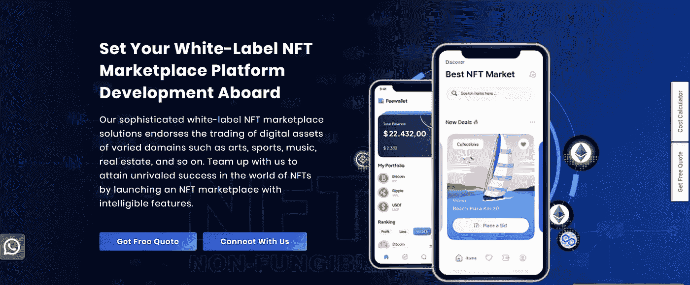
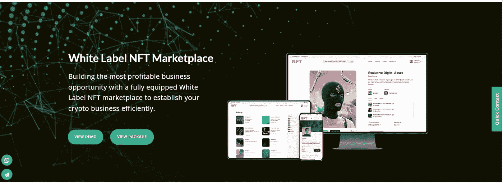
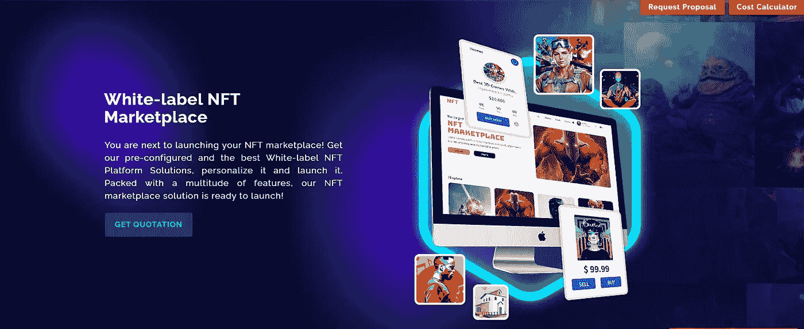
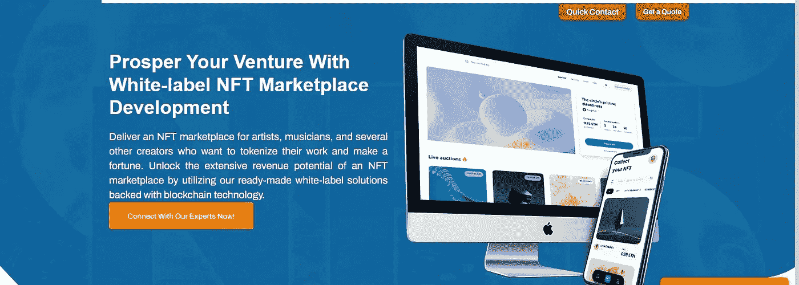
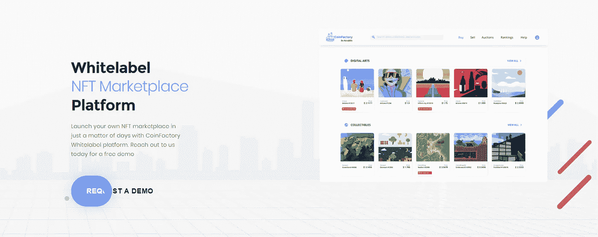

# 五大受欢迎的 NFT 市场开发公司

> 原文：<https://medium.com/geekculture/top-5-popular-white-label-nft-marketplace-development-companies-e59bb72b3e16?source=collection_archive---------14----------------------->

在过去的几年里，不可替代的代币已经占据了区块链世界。此外，对 NFT 的狂热甚至在未来几年还会继续。此外，到 2028 年第四季度末，全球 NFT 市场规模将达到 76.3 亿美元。值得注意的是，这表明随着时间的推移，NFT 市场正在蓬勃发展。更重要的是，NFT 市场的需求正在飙升。从今以后，这将为像您这样的企业家提供广泛的机会，并在 NFT 领域开启更多的机会。如你所愿，你可以向 NFT 市场发展公司寻求帮助，该公司专门制作 NFT 交易平台。这里的文章，我们策划了前 5 名最好的白标签 NFT 市场发展公司。看一看这些来获得洞察力。

## 什么是白牌 NFT 市场？

白标 NFT 市场是一个可定制的解决方案，能够交易不可替代的令牌，包括数字资产和收藏品。与从零开始开发 NFT 交易平台相比，采用白色标签的 NFT 市场解决方案将非常适合打算推出自己的平台并进入 NFT 圈的个人。作为一个定制的解决方案，它能够根据个人业务需求进行修改。这是根据注入的功能和区块链技术用于开发。

## **#5 最佳 NFT 市场开发公司**

随着大量的 NFT 开发公司，选择正确的和合适的是非常关键的。为了帮助您做出明智的决定，我们精心挑选了 NFT 白牌市场发展最佳的 5 家公司。

[INORU](https://www.inoru.com/white-label-nft-marketplace)

INORU 被认为是最好的白牌 NFT 市场开发公司之一，拥有一支熟练的团队，在区块链领域拥有多年的丰富经验。该公司致力于提供最适合个人的解决方案。以你需要的方式实现这个想法是选择 INORU 的一个很有希望的理由。

他们的可定制白标 NFT 市场解决方案将通过提供适合您的特殊和高级功能，引领您脱颖而出。此外，该公司提供现成的解决方案，如 OpenSea 克隆、Rarible 克隆、NBA Top Shot 克隆、SuperRare 克隆、Foundation 克隆等，离您只有一步之遥。

他们在 NFT 市场发展过程中遵循的透明和公平的方法使 INORU 成为一家独一无二、最具选择性的公司。到目前为止，他们已经为众多客户提供了全方位的最佳解决方案。值得注意的是，该公司在处理各种区块链网络方面非常出色，如以太坊、币安智能链、TRON、Polkadot、Flow 和许多其他最新技术。

[**区块链 App 工厂**](https://www.blockchainappfactory.com/white-label-nft-marketplace)

事实上，区块链应用工厂是帮助企业家或商人在白标解决方案的帮助下推出他们的 NFT 市场的先驱。白标 NFT 市场解决方案目前更受欢迎，这一独特的解决方案使区块链应用工厂(BAF)成为全球最好的公司之一。

有了前景广阔的 NFT 市场开发服务，能力超群的开发商将使白标解决方案完美地满足个人的各种需求。到目前为止，随着该公司的突出，他们将在规定的时间以可承受的价格交付解决方案。

[app dupe](https://www.appdupe.com/whitelabel-nft-marketplace)

AppDupe 是一家 NFT 市场开发公司，拥有世界一流解决方案的可靠记录。该公司提供了一个具有安全和高级功能的强大平台。此外，在各种区块链网络上开发 NFT 市场的专业知识，如币安智能链、Polygon、TRON 等。

除了提供开发流程，该公司还提供发布后支持，因为支持团队将负责全天候解决问题。除此之外，AppDupe 的营销团队也在 NFT 市场进行营销，以提高知名度。

[**TurnkeyTown**](https://www.turnkeytown.com/white-label-nft-marketplace)

TurnkeyTown 为那些希望在最短的时间内通过 NFT 市场进入 NFT 市场的企业提供端到端的 NFT 市场开发服务。该公司以其透明度、公平方法、以客户为导向的方法以及支持和维护而闻名。从创建 NFT 交易平台到发布，以及提供发布后支持和 NFT 营销服务。

开发商团队旨在提出创新和注重结果的建议，使您的 NFT 市场独一无二、出类拔萃，从而在竞争中脱颖而出。他们擅长提供适合各种利基市场的 NFT 市场，如艺术、音乐、游戏、体育、娱乐、时尚、房地产等等。

凭借该公司在区块链领域的良好声誉，该公司保证提供将在您选择的区块链网络上开发的白色标签 NFT 市场。

[**造币厂**](https://coinfactory.tech/whitelabel-nft-marketplace-platform/)

CoinFactory 是一家知名公司，擅长将加密或/和 NFT 相关的项目纳入主流。也就是说，拥有区块链领域经验的专家开发团队将致力于在尽可能短的时间内提供白牌 NFT 市场解决方案，甚至不会缺乏质量。

确保白牌 NFT 市场整合了用于定义数字资产交易的无缝执行的不可或缺的特征。以区块链科技为后盾，它的选择权交给你。

## **最终判决**

随着 NFT 市场的快速增长，进军该市场将是 NFT 市场的理想选择。同样，使用白色标签的 NFT 市场将帮助你，因为你可以通过各种可能的方式享受好处，因为定制和其他重要的特征。勇往直前，争取最好的白牌 NFT 市场发展，并按您的期望推出您的 NFT 交易平台。