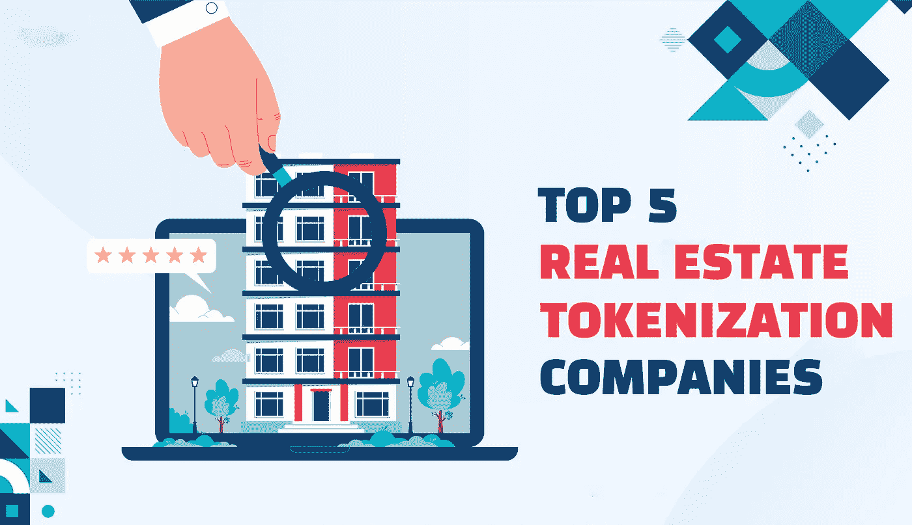
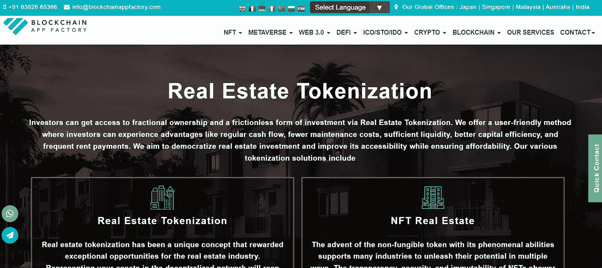
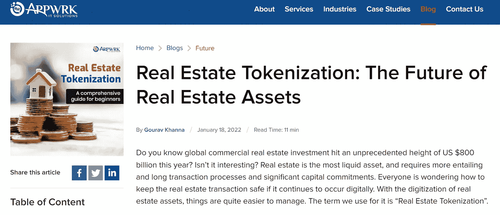
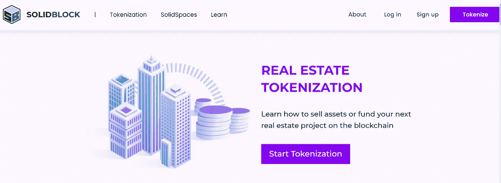
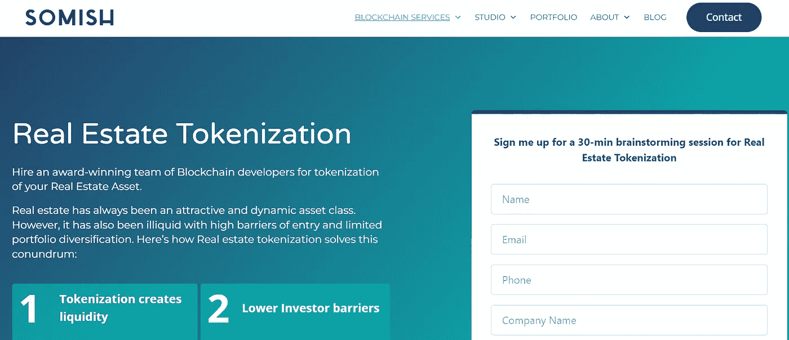
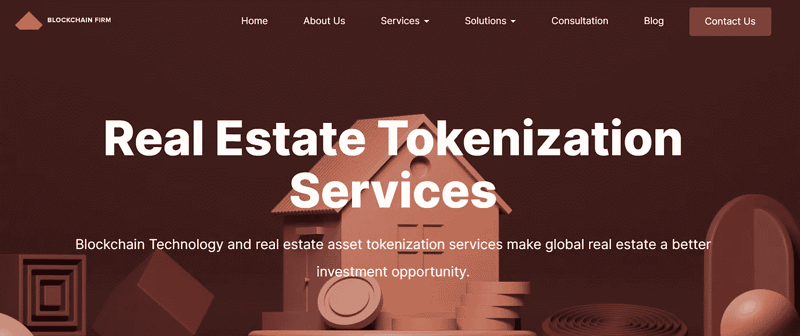

# 2022-2023 年前五大房地产令牌化公司

> 原文：<https://medium.com/geekculture/top-5-real-estate-tokenization-companies-in-2022-2023-31f41094765e?source=collection_archive---------2----------------------->

Top 5 Real Estate Tokenization Companies in 2022–2023

如今，区块链凭借前所未有的功能和专注于将力量回馈给用户的应用接管了数字世界。这些分布式数字分类账已经进入了几乎每个领域，即使是众所周知的技术适应缓慢的房地产领域也未能幸免。为了解决行业面临的问题和障碍， [**房地产标记化被认为是通过使用 Web3 技术的各个方面而成为游戏规则改变者的**](https://bit.ly/3cjgGBq) 。以下是房地产标记化实际上是什么，以及 2022-2023 年在该领域工作的前 5 家公司的描述。

[**2023 年你的房产属性如何令牌化？**](https://www.blockchainappfactory.com/real-estate-tokenization?utm_source=Medium+-+GC&utm_medium=19%2F7%2F22&utm_campaign=senpagapandian)

# 房地产标记化导论

房地产令牌化是将房地产资产令牌化为区块链上的条目的过程。该过程使得有可能细分房地产资产的所有权，甚至通过提供安全代币来收集资金，这些代币利用分散的加密交换来出售这些代币。将房地产资产令牌化也适用于使用不可替代令牌(NFTs)的虚拟世界或元虚拟世界，这在当今相当多的加密投资者中一直是一个有吸引力的交易前景。该机制还消除了中介、冗长的文书工作、产生的成本以及房地产领域中的欺诈可能性。

# 房地产令牌化的五大公司

# 区块链 App 工厂

区块链应用工厂是第一批将房地产标记为专业 Web3 服务的公司之一。该公司专门从事现实世界和元世界中的房地产标记化。人们还应该注意到，该公司的业务遍及全球。该公司的专家非常熟悉房地产代币化所涉及的因素，因此确保在发放客户项目代币之前履行所有适当的程序。该公司拥有咨询、法律事务、开发、测试和促销方面的专家，这使得它非常适合任何渴望在 Web3 房地产行业做大的初创公司。

# Appwrk

[**Appwrk**](https://appwrk.com/real-estate-tokenization-the-future-of-real-estate-assets) 是一家致力于多个领域的 Web3 公司，包括房地产标记化。该公司为其房地产资产数字化项目制定了专业的方法，以确保项目符合客户的预期。该公司提供其专业知识，在交易结构、数字化、技术、分销、营销和上市后支持等流程中标记房地产。如果愿意，人们甚至可以在代币旁边获得一个平台，例如代币市场。该公司的区块链开发商在 Web3 房地产上处理了许多优秀的项目，并在不断扩张的 Web3 领域赢得了声誉。

# 固体块

[**SolidBlock**](https://solidblock.co/real-estate-tokenization/) 总部位于以色列，是一家专门提供房地产标记化服务的公司。它自称是一家 TaaS(令牌化即服务)公司。该公司帮助初创公司将他们的房地产转换成区块链代币，并通过它们筹集资金。SolidBlock 拥有一支由开发、分析、法律事务、营销和领导力方面的杰出人士组成的完美团队，通过其以令人称道的方式提供的专业服务，在利基领域迅速发展壮大。该公司擅长为资产细分和证券代币发行(STO)活动创建房地产代币。

# Somish

[**Somish**](https://www.somish.com/blockchain/real-estate-tokenization/) 一直是创业爱好者将房地产资产令牌化的另一个目的地。该公司由长期从事 Web3 应用的年轻专业人员组成。该公司专门从事商业，住宅和奖杯房地产令牌化。它还提供安全令牌产品(STO)、合规保险、Web3 房地产咨询和合作伙伴网络解决方案等服务。Somish 也赢得了许多荣誉，包括黑客马拉松冠军、活跃的开源编程合作以及对 Web3 世界的技术贡献。

# 区块链公司

另一家经验丰富的进入 Web3 领域的公司 block chain company 提供与房地产令牌化相关的出色服务。该公司在该领域提供许多服务，包括物业列表平台开发、混合令牌化平台开发、分数令牌化服务、众筹服务、租赁和出租服务以及贷款和抵押便利。 [**区块链公司**](https://www.blockchainfirm.io/real-estate-tokenization-services) 也有团队为 Web3 房地产从事规划、智能合同、NFT 开发、网站开发、平台开发和营销服务。该公司在全球也有相当大的影响力，在几个国家设有办事处，在一些流行的 Web3 项目上有丰富的经验。

# 结束注释

我们已经看到了关于 [**房地产令牌化**](https://bit.ly/3cjgGBq) 和 2022-2023 年前 5 家房地产令牌化公司的解释。目前，数字化房地产的认知度正在迅速提高，这使得此类企业很容易聚集社区，并在长期内获得巨大的声誉和利润。希望在现实世界或 metaverses 领域开始创业的 Web3 创业爱好者可以接近上述公司之一来实现他们的想法。此外，在未来十年，通过区块链技术获得房地产可能会变得更容易，早期创业公司可能有优势为自己建立一个名字。