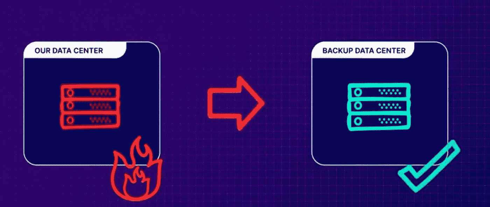
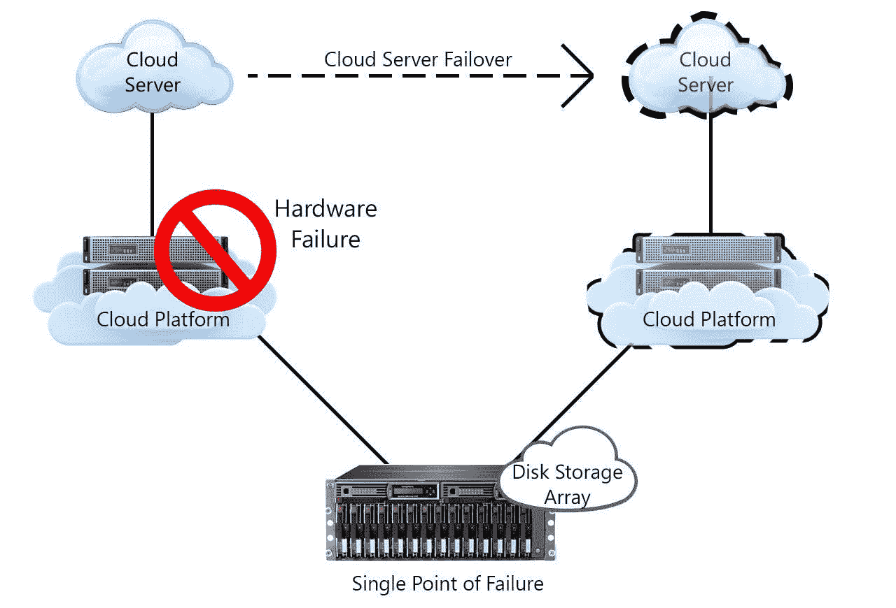

# 公司迁移到云的五大原因

> 原文：<https://medium.com/geekculture/top-5-reasons-why-companies-are-moving-to-the-cloud-c3a609332125?source=collection_archive---------9----------------------->

## 为什么企业对云的采用增加到了 **90%**

photo credit: [bmc.com](https://s7280.pcdn.co/wp-content/uploads/2018/08/CloudComplianceExplained4KeysforSuccess_Final-700x400.jpg.optimal.jpg)

术语云指的是在互联网上运行的软件和服务，而不是在本地的服务器或计算机上运行。采用云帮助企业找到了削减成本的替代方案，并确保他们的数据和系统随时随地可供客户使用。

云技术正在向不同的企业展示其潜力，并且还在继续扩张。随着全球许多云提供商(如 AWS、微软 Azure 和谷歌 GCP)的出现，您可以找到从本地服务器迁移到云服务器的不同选择。

由 O'Reilly 进行的 [2021 年云采用调查](https://get.oreilly.com/ind_the-cloud-in-2021-adoption-continues.html?ref=hackernoon.com)显示，企业对云的采用已经增加到 **90%** 。

在本文中，您将了解为什么一些公司正在向云迁移。

让我们开始吧。🚀

公司可能计划迁移到云有几个原因。你可以在没有云的情况下完成这些事情，就像你多年来一直在做的那样，但是云已经通过成本效益或可访问性引入了一些新的业务功能。

# 1.容错

公司最初对云感兴趣的一个常见原因是容错。根据定义，容错是指当一个或多个组件出现故障时，系统继续运行而不中断的能力。这里的系统可以是计算机、网络或云集群。

[acloudguru.com](https://acloudguru.com/)

如果你是一家重视自身存在的公司，你会有一些灾难恢复计划。如果您的主数据中心出现某种问题，这些计划通常涉及一些备用位置，您可以在这些位置存储数据或系统。

传统上，这是通过与一些提供商签订合同来实现的，以保留您的硬件的第二个物理副本，以便在您的主硬件出现故障时随时可用。

唯一的问题是，当一切都正常运行时，备份物理硬件只是坐在那里积灰并变得过时，但它会让您付出更多的成本，因为即使您当时并不使用它，您仍然需要为此付费。

但是，如果有比购买所有备份设备更好的方法呢？为什么不只是在你需要的时候租呢？云提供商可以在几秒钟内为您提供大量的系统容量，您只需为您使用的容量付费，这几乎总是一笔巨大的成本节约。当危机结束时，你可以关闭这些东西，停止支付。

[datasoft.ws](https://datasoft.ws/templates/VPSHost/html/images/ftcloud1.jpg)

# 2.成本节约

迁移到云技术使您能够节省空间和成本，以前您必须为现场服务器(有时甚至是非现场数据中心)付费。有了云，你付钱给云提供商来处理数据中心和其他资源，而不是自己在内部托管服务器。例如，Oracle 云客户通过转向云节省了大约[30%到 50%](https://www.forbes.com/sites/quora/2019/12/20/how-much-money-can-businesses-save-by-moving-to-the-cloud/?sh=6678530cef43&ref=hackernoon.com)。

Photo by [Karolina Grabowska](https://www.pexels.com/@karolina-grabowska?utm_content=attributionCopyText&utm_medium=referral&utm_source=pexels) from [Pexels](https://www.pexels.com/photo/crop-unrecognizable-financier-using-calculator-on-smartphone-near-dollar-banknotes-4386324/?utm_content=attributionCopyText&utm_medium=referral&utm_source=pexels)

但是，如果你滥用你的云资源，它们很容易就会比任何一种现场服务器贵得多。这就是培训您的员工并让有经验的云架构师参与进来如此重要的原因。

因此，成本节约是可以实现的，但你必须小心你设定的预期，尤其是在早期。

# 3.全球化

这是采用云的另一个常见原因。随着您的业务增长并扩展到国外，让资源和服务靠近您想要到达的新市场是有意义的，这可能是出于监管原因，也可能是出于性能原因。

Photo by [Artem Beliaikin](https://www.pexels.com/@belart84?utm_content=attributionCopyText&utm_medium=referral&utm_source=pexels) from [Pexels](https://www.pexels.com/photo/person-holding-terrestrial-globe-scale-model-taken-1079033/?utm_content=attributionCopyText&utm_medium=referral&utm_source=pexels)

云提供商已经在世界各地拥有数据中心和资源，您只需点击一下按钮就可以使用这些资源。这肯定会为您节省大量成本，因为您不必自己创建数据中心。

# 4.灵活

公司转向云计算的另一个原因是灵活性。简单来说，敏捷性就是响应不断变化的需求的能力。

在许多公司中，如果您想要运行一个需要 IT 设备的实验，您可能必须忍受征用和采购过程，并从 IT 团队获得资源来设置和维护该设备。这些步骤可能需要几周或几个月。

r[ickscloud.com](https://rickscloud.com/wp-content/uploads/2015/01/9609180862_f638ea35d0_o.jpg)

但是通过采用不同提供商的云，你可以在几分钟内访问设备，你可以尝试你的实验，然后关闭设备。

另一个好处是，你可以在几天内得到你的结果，而不是一个月，成本将比其他方式低。

# 5.可量测性

公司采用云的另一个原因是可扩展性。云计算中的可扩展性是指根据需要增加或减少 IT 资源以满足不断变化的业务需求的能力。您的目标是让我们的容量尽可能接近您的需求，但这是一件很难预测的事情。

[webwerk.in](https://www.webwerks.in/sites/default/files/blogs/images/cloud-hosting-benefits.jpg)

云提供商的现收现付模式使您能够根据业务需求灵活地扩展或缩减规模。

# 最后的想法

[云技术](https://hackernoon.com/how-to-deploy-machine-learning-models-to-the-cloud-quickly-and-easily?ref=hackernoon.com)从业务和运营的角度来看都有很多好处，在本文中，我解释了其中的一些好处，可以帮助你决定在你的公司中采用云技术，甚至在个人项目中工作。

除了采用云技术的好处之外，你还必须考虑潜在的风险。这些风险包括

*   迁移可能非常耗时。
*   使用第三方减少数据控制。
*   需要更多的管理人才。
*   现有数据丢失的可能性。

在下一篇文章中，您将了解**不同的云迁移方法。**

如果你学到了新的东西或者喜欢阅读这篇文章，请分享给其他人看。在那之前，下期帖子再见！

你也可以在推特上找到我 [@Davis_McDavid](https://twitter.com/Davis_McDavid?ref=hackernoon.com) 。

*最后一件事:在下面的链接中阅读更多类似的文章*

 [## 如何快速轻松地将机器学习模型部署到云上

### 从 Aibro 调用模型 API 并进行预测

medium.datadriveninvestor.com](https://medium.datadriveninvestor.com/how-to-deploy-machine-learning-models-to-the-cloud-quickly-and-easily-41cca9425c75)  [## 如何使用 Streamlit 和 Python 构建数据科学应用程序

### 用几行代码部署您的数据科学解决方案

towardsdatascience.com](https://towardsdatascience.com/how-to-use-streamlit-and-python-to-build-a-data-science-app-d74b0d28ca8)  [## 解决数据科学项目的 6 个基本技巧

### 学习技术技巧，提高数据科学项目的工作效率。

python .平原英语. io](https://python.plainenglish.io/6-essential-tips-to-solve-data-science-projects-17d8e45f02c4) 

*本文首发* [*此处*](https://hackernoon.com/top-5-reasons-why-companies-are-moving-to-the-cloud) *。*